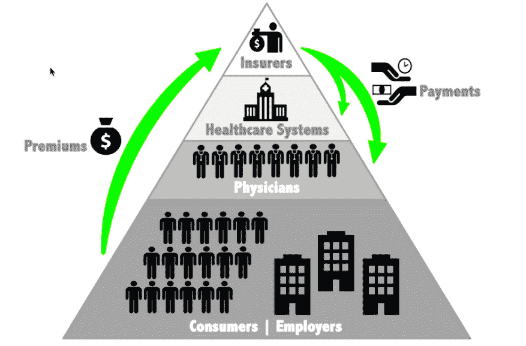

# 为什么美国的医疗保险如此糟糕？(第一部分)

> 原文：<https://medium.com/hackernoon/why-is-health-insurance-in-america-such-a-bad-deal-part-1-8888976900e5>

## [体面的](https://www.decent.com?utm_source=Medium&utm_medium=Content&utm_campaign=Health-insurance-in-america-bad-deal&utm_content=Pt-1-headline&UTM_ID=001)想搞定它，首先是给自己买的自由职业者。

除了康卡斯特，美国人最讨厌他们的健康保险。字面意思:除了电视和互联网服务，这个行业得到的净推广分数比其他任何行业都低。

**美国行业净推广得分(NPS)**

我们讨厌我们的健康保险，因为它太贵了。不断上涨的保费、免赔额、共付额和共保额对家庭预算形成了真空锁。美国 5700 万自由职业者中的许多人受到的打击最大，因为他们自己购买保险，而不是通过工作或政府获得保险。[我们大多数体面的](https://www.decent.com/about-us)人都做过自由职业者，所以我们对这个问题有第一手的了解——根据 2017 年美国自由职业者调查，预计到 2027 年，美国自由职业者的数量将超过非自由职业者。

如今，自由职业者在 ACA 交易所购买价格过高的保险，支付不涵盖严重疾病的短期或赔偿计划，或者根本不购买保险，将自己的生命和家庭置于风险之中。一些人正在拼凑自己的替代方案:宗教健康共享牧师等非保险解决方案的注册人数从 2014 年到 2016 年增加了 74%，这些解决方案不保证覆盖范围，并要求成员签署一份信仰声明。

难怪大家都在纠结。个人市场中 43%的购买者没有资格获得每月保费补贴——自 2013 年以来，个人保费增长了 123%，家庭保费增长了 174%。

同期，UnitedHealthcare 的首席执行官获得了逾 2.7 亿美元的薪酬。保险公司位于医疗保健食物链的顶端，因为它们控制着资金，从消费者和雇主那里收取保费，并向医疗系统和提供商支付费用:一个巨大的寻租中间人，在医疗保健的数据、设计和交付方面比任何其他利益相关者都有更大的权力。

**健康食品链，文斯·萨尔沃 2018**

**美国人支付的医疗费用更多，但得到的却更少。**

美国医疗保健是该国最大的私营行业，每年花费超过 3.5 万亿美元(35 亿美元)，其中约 75%通过医疗保险支出。美国有 13%的劳动力受雇于该行业，其人均医疗保健支出高于任何其他国家——人均超过 1 万美元——但在全球健康排名中经常垫底。

**经合组织 2015 年各国人均医疗支出**

**医疗保健系统排名，英联邦基金 2017**

显然，美国没有为质量买单。在 20 个工业化程度最高的国家中，美国公民的预期寿命最短:2015 年在美国出生的女婴预期寿命约为 81 岁，比在日本出生的女婴少 5 年。美国也没有为数量付费:随着服务利用率下降或持平，成本在 2016 年继续上升。美国人正在支付最高的价格，我们没有得到我们的钱的价值。在美国花费 150，000 美元的心内直视手术，在印度的一家机构花 2，000 美元就可以进行，临床效果相当或更好。根据凯泽家庭基金会的数据，在可比较的国家中，美国可通过医疗保健预防的死亡率最高；因残疾和过早死亡而损失的年数；可预防疾病的住院治疗；医疗、药物和实验室错误；肥胖；和呼吸系统疾病的死亡率。美国成年人在需要时不太可能像其他国家的成年人那样迅速找到医生和护士，他们更有可能去急诊室寻求可以由普通医生治疗的疾病。

**我们是怎么来到这里的？**

医疗保健和伦理从一开始就捆绑在一起。最早的关于医疗保健的文字记载出现在公元前 1754 年的汉谟拉比法典中:管理美索不达米亚的法律，这是世界上第一个已知的文明社会。汉谟拉比规定了医生应得报酬的浮动比例——照顾一个领主十谢克尔，穷人五谢克尔，奴隶两谢克尔——以及对失败的明确惩罚:“如果一个医生给一个领主做了一个大手术……导致了他的死亡……他们应该砍掉他的手。”

西方医学起源于古希腊。希腊的医药和治疗之神阿斯克勒庇俄斯手持一根缠绕着蛇的棍子，至今仍被认为是医药的象征。希腊人引入了诊断和预后的概念。通常被称为“医学之父”的希波克拉底将医学作为一门独立于神学的学科，认为疾病是环境因素、饮食和生活习惯的产物，而不是上帝施加的惩罚。他写下了现代医生仍在宣誓的原始希波克拉底誓言，在公元前 400 年左右将伦理编码到医疗保健中:“我将根据我的能力和判断使用治疗来帮助病人，但绝不会以伤害和错误行为为目的。…我将保持我的生活和艺术的纯洁和神圣。”

美国的第一个健康保险计划诞生于 1929 年，当时达拉斯教育家贾斯汀·福特·金博尔(Justin Ford Kimball)观察到教师不能生病:“他们无法承担支付医院账单的费用。与此同时，贝勒大学医院(金博尔曾在那里担任管理人员)急需资金……它欠了 150 多万美元。”

Kimball 制定了一项计划，让 Baylor 的病人(大多数是教师)每月预付 50 美分，以支付每年住院 3 周的费用，从住院的第 2 周开始。第 1 周的费用为每天 5 美元，这是最初的共付额，旨在阻止不必要的护理。他的模型假设所有的医院都是非盈利性的，并旨在确保医院获得他们在病人护理上的支出——这意味着从一开始，该计划就支付医院收取的费用。它很快就火了，75%的达拉斯教师都注册了。

随着一个新行业的建立，暴利时代不远了。附近卫理公会医院的病人抱怨新计划只针对贝勒病人。金博尔提出扩大它，但卫理公会管理人员与一家商业保险公司合作，后者增加了四分之一(50%！)以每月保费作为他的佣金。金博尔开始在当地报纸上推销他的计划，然后通过医院，这些医院重视经常性收入，并打上蓝十字的印记。

在医院财务部门的支持下，Blue Cross Blue Shield 的业务迅速扩展，成为美国最大的健康保险公司，覆盖了 50 个州三分之一的美国人。2016 年，它在游说上花费了超过 2500 万美元，比美国任何其他公司都多——仅领先于美国医院协会、美国药物研究和制造商协会以及美国医学协会。医疗保健和伦理之间的纽带已经磨损，如果不是切断的话:大型商业利益正在尽一切可能最大化利润，而不是健康。通过制定游戏规则，这些利益使得小型新兴创新者更难尝试新模式并获得有意义的足迹。

贪婪和浪费导致的医疗费用正在让美国中产阶级破产。

自 1980 年以来，美国医疗费用占国内生产总值(GDP)的比例稳步上升，超过 18%:是其他发达国家平均水平 9%的两倍。

**医疗保健支出占国内生产总值的百分比，CMS 2018**

一个主要驱动因素是浪费:专家估计，超过 30%的医疗支出，或每年超过 1 万亿美元，是浪费——自 1970 年以来，中间人和管理人员的数量与医生的增长相比一直在飙升(**图表 6** )。

**医生和行政人员的增长，劳动局，2010 年**

不断上涨的医疗费用加剧了美国中产阶级数十年的经济萧条。经济收益不成比例地转移给了富人:自 1960 年以来，美国医疗费用的增长超过了工资的增长，两者的比例达到了惊人的 818%和 16%。医疗费用是该国破产的主要原因。近 80%的美国人表示，他们靠薪水过活，近一半的美国人需要借钱或卖东西来支付甚至 400 美元的紧急费用——五分之一的人在去年经历了意外的医疗费用，平均费用为 2782 美元。

**医疗保健支出增长与 GDP 和工资，麦肯锡 2011 年**

几十年来，包括保险在内的医疗费用阻止了美国穷人和中产阶级的进步。随着婴儿潮一代的年龄增长，进入医疗保险体系，并得到年轻一代的补贴，他们的价格只会越来越高。CMS 预计，从 2017 年到 2026 年，医疗保健支出将每年增长 5.5%，到 2026 年占 GDP 的 20%。

与此同时，2017 年预计将是美国预期寿命连续第三年下降，主要原因是阿片类药物流行导致数百万美国人死于市售药物——这与 1916 年至 1918 年期间出现的可疑趋势相符，这一时期包括历史上最严重的疫情流感。

许多人认为医疗保健违背了商业法则。在每一个其他行业，创新和市场力量协同工作，随着时间的推移降低成本和提高质量。医疗保健肯定有所不同。但是什么？

*敬请关注。* [*在第二部*](https://hackernoon.com/why-is-health-insurance-in-america-such-a-bad-deal-part-2-fd9b51606c0b) *中，我们将分享根本原因以及* [*体面*](https://www.decent.com?utm_source=Medium&utm_medium=Content&utm_campaign=Health-insurance-in-america-bad-deal&utm_content=Pt-1-bottom&UTM_ID=007) *正在做什么来修复它。*