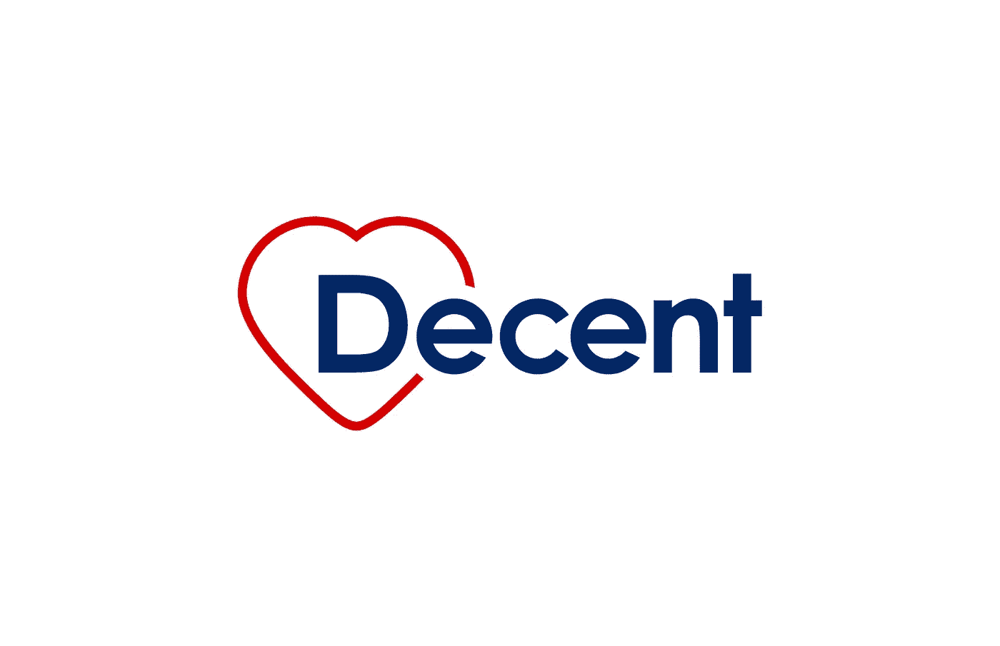

# 为什么美国的医疗保险如此糟糕？(第二部分)

> 原文：<https://medium.com/hackernoon/why-is-health-insurance-in-america-such-a-bad-deal-part-2-fd9b51606c0b>

## [体面的](https://www.decent.com?utm_source=Medium&utm_medium=Content&utm_campaign=Health-insurance-in-america-bad-deal&utm_content=Pt-2-headline&UTM_ID=011)想搞定它，首先是给自己买的自由职业者。

在这篇文章的第一部分[中，我写了医疗费用是如何让美国梦破产的，尤其是对于那些自己买保险的自由职业者。今天，我将分享根本原因，以及体面正在做些什么来解决它。](/decent/why-is-health-insurance-in-america-such-a-bad-deal-24ad6af503bc)

**医疗保健问题的根本原因是，当成本上升时，除了病人以外的所有关键利益相关者都会受益。**

如果你习惯于在其他行业购物，医疗保健可能会显得不理性。

*“保险最令人沮丧的地方就是付出太多却得不到很大的收益。我每个月都会拿出很大一部分收入，但我还是会花很多钱去看医生，诸如此类。”*

*“我只是不太清楚成本是如何确定的。我想在接受治疗前知道我会花多少钱。”*

*“关于我目前的保险计划，最令人沮丧的是很难在官僚主义的迷宫中导航，这些信息相互矛盾，而且往往不是最新的。”*

“我的健康计划不包括我的针灸治疗，这似乎是我缓解慢性疼痛的唯一方法。”

*—来自正派 2018 年健康保险调查的匿名自由职业者。*

医疗保健到底是怎么回事？

*   **为什么价格和质量数据如此难以查找和理解？如今，如果你不得不离开你的房子，你可以在网上比较大多数东西，并在离开你的房子之前检查价格。在医疗保健领域很难找到可靠的价格数据，而这仅仅是个开始。哪些医生好？为什么你的医生会提出这样的建议？什么样的治疗最有可能保持你的健康，什么时候需要治疗？为什么像核磁共振这样的普通医疗程序在旧金山的一家医院要比另一家医院贵 13 倍？你的保险包括什么？你的计划如何运作？你账单上的所有费用是什么意思？大多数保险表格都是在大学或更高的水平上写的，但是美国人的平均阅读水平是 7 或 8 年级。没有你能理解的好数据，你很难做出好的决定，甚至没有动力去尝试。**
*   为什么客户满意度和服务似乎并不重要？医疗保险的[净推介值](https://cdn-images-1.medium.com/max/800/0*1NUeJZgpuk8epjkM)怎么会如此糟糕，变化如此之小？为什么预约要花这么长时间，或者当你去预约的时候被看到？为什么要在候诊室一遍又一遍的填同样的信息？为什么很难协调临床医生之间的护理，或者将您的健康数据从一个移动到另一个？为什么不是所有的诊所都有网上预约？为什么急诊室通常是您快速护理的唯一选择？
*   **为什么真正的选择如此之少？**尽管有证据表明药物和急性干预解决了事后问题，但并不是保持健康的最佳方式，很少有保险计划涵盖替代护理方法——我们的系统是一刀切的。三分之一的美国成年人使用某种形式的替代药物并从中受益，大多数人都是自掏腰包。
*   为什么初级保健医生如此匆忙？许多医生的预约时间都是以 15 分钟为间隔。有了[管理员横行](https://cdn-images-1.medium.com/max/800/0*_ZChset3FNqiQlyE)，难怪[一半以上的医生都累垮了](https://www.beckershospitalreview.com/workforce/why-physician-burnout-jumped-to-54-over-3-years.html)。在美国，每天都有一名医生自杀，是所有职业中自杀率最高的。除了向专家转诊或开处方之外，他们在窗口*还能做什么？*

你可能听说过医疗费用上涨是不可避免的，或者是无法解释的，或者是太复杂而无法解决的。不要相信。深入挖掘，这一切都很有意义。

推动医疗保健的是利润，而不是病人。

费用上涨时，除了病人，所有人都受益。

*   传统的健康保险公司受到一个 T2 医疗损失率的控制:他们必须将收到的每一美元保费中的 80%用于医疗保健，并且可以保留 20%来支付管理费用和利润。这意味着他们只能在医疗总成本上升时赚取更多利润——他们从不断增长的馅饼中拿走固定的百分比。如果我告诉我 5 岁的儿子布恩"[你可以拥有面包店任何一个甜甜圈的 20%](https://hackernoon.com/us-healthcare-is-against-the-patient-8b99723e71ba)，他会走向柜台，挑一个他能找到的最大的。一旦价格确定下来，每年你的保费存在银行里，他们就有动力拒绝索赔(当他们支付时，也会慢慢支付，因为你的保费给他们带来了利息)。但每年他们都必须根据预期的总医疗成本来证明价格上涨的合理性，所以当这些年度上涨到来时，他们会支持总医疗成本上涨。他们与收费服务连锁医院和其他机构合作来实现这一目标。
*   经纪人从佣金中赚钱，在大宗交易中获得更多佣金。
*   **收费医院、诊所和临床医生每次为你做点什么都会得到报酬，不管对你有没有帮助:当护理价格和数量增加时，他们就会获利，治疗急性健康症状比解决疾病的根本原因赚得更多。**
*   **药房受益经理(PBMs)** 拿药价提成。
*   制药公司在价格上涨时获利，这引出了高盛在 4 月份给生物技术客户的报告中简洁提出的一个问题:“[治愈病人是一种可持续的商业模式吗？](https://www.cnbc.com/2018/04/11/goldman-asks-is-curing-patients-a-sustainable-business-model.html)

当你生病的时候，除了你，每个人都能赚更多的钱。从这个角度来看，美国医疗保健的许多“非理性”的东西都非常有意义。其他利益相关者都在和你这个病人作对。你不是他们的顾客。他们是彼此的客户。他们以你为代价赚了越来越多的钱。不要指望他们会改变医疗体系。它在做他们想让它做的事情。

病人应该得到更好的。

**在整个医疗保健领域，体面的激励措施是一致的，因此当成本下降时，包括患者在内的所有关键利益相关方都将受益。**

我们与数千名自由职业者讨论了他们的保险，了解到他们希望保险是负担得起的、透明的、灵活的——所以这是我们在体面公司的价值主张。我们的使命是为所有人提供负担得起的医疗保健，我们从自由职业者开始，因为我们感受到了他们的痛苦，他们的人数正在快速增长。我们相信自由职业者想要的也是您想要的:

*   **负担得起**:你想要高质量的保险，而不需要倾家荡产。
*   **透明**:你想要从价格到质量的关于你事业的前沿数据。
*   灵活:你想要有选择，所以你可以选择适合你的。

我们今天在美国没有负担得起的、透明的、灵活的健康保险，因为传统保险公司的商业模式与之背道而驰。因此，我们正在建立一种新型的医疗保健公司，它将利益相关者的激励结合起来，这样当成员健康时，每个人都会受益。我们设计了我们管理的计划，以最大化患者的价值，而不是成本。我们将利用包括区块链在内的新兴技术，从 3 万亿美元的美国医疗保健市场中挤出浪费，激励导致更好结果的行为，并提供更实惠的覆盖范围——最初是为 5200 万购买自己保险的美国人。有人称之为现代健康保险合作社。我们称之为体面。

**2019 年，体面公司将从德克萨斯州奥斯汀开始，为自由职业者提供负担得起的综合医疗保险。**

自由职业者是一个相对健康的群体，他们不会受到雇主或政府飙升的医疗费用的影响，他们往往是早期技术和加密的采用者。首先为他们提供服务将让我们在随着时间的推移扩展以服务新的地理位置和人口统计数据之前，用理想的人口来检验我们的模型。

集中式保险公司经营医疗保健。我们无意与传统的保险公司对抗——这些公司里有许多优秀的人只是在做他们被激励去做的事情。但体面将有助于自由职业者团结起来，以获得更好的利率和更灵活的覆盖面。

我们将首先使用区块链技术使价格透明、可及、防篡改，并为做出明智健康选择的会员降低保费。我们计划现在赢得可负担性和透明度，以后赢得灵活性。我们将提供会员所需的健康资讯，并且易于理解。我们会坦诚地告诉你事情的进展。当你需要我们时，我们会敞开心扉，积极响应。

**随着时间的推移，正派将分散核心保险职能，以创建点对点健康保险协议。**

多拗口啊！

去中心化并不像听起来那么复杂。大保险公司做了很多工作。其中一些是保管工作——“指的是或有责任保护、照顾或维护某物或某人”——在这种情况下，就是你的钱。不管是好是坏，大保险公司收取高额费用来持有和保护你的钱。其中一些是功能性工作:审查收到的索赔，投资你的保费，让他们获得回报，回答你的客户服务问题。

随着时间的推移，区块链技术将消除对保管工作的需求，这样你就不必信任大型保险公司来保管和保护你的钱和健康数据——你只需要相信数学。不必相信大的保险公司——有些人会称之为从保险中“去除中间人”——降低了由于贪婪、欺诈、盗窃或浪费而使你的钱发生不良情况的风险。符合 HIPAA 等法律标准的透明操作将让您看到您的资金和数据如何流动，并确保一切正常。做得好的话，所有这些将意味着更好的医疗保健和更低的风险。

有些人仍然需要做功能性的工作，他们需要激励去做。接受过相应培训的个人和团体可以做这项工作，通过使用被称为“共识机制”的方式就真相达成一致，换取有价值的加密令牌。西雅图的一位受过索赔管理培训的全职妈妈可能会与巴尔的摩的一位小说家和奥斯汀的一位自由职业开发者达成共识，认为你的索赔是有效的——所有人都独立工作，没有交流，甚至不了解彼此——并且会立即得到支付。不浪费。没有管理开销。不需要大型保险公司。

随着时间的推移，正派将负责任地分散核心职能，直到世界各地的人们能够团结起来，使用正派协议来创建他们自己的[对等医疗保险池](https://hackernoon.com/how-affordable-healthcare-looks-in-2025-ddf8ba4d1364)。一些资金池将涵盖当今健康保险“一刀切”模式之外的治疗:真正灵活的护理。如果这些治疗有助于保持会员的健康，那么加入这些泳池的费用就会降低。随着资金池在不同地域和人口中的形成和运作，我们将开始接近一个让我们保持健康的基本事实，并为做出明智选择的人提供强大的财务激励。随着时间的推移，我们将与整个生态系统中所有志同道合的利益相关者合作，包括临床医生，以调整高质量平价医疗服务的激励措施。

这些变化将共同减少医疗保健系统中的浪费，为您——患者——带来更多价值。仅在美国医疗保健行业，每年就有大约 1 万亿美元(10 亿美元)的浪费，改进的机会是巨大的。

最重要的是，这一切都发生在引擎盖下。你不需要理解甚至思考区块链和加密令牌来使用体面，或者从他们创造的效率中受益。你可以用美元支付保险费和医疗费用。我们将利用区块链技术和许多其他技术来实现我们的价值主张:负担得起、透明、灵活的医疗保健。

我们不是区块链公司，我们是医疗保健公司。

体面的使命是为所有人提供负担得起的医疗保健。

我们团队的[每个成员都有](https://www.decent.com/about-us)[个人健康问题的经历](https://hackernoon.com/us-health-care-needs-a-nervous-system-4dc743fac5f8)，自从我们开始体面工作以来，从密友到 Lyft 司机的人们都告诉我们他们的保险恐怖故事。我们团队的一个朋友结婚只是为了获得她丈夫的健康保险。另一个搬到了柏林，以摆脱美国的医疗体系。

我们的使命是全球性的，但它始于美国。我们团队的成员就在最近这一代人来到这里，追求美国梦:即每个人都应该有平等的机会通过努力工作、决心和主动性获得成功和繁荣。不断上涨的医疗费用已经损害了这个梦想。但不一定要这样。

我们认为富兰克林·德拉诺·罗斯福说的大部分是对的，他说所有美国人都有权“获得足够的医疗保健，并有机会获得和享受良好的健康”——但我们认为这一权利延伸到每个人。风险共担是我们对彼此分担责任的一种表达，这种想法是完全正确的:如果没有风险共担，我们都不希望自己成为真正生病的那个人。但是这个国家的数字不起作用，因为浪费和错位的激励，传统的保险公司拥有与其职能不相称的权力。

我们选择这个名字[体面](https://www.decent.com/)是因为我们相信让每个人都能负担得起医疗保健是一件体面的事情。“体面”也出现在“去中心化”中，这是一个令人高兴的意外。

这需要时间，但任务是为每个人服务。

全民负担得起的医疗保健。

