# 为什么增强现实中的遮挡这么难？

> 原文：<https://medium.com/hackernoon/why-is-occlusion-in-augmented-reality-so-hard-7bc8041607f9>

## “遮挡”就是把虚拟的物体藏在真实的东西后面。

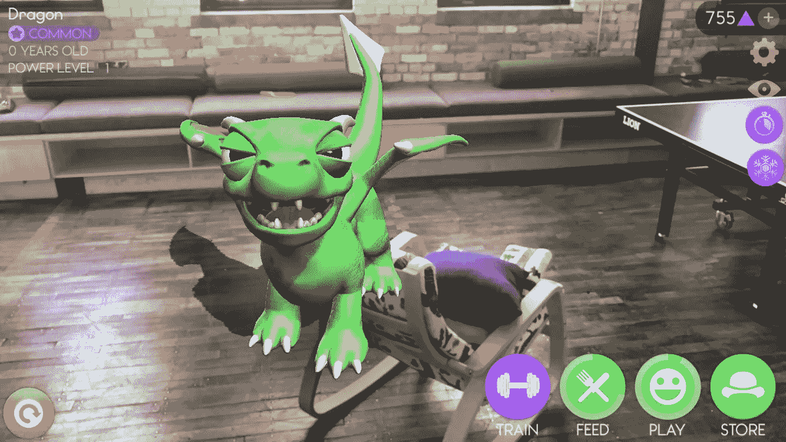

增强现实难题中最大、最难以捉摸的一块是遮挡。换句话说，将虚拟对象隐藏在真实事物后面的能力。

这篇帖子是关于为什么 AR 中的遮挡如此困难，以及为什么深度学习可能是未来解决它的关键。

当你看一个纯粹真实或纯粹虚拟的世界时，你倾向于接受那个世界的“规则”或 [**暂停怀疑，**](https://en.wikipedia.org/wiki/Suspension_of_disbelief) ，只要它满足现实的一些基本概念，如重力、照明、阴影等。当这些规则被打破时，你会注意到，因为这很不和谐，感觉像是“看起来不对劲”。这就是为什么对电影中糟糕的特效畏缩不前是如此的本能。

在 VR 中，实际上很容易实现暂停怀疑，因为你可以完全控制场景中的所有元素。**不幸的是，作为一名 AR 开发者，你没有这种奢侈，因为你的应用程序的大部分屏幕空间(即真实世界)完全不受你的控制。**

> **作为一名 AR 开发者，你的大部分应用的屏幕实际空间(即真实世界)完全不在你的控制之内。**

在移动世界中， [**苹果的 ARKit**](https://developer.apple.com/arkit/) 已经实现了令人难以置信的快速运动跟踪以及逼真的光照和阴影，但在遮挡方面仍然有所欠缺。

## **这里有个例子:**

下面的截图你觉得奇怪吗？这是因为龙看起来离椅子更远了，但仍然出现在椅子前面。

**Without occlusion, this dragon looks weird overlapping the chair.**

这不仅仅是移动增强现实的问题。这也是目前所有耳机都存在的问题。

# AR 中的遮挡是如何工作的？

遮挡的目的是在创建 AR 场景时保留视线的规则。这意味着任何在真实物体后面的虚拟物体，应该被“**遮挡**”或者隐藏在真实物体后面。

那么这在 AR 中是怎么做到的呢？基本上，我们基于真实世界的 3D 结构的一些知识，有选择地阻止部分虚拟场景在屏幕上呈现。

## **这样做涉及 3 个主要功能:**

1.  **感知**现实世界的 3D 结构。
2.  **重建**一个数字化的 3D 世界模型。
3.  **渲染**该模型为隐藏虚拟对象的透明遮罩。

# 但是这有什么难的呢？

假设你对真实环境中的所有物体都有一个很好的重建，遮挡只是简单地将模型渲染为场景中的透明遮罩。这是容易的部分。事情已经到了开始变得难以处理的地步。

考虑一个常见的街道场景。在离你各种距离的地方都有人、车辆、树木和各种各样的物体。更远的地方，有更大的结构，如桥梁和建筑，每一个都有自己独特的功能。

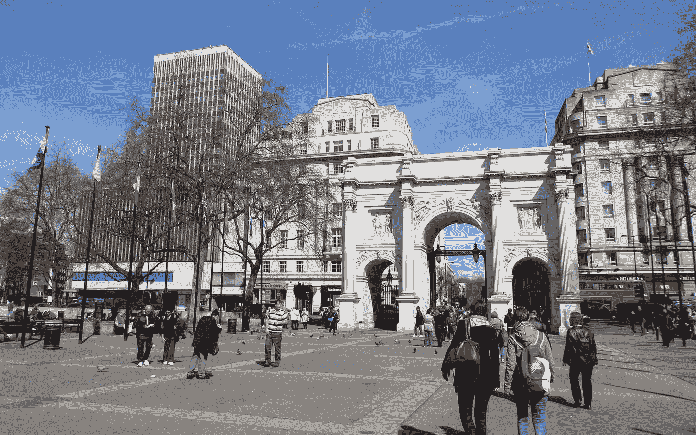

The real world is a complicated and dynamic 3D scene

**创建一个真实的遮挡遮罩最困难的事情实际上是重建一个足够好的真实世界模型来应用这个遮罩。**

这是因为今天没有可用的 AR 设备能够足够精确或快速地感知其环境，以实现逼真的遮挡。

# 3D 传感是如何工作的？

感知 3D 结构其实可以归结为一个重要的能力——深度感知。深度传感器有很多种，常见的有 [**结构光**](https://en.wikipedia.org/wiki/Structured-light_3D_scanner#Challenges)[**飞行时间**](https://en.wikipedia.org/wiki/Time-of-flight_camera) 和 [**立体摄像机**](https://en.wikipedia.org/wiki/Computer_stereo_vision) 。

在硬件方面，结构光和飞行时间涉及一个红外投影仪和传感器对，而立体需要两个彼此相距固定距离的相机，指向相同的方向。

**概括地说，它们是如何工作的:**

## 结构光传感器

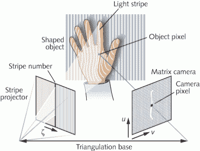

结构光传感的工作原理是将红外光图案投射到 3D 表面上，并使用扭曲来重建表面轮廓。

## 飞行时间传感器

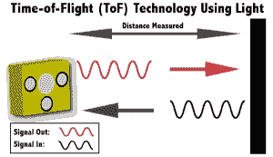

这种传感器的工作原理是发射快速脉冲的红外光，这些红外光被其视野内的物体反射。图像传感器使用反射光的延迟来计算每个像素的深度。

## 立体摄像机

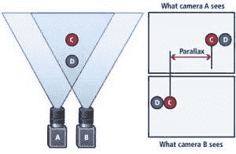

立体摄像机通过测量相隔固定距离放置的两个摄像机之间的像素位移来模拟人类的双目视觉，并使用它来三角测量场景中各点的距离。

当然，所有这些传感器都有其局限性。基于红外的传感器，如，在户外工作就比较困难，因为明亮的阳光(大量的红外)会洗掉或者给测量增加噪声。立体相机在户外工作没有问题，功耗更低，但它们在光线充足的地区工作得最好，有很多功能和鲜明的对比。

> 要迷惑一台立体摄像机，你只需将它对准一面平坦的白墙。

由于所有这些传感器都是基于像素的测量，因此测量中的任何噪声或误差都会在深度图像中产生空洞。此外，在今天的手机和耳机设备的大小和容量下，迄今为止实现的最大范围约为**3-4 米**。

**下图是一个用立体相机创建的深度图的例子。颜色代表离相机的距离。看看近距离的测量结果如何好，而远处的物体噪音太大或被忽略？**

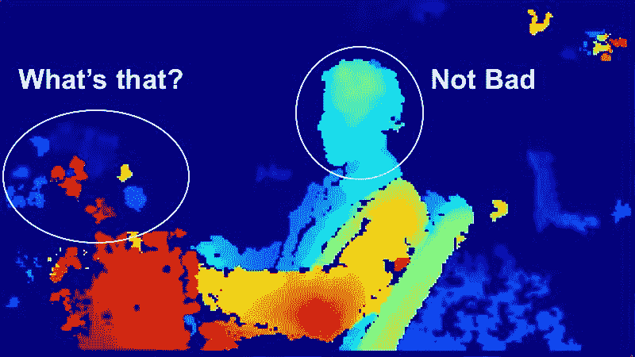

3D 感知并不仅限于深度感应。下一步是获取 2D 深度图像，并将其转换为 3D 点云模型，其中深度图像中的每个像素都获得了相对于相机的 3D 位置。

接下来，所有相机相对点云与相机运动的估计融合，以创建传感器周围世界的 3D 点云地图。

**下面的视频展示了完整的点云制图过程。**

Mapping an museum exhibit in 3D - From a real project we worked on at Placenote.

现在你已经理解了 3D 感知的完整流程，让我们看看这是如何转化为实现遮挡的。

# 使用深度传感器数据进行遮挡

有几种方法可以使用 3D 深度信息来遮挡虚拟对象。

## 方法 1

**直接使用来自传感器的 2D 深度图。**

在这种方法中，我们对齐相机图像和深度图，并隐藏应该在深度图的任何像素后面的场景部分。这种方法实际上不需要完全的 3D 重建，因为它只使用深度图像。

这使它更快，但有几个问题:

1.  该传感器只能探测到 4 米远的物体。再远就不会被遮挡了。
2.  深度图有**个洞**并且不完美
3.  深度图的分辨率比相机低得多，这意味着缩放和对齐两幅图像将为遮挡创建**像素化的锯齿状边缘**。

**下面的视频是一个基于深度图的遮挡例子。注意红色立方体移动时遮挡遮罩的不规则性。**

Occlusion masking done with a simple depth map.

## 方法 2

**重建并使用三维点云模型。**

由于点云是真实世界的几何精确地图，我们可以用它来创建遮挡遮罩。请注意，点云本身并不足以进行遮挡，但是可以处理点云来创建网格，这些网格基本上将曲面拟合到点图上(就像覆盖 3D 点云的毯子)。

> 网格的计算量比点云少得多，并且是计算(如检测 3D 游戏中的碰撞)的首选机制。

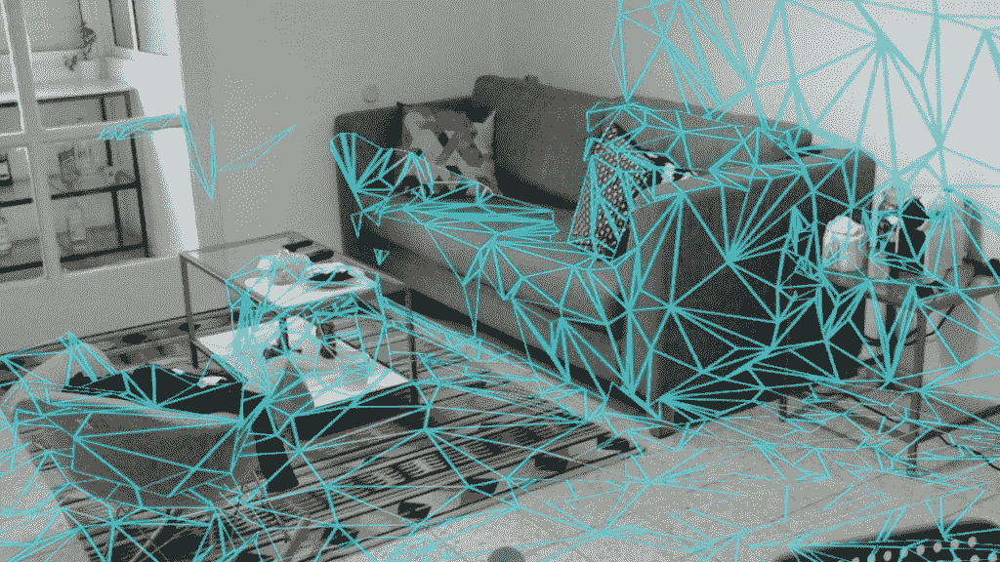

Environment mesh created with a Microsoft Hololens

这个网格现在可以用来创建我们需要的透明遮罩来遮挡场景中的虚拟元素。

听起来我们已经有了一个足够好的遮挡解决方案！那么问题出在哪里？

# 如今增强现实设备的问题是

我认为今天具有最令人印象深刻的跟踪和地图功能的 3 种 AR 设备是**谷歌 Tango、微软 Hololens、**和**苹果 iPhone x。**下面是它们的传感器相互对比的情况。

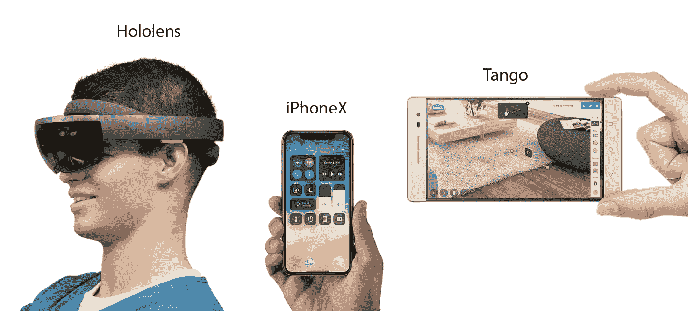

**谷歌 Tango(已被谷歌停产)** *深度传感器——红外飞行时间
范围——4m*

**微软 Hololens** *深度传感器—红外飞行时间
范围— 4m*

**苹果 iPhone X** *前向深度传感器—* [*IR 结构光*](https://www.extremetech.com/mobile/255771-apple-iphone-x-truedepth-camera-works) *后向深度传感器—立体摄像头
范围— 4m*

**上述所有系统的主要问题在于，在深度感测方面，它们有:**

1.  **范围差(< 4m):** 移动设备的尺寸和功率限制限制了红外和立体深度传感器的范围。
2.  **低分辨率:**场景中较小的物体在点云中不可分辨，很难获得清晰可靠的遮挡表面。
3.  **缓慢的网格重建:**当前从点云生成网格的方法对于这些设备上的实时遮挡来说太慢了。

> 目前，从点云生成网格对于任何平板电脑或耳机设备上的实时遮挡来说都不够快。

那么，今天的开发人员如何拼凑出一个合理的解决方案来解决这些问题呢？

# 今天怎么黑闭塞？

完美的遮挡是一个难以捉摸的目标，但我们可以在某些情况下接近它，特别是当我们可以**放松实时约束**的时候。

如果应用程序允许预映射环境，可以使用预构建的网格作为场景中较大突出对象的遮挡遮罩，前提是它们不移动。

这意味着你不局限于深度传感器的 4 米范围，至少对于静态对象后面的遮挡。

移动物体仍然是一个问题，现在唯一的解决方案是使用深度图遮罩方法来处理近距离移动物体**比如你的手。**

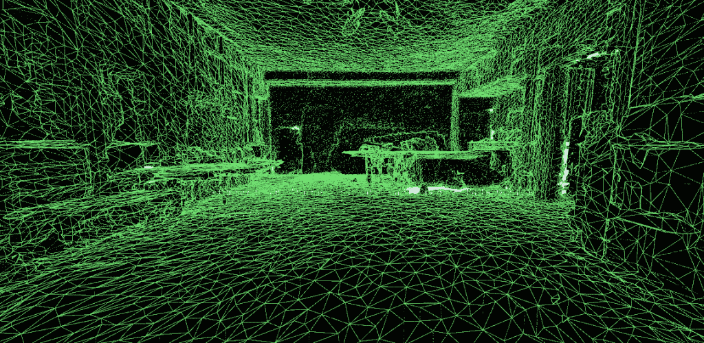

A sample 3D environment mesh built by pre-mapping an indoor space

现在，从上面的示例网格可以清楚地看出，预构建网格的一个大问题是，尽管它们比点云轻，但它们会导致 3D 内容的复杂性增加十倍以上。

> 简化 3D 网格的方法是用更简单的对象(如包围复杂结构的墙和块)来近似其结构。

在 Placenote，我们已经在 AR 建立了大型博物馆的导游，我们破解 occlusion 的方法是**手动绘制平面来覆盖空间中可能会妨碍我们虚拟内容的特定墙壁。**

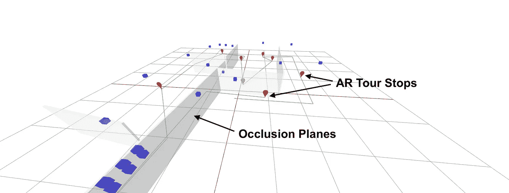

A Unity scene that shows how we hacked Occlusion at Placenote. [Visit placenote (https://placenote.com)](https://placenote.com)

## 这是一个在 Google Tango 上使用高质量的预建环境网格进行遮挡的例子。

**当然，这种方法假设开发者或用户在 AR 会话之前会花时间绘制环境地图。**

由于这对于普通用户来说可能有点难以承受，所以它可能在基于位置的 AR 体验中工作得最好**，其中地图可以由开发人员预先构建。**

**在一个极端的场景中，你可能想要在一个大得多的尺度上遮挡 AR 体验，比如渲染一只恐龙在纽约市的建筑物中行走。也许，这样做的方法是使用来自谷歌地图或地图盒等服务的已知建筑物 3D 模型来创建城市尺度的遮挡表面。**

**我们在 Sturfee 的朋友已经建立了一种独特的方式来创建城市规模的增强现实体验，使用卫星图像来重建大型建筑和静态结构。Sturfee 的黄生在这里写了关于他们平台的文章。**

**当然，这意味着你需要能够在 3D 中精确定位设备，这在那个尺度上是相当具有挑战性的。 **GPS 定位对于遮挡来说根本不够好，因为它很慢(1Hz)并且非常不准确(测量误差为 5-20 米)。****

***事实上，室内和室外的厘米级位置跟踪是遮挡的一个关键组成部分，通过我们与*[***place note***](https://placenote.com/)*的合作，我们正在努力开发一种基于云的视觉定位系统* *，它可以解决其中的一些问题。***

**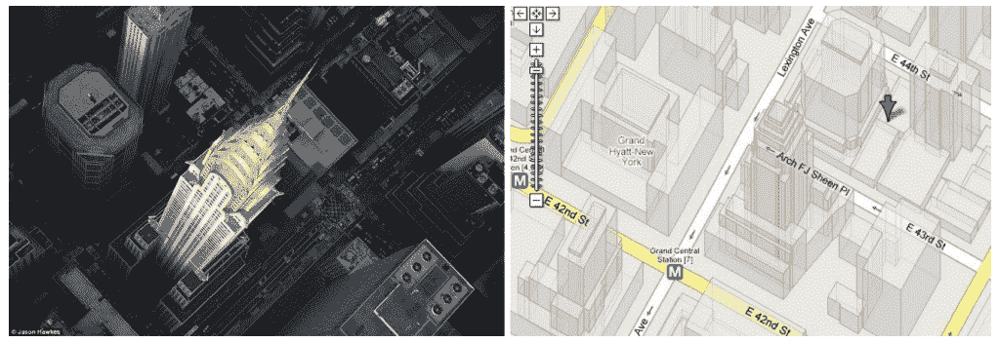**

**Occluding buildings is a crazy idea. Or is it? We already have 3D maps (like Google maps) that could be used for Occlusion.**

# **未来是什么样子的？**

**虽然预先构建的网格对于绑定到单个位置的 AR 体验来说非常好，但遮挡移动对象仍然需要在大于 4 米的范围内进行即时深度测量。**

> **创建逼真的 AR 体验所需的是一个传感器，它可以产生接近无限范围的高分辨率深度图。**

**传感硬件的改进肯定有助于从红外或立体传感器获得更大的分辨率和范围，但这些改进可能会遇到天花板，并在不久的将来产生递减的回报。**

****有趣的是，3D 传感研究中出现了一种替代方法，通过利用深度学习来提高 3D 重建的速度和质量，将这种硬件问题转化为软件问题。****

> **神经网络可能是未来解决闭塞的关键。**

**这种方法使用神经网络，可以在场景中挑选出视觉线索来估计 3D 结构，就像我们人类估计距离的方式一样。(即通过使用我们对现实世界中事物大小的一般知识来猜测距离。这些网络在大型图像数据集上接受训练，能够分割出场景中的对象，然后识别它们以估计深度。**

**这意味着，如果我们能够[设计](https://hackernoon.com/tagged/design)神经网络，并在足够好的数据集上训练它们，我们可能能够绕过当前深度传感技术中存在的分辨率和范围的许多限制，而不会增加硬件成本。**

**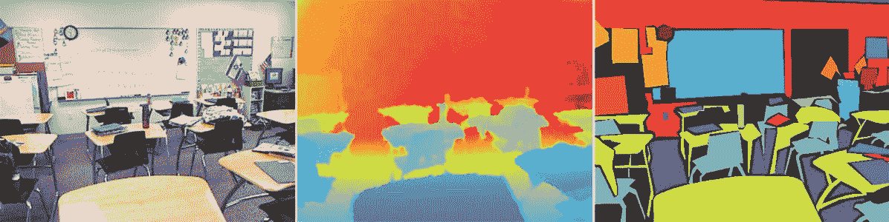**

**Neural network scene segmentation ([http://www.ais.uni-bonn.de/papers/KI_2014_Hoeft_RGB-D_Semantic_Segmentation.pdf](http://www.ais.uni-bonn.de/papers/KI_2014_Hoeft_RGB-D_Semantic_Segmentation.pdf))**

**上面的图像来自一篇论文，该论文探索了使用神经网络结合深度传感器来分割和标记场景的方法，以提高生成的地图的质量。**

**你可以在这里找到论文的全文。**

# **概括起来**

1.  **到目前为止，遮挡是 ar 拼图中最大的一块，因为它朝着 AR 体验的真实性迈出了最大的一步。**
2.  **今天的深度传感器太慢，范围有限，实时遮挡的分辨率低。**
3.  **你可以通过在预先构建环境网格的区域中构建 AR 应用来绕过这些限制。
    [***试用 Placenote SDK 构建基于位置的 AR 体验。***](https://placenote.com)**
4.  **未来解决深度传感器的范围和速度限制的关键可能是深度学习，这种方法已经显示出有希望的结果。**

**如果你是一个新的 AR 开发者，正在寻找建立引人注目的 AR 体验，不要让遮挡阻止你。还记得口袋妖怪 Go 吗？Pokemon Go 中糟糕的遮挡导致了一些搞笑的 AR 截图，这些截图传遍了互联网，并帮助了游戏的迅速崛起。**

**所以好好享受吧！**

****如果您想在 iOS 或 Unity 上构建令人惊叹的 AR 体验，请与我们合作，或者加入我们的团队，让我们一起来吧！****

****联系我**[**Neil @ vertical . ai**](mailto:neil@vertical.ai)**

# **我们是谁？**

**我们正在为持久、共享的增强现实体验构建一个 SDK。我们称之为 [**Placenote SDK**](https://placenote.com) 。**

***特别感谢* [*黄生*](https://medium.com/u/c94b43f230b6?source=post_page-----7bc8041607f9--------------------------------)*[*多米尼克斯·鲍尔*](https://medium.com/u/5faacc2a4dd3?source=post_page-----7bc8041607f9--------------------------------)*[*大卫·斯穆克*](https://medium.com/u/7f91547ce9c9?source=post_page-----7bc8041607f9--------------------------------) *和* [*彼得·费尔德*](https://medium.com/u/42e641330078?source=post_page-----7bc8041607f9--------------------------------) *帮助审阅本文！*****