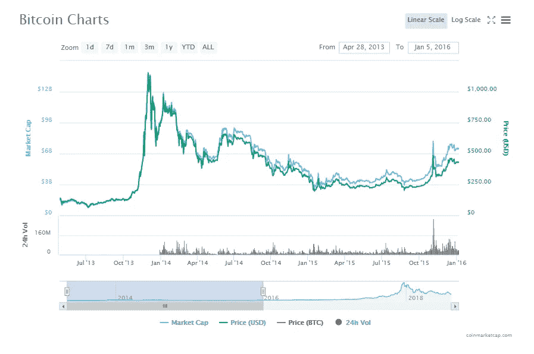
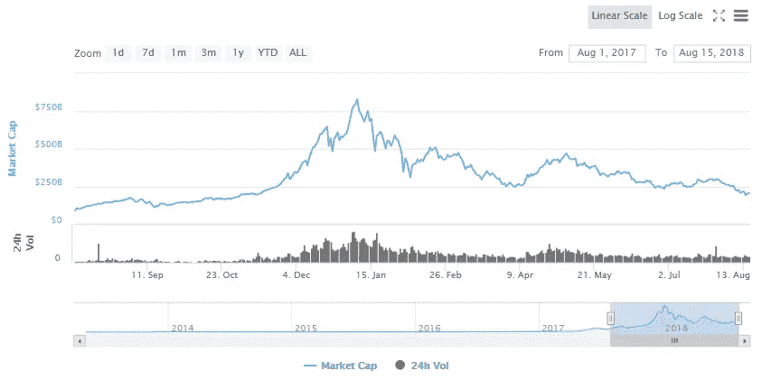
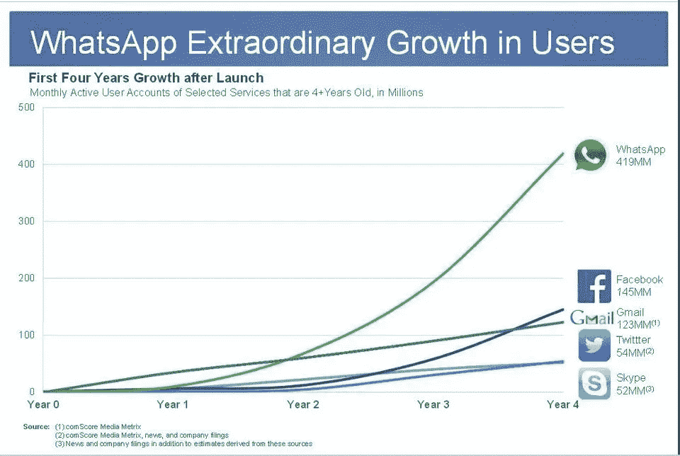

# 加密货币市场为什么会崩盘？另一个长期视角

> 原文：<https://medium.com/hackernoon/why-is-the-cryptocurrency-market-crashing-another-long-term-perspective-808bcbe7cc95>

今天是加密货币领域令人沮丧的一天。今年 1 月后，当百万富翁对他们的新财富幸灾乐祸并抓住“加密货币是永远不会破裂的泡沫”这样的短语时，事情开始放缓，最终迅速下滑。

今天的消息相当令人沮丧。只要谷歌一下“Reddit 加密货币”(因为我更喜欢像一个 80 岁的老人一样用谷歌搜索 Reddit)，这些都是最热门的新闻结果。

这绝对不是许多 ICO 和思想领袖向投资者承诺的未来。(在阅读了关于 12.7 万美元贷款的文章后，孩子们，不要利用风险资产)。目前，该市场已从 8000 亿美元的历史高点下跌了约 75%，在撰写本文时仅略高于 200 美元。那么，为什么会这样呢？谁该为突然的崩溃负责？要理解这一点，我们必须先了解我们是如何来到这里的。

## 重演历史

在 2013 年末，经过一系列非常积极的事件(在著名的[比特币爱情节参议院听证会](https://www.washingtonpost.com/news/the-switch/wp/2013/11/18/this-senate-hearing-is-a-bitcoin-lovefest/?noredirect=on)中达到高潮)，比特币的价格从 100 美元涨到了大约 1000 美元。许多目前的加密货币区块链创始人是行业的一部分，但只有在这次事件后才真正开始认真对待这个行业。

随之而来的是漫长的熊市，直到 2016 年 1 月才完全见底，直到 2017 年才完全恢复。虽然该行业保持活跃并不断创新，但市场直到 2017 年才反映出这一变化。

2013 through Early 2016, Bitcoin Price

如果我们看看今天的整体市场，很容易发现与这一事件的相似之处:

Cryptocurrency Market Capitalization: 2017 to 2018

我不是那种依赖相似的图表来对市场做出决定的人，但情况和主题太相似了，不可能是巧合。在这两种情况下，我们都有:

*   革命性技术的承诺(在这两种情况下，分散的应用程序/产品)
*   增加市场流动性的新/改进手段(交易所、ico 等)
*   一个早期采用者的市场，他们有令人信服的故事，从投资中获得 XXX%的回报，并推广该技术
*   一个更大的未开发的市场，人们非常希望从他们的投资中获得 XXX%的回报

这两种情况都允许市场急剧扩张，超过其目前的规模，并允许价格和估值的大幅上升。但是，关于加密货币及其潜力的好故事，加上更容易的投资方法和已经准备好投资的未开发市场，使得涨幅非常高，崩溃更加严重。我们先来讨论一下行情的上涨。

## 崛起

大多数人倾向于从技术潜力*和采用*的角度来谈论加密货币市场。2017 年末的故事是，市场的价值正在增加，因为该技术是革命性的，允许更好的组织和应用程序，并以前所未有的速度在世界范围内积极采用。

这方面的一个主要例子是 XRP 的价值如何急剧上升，因为世界各地的银行开始了解涟漪的潜力，从而积极受益于价格。在 2017 年，你无法与业内人士交谈，除非他们告诉你所有大规模采用加密货币的公司和个人。证据表明用户的采纳并不令人满意，这似乎并不重要，这个故事被那些投资者普遍接受。

这不仅仅是 XRP 的真实情况，而是所有加密货币的支持者的叙述。(补充说明:我认为唯一能够做出这种声明的加密货币是像 Monero 这样的项目，在那里货币是真正不可交易的。当然，他们的主要用户群是罪犯，但这是另一天的讨论了)。

虽然这个故事适合于“价值将继续上升”的叙述，但我最终更喜欢另一种叙述。事实上，这种叙事也可以解释同样的向上估值曲线，如果不是比采用叙事*更好的话。*让我们从尚未开发的市场和投资工具的角度来谈谈加密货币*。*

Early Cryptocurrency Exchange

2012 年，只有两种获得比特币(或任何加密货币)的好方法，通过网络挖掘或在非常小的、不一定对用户友好的交易所购买。有一些证据表明，这项技术有潜力，你可以投资，但即使是许多技术早期采用者也需要时间来真正理解发生了什么。很少有人大量收养，但事实证明这足以启动未来。

2012 年，BTC 开始向 100 美元上方移动，并且没有停下来。虽然投资的业内人士对事态的这种转变非常高兴，但真正引起注意的是那些熟悉该行业但没有采取行动的局外人。许多了解市场的局外人看到了火箭起飞，不想错过它。随后，许多人通过交易所进行购买。

因为市场如此之小，而相对涌入的人数又如此之多，这意味着市场吸纳了大量新资金，他们都在做一件事:买入。鉴于系统中真实现金的不对称性质，这些现金很容易淹没市场，使价格呈指数增长。[这可能不是 2013 年发生的事情，](https://techcrunch.com/2018/01/15/researchers-finds-that-one-person-likely-drove-bitcoin-from-150-to-1000/)但考虑到 2017 年的市场规模，这肯定是事实。新的资金淹没了市场，使价格成倍上涨。

2017 年，我们上演了同样的事情，但这一次规模更大。其中一个主要原因是因为交易所变得更容易使用，并且使用案例急剧增加。以太坊等项目兴起，创造了新投资工具(ICO ),允许为新项目进行众筹。此外，写作、文档和开发工具的数量也增加了，允许较少(但仍然)的技术用户开始试验。

尽管一个清晰、易于导航的用户界面看起来不像是一个突破，但它足以扩大潜在市场(即使这些用户不能 100%确定他们投资的是什么)。2017 年，我们有更多的用户进入市场，新闻报道更加广泛(各大电视网报道比特币和其他资产的价格上涨)。因此，有人很容易进入市场，为交易所增加更多的“买入”支持。

不管实际采用与否，投机似乎有能力提高加密货币的价格。要解释价格的突然上涨，我们甚至不需要采用成为叙事的一部分:交易者和投机本身就足以解释大规模的估值飙升。但这只能用来解释价格的短期转变。如果这种估价没有得到“真正的”采纳(也就是真正需要你的产品并致力于它的人)的支持，你就会…

## 秋天

投机交易最好和最坏的一点是，这类交易都是短视的。如果一个投机交易者看到一个 10%的交易回报机会，他们会大量买入，并可能通过他们的努力抬高价格。然而，如果这个人感到失望，并决定退出，他们会很容易清算他们的资产，继续他们的生活。

当这是一个单独的交易者或一小群人时，这没什么大不了的(投机者总是存在的)。然而，鉴于加密货币市场的大部分(或至少是市场估值)是由这些新资金推动的，这意味着价格继续上涨的唯一方式是新用户的海啸不会停止。押注投机的新交易者只会有这么多现金，一旦他们投入了一切，他们就不再进行“买入”交易，而是开始进行“卖出”交易。如果太多人同时这么做，你会得到同样的效果，但是效果相反。

现在，这并不总是发生在投机投资者身上。有些人，像我的许多亲戚一样，在 2018 年的高峰期购买了加密货币，然后就停止了交易。一些人，甚至在高峰过后，给市场带来了新的资金([甚至在今天，比特币基地声称每天增加 50，000 名用户](https://www.bloomberg.com/news/articles/2018-08-14/in-crypto-downturn-coinbase-still-signing-up-50-000-users-a-day))。但是，如果你不继续维持市场的增长，买家中新买的要么没有影响，要么成为卖家(业内称之为‘弱手’)。如果这种情况发生得太快，许多其他交易者(市场上的许多投机者)会害怕潜在的损失，迅速抛售。

如果一个市场是由投机支撑的，那么支撑价格的将是投机的突发奇想。尽管有人大声疾呼，声称要全部入市，但大多数人都是为了快速赚钱。长期价值只能由真正需要产品的人来支撑。那么，为什么收养没有在秋天收拾残局呢？毕竟，如果这项技术真的像人们所说的那样具有革命性，难道不应该有一部分人开始购买加密货币用于实际用途吗？答案是，不，那是不可能的。

## 采纳曲线永远不会达到投机者的期望(至少在最初)

如果采用率(我指的是日常运营中需要加密货币的产品的实际用户)跟上了估值和投机者的步伐，理论上可以防止这次崩溃，但这种情况根本不会发生，原因有二。

一方面，新技术的采用是缓慢而平稳的*，即使对于高速增长的产品也是如此。我最喜欢的一个例子是流行网络应用的用户采用曲线:*

**

*请记住，这些都是历史上增长最快的产品，并且都是由真实的用户增长支持的。如果你观察每条曲线，你会注意到每个应用程序吸引用户的能力有一个自然的“进程”。虽然个别日子的现实会相当参差不齐(在 WhatsApp 的历史上，很可能有一天我的人数在一天内增长了 100 多万，然后第二天比这少了 10 倍)，但总体趋势是平稳的，加速的进展。*

*您没有看到的是，应用程序在短短几个月内增长了 10 倍(对于非常小的组织来说，即使是一年增长 10 倍也很难实现)。当处理真正的用户采用时，锯齿状的曲棍球棒增长是不可能的。如果我们看看自己的技术习惯，我们知道这是真的。*

*想一想您现在使用的最流行的应用程序之一，它现在已经成为您日常生活的一部分。也许是 LinkedIn 或 Youtube 或其他社交媒体应用程序。现在，回想一下您第一次听说这个应用程序的时候，可能是通过朋友或同事。在你决定放弃并注册账户后，我希望你回想一下你使用该平台的头几个月。你是不是…*

*   *一个超级用户在几天内，并迅速了解如何使用该应用程序的全部潜力，或…*
*   *一个只是在网站上涉猎一下，看看你有多喜欢它，然后随着时间的推移，慢慢开始融入你的社交/工作生活的用户？*

*如果你像大多数人一样，现实可能更接近后者(除非你从一个工具切换到一个几乎相同的工具，比如从 Hotmail 转到 gmail)。我自己做这个练习时，回忆了 2014 年我在 Quora 上的第一次互动，这是一个我最终会每天使用的网站。在创建了一个账户并回答了一个问题后，我立即停止使用该网站大约一年。2015 年，我在年中回答了大约十几个问题，并开始偶尔使用网站，直到 2016 年年中我更加认真地对待我的写作。在这种情况下,“首次引入”到“日常使用”大约花了两年时间。对于大多数应用程序，从脸书到 LinkedIn，再到 Twitch 和 Youtube，它们都遵循着类似的缓慢模式。*

*即使每个进入市场的新投机者都完全打算成为活跃的区块链用户，他们仍然有可能在更深入地投入之前慢慢开始使用这项技术。这种影响是深远的。一个以太坊的理论上的超级用户可以负责一天花费 100 美元的以太网，而一个非超级用户一个季度可能只进行一次交易。高加密货币估值需要这些类型的超级用户的支持，这些用户将积极支持网络，而不是那些偶尔进行交易的用户。*

*但是，即使相当数量的投机者从第一天起就完全打算成为超级用户，这项技术也会出现另一个问题。*

## *区块链在今天很难使用(即使对于早期采用者)*

*当我去纽约的 Ethereal 时，这个事实对我来说变得非常明显。Consensys 为以太坊爱好者举办了一个为期两天的会议(该会议以有人出价 14 万美元购买一只罕见的 cryptokitty 而结束而闻名)。票价从 800 美元到 1200 美元不等，除非你是纽约本地人，否则需要一张机票和两晚酒店住宿才能参加。我要强调指出一个事实，那就是只有那些愿意花将近 1500 美元去听 Joseph Lubin 和他的同事谈论以太坊未来的人才会去参加这个活动。也就是说，人们应该比普通加密货币用户更有知识。*

*令我惊讶的是，许多(我确实是说许多)参加活动的人并不完全理解区块链交易是如何运作的。在我的谈话中，我不得不多次向人们解释如何购买硬件钱包，如何发送交易，甚至帮助一个新朋友建立一个 metamask 帐户来接收一些新购买的电子邮件。更具启发性的体验之一是一场艺术展览，它要求用户在“体验”结束时发送一笔交易。该展览需要一名全职服务员向人们解释如何通过 QR 码发送交易，因为很多人在结束时离开，不知道如何继续。*

*鉴于智能手机的普遍存在，与解释如何使用去中心化的应用程序相比，从短信切换到 WhatsApp 是一个相对快速的过渡，包括设置钱包，发送交易，确保交易实际发送，以及在你的钱包中看到结果。虽然技术上的变革有可能相当深远，但采用周期将是漫长而艰难的。*

*这甚至还没有提到这样一个事实，即大多数用户并不真正确定一旦拿到钱包(除了交易资产)后该拿钱包做什么。鉴于与交易或投资无关的最具影响力的分散式应用一直是 cryptokitties，我们非常缺乏新的应用。*

*当今行业中大多数非常有趣的项目都专注于构建急需的基础设施，以使技术可扩展并更易于开发，而不是制作最终用户易于理解的东西。我们都理解对良好基础设施的需求(如果你生活在 BBS 时代，你会理解 URL 和浏览器的奇迹)，但也理解这不会很快获得更多用户。*

*这意味着，不可避免地，采用将无法支撑估值，崩盘是不可避免的。我们距离自由市场能够公平地支撑一个 8000 亿美元的市场还有好几年的时间。投机者根本做不到这一点。*

## *结果*

*我称之为“结果”，但每个阅读这篇文章的人都生活在现实中。如果没有稳定的用户流持续使用加密货币进行商业或应用，以及今天的投资者市场或多或少受到限制，这意味着实际使用的下限远远低于实际的市场估值。不要误解我上面的观点:我并不是说市场上没有采用加密货币资产。有许多开发商、新投资者和企业不会轻易放弃他们在该行业的股份，即使价格暴跌。*

*我们看到，在 2014 年至 2015 年的崩盘期间，许多主导 2017 年上涨的项目(我想到了以太坊和 Monero)正在启动。甚至一些打算赚快钱的人发现他们完全被套牢了，尽管他们损失了 90%的价值。这些采纳者不可能维持市场的最高估值，但他们的影响不会是 0。在接下来的几年里，在股市崩盘期间，以及极有可能的长期市场衰退期间，这些人将是该行业的命脉。*

*所以，我的回答更简单:市场以疯狂的速度增长，因为有新的/改进的方式投资加密货币，有足够多的成功故事让每个人的朋友/家人/邻居都有兴趣加入这个派对。人们谈论加密货币是如何被采用的，但实际上这只是推高价格的投机行为。因为实际的采用率不可能跟得上投机者设定的高估值预期(因为价值增长太快，用例太少)，这些投机者中的许多人很快成为市场上的大规模*卖家*。没有任何一种资产或组织导致了这场崩盘，这只是市场不可避免的退出。*

*一些我们无法回答的问题:市场何时见底？衰退会持续多久？XXX 项目会成功吗？这些都是没有答案的常见问题，在今天都可以轻松回答(而且只能事后才明白)。但是我们知道的是，这个行业现在比以前拥有更多的开发人员和聪明人。尽管经历了崩溃，许多项目现在有资金在未来几年进行实验，而市场的其余部分却忽略了它们，转而青睐下一个闪亮的东西。*

*这些人会创造出不可思议的东西吗？我当然很有希望。但这不是我们能决定的。*