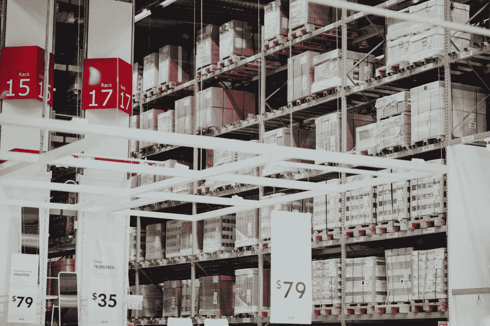

# 为什么仓库自动化对 AI 专业人员如此重要？

> 原文：<https://medium.com/hackernoon/why-is-warehouse-automation-so-important-for-ai-watchers-6f802e70271d>

## ***人工智能在仓库内的影响将充当 AI 的水晶球，机器人在其他行业***

今天工厂里使用的大多数机器人功能强大，但却是盲目的。它们被编程为以高精度和高速度重复执行特定任务，但直到现在…