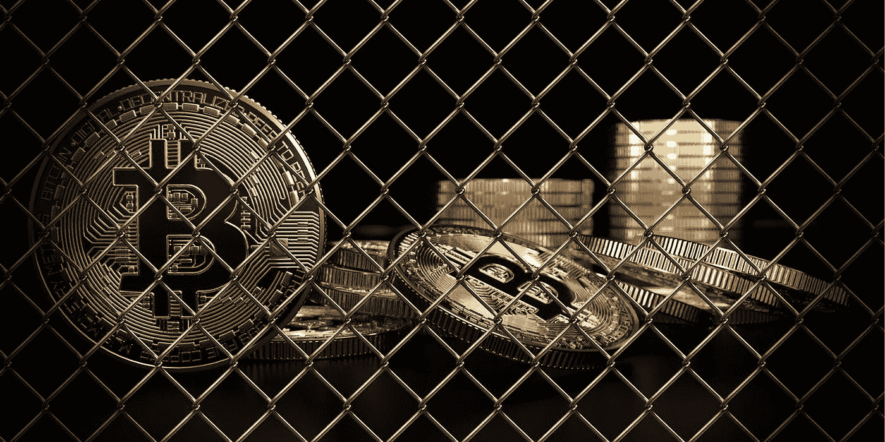
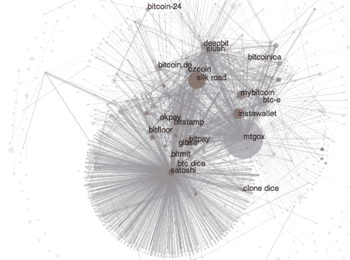
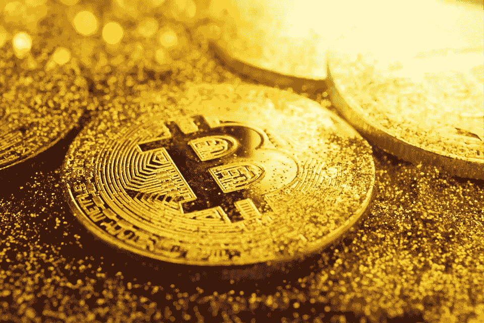
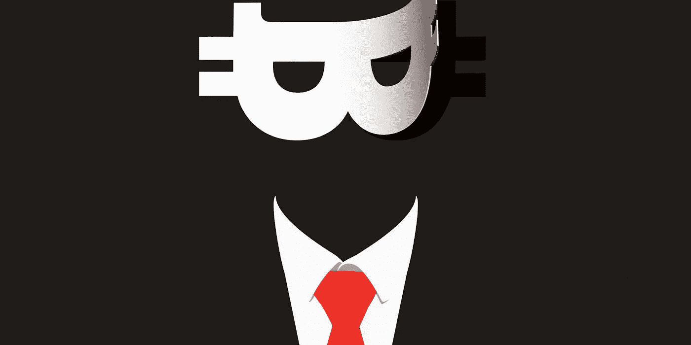

# 为什么比特币没有被各地禁止？

> 原文：<https://medium.com/hackernoon/why-isnt-bitcoin-banned-everywhere-32a2caec90>

当我第一次听说比特币时，它听起来像是反乌托邦科幻小说中的东西。数字，加密，不受审查的钱？这似乎是一个激进的想法，它不可能属于这个十年。

但如果真的如此——如果比特币成为主流——我确信这将导致大规模的地缘政治混乱，改变政府和公民之间的权力关系。这将意味着投资比特币就像资助一支革命军队。这将是如此具有颠覆性，只有少数疯狂的人会愿意这样做。

当然，我所有的想法都是错的。

祖母们现在拥有比特币。除了几个显著的例外(即中国和印度)，世界各国政府都出人意料地欢迎加密货币。比特币几乎在任何地方都是合法的。

最近在监管方面有很多[的骚动](https://www.chainbits.com/news/us-senators-want-stronger-sanctions-on-venezuelas-crypto-petro/)。但在狂热的加密新闻周期中，人们很容易忽视比特币是合法的这一点有多奇怪。显然这是好事——但我们应该对这种情况的发生感到惊讶！

比特币被认为是政府的敌人。它本应摧毁国家对货币政策的垄断，本应成为打击银行和金融监管的利器。事实上，比特币本应建立一个不受审查的影子金融体系。

那么，为什么政府会让比特币走进大门呢？

# 三种解释

最近我一直在思考这个问题，因为我觉得这个问题需要回答。我想到了三种可能的解释。

> **首先是“所有的创新都是好的创新。”**

也许政府认识到区块链技术不可避免的增长，不想通过过度监管过早地阻止创新。这似乎是合理的:你仍能在工业大厅里听到“区块链不是比特币”的回声，区块链理想主义已成为安全的鸡尾酒会话题。

但这种解释有所欠缺。首先，我们已经*有了*区块链。比特币的进一步发展不太可能有助于企业区块链的部署。如果让比特币蓬勃发展的目的是为了开创企业区块链时代，那么它的任务已经完成了。

或许政府正在将区块链与互联网进行模式匹配。对互联网监管采取观望态度显然有助于互联网的繁荣，或许政府也打算这么做。但是政府也竭尽全力反对端到端加密、P2P 文件共享、Tor 之类的隐私技术以及允许逃税的金融网络(见 [e-gold](https://en.wikipedia.org/wiki/E-gold) 和 [FATCA](https://en.wikipedia.org/wiki/Foreign_Account_Tax_Compliance_Act) 之类的全球金融监管政策)。如果比特币威胁到金融监管的权力，那么它将被认为比这些现有技术更加危险。

根据这些例子，“所有的创新都是好的创新”不足以解释政府的松懈态度。

> **第二种可能性是，政府太笨了，没有意识到比特币是一条最终会咬他们的蛇。**

政府有时肯定是被动和短视的。但是我认为这个不正确。总的来说，最强大的世界政府在识别和消除对其权力的威胁方面是彻底而无情的。

此外，比特币的支持者在历史上几乎没有政治影响力。比特币的过去已经被与犯罪、黑市和数字无政府状态的联系所玷污。这正是政府会放进“非法互联网恶作剧”桶里的那种东西。

这两种解释都不令人满意。这让我想到了第三种可能，也是最激进的一种可能:

> 比特币实际上并不是对主权的威胁。

我越来越相信这一点。事实上，比特币可能是对主权最友好的加密货币。

听我说完。我认为这是真实的，主要有三个原因。

# 比特币不提供真正的匿名

比特币通常被描述为匿名加密货币，但这是不正确的。比特币其实是*化名*。区别是至关重要的:在一个密码化名下，你的行为仍然可以被跟踪。

这是怎么做到的？首先是菲亚特 onramps，交易所通过他们的 KYC 程序收集你的信息。在调查可疑活动时，这些信息通常会与其他交易所共享。即使你把比特币拿到主网上，你的活动仍然会被追踪。[试探法和聚类分析](https://bitfury.com/content/downloads/clustering_whitepaper.pdf)经常被用来识别你使用的交易所、混合器和其他常见的区块链服务。[超级节点](https://www.coindesk.com/chainalysis-ceo-denies-launching-sybil-attack-on-bitcoin-network/)连接到比特币网络的大片区域，并将交易与其原始 IP 相关联。即使有细致的 opsec 和地址轮换(大多数人不这么做)，如果你想把比特币变回菲亚特，那个出口也同样受到严格监管。如果你的比特币出现非法活动的迹象，你通常会被拒之门外。

这不仅仅是假设。交易所对比特币的流动有着深刻的洞察力——足以成功阻止黑客攻击、被盗资金，并定期提交[可疑活动报告](https://en.wikipedia.org/wiki/Suspicious_activity_report)(美国所有交易所都被要求这样做)。我们通过[米勒探测器](https://blog.cotten.io/bitcoin-money-laundering-and-muellers-12-e2fa91097e12)和 [Mt. Gox 黑客](https://www.youtube.com/watch?v=l70iRcSxqzo)的分析看到了这一点。像 Chainalysis 这样的公司为执法部门和各种三信机构提供监控服务，[据报道，2018 年通过政府合同获得超过 570 万美元的收入](https://diar.co/volume-2-issue-38/)。

对于一般人来说，这大概不是什么大事。大多数加密货币用户没有做任何违法的事情，也不必担心自己成为监控的目标。但是想想:这和我们使用的其他系统有什么不同？大多数人觉得他们的手机通话是隐私。但是在他们的脑海里，他们知道他们的电话可能被窃听或者他们的电话供应商被传唤。我们感到欣慰的是，这种监控是不太可能的，通常需要一个重要的法律门槛。然而，如果有一天我们的电话在陪审团面前被重播，我们知道不要感到惊讶。比特币属于同样的安全模式。

人们甚至可以说，比特币没有使用海外银行系统那么私密。美国对不友好的银行辖区所发生的事情了解有限。但是区块链上的一切都是可见的。如果每一家外国金融机构都在区块链上公开它们的交易，这对美国来说将是一份多么大的礼物啊！

在没有批判眼光的人看来，比特币的假名看起来像是经济隐私方面的一大进步。但是隐私的表象比没有隐私更危险。公民越是相信自己是安全的、有权力的，国家就越能自由地对他们行使真正的权力。这是比特币对主权友好的第一个原因。

# 价值储存不具有威胁性

我曾经相信，如果比特币真的成功了，它会成为一种全球货币。世界上的每个经济体都将通过使用比特币作为新的全球加密货币而团结起来。

越来越明显的是，这不太可能。这既是因为比特币不可能成为世界性货币，也是因为比特币可以在不成为世界性货币的情况下取得成功。传统上，货币必须充当交换媒介、记账单位和价值储存手段。

比特币不太可能成为全球货币，原因有几个，每一个都可能是一篇独立的文章。但简而言之:比特币有[过高的延迟，过低的吞吐量](https://en.wikipedia.org/wiki/Bitcoin_scalability_problem)，以及由于灰尘限制(目前非 Segwit 交易约 3c 美元)上升导致的可分性过低[。此外，即使像闪电网络这样的第二层扩展技术被证明是成功的，比特币的通货紧缩的货币政策使其成为一种](https://www.reddit.com/r/Bitcoin/comments/2unzen/what_is_bitcoins_dust_limit_precisely/)[糟糕的交易媒介](https://www.economist.com/free-exchange/2014/04/03/bitcoins-deflation-problem)。

如果真到了这一步，央行觉得数字货币构成了足够大的威胁，它们会很乐意激励(或强制)使用自己的货币，以维持主权货币政策。

值得记住的是:金钱是终极的网络效应，而且具有不可思议的粘性。在第一世界尤其如此。我们的金融系统可能建立在生锈的旧齿轮上，但它已经被改造成具有如此多的抽象层和可用性，以至于在大多数时间里，对大多数人来说，它已经足够好了。将这两者放在一起看，我们当前的金融体系远远领先于加密货币的 UX(尽管我急切地等待着改变的那一天)。

所以比特币不适合做全球货币。但是比特币还是可以成功的！正如尼克·卡特(与后街男孩没有联系)所记录的那样，比特币已经迭代进入了“数字黄金”的[愿景](/@nic__carter/visions-of-bitcoin-4b7b7cbcd24c)事实证明，主权国家对此相当满意。

注意，比特币成为一种数字黄金还有很长的路要走。更不用说它们的相对波动性了，黄金的市值高达数万亿美元。与黄金作为全球价值储存手段的主导地位相比，比特币仍然相形见绌。

但主权国家主要关心的不是保护黄金的地位(除非它们持有一定数量的黄金储备)。全球价值储备的中断不会对他们的权力构成重大威胁。

但我会告诉你会发生什么:如果比特币成为一种交易媒介。然后，它可以支持一个丰富的链上经济，它的用户可能能够在一个平行的，不受审查的经济上进行他们的金融生活。但事实证明，比特币是一种糟糕的交易媒介，很少有实质性的业务完全建立在比特币上。

作为价值储存手段，故事就简单多了。比特币的使用流程必须始于法定货币，并终结于比特币基地或 Bitfinex 等非链交易所。这些交易所是政府可以监管连锁活动的瓶颈。任何犯罪活动最终都需要获得法定流动性——价值储存不能用于为现实世界的运营融资。

(比特币也无法支持 DEXes 或轻松与其他区块链互操作。这迫使市场围绕这些链外交易所进行整合。)

这很好地解释了为什么印度和中国是禁止加密的两个主要国家。这两个国家都有严格的资本管制和迅速壮大的中产阶级，渴望逃离本币。他们主要关注的是经济保护主义和防止资本外逃。T2、印度和 T4、中国对黄金进口都有严格的限制。对于不怕资本外逃的国家来说，价值储存构成的威胁较小。

但是交易媒介让政府感到害怕。自由储备银行是这种试图规避政府对金融监管垄断的交易媒介的典型例子。但是一个纯粹的价值储存库，它的涨跌可以很容易地被监管，并且它不能避开金融-工业复合体——嗯，它对主权的威胁较小。他们甚至可以称之为创新。

这是主权国家对比特币开放的第二个原因。

# 比特币不属于任何人

这听起来像是这篇关于比特币的文章。但我其实很看好比特币。比特币是迄今为止最分散的加密货币，也是唯一可以说是政治上无状态的货币。这是成为价值储存手段的巨大优势。没有其他加密货币可以声称这一点，也可能没有其他货币会这样做。

你看，今天存在的几乎所有其他加密货币都可以在地图上找到。它是由一个人或几个人构想出来的。我们知道他们从哪里来，住在哪里，以及他们在哪里传福音。

比特币是唯一的例外。它的假名创造者中本聪现在是一个幽灵。比特币不属于任何人，也不依赖任何人。如果它的所有开发者都被围捕并投入秘密监狱，它的开发将在另一组名字下继续。这也意味着，如果一个政府支持比特币，它不会将权力拱手让给任何其他国家。这个事实被低估了。

比特币的无国籍性使其成为唯一有机会被央行购买的加密货币——最终，也是唯一能让比特币成为万亿美元资产的买家。这种合法化将巩固它作为一个真正的数字黄金。

中央银行能购买乙醚或 IOTA 吗？我想不会。这些是公司，有总部和可识别领导人的世俗组织。

虽然我很喜欢以太坊，但它是由一个俄罗斯裔加拿大人创建的，开发团队主要是美国和欧洲人。创始人四处走动。他们有计划，他们改变主意。他们有护照和忠诚。以太坊完全属于这个世界。

而比特币则是无处不在:所有国家都能在比特币上看到自己的倒影。美国人将比特币基金会和许多核心开发者视为美国人。日本人视中本聪为自己人，因此比特币是他们的发明之一。英国人声称[聪很可能来自英国](https://en.wikipedia.org/wiki/Satoshi_Nakamoto#Characteristics_and_identity)。中国人声称他们控制了采矿业和保障比特币安全的硬件。

这一点我不是在批评以太坊！以太坊是一个梦幻般的创新项目，在任何事情上快速创新都需要协调和集中。但以太坊在这一点上与比特币不同，鉴于它只有几年的历史，我们不应该期望它是。或许十年后情况会有所不同，但目前比特币自成一类。

比特币是唯一一种类似全球公地的数字货币。这些因素将使政府更有可能接受比特币作为价值储存手段。

# 艰难的妥协

请记住，如果政府真的认为比特币是一种威胁，他们会宣布其为非法，并关闭加密货币交易所。这将打击价格和流动性。当然，这不会是比特币的终结，但这将是比特币取代黄金梦想的终结。

在某种程度上，或许比特币的技术惯性和薄弱的隐私保障比我们想象的更具适应性。也许如果比特币像以太坊或 Zcash 一样积极创新，我们就不会处于今天的局面。

因此，问题仍然存在:即使比特币被降级为价值储存手段，其他一些加密货币会成为全球交易媒介吗？现在，我相信政府看不到这种情况很快发生的任何可能性，这一定是他们允许实验继续进行的原因。老实说，我们当中清醒的人也不知道——目前加密货币唯一的杀手级应用是投机。

但随着技术的成熟和这些系统开始规模化，这种情况将会改变。事实上，当这种情况发生时，我们应该预料到加密的下一阶段会更加混乱。它不一定伴随着政府不加批判的祝福而来。

最终，我不知道这些问题的答案。说实话，我甚至对这些结论都不确定——我既不是监管专家，也不是国际政治专家。事实上，政府并不是由一个单一的意图驱动的，而是由许多派别组成的复杂的、涌现的过程。过去十年清楚地告诉我们:政府很难根据基本原则来预测。

不管怎样，我想看到这个实验结束。在我看来，毫无疑问，50 年后，货币的运行方式将与今天完全不同。唯一的问题是要走哪条路才能到达那里。

免责声明:这些是我的个人观点——它们不代表亚稳定资本，也不应被视为投资建议。我不是你的投资顾问，我不是你的律师，我也不是你的父亲，尽管我和你妈妈非常相爱。完全公开，我拥有一些比特币，亚稳定资本也是。