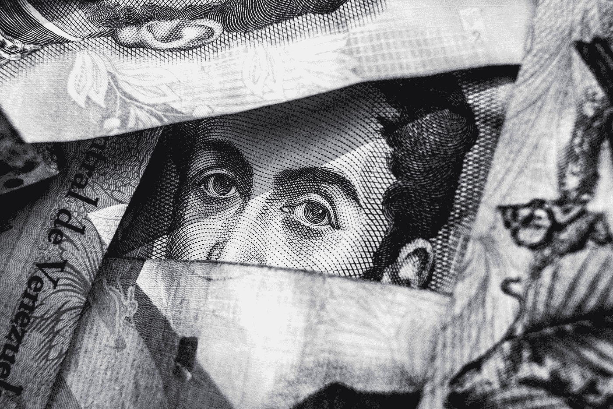

# 为什么是时候监管加密交换了

> 原文：<https://medium.com/hackernoon/why-it-is-time-to-regulate-crypto-exchanges-e4a8b2a82bdd>

The eye of the regulator is turning towards crypto exchanges.

**泵送和倾倒**

是时候了。华尔街日报刚刚发表了他们对加密货币泵和转储方案的研究。显然，也许这并不奇怪，泵和转储是一个猖獗的问题，并发生在所有的时间。甚至像币安这样的顶级交易所也不能幸免。

通过 Telegram 和 Discord 等聊天应用程序，匿名用户将投资者社区组织成泵和转储组，以便在精确的日期和时间购买代币，从而在代币上制造虚假的涨势。抛售的目的是让不知情的投资者跳上涨势，购买代币，相信他们也可以从价格上涨中获利。

一旦价格达到预先设定的阈值，那些参与抽取和倾倒的人就卖掉他们的代币，获得利润并使代币回落到其原始价格。那些不知情的投资者购买了代币，但却没有参与游戏，他们的钱也就没了。在这些骗局中损失了数亿美元。那么，监管者在哪里？

即使金融欺诈不是发生在受监管的交易所或替代交易系统中，它也是一种犯罪。惊喜！那些认为公用事业代币不是证券，因为证交会、CFTC 和联邦贸易委员会与此事无关，所以非法抽水和倾倒会不受惩罚的欺诈者，在这两方面都是错误的。

金融欺诈是美国证券交易委员会和其他美国监管机构最感兴趣的领域。例如，金字塔顶端的人向其他人销售“产品”，而其他人又雇佣更多的销售人员来赚取佣金，如果系统中的金钱不能为参与者创造任何价值，那么这种金字塔计划就是非法的。答对了。这是一种最简单形式的欺诈，泵和转储也是如此。

**证交会在哪里？**

真正的问题是，在这个故事中，证交会在哪里？明显的罪行怎么能逍遥法外，不被追究呢？毕竟，如果联邦调查局能找到罗斯·乌布里希特，也就是丝绸之路毒品市场的头目“恐惧海盗罗伯茨”，并让他在监狱里呆上两辈子，那么 SEC 肯定也能找到“泵和转储”背后不那么老练的罪犯。

SEC 的第一步是从 Telegram 聊天系统中收集所有数据，以识别群组参与者。不幸的是，Telegram 使用了非常好的加密系统，这使得追溯组织者的 IP 地址非常困难。然而，有另一种方法可以找到它们。

事实证明，每一个交易加密令牌的网站，也称为“交易所”，都是找到泵和转储背后的个人的门户。问题是，SEC 需要交易所运营商的合作，才能抓住这些罪犯。想象一下这样一个场景:币安的创始人兼首席执行官赵昌鹏向美国证券交易委员会(SEC)提供了那些在加油前进行交易的账户的地址。从逻辑上讲，在这些账户中的某个地方，是泵和转储的组织者以及参与者。如果交易所有他们的身份或 IP 地址，那么就有可能将罪行归咎于罪犯。

然而，现实是这样的:币安不受监管。它位于香港，最近宣布迁至马耳他。币安没有义务帮助外国政府，也没有义务帮助其用户。事实上，抽取和转储方案对交易所有利，因为这些方案增加了流动性和用户活跃度。这对他们来说只是额外的收入。他们为什么要阻止呢？

在各国监管机构决定认真保护投资者之前，它们不会迫使交易所接受监管，从而接受监督。直到那个时间点，什么都不会改变。

**受监管的市场**

All marketplaces need order.

在受监管的世界里，美国的另类交易系统和交易所受 SEC 的直接监管。证券交易委员会可以随时获取所有数据。因此，经纪自营商和交易所运营商受到激励，去做正确的事情，不允许任何抽取和转储计划，因为如果 SEC 发现他们的交易平台存在欺诈，他们可能会被吊销执照。对于加密交易网站或所谓的“交易所”来说，情况并非如此他们可能不太关心欺诈行为。他们唯一优先考虑的是扩大用户群，创造更多收入。对他们来说，用户群到底是谁，他们在交易所里到底在做什么，远没有那么重要。

需要明确的是，在我看来，问题不在于这些交易所是否会受到监管，而在于何时受到监管。2018 年 3 月 7 日，美国证券交易委员会宣布，促进证券交易的交易所(这包括“效用令牌”的交易，美国证券交易委员会已经明确表示，这些交易通常缺乏效用，事实上是其他几份公告中的证券)必须在美国证券交易委员会注册[或豁免注册](https://www.sec.gov/news/public-statement/enforcement-tm-statement-potentially-unlawful-online-platforms-trading)。在此声明之后，像比特币基地和 Polliniex 这样的公司决定向 SEC 和 FINRA 寻求 ATS 许可证，这并不是巧合。

监管正在发生。随着寻求注册的公司进入该行业的最前沿，下一步是 SEC 传唤所有在美国运营和/或拥有美国用户的未注册交易所。然后，美国证券交易委员会可以收集他们的数据，开展执法行动，把泵和转储阴谋者和其他欺诈者绳之以法，并归还投资者的一些钱。

这就是监管者的作用。

如果你喜欢你所读的，请鼓掌并给我一个跟进的媒体。