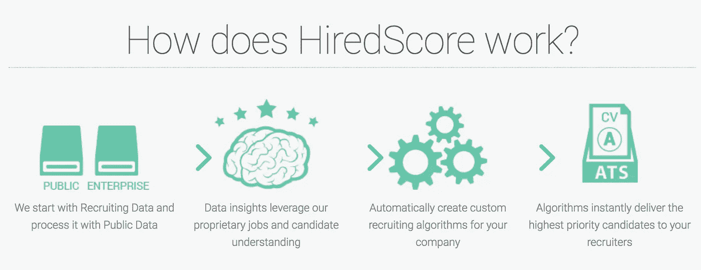

# 为什么我决定加入 HiredScore

> 原文：<https://medium.com/hackernoon/why-ive-decided-to-join-hiredscore-867ed125f697>

在我的[上一篇文章](https://hackernoon.com/the-hard-thing-about-hard-things-when-a-manager-decides-to-quit-680b031965b1)中，我分享了我作为一名决定离开公司的经理的经历。

从那以后，我加入了一家名为[的令人惊叹的初创公司，雇佣了 Score](https://hiredscore.com/) 作为他们的整合主管。

在这篇文章中，我想分享**为什么**我决定加入他们。

# 是什么驱使着我

我进入软件行业已经快 10 年了。我和许多人、经理、团队成员、同事、客户和其他人一起工作过许多不同的产品和技术。

我想只有在过去的几年里，我才真正明白是什么在驱动着我。对我来说，创造激情和那种感觉，让你想带着微笑来工作的要素是什么？

对我来说，有四个要素:人、产品、商业策略和技术。

## 人

我想成为一个有才华、专业和有趣的团队的一员。想要成功的人，不害怕离开他们的舒适区，并不断挑战彼此，以不断提高。

## 商业策略

我希望成为一个团队的一员，这个团队不断思考关键的业务组成部分，包括盈利能力、可量化的影响和竞争定位，而不仅仅是产品和技术。一个拥有创建成功公司愿景的团队。一个目标是成为市场领导者的人，通过创造一个伟大的产品，由一个伟大的和财务健全的公司支持。

## 产品

我想做一个真正与众不同的产品。为用户带来真正价值的产品。一个拥有巨大潜力和大量发展机会的产品。

## 技术

我是一名工程师，技术是我生命的血液。我想面对艰难的技术挑战，用工程师们引以为豪的方式来制造产品。

这是我开始寻找的组合。

# **输入 HiredScore**

[HiredScore 的](https://hiredscore.com/)使命是通过深度整合招聘和员工数据，帮助大公司改善招聘流程，实现招聘目标。

HiredScore 使用机器学习来了解大公司如何雇用候选人，并形成独特的见解，以便为新的申请候选人提供分数，并让公司的招聘人员专注于与他们的工作最匹配的候选人。此外，HiredScore 还传播高质量的潜在客户，这些客户在过去的流程中可能会被拒绝，或者已经签约，以便在未来获得该公司的潜在工作机会。

我喜欢人力资源世界。尤其是人们如何雇用和拒绝候选人。我觉得这个产品很迷人，这并不奇怪！想想这个挑战的重要性——如何自动化这样一个主观的软技能，比如决定一个人是否适合你的公司？

我曾经有一个经理，他有一句口头禅——“了不起的人创造了不起的产品”。我一直很喜欢这句话。主要是因为这是真的。HiredScore 团队是一群来自不同行业和角色的超级天才。每个人都给团队带来了独一无二的特质。他们不仅聪明、专业，而且友善，一起工作很有趣。心脏和大脑。

该产品具有巨大的潜力和许多不同的产品和商业机会。我真的相信它解决了一个真正的问题，并为它的用户带来了真正的价值。有许多方法可以让产品和公司成长，以成为行业领导者和一个伟大的盈利公司。

HiredScore 帮助公司改善招聘流程和招聘目标。但这不仅仅是它的功能。这也是一个 100%合规的解决方案，也为候选人带来了价值！HiredScore 为每一位候选人提供平等的机会，不论性别、种族、民族等。这个产品其实是在做一件对世界有意义的好事。

技术挑战是巨大的！需要设计和制造一种高度可定制的产品，能够学习和适应公司独特的招聘工作流程和决策过程。这不是像对狗或猫的照片进行分类这样常见的机器学习挑战。HiredScore 开发了一些算法，这些算法可以接受人类的决定，并试图消除人的主观因素，并以完全合规的方式根据数据提出建议。

但是“集成负责人”的真正含义是什么呢？

# 整合主管

我在 HiredScore 的角色是“集成负责人”，这意味着我处于创建高度可扩展和可靠的集成和产品的十字路口，尽管存在高度复杂和高度定制的逐客户端系统和数据结构。

与世界上一些最大的公司在全球范围内开展所有这些工作，确实不是一个简单的技术、产品和数据科学挑战，需要一个极具创造力、热情和才华的团队来构思、构建和不断迭代！

> 这家公司太棒了，它非常适合我想要实现的一切并成为其中的一员。

快一个月了，我已经有了目标感。我和优秀的人一起工作，和他们一起工作我很开心。我感到挑战和满足。

多棒的旅程啊。

页（page 的缩写）S

我们正在招聘:)

https://hiredscore.com/jobs.php