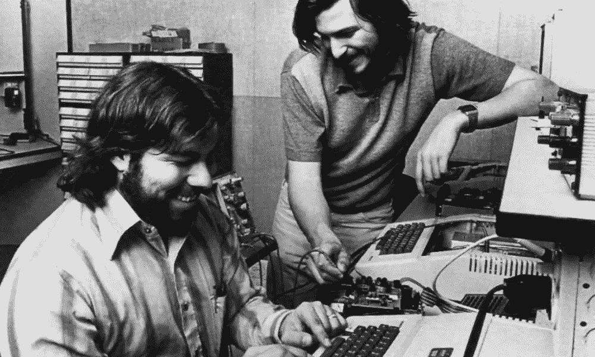

# 为什么你应该加入一家早期创业公司

> 原文：<https://medium.com/hackernoon/why-joining-an-early-stage-startup-973d904bf28b>

## 作为工程师，你有巨大的影响力💥在你工作的产品上👩‍💻和你加入的组织🤝

Steve and Steve in Steve’s parents’ garage

各种科技公司都有机会，尤其是如果你是一名工程师。如果你并不真正关注，你只会听说大公司，因为它们肯定会吸引大部分的注意力，即使它们只代表了一小部分的工作机会。此外，即使在 2018 年，一些人认为加入一家初创公司对你的职业生涯来说是不确定的，甚至是危险的。

**操。那个。狗屎***

# 轻巧高效的 organization️ ⚡️

一个早期的创业公司有一个非常小的团队。没有指挥链，没有经理，没有繁重的流程，也没有遗留系统。这样的小团队天生高效。所有利益相关者都是其中的一部分，所以 CTO 或 CEO 现在可能就坐在你旁边。这个组织永远不会妨碍你。这让你的工作效率很高。

# ️Your 对产品的影响💥

当你发布一个产品时，你花了大部分时间去做有用的事情。增加一个新功能真的又快又便宜。删除该功能并尝试另一个功能会更快😜。此外，在一个 5 或 6 人的团队中，**你肯定会对产品产生巨大的影响**。你不仅代表了 20%的劳动力，而且在 3 年内，许多特性和发展将取决于你在开始时所做的工作。

# 大公司的想法通常会发生什么💡

一个新想法在大公司的生命周期是怎样的？如果这是你的想法，而你又不是高管，那就需要*永远*来验证。然后，您需要考虑对您的用户、技术堆栈或数据的影响。所以你需要一个**迁移计划😨**。如果迁移对用户有影响，你可能会创建一个类似于[这个](https://beebom.com/how-enable-new-gmail-ui/)或者[那个](https://www.theverge.com/2017/5/2/15514028/youtube-material-design-preview-opt-in-desktop-dark-mode)的并行 UI。如果需要迁移数据，那么在合理的时间内完成迁移所需的时间肯定会比您想象的长 10 倍。如果是架构(想想从 Angular 迁移到 React，或者从 Rails 4.1 迁移到 Rails 5 等等。)，我们谈论的是几周或几个月的发展。哦，大多数时候，迁移是不值得努力的。因此，您会受困于旧的界面、过时的数据或低效的技术体系。

# 建立遗产还是承受遗产？🌓

当你在早期创业阶段从事产品工作时，你实际上是在创造一份遗产，在我看来，这比依赖别人的遗产要愉快得多。几年后，你会比其他人更有效率地开发产品，因为你不仅知道过去大多数决策的背景，你也是背景的一部分。

早期员工在新人入职过程中起着关键作用。他们了解公司，因为他们就是公司。

# 你冒的那些风险🙀

让我们面对现实吧。当你在一个市场上接受一份工作，而这个市场上有 10 份工作需要 3 个候选人时，接受其中任何一份工作都绝对没有风险。你的创业 3 个月后失败了？好吧，你将是市场上唯一可以立即得到的人，而其他人都有两三个月的通知。不想再这样了？在大公司找一份安静轻松的工作。也许你会加入另一家小公司，几年后自己创业。

> 也许几年后你会创建自己的公司…

# 你赚的钱💸

这是不确定的部分。早期员工通常在公司真的很小的时候获得股票期权。百分比在 0.15%和 2%之间变化，当然，几年后这些股票可能一文不值。但该公司被收购的可能性很小，在 1000 万美元到 1 亿美元之间。在这种情况下，你的成果可以代表相当多的钱。当然，早期员工获得的股份比其他人多得多，主要是因为他们在不确定性高的时候决定加入公司，但也因为你根本不可能让 200 个人每人拥有 1%的股份…

老实说，如果金钱是你加入一家公司的主要原因，那么还有其他更确定的赚钱方式。

# 想知道做企业家是什么感觉？🤓

也许，只是也许，有一天，你打算创建自己的公司。在早期创业中，你观察到的是真正的创业者每天都面临挑战、成功和失败。在公司外部，你主要听到的是筹资和首次公开募股，或者与性骚扰相关的灾难，或者 T2 的隐私问题。

# 学习别人的 jobs️🙋‍♂️

在一个小公司里，所有的技能都聚集在一个非常小的环境里。你总是与从事不同工作的人合作，并从他们身上学习。如果你是一名工程师，学习一些关于营销或设计的东西很容易，或者至少理解他们面临的挑战。在一个大的组织中，除非你是一名经理，否则你通常会和像你一样的人合作。

当你是一家大公司的经理时，情况就不同了。你确实和组织的其他团队交流过。但是，你实际工作做的不多。这是因为参加会议、处理积压的工作、搞政治和管理你的职业生涯需要大量的时间。这就是为什么越来越多的管理者成为个人贡献者的原因。

# 像对待产品一样对待组织👫👭

早期创业公司是一个年轻的组织。成为其中的一员，你就有机会尝试新的管理方式，而不必应付已有的等级制度。你会尝试一些闪亮而高效的举措，比如举行[无状态会议](https://m.signalvnoise.com/status-meetings-are-the-scourge-39f49267ca90)、[异步沟通](https://zachholman.com/posts/how-github-works-asynchronous/)、[电子邮件透明](https://stripe.com/blog/email-transparency)——十年前我会提到 Scrum😛。在如何相互协作、如何交付产品以及如何与客户交流方面，你都有自己的发言权。因为你为组织做出了贡献，你会喜欢它，就像你喜欢你正在开发的产品一样。

你将不断创新、学习、试验产品和工作方式中的新东西。每一天，你将拥有你所做的和你如何做的。

*想加入一家总部位于巴黎的初创公司，帮我们解决所有问题吗？想做一个伟大的产品，并把公司作为一个产品？看看我们的* [*开口*](https://angel.co/yeeld-fr/jobs) 。

Yeeld 是一家专注于简单目标实现的法国移动银行。

* *善意的* [*从 DHH* 借来的](https://m.signalvnoise.com/microsoft-reboots-war-on-sleep-a90da0396fb5)