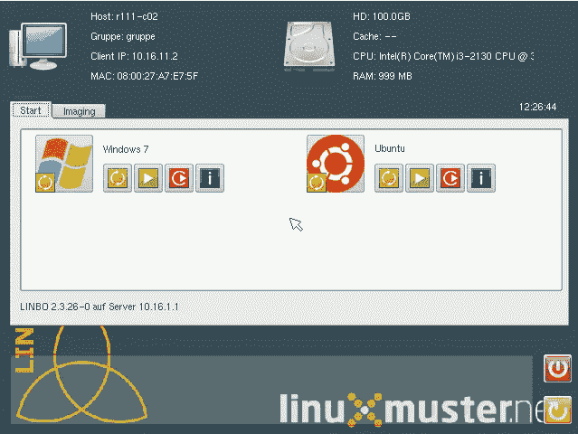
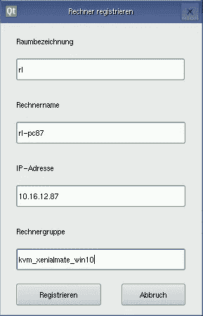
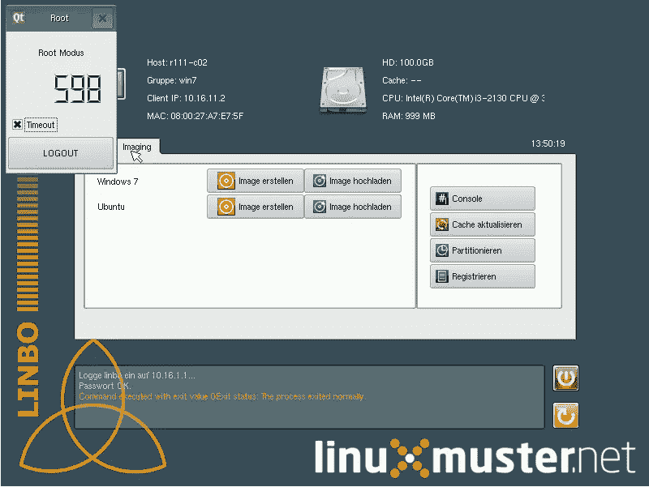

# 为什么林波是 linuxmuster.net 最好的特色之一

> 原文：<https://medium.com/hackernoon/why-linbo-is-one-of-the-best-features-of-linuxmuster-net-3b8a5fd5ee34>



linuxmuster.net 有很多我喜欢的地方，但其中最棒的是 Linbo。Linbo ( **李** nux **N** 网络 **Bo** ot)是一个我们用来管理所有电脑的迷你操作系统。有了 Linbo，我们可以在网络中注册新的计算机，创建新的映像，并将它们分发给学校网络中的其他计算机。对于学生和教师来说，Linbo 更像是一个引导管理器，他们可以用它来选择或重置他们想要的操作系统。

Linbo 有什么特别之处，为什么它能节省我们很多时间，我想在这篇文章中解释一下。

# 注册计算机

在 linuxmuster.net，你必须注册所有的电脑才能被 Linbo 管理。每台计算机接收一个 IP 地址、一个计算机组、一个房间和一个主机名。只需通过网络启动计算机，并在 Linbo 中选择“成像”选项卡。出现一个对话框，您可以在其中输入所有信息。如果您在一个房间里有多台计算机，Linbo 会自动填充大多数字段。



如果您以后想要对单个房间或计算机组进行设置，此信息非常重要。这方面的一个例子是教室管理软件 [Epoptes](https://openschoolsolutions.org/classroom-management-epoptes-app-month/) 。

# 创建图像

使用 Linbo，您可以创建分区的映像(“映像”)，以后您可以将这些映像分发给其他计算机。这极大地简化了许多电脑的管理，因为您通常只创建一个主映像，然后在多台电脑上使用它。由于 Linbo 创建了分区的镜像，它几乎支持任何操作系统(Ubuntu、Windows 等等)。在“成像”选项卡中，您有不同的选项可供选择。



使用“创建图像”按钮，您可以创建图像并将其直接上传到服务器。

# 同步计算机(也离线！)

一旦您创建了映像并上传到服务器，该映像就可以分发到其他计算机。为此，您可以通过网络重启计算机，然后简单地按下黄色或红色按钮。不同的是，通过点击“新建并开始”(红色按钮)，分区被预先格式化。在正常同步中，rsync 在后台执行。


Linbo 会在同步之前将完整的图像下载到电脑上。我们的 Ubuntu 映像大约 4.1GB，我们的 Windows 10 映像大约 12 GB(这是我更喜欢使用 Ubuntu 的另一个原因:)。由于映像是下载的，同步也可以脱机工作。例如，如果系统被 u 盘感染了病毒，或者您的配置被破坏，您只需重新同步计算机，就可以恢复到所需的状态。这是一个很棒的功能，对于每周有数百名学生使用电脑的学校来说尤其重要。

# 林博工具

linuxmuster。net 附带了一些可以从服务器端使用的命令行工具:`linbo-ssh`、`linbo-remote`和`linbo_wrapper`。

# 林波-宋承宪

用`linbo-ssh`你可以登录每一台启动 Linbo 的电脑。为此，只需在命令后输入计算机的主机名，例如

```
$ linbo-ssh r100-pc01
```

# linbo _ 包装器

如果您使用`linbo-ssh`登录到计算机，`linbo_wrapper`可以执行 GUI 中的所有命令。例如，要格式化计算机，然后同步第一个操作系统，请使用以下命令:

```
~$ linbo_wrapper partition sync: 1
```

`linbo_wrapper help`给你更多选择。

# linbo-remote

这个命令对我来说是最好的特性之一，因为它允许我从服务器控制一切，我也可以在 GUI 中手动完成。可能的应用非常多样:

*   自动为整个计算机组提供一个新的映像(通过局域网唤醒),例如$ linbo-remote -g fs -w 60 -c 分区，格式，initcache: torrent，sync: 1，start: 1
*   自动关闭已经启动 Linbo 的计算机
*   每天早上同步所有计算机，并启动选择的操作系统。因此，你总是有一个新鲜的系统，这是立即准备使用。

由于`linbo-remote`是一个非常普通的命令行工具，它还可以集成到其他脚本中，这进一步扩展了应用的可能性。

我们非常喜欢这个工具，因为它允许我们自动执行大多数维护任务。

# 结论

如果你想了解更多关于 Linbo 的信息，你可以在文档中找到更多信息[。对我来说，这是 linuxmuster.net 的特色。我从未见过任何其他方式可以如此轻松地管理多台电脑。](http://docs.linuxmuster.net/en/latest/clients/linbo/index.html)

**你用什么工具管理多台电脑？CloneZilla？雾？辉？Opsi？**

*最初发表于*[*【openschoolsolutions.org】*](https://openschoolsolutions.org/linbo-one-best-features-linuxmuster-net/)*。* ***注册*** *订阅我们的时事通讯，获取免费的 PDF 格式，并为您的课堂提供出色的开源应用程序，或者在 Twitter 上关注*[*@ OpenSchoolZ*](https://twitter.com/OpenSchoolZ)*。*