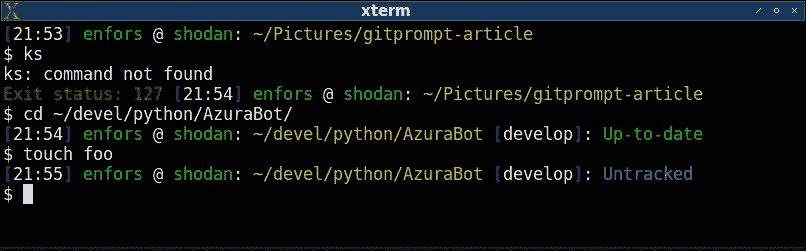

# 为什么 Linux 开发者应该使用 GitPrompt

> 原文：<https://medium.com/hackernoon/why-linux-developers-should-use-gitprompt-8d654e5b87e1>

在过去的 23 年里，我一直是一名 Linux 开发人员(我从 Linux 版本 1.2.1 开始)。我*在命令提示符下活*。正因为如此，我希望提示本身看起来很漂亮，并且提供一目了然的有用信息。所以我写了一个脚本叫 gitprompt，自定义提示。我已经在工作中使用它有一段时间了，我的一些同事注意到了这一点，并要求复制一份。因此，因为我知道至少有一些人对此感兴趣，所以我发表了这篇关于它的简短文章，以防你想自己尝试一下。

这是它最基本的样子:

“21:53”是时间，后面是我的用户名(“enfors”)，以及我的机器名(“shodan”)。之后，是当前目录——到目前为止没有什么异常。光标本身在下一行，为长命令腾出空间。

所以，我们来看第一个特征。如果命令失败，提示符将以红色显示其退出状态，因此您不会错过它:

好吧，酷。但是为什么叫“gitprompt”呢？我以为你不会问。我们一进入 git 目录，神奇的事情就发生了:

位于 git 目录中会在提示的末尾添加额外的信息；“开发”是当前分支，“最新”意味着自上次提交以来没有发生任何变化。那么如果我们添加一个文件会发生什么呢？让我们通过创建一个名为“foo”的空虚拟文件来找出答案:

现在，不是“最新”，而是“未跟踪”，所以我们知道在回购中至少有一个未跟踪的文件。让我们通过添加来跟踪它:

很好，现在它说“添加”了。但是，如果我们既有未跟踪的文件又有新添加的文件，会发生什么呢？好吧，让我们添加另一个虚拟文件，这次叫做“bar”来找出答案，好吗？

我可以继续，但我想你现在明白了。

如果这对你有用的话，[可以随意访问该项目的 Github 页面](https://www.github.com/enfors/gitprompt)，在那里你会找到安装说明，并获得你自己的副本。

*如果你喜欢这篇文章，我建议你关注我的* [*Twitter*](https://www.twitter.com/enfors) *。*