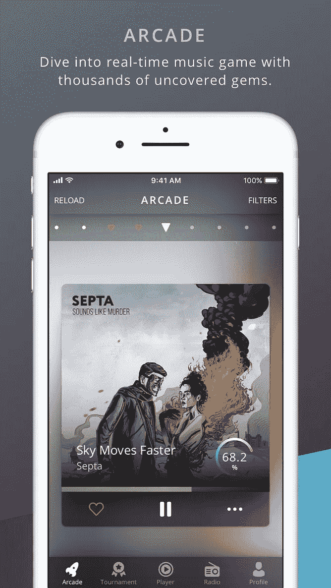
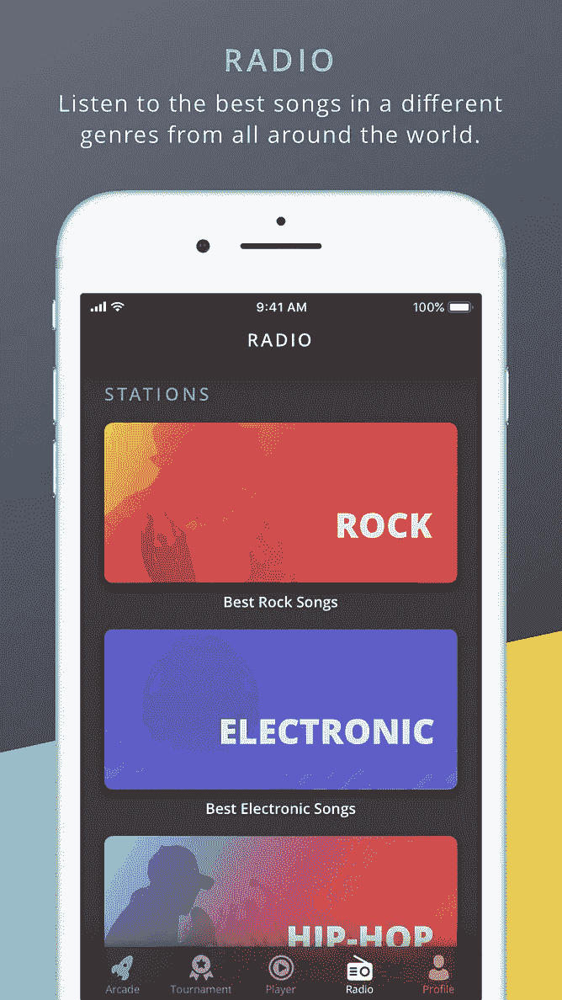
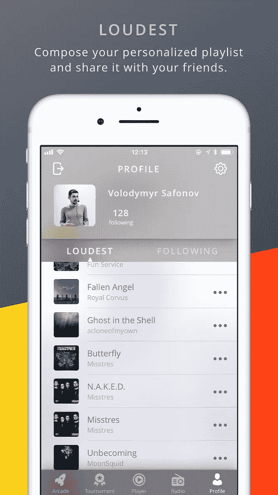

# 为什么 Louder.me 不是“只是一个音乐平台”？

> 原文：<https://medium.com/hackernoon/why-louder-me-isnt-just-a-music-platform-3820d57695b7>

Louder.me is a real-time game of your music journey.

最具讽刺意味的现代问题之一是，有太多的选择，往往很难选择。从食品杂货到职业机会，每样东西的种类都是巨大的，很难不对我们的选择感到困惑。因此，毫不奇怪,“我们为你挑选最好的”这一招在市场上越来越受欢迎——你知道，像我们所信赖的化妆品或你肯定需要去的旅游目的地之类的东西。当然，这些列表很方便，也许能节省我们的时间。尽管如此，我们已经厌倦了大众市场，越来越愿意寻找利基产品。

[音乐](https://hackernoon.com/tagged/music)也是一样。它不再受有线广播的限制——我们可以收听几乎无限数量的在线频道和数据流。但是在这些无尽的渠道中找到小众艺术家变得更加困难。

**给音乐爱好者**

Louder.me Release Party Aftermovie 2018

是的，我们周围有很多音乐。但让我们面对现实:大部分是为我们选择的，却没有我们。当我们寻找新音乐时，我们面临两个主要问题。

首先，服务通常只与流行音乐人合作。没有理由怀疑 top chart 的内容质量，因为它代表了市场趋势，展示了已经获得成功的音乐人。然而，你不太可能在那里找到有趣的独立艺术家。

第二个问题是当服务不加选择地显示所有内容时(特别是当侦听器自己参与到这个过程中时)。还是那句话，只有名人才是焦点。这是一种永无止境的循环:受欢迎的艺术家得到更多的关注，因为他们已经很受欢迎了；与此同时，年轻乐队不被人注意，因为他们很少有人听。在这些平台的帮助下，你可能会找到你已经喜欢的著名乐队的[专辑](https://hackernoon.com/tagged/discography)。也许网站会推荐类似的艺术家。但是这些流行的服务不太可能帮助你找到真正不同的音乐。

我们的主要目标之一就是填补这一空白。我们的应用程序是为年轻的独立音乐人设计的，他们没有和大的唱片公司合作，仍然很少为人所知。剩下的就看我们的听众了:一首歌的循环频率取决于它获得的赞数。这很简单:你有一个所谓的时间轴，里面充满了音轨预览。你标记出你喜欢的一首，这首歌的完整版本就会自动保存到你的播放列表中——就像我们小时候一样，希望我们可以快进收音机，看看下一首是什么。现在你可以这样做了，因为你负责这台收音机。没有人站在你和你想听的音乐之间。

**对于独立艺术家**

Louder.me @ Faine Misto Festival 2017

许多流媒体服务使用复杂的多级艺术家选择系统，将年轻音乐家被听到的机会降至最低——例如，他们需要一定数量的收听才能进入播放列表。这种方法让年轻艺术家很少有或没有机会被发现，因为他经常要与拥有多白金专辑的人竞争。这是不公平的。

当一个艺术家上传他的歌曲到[lounge . me](http://bit.ly/2kem9es)上时，他严格地与听众互动。他选择上传什么，歌曲的哪一部分将成为它的预告片。利用他的评级，他是得出结论的人:哪些曲目被公众更好地感知，哪些问题需要解决。对于那些在没有经验丰富的导师指出错误的情况下开始职业生涯的音乐家来说，这一时刻至关重要。我们的目标是将地下组织从主流中分离出来，而节制内容是我们唯一牢记的事情。因此，一个年轻的有抱负的艺术家不需要担心与杰克·怀特争夺收视率。

**玩街机游戏模式**

Louder.me App on iOS

我们不定义任何格式，也没有选择标准。我们以音乐疯狂社区的形式为观众提供一个向观众展示自己的地方。从技术上讲，发帖和在脸书发帖一样容易。但在我们的例子中，音乐家为已经愿意听他们的人发布曲目，因为你在其他地方找不到的音乐正是他们在寻找的。

我们为那些仍然相信没有制作人就无法突破的音乐人创造了我们的应用程序。我们想打破这个神话。对于那些想掌控自己扬声器里的声音的听众，我们的目标是激励你去演奏和聆听。

剩下的就看你的了。