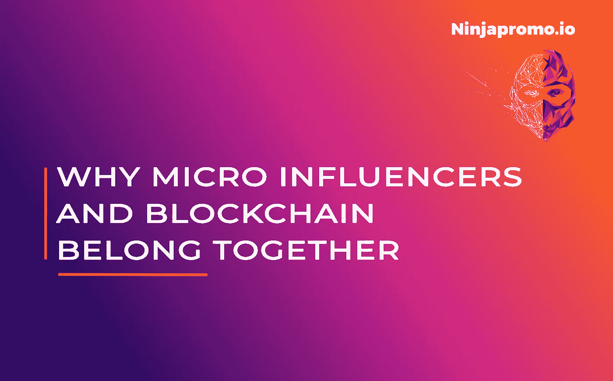
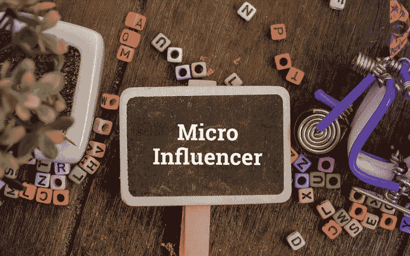

# 为什么微影响者和区块链项目属于一起

> 原文：<https://medium.com/hackernoon/why-micro-influencers-and-blockchain-projects-belong-together-e1194e4cb2bd>

*影响者营销是* [*NinjaPromo 的*](http://ninjapromo.io/?utm_source=medium&utm_medium=article&utm_campaign=microinfluencers) *广告活动中最受欢迎的方向之一。它允许使用各种各样的工具和方式，以最意想不到的方式接触到受众。*

[上一次我们谈到了区块链使用影响者](https://hackernoon.com/influencer-marketing-fdff540b092e)我们指出，他们可以根据他们制作的内容分成几个小组。但是当涉及到他们的受众时，有两种主要类型——高层影响者和微观影响者。当你推销你的项目时，求助于最知名的人并利用他们的名字为你的利润提供曝光率是很有诱惑力的。

坚持住。这真的是个好主意吗？

# **微观影响者的权重**

根据 Grin 的调查，30%的潜在顾客会根据非名人的推荐做出购物选择。区块链是一个高度特定的领域，因此微观影响者提供的活跃兴趣份额对于加密项目来说甚至更大。

另一方面，只有大约 3%的消费者会听从名人的建议。你将扩大你的影响范围，这是肯定的，这将是浪费资源，几乎没有任何结果。

> *说到资源。你的会计师也更喜欢有影响力的人。他们提供了比名人高 60%的参与度和 22%的社交驱动，比名人的成本效益高 6-7 倍。*

人们倾向于相信那些和他们说同样语言、过着同样生活的人，而不是那些背后有整个营销团队的精致形象。当涉及到加密时，这种影响会加剧。区块链项目和微观影响者是为彼此创造的——他们都有非常具体、通常很狭窄的受众，而不是对非常精确的主题深感兴趣。

# **介绍成功的微观影响者活动的基本要素**

对于区块链的项目，微观影响者尤为重要。那么，在计划通过它们进行竞选活动时，你应该记住什么呢？

首先，广告的形式应该与影响者提供给他们的追随者的内容类型相对应。每个影响者都以自己的方式讲述自己的故事。你需要做的是确保他们不只是添加你的标志或把你的产品放在背景上，他们实际上是在讲述他们与你的经历。

这是将影响者的追随者转化为潜在客户的唯一方法，然后——你就是你的热情拥护者。

你还应该记住，在这种情况下，从长远来看，一次性广告几乎是无效的。当微影响者坚持他们的观点和他们推广的服务时，他们是最好的。因此，最明智的想法是通过一系列整合的持续**活动**慢慢进入观众的头脑。

> 毕竟，可口可乐全年通过所有可用渠道大力促销是有原因的——尽管每个人都知道可口可乐是什么。

# **并非一切都光彩照人:微影响力人士的主要困难**

尽管微观影响者活动特别为广告商和区块链项目提供了许多优势，但转向这一方向仍有一定的陷阱。

最明显的一点是，很难找到真正与**相关的微观影响者。越来越多的普通人获得了大量的追随者，在这种情况下，寻找合适的意见领袖变得复杂而耗时。那么，如何让这种搜索变得更容易呢？**

*   ***你的公司账户是你最好的朋友*** 。Cryptocommunity 是一个舒适且相对较小的空间，小影响者往往会追随有前途的初创公司。深入所有社交媒体平台的订阅者列表，搜索那些拥有必要追随者的人，并与他们取得联系。
*   ***自动搜索*** 。有很多工具(如 [Klear](https://klear.com/free-tools/find-instagram-influencers) 或 [BuzzSumo](https://app.buzzsumo.com/amplification/influencers) )可以避免影响者搜索中最耗时的部分。
*   ***牢记标签*** 。如今，几乎每个社交网络都使用标签。你也应该如此，即使只是寻找合适的影响者。这样你就可以找到内容的例子，并立即弄清楚你是否需要这样的推广。

这可能会让你大吃一惊，但是**微影响者可能更难共事**。需要与他们一起长时间工作，这就需要投入更多的时间和资源来搜索、交流和分析结果。即使是受众相对较少的意见领袖也不会接受他们遇到的每一个提议。所以从表面上看，与 10 个微小影响者合作似乎比与一个高层影响者合作复杂得多。

# 它给我们留下了什么？

由于投资回报率的衡量仍然是一个挑战，而参与度仍然是营销活动绩效的最相关指标，因此与您的推广者建立持久的关系在今天至关重要，如果与影响力市场上规模虽小但却很重要的参与者建立这种关系，这种关系将会更加牢固。应该给微影响者喘息的空间，但不要给他们完全的自由。向他们提供媒体计划和内容指南，将他们视为合作伙伴——这样你就能为区块链项目的有效多渠道营销打下坚实的基础。

*感谢您阅读这篇文章！如果你喜欢它，请分享它，并告诉我们你对加密相关项目的微观影响者的相关性有什么看法。另外，你可能会喜欢我们的其他故事:*

> [*——区块链影响者营销手册*](https://hackernoon.com/influencer-marketing-fdff540b092e)
> 
> [*——ICO 为什么需要它的社区，如何专注于它*](/@NinjaPromoAgency/why-crypto-community-matters-and-how-to-focus-on-it-ebd2d293c94)
> 
> [*——在推销你的加密项目时，因为显而易见而被你忽视的事情*](/@NinjaPromoAgency/things-you-neglect-because-they-are-obvious-while-marketing-your-crypto-project-4100cf3bef05)
> 
> *-* [*ICO 发布:你想法的真实价格*](https://hackernoon.com/ico-launch-the-true-price-of-your-idea-52dcc61587d4)