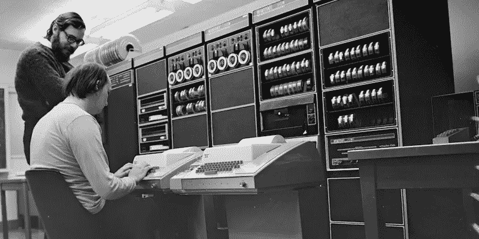
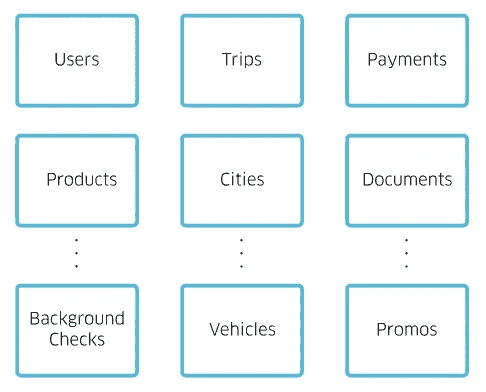
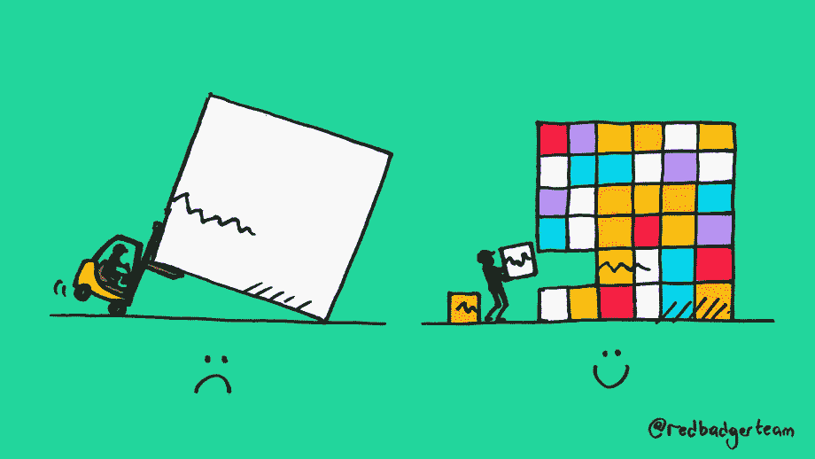
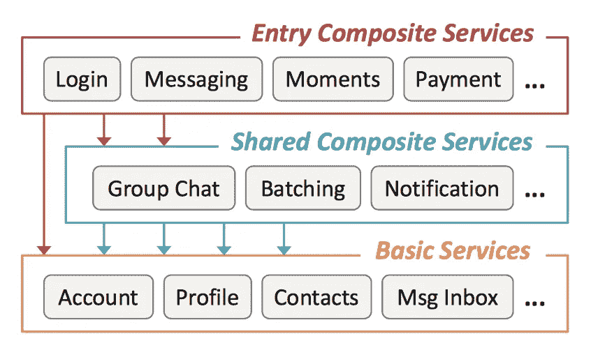

# 为什么微服务是企业新的创新推动者

> 原文：<https://medium.com/hackernoon/why-microservices-are-the-new-innovation-enablers-for-enterprises-6a4c637fd901>

*Is this what your IT system looks like to Silicon Valley Startups?*

初创公司开发软件来解决客户的问题，而不是用买来的软件来简化内部流程。

在这篇长文中，我们涵盖了以下主要话题:

*   用软件取胜，或者被软件吃掉
*   客户的力量=速度和灵活性变得更加重要
*   从 IT 角度对比企业和初创公司
*   分野是怎么发生的？
*   Gartner 预测“ERP 之死”
*   独石与新的软件架构
*   顶级企业如何利用*微服务*进行创新

# 被软件吃掉

“如果你昨晚睡觉时还是一家工业公司，那么今天醒来时你将是一家软件和分析公司。”这是 2014 年通用电气时任 CEO 的一句话。他的声明的潜在信息是，除非你投资于软件，否则你将无法保持竞争力，因此你可能永远不会醒来。

然而，直到最近，软件和 IT 总体上从未被证明是竞争优势的来源。例如，您购买了一台大型机来更好地管理您的业务，您的竞争对手也是如此。你给所有员工买了一台笔记本电脑，你的竞争对手也是。你为你的行业安装了领先的 ERP 系统，你所有的竞争对手也是如此。

随着 Airbnb、优步和网飞等数字原住民的到来，所有这一切都发生了巨大变化，他们通过配置和投资自己的软件获得了优势，这些软件对他们来说是独一无二的，其他人无法获得，他们正在扰乱市场。

这是怎么发生的？根据创造了“软件正在吞噬世界”这句话的风险投资公司 [a16z](https://a16z.com/2016/08/20/why-software-is-eating-the-world/) :

> *“计算机革命已经过去了 60 年，微处理器发明已经过去了 40 年，现代互联网的兴起也已经过去了 20 年，所有通过软件来改变行业的技术最终都发挥了作用，并可以在全球范围内广泛传播。”*

不幸的是，现有的公司并不是用软件取胜的公司，而是被软件吃掉的公司。

最后，本文将探讨现有企业如何改变他们的方式来成功地利用信息技术，并提高他们的竞争优势。但是要正确地做到这一点，我们需要将我们的注意力从 IT 转移到企业存在的唯一理由…“增加股东回报！”

对不起，我开玩笑，应该是“顾客！”—我们如何通过提供真正解决客户未得到满足的工作的产品或服务，更好、更快地满足客户？

# 现在，权力属于您的客户

像 iPhone 这样的智能设备的出现使得计算成为一种非常移动、可访问和个性化的体验。

互联网为消费者提供了过多的选择，这意味着地理和分销成本不再是他们曾经的障碍。

> 如果你在现实世界中让顾客不开心，他们可能会告诉六个朋友。如果你在网上让客户不高兴，他们每个人都可以告诉 6000 个朋友。”—杰夫·贝索斯

今天的顾客是高度授权的、积极的和自主的。有了唾手可得的知识和计算能力，他们很快就能找到最好的/最便宜的/最先进的等等。选项。

正如我们在另一篇博客文章中讨论的那样，[客户体验](http://blog.enabled.com.au/marketing-customer-experience/)是品牌目标。

从这一点出发，员工应被视为“内部”客户。作为软件鉴赏家，他们不再乐于使用 IT 部门提供的笨重且有局限性的软件。

由于千禧一代在劳动力中占很大一部分，关注他们可能会如何塑造工作场所也很重要。普华永道的一份报告讨论了千禧一代对工作中的[技术](https://www.pwc.com/m1/en/services/consulting/documents/millennials-at-work.pdf)的具体期望，例如，雇主提供最先进的技术，以及能够在工作场所使用自己的技术。

# 速度和灵活性是关键

如果所有客户都对你的品牌拥有这种力量，那就不再是能够提前 12-18 个月预测未来，而是能够快速适应客户不断变化的期望。

那些能够快速调整和适应其商业模式的企业有更好的机会抢占市场份额并保持竞争优势。

关于[企业创新状态的最新调查](https://www.cbinsights.com/research-aw-state-of-innovation-report)指出，高性能公司争取先发优势的可能性是其他公司的 3 倍，也就是说，他们理解速度的重要性。今天，这比以往任何时候都更重要，因为利用互联网可以实现规模速度，同时显著降低成本。想想看，建立一个新闻网站比创办一份报纸要容易得多。

未能认识到速度、适应性和敏捷性的重要性，将对企业的成功产生极其不利的影响。例如，一家企业可能进展顺利，但似乎在几周内，他们的商业模式就受到了严重挑战，甚至可能被打乱。

想想出租车和优步，旅行社和比较网站，DVD 出租和网飞等。你可以在我们关于[数字化转型](http://blog.enabled.com.au/digital-transformation/)的文章中了解更多关于商业模式颠覆的信息。

Source: [McKinsey](http://www.mckinsey.com/business-functions/strategy-and-corporate-finance/our-insights/an-incumbents-guide-to-digital-disruption)

那么，面对不断变化的客户需求和技术进步，企业在做什么呢？从根本上说，在如何使用数字技术方面，有两个截然不同的群体。出于本文的考虑，我们将它们标记如下:

*   企业:行业中的现有企业，大多是非科技公司
*   初创公司:试图取代现有公司的数字原住民

# 企业

公司企业拥有无所不包的 IT 系统，通常通过“成熟的”供应商购买。

这些系统用于解决内部问题，并根据行业标准和公认的最佳实践进行优化。

如下图所示，购买任何现成企业级软件的用户将只能获得其行业所需的基本功能。

因此，这种方法提出了两个关键问题:

*   使用行业标准使您成为行业标准
*   遵循所谓的“最佳实践”可能只会削弱你的竞争优势

这意味着企业:

*   无法为他们的客户创造一个与众不同的点
*   努力跟上客户偏好和行为的变化

最佳实践，或者更准确地理解为这里的通用实践，只能让企业到此为止。然后，为了试图获得竞争优势或解决客户偏好的变化，企业可能会努力定制限制性的开箱即用软件。

不幸的是，这通常会增加复杂性、时间和 IT 预算成本，使竞争优势成为难以实现的目标。这就是企业系统实现的大部分不可预测性和风险所在，然而这是最普遍接受的实践。

# 创业公司

与企业形成对比的是，成功的创业公司不会用它来支持他们的业务。相反，他们专注于可以通过任何手段解决的客户问题，这些手段通常是软件。

他们围绕一小组问题，从一张白纸开始，优化解决这些问题。

不受行业最佳实践概念的束缚，初创公司有能力发明前所未有的商业模式，从而颠覆现有的商业模式。

再次使用著名的成功创业公司的例子:网飞发明了按需电影流媒体模式，优步发明了按需乘车模式，亚马逊发明了按需电子书出版模式。

让我们对比一下这两种方法:

*   企业用它解决自己的问题
*   创业公司用软件解决客户的问题

哪个更厉害？

> *“把你的注意力从问题(客户的问题)上移开，很快竞争对手就会更好地解决这个问题。”*

# 这种分化是怎么发生的？

## 企业软件之旅

几十年前，软件开始时是“单一用途”的，通常与单一业务功能相关，例如财务。

随着时间的推移，其他软件的出现使更多的业务功能受益。这些软件应用程序是独立的，连接很差，这意味着在它们之间传递数据很困难。一开始，它们是分开的，因为连接物理计算机很困难。他们创建的应用程序和数据将在物理介质上传递，如卡片和光盘。

购买和维护软件非常昂贵。更新需要大量的工作，并给系统的可用性带来风险。

这些因素使得与单个供应商打交道变得很有吸引力，这反过来又促使单个软件供应商处理多个业务功能。

这种对集成的渴望将功能上分散的软件应用程序变成了为企业做一切事情的整体。

企业整体的缩影是企业资源规划(ERP)系统。

## ERP 那种的庞然大物

ERP 旨在通过跨业务职能部门共享信息并将这些信息组织到一个决策中心来实现效率。

企业资源规划已经成为企业的“链条”:

*   它们价格昂贵，耗费时间和预算
*   他们太死板而不能适应，因此也就太慢而不能获得优势
*   通常没有人完全理解这个系统，然而这几乎是一个要求
*   它们不是根据开放标准创建的，因此人才储备受到限制
*   它们可能很复杂，因此用户会寻找在这些系统之外完成业务的其他方法(通常坚持使用更多的手动密集型和容易出错的纸质方法)
*   他们仍然以业务功能为导向，而不是以客户为导向。(阅读更多关于[要做的工作](http://blog.enabled.com.au/jobs-to-be-done/)框架，一种面向客户的产品开发方法，包括软件)

**定制很难**

Monolith 软件从本质上假设它们在一个应用程序中包含了所有的东西。此外，ERP 供应商可能不愿意让其他软件与之合作，因为这是在“削减他们的午餐”

企业必须依赖有限的领域专家供应:你要么排队并支付高昂的费用来做出改变，要么雇佣并保持敬业的人。

请注意，独石不仅仅是 ERP。一些网站内容管理系统(CMS)和客户关系系统(CRM)符合这种描述，并且同样难以负担。

2000 年，Gartner 研究小组预测，到 2018 年，使用[ERP](http://www.sunlike.com.cn/internet/onlineerp/images/Long%20live%20ERPII%20By%20Gartner%20Group.pdf)和 monoliths 的概念将会“消亡”他们建议改变业务战略，以实现更加开放和协作的流程，而不是采购单一的整体产品来优化内部企业绩效。

然而，今天许多公司才刚刚开始 2-3 年的 ERP 之旅。他们正在购买 ERP 供应商“为所有人提供所有东西”的不成文咒语，这使得这个庞然大物“不适合需要专注和[外部连接](http://www.sunlike.com.cn/internet/onlineerp/images/Long%20live%20ERPII%20By%20Gartner%20Group.pdf)的未来”

**失败风险高**

从项目管理的角度来看，像 ERP 实施这样的大型项目比小型项目风险更大。听起来很明显，ERP 项目是一个"[潜在的雷区](https://www.cio.com/article/3223729/project-management/when-to-kill-and-when-to-recover-a-failed-project.html)，因为有更多的移动部分需要同时关注。

看看这份 [ERP 灾难](https://www.cio.com/article/2429865/enterprise-resource-planning/enterprise-resource-planning-10-famous-erp-disasters-dustups-and-disappointments.html)清单。

在这个世界上，速度是企业抵御业务中断的关键因素之一，受遗留系统的拖累是一个大问题。我们如何负责任地制止这种行为？

> *“24 个月后，当我们的 ERP 项目推出时，我们将具有竞争力，”澳大利亚老年护理领域的一家领先企业表示。*

## 新软件

根据 Gartner 对更加开放和协作的业务战略的预测，已经出现了向更新的云架构的明显转变——由创新技术公司引领。

[云](https://aws.amazon.com/what-is-cloud-computing/)允许通过互联网“按需交付计算能力、数据库存储、应用程序和其他 IT 资源”,而不是您的本地硬盘。

例如，当时微软办公软件是一个你可以在本地电脑上安装和访问的应用程序。现在你可以通过 Office 365 拥有微软 Office 应用程序的网络版，就像谷歌基于网络的 G Suite 产品一样。

但是，简单地将一个整体转移到云上只意味着在不同的计算机上使用相同的球和链——整体的所有缺点都可以保留。

亚马逊、谷歌、脸书和网飞等大型软件公司意识到了这个问题。他们的巨石变得如此之大，如此之分散，以至于他们开始面临前所未有的问题:

*   他们的硬件和软件需求变得太大，任何一个团队都无法全面理解
*   任何一个小特性的发布都需要整个系统的发布，因此会给整个系统带来风险。
*   他们的员工和客户群变得过于分散，无法集中管理
*   移动设备的出现加剧了这种困境，需要管理多种类型的设备、型号和操作系统

## 新范式

由于云计算意味着没有“真正的”计算机，它创造了弹性的计算能力，并由自动化软件控制，从而随着需求而增加或减少。

这导致创新公司放弃构建软件整体的大规模团队，而倾向于让较小的团队专注于构建更小的、有限用途的软件元素，称为微服务。

微服务最初是一种架构风格，通过这种风格，一个特定的、封装良好的领域(或业务能力)被开发成一套小型服务。

这个想法是致力于这种能力的微服务，可以成为最好的。这些微服务可以独立部署，然后通过定义良好的接口(称为应用编程接口(API ))相互通信。

看看优步应用程序的架构，由这些构建块或微服务组成。

Source: [Uber](https://eng.uber.com/soa/)

**这并不意味着解决方案是拼凑起来的**

一个重要的区别是:微服务架构不是将不同的软件组件拼凑在一起。

例如，在这里使用一个软件，然后将一些数据导出到一个电子表格或 CSV 中，然后再导入到另一个软件中，情况就不一样了。

在上面的场景中，两个独立的软件之间没有保持任何一致性的协议，因此，如果任何一方做了一个小的改变，甚至小到重命名电子表格中的列名，整个过程都会中断。

而对于微服务架构，这些小组件是独立的，通过一个协议松散耦合，通过一个文档化的 API 来保持软件的一致入口和出口点。

因此，微服务通过这些 API 相互通信，以确保业务操作是无缝和实时的。

API 和它们的一致性是脱离整体的关键机制之一，因为它们本质上是微服务之间的“契约”。

再次以优步为例，他们的一项微服务是获取最新的货币和外汇数据。如果该应用程序是“拼凑”起来的，优步将无法同时为全球近 60 种货币的乘客提供服务。

**单片与微服务**

让我们把它带回来，并阐明新旧范例之间的区别——或者说单片和微服务。

用食物做类比，我们有像意大利面条一样的巨型软件。这是一种完整的膳食，有两个主要部分，面条和调味汁。

尽管这道菜在结构上可以用不同的意大利面形状或不同的酱料进行定制，但一旦制作完成，用一种成分替换另一种成分是不切实际的，因为它们结合得太紧密了。例如，一旦你发现你的晚餐客人对麸质过敏，你就不能很快适应他们的需求。

称为面向服务的架构(SOA)的过渡状态是对单一整体架构的改进。这里的服务仍然需要仔细设计，以便与整体解决方案一起工作。多想想把一块蛋糕换成另一块同样大小和形状的蛋糕。

不幸的是，SOA 仍然被供应商锁定所支配，这意味着您只能使用一家蛋糕店的蛋糕片。

另一方面，微服务可以被认为是一盒甜甜圈。从功能上来说，麸质不耐受症没有问题，你可以换成不含小麦的巧克力布朗尼，甚至一片水果。关键是:它们互不依赖，它们是独立的软件，处理非常离散的功能。

Source: [DZone](https://dzone.com/articles/what-are-microservices-actually)

另一个经常使用的类比是集装箱。这项技术彻底改变了货物运输。商品的形状不再重要，只要它们能被放在一个容器里，它们就能通过一套标准化的接口，或者用我们的比喻来说就是 API。

就像一个集装箱一样，无论微服务包含什么，甚至是用什么计算机语言开发的，都无关紧要。这种容器化甚至已经成为一种包装微服务的技术，使其可以部署到任何计算机环境中。我们在另一篇文章中也提到了作为一项技术的[容器](http://blog.enabled.com.au/containers-devops/)。

**《萨斯化》**

随着云和微服务的日益流行，不要忘记 SaaS(软件即服务)。SaaS 是一种基于订阅、通过互联网交付的软件模型。

今天有可能发现非常大的 SaaS 供品，几乎可以被认为是巨石。例如，Salesforce CRM 是一个企业级 SaaS 产品，接近于一个整体，但在其自己的应用程序套件中，它确实实现了强大的 API，提供了一些微服务优势。

此外，有许多微 SaaS 应用程序本身几乎是微服务，并且具有非常强大的 API，可以被其他应用程序使用。

例如，除了他们自己的定制服务组成的应用程序，[优步](https://nordicapis.com/4-apps-rely-apis-survival/)已经使用了一系列第三方 SaaS 应用程序来实现不同的业务功能:

*   用于定位和导航服务的谷歌地图
*   短信通知 Twilio
*   支付处理的大脑树
*   用于自动化电子邮件活动的 SendGrid

# 大型软件供应商正在采取什么措施来应对这种转变？

注意:我们使用了“战斗”这个词，而不是“适应”甚至“拥抱”微服务被许多现有软件供应商视为一种威胁，而不是一种让客户受益的更好方式。

任何 10 年前开始的 ERP 软件供应商可能仍然被困在方法和技术的过渡中。随着客户被锁定，他们可能甚至没有动力或能力过渡到[后现代 ERP](https://www.gartner.com/newsroom/id/3233217) 世界。

这个[后现代 ERP](https://www.theregister.co.uk/2016/03/02/postmodern_erp_disaster_gartner/) 世界呈现出复杂性和高失败率，对于那些“假设兜售云的厂商会解决这个问题”的人来说。当——不可避免地——他们没有。”

为什么？

因为许多供应商自己无法采取任何措施来应对这种转变。他们被困在需要迁移到新的和陷入沉没成本谬误之间，也就是说，他们不想放弃他们现有的软件资产。这非常类似于百视达不想放弃他们的 DVD 商店的简单故事，然后最终因为更快发展的网飞而倒闭。

这些软件供应商犯有将自身利益置于客户之上的错误，他们必须提高自己的水平，否则就会面临被企业客户抛弃的风险，因为在不到两年的时间里，企业客户对价值的要求越来越高。

不要被许多声称提供所谓的云 ERP 的人所欺骗——这些通常由相同的供应商发布，由相同的软件架构师构建。

当他们所做的只是重新包装一个老化的 ERP 系统时，怎么能说他们帮助他们的客户进行了“数字化转型”？这只不过是不同电脑上的同一个球和链条。

# 微服务的优势

与此同时，了解这些变化的创新公司已经通过多种方式从微服务中获益。

## 效率

微服务是可重复使用和可互换的，这使得用新件替换比修理整个整体容易得多。它提供了一个进化的架构，可以成长并适应不断变化的业务环境。

例如，如果您的商业智能仪表板不再满足您的需求，您可以将其换成另一个更合适的选项，而不会破坏整个系统。

Source: [Red Badger](https://blog.red-badger.com/blog/deploy-a-microservices-application-as-though-it-was-a-monolith)

请看特里·普拉切特的书《第五只大象》中的一段摘录:

> “老爷，这是我家的斧子。我们拥有它已经快九百年了。当然，有时它需要一个新刀片。有时它需要一个新的把手，金属制品上的新设计，装饰上的一点更新。。。但这不就是我家那把九百年的斧子吗？因为它随着时间的推移逐渐改变，所以它仍然是一把很好的斧子。挺好的。”

斧头是模块化的:刀刃，手柄，装饰。当其中一个磨损了，它可以换成新的或更好的选择。今天，木制手柄可以被一种更能吸收冲击力的玻璃纤维所取代。最终，对于刀片，你可能会选择一个硬化的钛芯，带有碳化钨边缘，夹在两层碳纤维之间。

通过利用微服务的底层模块化特性，企业可以实现成本节约并变得更具弹性。

相比之下，在传统的 [IT 治理](https://www.thoughtworks.com/insights/blog/cxo-guide-microservices)环境中，企业希望尽可能标准化，以最大限度地实现资源共享。因此，他们倾向于建立一个最复杂的用例列表，并试图购买一个单一的工具来考虑所有的场景。考虑建立一个“如果”购物清单。

例如，一个团队可能只需要一个简单的数据存储，而不需要复杂的查询功能。但是他们仍然不得不使用工业级的数据库服务器，这带来了不必要的复杂性、低效率和更高的许可费用。

微服务还设计用于风险缓解/管理:

*   应用程序不太可能出现单点故障，因为功能分散在多个服务中
*   因此，应用程序可以执行得更好，停机时间更少

对于有许多分支机构或子公司的企业，微服务架构可以帮助减少时间和成本，同时仍然确保它无缝地工作。

例如，跨国企业集团可口可乐从内部软件转向微服务，这帮助他们创造了出色的客户体验。

如果有兴趣，你可以观看可口可乐技术人员谈论这个[微服务实施](https://videos.mulesoft.com/watch/Fdaf7xzJfQw3yDQDpSiYqW)之旅的网络研讨会。

## 渐进的改进

任何面向微服务的软件都能够以卓越的敏捷性逐步增强。怎么会？如上所述，微服务是独立可替换的，因此模块化组件的升级可以以非常敏捷的方式完成。因此:

*   定制软件项目更容易、更短、更快实现，并且更容易理解
*   随着持续改进，客户保持率和参与度也会提高，因为您可以快速适应他们的需求或他们的行为。
*   对人力资源的一个不太明显的影响是，你可能会吸引和留住更多有才华的工程师。因为微服务使你能够增量地采用和测试新技术，这是好的工程师想做的，当他们做不到时，他们就会离开。事实上，这是许多 monolith 供应商正在发生的事情，优秀的人才流失了，他们留下了那些被困在旧范式中的人。

## 授权创新

借助微服务，企业现在可以培育新的业务模式，并适应客户和员工不断变化的需求。

企业可以更像高速部署的创业公司。他们可以推出一项新的服务，一条新的业务线，甚至是一家新的初创公司，以抵御其他初创公司和现有公司。

麦肯锡的一篇文章讨论了培养一种[的实验文化](https://www.mckinsey.com/business-functions/strategy-and-corporate-finance/our-insights/how-big-companies-can-innovate)对于保持大企业在当今快速发展的世界中的生存是多么重要。微服务是实验的推动者。

例如，自 2014 年以来，快速发展的 realestate.com.au 已经开始从单片向[微服务架构](https://www.computerworld.com.au/article/634277/rea-group-works-re-platforming-realestate-com-au/)转变。为了更好地满足客户的需求，他们已经逐步取代了一些关键服务，比如“已售”部分和“买方”部分。

此外，灵活的基础设施使 realestate.com.au 的运营商 REA 集团与 NAB 合作发布了世界上第一项创新。这个想法是“将房产搜索和金融整合到一个平台上。”如果双方都有一个笨重的 ERP 来导航，这种集成会有问题。

相反，“该功能主要是通过运行在 AWS 基础设施上的[微服务](https://www.itnews.com.au/news/how-rea-and-nab-made-their-tech-work-together-478836)来实现的。”

Users searching on [realestate.com.au](https://itunes.apple.com/au/app/realestate-com-au-property/id404667893?mt=8) now see the home loan add-on

# 在不引起混乱的情况下冒险和破坏

创业公司自然有更高的冒险倾向，因为他们比企业同行损失更少。然而，与表现不佳的企业相比，表现良好的企业报告自己[寻求风险](https://www.cbinsights.com/research-aw-state-of-innovation-report)的可能性是后者的两倍。

因此，聪明的颠覆者和创新者总是在寻找更快更好地解决客户问题的方法。最后，让我们重新审视一下他们如何利用新技术，并从不同的角度看待企业 IT。

## 明智地选择你的投资

俗话说“现在每个公司都是 T2 的科技公司”，然而“有时公司管理 T4 IT 支出的方式才是问题所在。”

尽管担心中断，但大多数企业创新预算都用于现有流程和产品的持续改进，即小事情。

因此，采用行业标准的 ERP 系统并不能完全帮助你扰乱市场，因为它主要是关于效率的。具有讽刺意味的是，ERP 系统在规模上并不是“小东西”。

与此同时，高绩效的公司倾向于在授权和颠覆性创新上投入更多。云和微服务架构是实现这一点的促成因素，也是大多数企业关注的效率创新。

领导者们已经在快速进入新的软件范式:尺寸小，但影响大。工业巨头通用电气(本文开头提到的)将自己转变为一个数字化组织，在[云和微服务](https://www.ge.com/digital/blog/reimagining-cloud-infrastructure-industrial-internet-things)架构方面保持领先，并在 [BCG](https://www.bcg.com/en-au/publications/collections/most-innovative-companies-2018.aspx) 年度最具创新力公司名单中排名第 18 位。

## 为什么要有取舍？

高绩效公司不会在速度和性能之间进行权衡。

丰田不是靠制造更快的汽车取胜，而是靠制造更快的高质量汽车取胜。从某种意义上说，制造软件和制造有一些相似之处，因为精益方法可以被应用。

如果感兴趣，你可以听听风险投资公司 a16z 的这个[播客](https://a16z.com/2018/03/28/devops-org-change-software-performance/)中剩下的辩论。

当公司花费所有的精力、时间和金钱试图推出和定制他们的 ERP 系统时，竞争对手正专注于满足客户期望的新产品。事实上，60%的公司花一年或更长的时间来创造[新产品](https://www.cbinsights.com/research-aw-state-of-innovation-report)。在这段时间内，新的创业公司或竞争对手可能会突然出现。

让我们看看中国的脸书——微信——它运行在 2K+微服务上。他们不断创新，取得了令人印象深刻的增长和服务组合。微信用户基本上通过该应用程序管理他们生活中所有必要的方面:从消息传递到支付、购物和打车等。

为了在不牺牲可靠性和灵活性的情况下实现如此大的规模，他们的微服务架构起着至关重要的作用。

WeChat [microservices architecture](https://arxiv.org/pdf/1806.04075.pdf)

## 做出独特的东西

将这一点与竞争优势联系起来，如果公司都在使用行业标准的 ERP 或任何企业级系统，他们就有一个相同点，很少会有差异点。

由于我们在整篇文章中已经谈了很多关于 ERP 的内容，所以有必要重申 ERP 不是一个软件。它是一项活动或目标(因此得名)。因此，即使没有一个单一的整体解决方案，企业仍然希望进行 ERP 活动。

如上所述，Gartner 预测了 ERP 概念的死亡，并推出了 [ERP II](http://www.sunlike.com.cn/internet/onlineerp/images/Long%20live%20ERPII%20By%20Gartner%20Group.pdf) ，不是作为另一个整体，而是现在具有不同策略的相同活动，这基本上是一个“松散耦合和联合的微服务 ERP 环境”

这种环境使企业有机会通过将同类最佳的 SaaS 产品与他们自己的定制微服务相结合来实现强大的功能，所有这些产品都根据他们自己独特的业务模式和流程进行配置，同时仍然保持足够的灵活性来根据客户的需求进行调整。

现在，以硅谷创业公司为例！

## **作者:**

**格兰特·赫尔，首席执行官兼董事** [**启用**](http://enabled.com.au/)

除了指导业务之外，Grant 还是数字空间中一位受欢迎的演示者和演讲者。他在几所澳大利亚大学教授创新课程，并为高管团队开设大师班。
在 [Twitter](https://twitter.com/gbuffer) 和 [LinkedIn](https://www.linkedin.com/in/granthull) 上关注格兰特

*原载于* [*启用的博客*](http://blog.enabled.com.au/microservices-innovation/?utm_source=medium&utm_medium=link&utm_campaign=blog) *。*