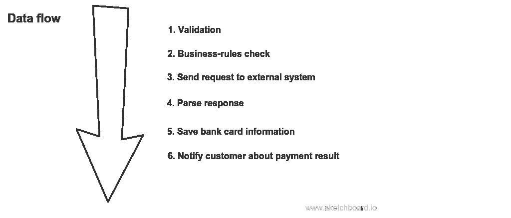
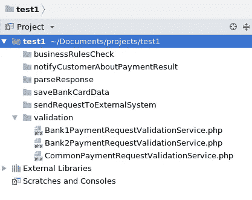
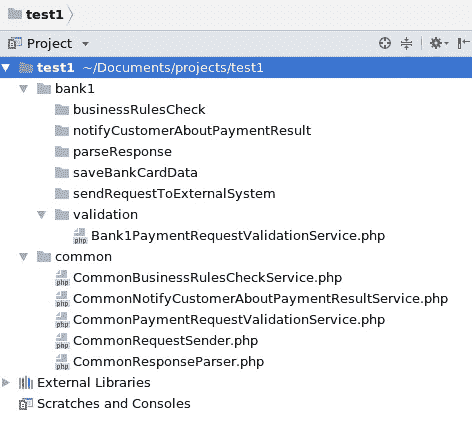
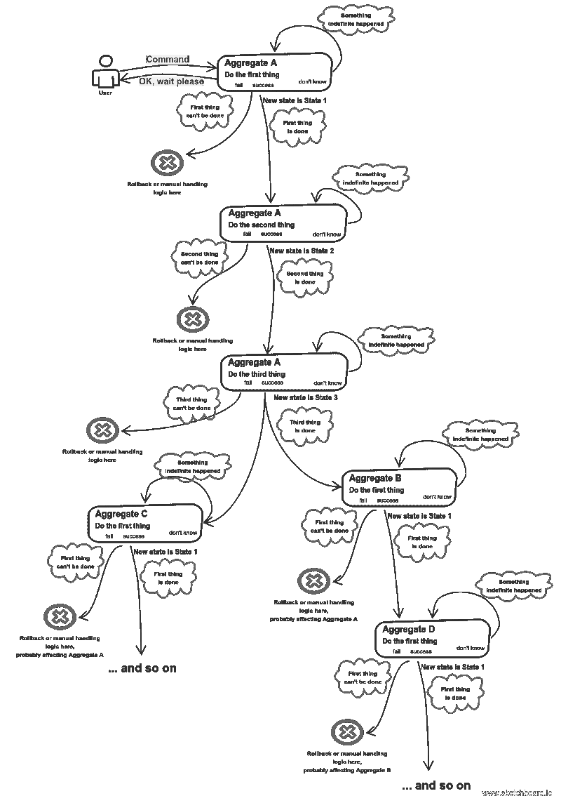

# 微服务失败的原因

> 原文：<https://medium.com/hackernoon/why-microservices-fail-6cdc006f9540>

## 免责声明:这是因为您将业务逻辑放在了服务类中

最近偶然看到一个[帖子](https://segment.com/blog/goodbye-microservices/)讲的是作者使用微服务的经历。这种经历相当负面，但原因是如此典型和根本，以至于我决定写一篇后续文章。但是在说微服务本身之前，我们先从更低级的问题说起。

## 程序思维是什么样子的

[过程思维](https://en.wikipedia.org/wiki/Procedural_programming)与 [OOP](https://hackernoon.com/solid-principles-530b2cc2badf) 的不同之处在于，当你使用前者时，你把你的程序视为一系列对数据执行某些动作的步骤。因此，数据和行为本质上是分离的。

考虑下面的例子。您的系统收到一个`register card transaction`请求。首先，您应该验证它，然后处理一些业务规则(以防您区分验证和业务规则)，然后向一些外部支付服务发送 http 请求，然后解析它的响应，然后基于它的结果执行一些业务逻辑—例如，向客户发送电子邮件并记住一张卡。这是一个你用程序方法想象出来的心流图像:

Typical procedural mindset represented as data flow and sequence of actions that operate upon that data

实现这个场景的典型类是什么？嗯，很简单:`CardPaymentRequestValidationService`、`BankPaymentRequestSender`、`BankPaymentResponseParser`、`EmailSendingService`和`CardRememberingService`。

## 整个过程式系统最终看起来是什么样的

接下来发生的事情是，您必须为另一家银行实现一些业务逻辑(考虑到第一家银行称为 Bank1，第二家银行称为 Bank2)。因此，如果你不懒惰，你可以修改你的类，使每个类只处理一个库，并提取一个公共的父类。所以你的类集合变成了如下:`Bank1PaymentRequestValidationService`(现在扩展了`CardPaymentRequestValidationService`)，`Bank1PaymentRequestSender`(现在扩展了`CommonBankPaymentRequestSender`)，`Bank1PaymentResponseParser`(现在扩展了`CommonBankPaymentResponseParser`)，Bank2 也是一样。`EmailSendingService`会怎么样？每个银行需要单独上课吗？嗯，也许是，也许不是。也许不是:只有两家银行，这两家银行的逻辑几乎完全相同。因此，现在您的代码结构很可能如下所示:

将所有这些`Common`类提取到一个名为`common`或`core`或`base`的目录中似乎是一个好主意，或者，如果你已经*到了*那么远的话，`shared`。因此，使用后一个名称，在自己的微服务中提取每个银行相关代码变得绝对合法，并附带有`common`库:

几十家银行之后，你发现自己正处于与[部门](https://segment.com/)开发人员完全相同的棘手境地:你的共享库在规模和复杂性方面都有了显著增长，包含了许多特定于客户的细节，而且你害怕修改它，因为依赖它的客户太多了。

因此，简而言之，这就是分布式整体结构的创建过程。

## 分布式 monolith 有什么问题

对我来说，这种方法有三个主要缺点。第一个是与特定技术的耦合，这样你就不能用最适合的技术来解决手头的问题。第二个问题是，在共享库被修改的情况下，必须同时部署所有服务，因此整个系统中断的可能性更高。第三个是我之前已经提到的:客户端相关的代码不可避免地在共享库中蔓延。所以共享库的整个概念本质上是脆弱的。

这不是微服务失败的唯一原因，实际上还有更多原因，但这是非常突出的一个原因。

## 为什么服务类会导致糟糕的设计

因为是[服务类](https://hackernoon.com/you-dont-need-a-domain-service-class-in-ddd-9ecd3140782)的概念导致了分布式的整体，你一定想知道为什么会这样。第一眼看上去，他们很棒。它们是可重用的，有时是可组合的。它们唯一的问题是它们不属于 OOP 领域。为什么？OOP 的核心原则是[行为和数据属于同一个](https://martinfowler.com/bliki/AnemicDomainModel.html)。而且这个原则在服务类中即使不总是被违反，也是大多数时候被违反的。

好吧，那又怎样？毕竟，我们不是 OOP 狂热者，盲目地遵循它的原则。为什么服务类会导致糟糕的设计？

这是一个有点哲学的问题。如今的软件工程与其说是一门工程科学，不如说是一门社会和行为科学。没有一成不变的原则一定会让你取得伟大的成就。有一些技术可以促进达到好的结果，也有一些方法会使它变得更加困难。服务类就是这样。您可以保持代码的整洁，但是使用服务类更难做到。

想了很久，我得出了为什么会这样的主要主观原因。服务类没有身份感，没有属于特定上下文的感觉，比如说，一个用户故事。所以从心理上来说，增加一个依赖于客户的 if 子句更容易。因此，它们中的大多数最终都是一样的:看似可重用的服务类被依赖于客户端的逻辑所膨胀。创建一个共享库和一堆微服务只会让情况变得更糟。

根据定义，包含客户端特定代码的共享库是糟糕的抽象。抽象应该是，嗯，抽象。如果你经常不得不修改你认为是抽象的代码，那么你就创建了错误的抽象。基于服务类提出糟糕的抽象的原因(感觉更像是一种主观感觉)是很难提出好的只是动作的抽象。就我个人而言，我的思维倾向于首先识别一个名词，其次——一个动词，也就是它的行为。

## 如何避免失败的微服务

首先，专注于形成内聚[业务能力](https://hackernoon.com/how-to-define-service-boundaries-251c4fc0f205)的用户故事。然后，在每一个里面，把注意力集中在拥有一些身份和行为的对象上。这就是如何获得用 [DDD 聚合](https://martinfowler.com/bliki/DDD_Aggregate.html)(通常是[传奇](https://hackernoon.com/service-boundaries-identification-example-in-e-commerce-a2c01a1b8ee9))表达的业务流程的更高层次视图。将其余的逻辑放在值对象中。因此，您可能最终几乎没有服务类。

我心目中的优质服务大概是这样的:

## 介意提供一些例子吗？

当然可以。你可以在这里找到一些——普遍使用的电子商务，在这里找到，还有支付服务提供商的细节。此外，InfoQ 上有我想法的摘要。