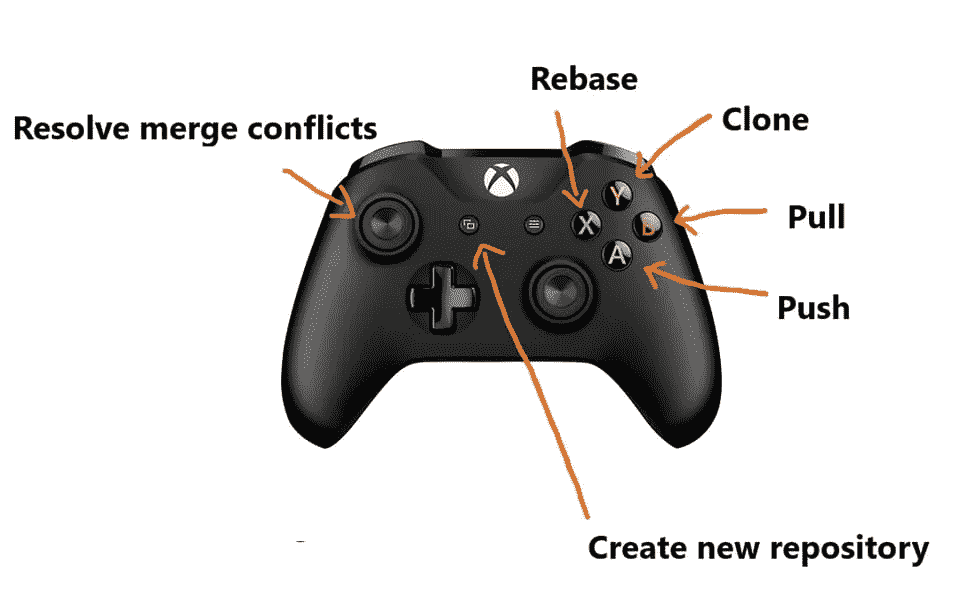
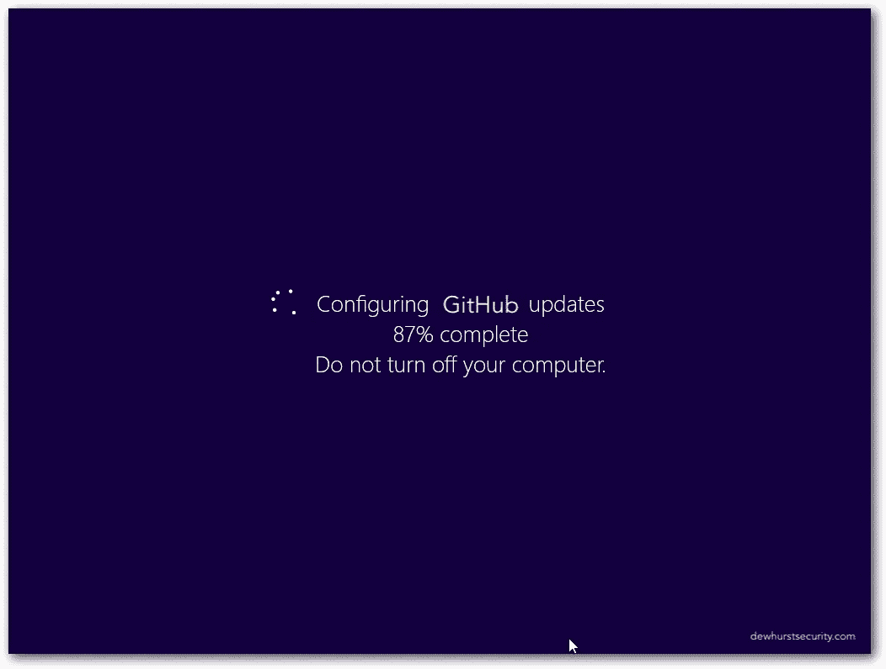
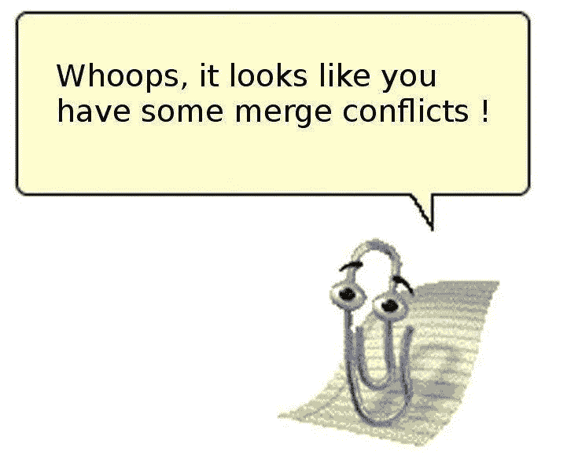
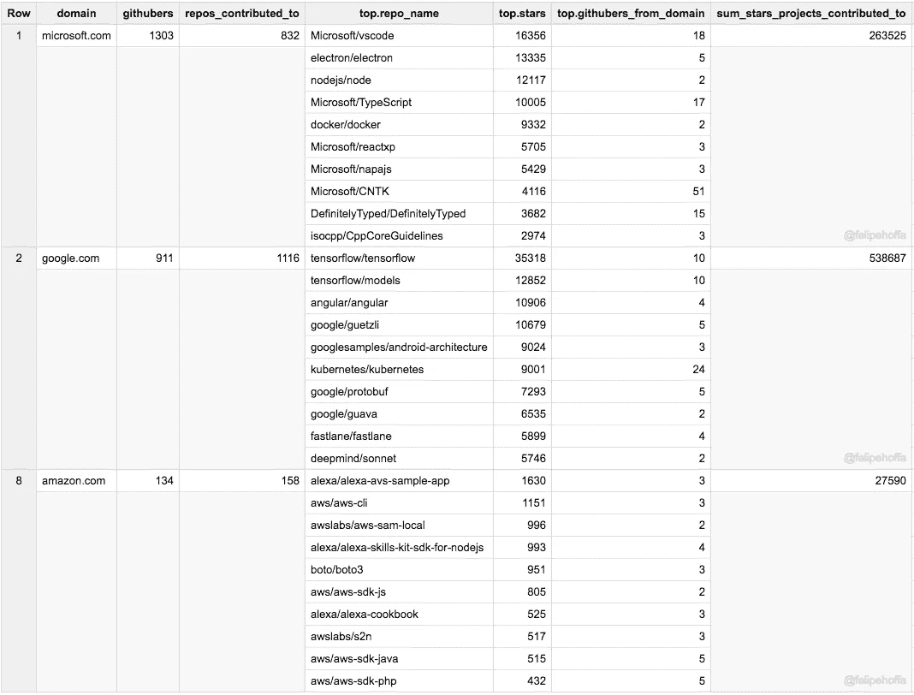

# 为什么微软收购 Github 完全有道理

> 原文：<https://medium.com/hackernoon/why-microsoft-buying-github-totally-makes-sense-dd5b3d8a3bac>

My friend from work can’t stop crying. Microsoft why are you doing that to him.

Github 会换主人。是的，相当大的新闻。忘掉你对这笔交易的典型想法。沉住气，不要再点击删除账户，也不要像其他人一样马上迁移到 GitLab。和我在一起。

让我从头说起。Github 是黑客的天堂，这也解释了为什么它在赚钱上有问题，维持天堂的成本很高。你可以在那里找到几乎所有的东西，从机器学习、最新的 [JavaScript](https://hackernoon.com/tagged/javascript) 框架到受 Trump 启发的[编程](https://hackernoon.com/tagged/programming)语言(剧透:你只能使用大于一百万的数字)。

即使你不是程序员，你也应该关心，因为你正在运行的大多数网站或应用程序都在使用 Github 上托管的一个库。多年来，该公司成为了 2800 万开发者和 8500 万存储库的家园，围绕着那些愿意做出贡献的人建立了美好的社区，因为他们重视拥有 100 颗星回购或看到人们使用它的意义。如果这听起来不令人信服，微软支付的 75 亿美元交易怎么样？这个数目一定有意义。

## 然后互联网出现了

互联网不喜欢微软，那是旧闻了。当信息冲击互联网的时候，连我都不相信程序员有多苛刻。几个小时带来了这样的事情:

*   大规模逃亡到关塔那摩湾
*   微软迷因
*   网络时代的抱怨
*   更多迷因

好吧，微软并不完美，我理解这种批评，它长期以来一直反对开源软件，购买专利，忽视用户隐私。微软关于收购的最后一个决定也不是特别坚定:诺基亚处于最糟糕的时刻之一(他们很快承认这是他们的一个错误)，罕见的游戏开发商，他们从伟大的工作室变成了一个不能生产他们所知的质量的公司，来自爱沙尼亚的 Skype 有希望的初创公司，梦想着去中心化，由于微软的收购，他们很快就可以告别了。

我觉得这次不一样…

## 互联网忘记了什么？

有趣的事实，猜猜谁是 Github 上开源的最大贡献者。从菲利普·霍法那里偷来的电子表格不会说谎。

这不再是比尔·盖茨或史蒂夫·鲍尔默的微软。微软现在支持不同风格的 Linux，并在一些重要的云和开发者产品上使用开源模型。微软不再是开源思想的对立面，我不认为他们会再写“给业余爱好者的公开信”。

你想要另一个证据？听说过 Xamarin，它是为 C#中的移动应用程序的原生交叉开发而创建的，它被微软收购了，猜猜他们做了什么，他们把它开源了。这不是老微软会做的事。

我不知道为什么人们会把 Github 过度理想化为一家没有瑕疵的公司。让我们回到几年前，他们有性别歧视的问题，他们都是这个丑闻的新闻。四年前的耻辱，但看起来混乱仍然存在，因为他们无法找到新的首席执行官从去年 8 月开始。Github 不全是阳光和彩虹，人们必须理解。财务文件显示，这家风投支持的独角兽初创公司在 2016 年的 9 个月里亏损了 6600 万美元。它只从私有存储库和新引入的市场中获利。这就是为什么他们最近经历了这么多轮融资。

说实话，在谈到被巨头收购时，微软是较好的选择之一。在多次收购失败后，他们需要证明一些东西，我认为他们非常适合。作为顶级贡献者已经拥有的经验给了他们竞争优势。

## 为什么这是微软的明智之举

他们非常想要一个电子合并的公关，所以他们买了 GitHub。玩笑归玩笑，但是 Github 有很多价值。Electron 现在是 VSCode 后面的桌面和引擎的主要开发平台。Slack 在用电子。几乎每一个出现在桌面上的新产品都是由电子驱动的。在多年的劣质桌面产品之后，微软终于有机会在这个领域挽回自己。

时代在变，他们的产品变得越来越不相关，当谷歌文档出现时，不再需要 Office 有了更好的免费 Ubuntu，就不再需要 Windows 了(甚至游戏的争论现在也不是很强烈)。甚至有传言说 Windows 将会开源。对于一个软件巨头来说，这种进入开发者社区的机会是无价的。他们真的可以在这里有所作为。

对于 Azure 来说，这是一个很好的举措，因为你经常在 Readme 中看到一键部署到 Heroku 或 Digital Ocean droplets 的按钮，微软可以提供工具或激励措施，让开发人员经常在 Azure 上一键部署，Github 上的这么多项目可以带来更多销售。

## 一切都好，但是…

Photo by [Anna Sullivan](https://unsplash.com/@aesullivan2010?utm_source=medium&utm_medium=referral) on [Unsplash](https://unsplash.com?utm_source=medium&utm_medium=referral)

我认为一切都很好，不要尖叫着逃到 Gitlab。尽管如此，还是有一些问题需要回答。

Atom 会怎么样？VSCode 归微软所有，他们是有竞争力的产品。也许我们在这里谈论的是将这两个编辑器合并在一起，VSCode 有更好的性能，最近受到了很多关注，而 Atom 则有着丰富的插件。他们如何让这两者协同工作？

亚伦·帕特森会怎么样？作为开发人员，他是 Github 中的杰出人物，但我没有从他那里得到“我想为 giant 工作”的感觉。也许我错了，这里发生了更多的事情。

Github 是用 Ruby 写的。这个消息对 Ruby 在公司的未来意味着什么？据我所知，Ruby 在微软并不是主流语言。也许我是不可救药的乐观主义者，但这可能是 Redmond 公司用 ruby 做些事情的机会，我希望他们不会在这么长时间后放弃它，转而支持。NET，因为这将吸大时间。