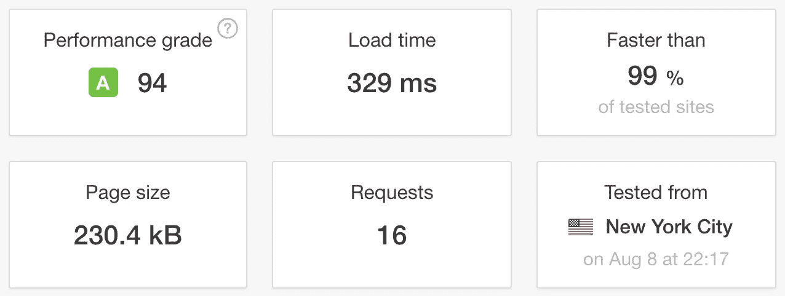

# 为什么要从 WordPress 迁移到静态站点生成器

> 原文：<https://medium.com/hackernoon/why-migrate-from-wordpress-to-a-static-site-generator-c9d46bd24710>

最初选择 WordPress 是因为内容管理系统(CMS)和易用性。WordPress 还为超过 31%的网站提供支持。

从 WordPress 迁移到 Hugo 这样的静态站点生成器的主要原因是**节省成本和速度。**其他原因包括安全性、不太复杂的定制以及可伸缩性/可维护性。

# 成本节约

[迁移](https://hackernoon.com/tagged/migration)的主要原因之一是成本。与 [WordPress](https://hackernoon.com/tagged/wordpress) 你将需要一个域，和网络托管，其中包括一个网络服务器，PHP 和一个数据库。大多数托管计划会在第一年给你一个很好的交易，但几年后，它会变得昂贵。

对我来说，因为我有很多年的主机经验，域名的费用是 14.99 加元/年，主机费用是 120 加元/年。有了一个静态网站，如果你想要一个自定义域名的话,**费用会降到 0 美元/年，或者只有 14.99 美元/年**。因为静态网站只需要 HTML/CSS 和 JavaScript，你可以使用像 GitHub Pages 或 Netlify 这样的平台免费托管你的网站。

# 速度

切换到静态网站的另一个原因是页面加载速度。WordPress 网站需要更长的时间来加载，因为页面是动态加载的。每当用户加载一个 WordPress 网站时，它必须从模板中构建页面，从数据库中获取内容和数据，然后将完成的页面发送给用户。

使用静态站点生成器，您可以托管静态文件，其中已经包含了内容。每当用户加载一个静态网站时，内容已经在文件中，所以服务器需要做的就是找到匹配的文件并显示它。显著提高了页面加载速度。

下面是我在我的 WordPress 和 static 网站上使用 [Pingdom 网站速度测试](https://tools.pingdom.com/)进行的测试。

**测试:**

**静态现场测试:**

# 安全性

对于静态网站，没有动态数据存储，这意味着黑客可以利用的东西更少。WordPress 存在已知的漏洞，你安装的每一个 WordPress 插件都为黑客引入了一个潜在的接入点。

# 结论

总之，从像 WordPress 这样的动态网站转移到静态网站有很多好处，包括节省成本，快速的页面加载时间，以及增强的安全性。

查看[如何选择最佳静态站点生成器](https://snipcart.com/blog/choose-best-static-site-generator)选择静态站点生成器时的注意事项，以及[WordPress to Static Site Generator(Hugo)迁移和部署](https://hackernoon.com/wordpress-to-static-site-generator-hugo-migration-and-deployment-788a69b93e66)如何开始迁移的步骤。