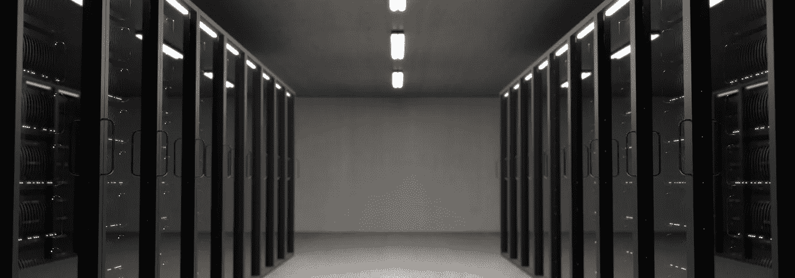

# 为什么矿池集中度是比特币的致命弱点？

> 原文：<https://medium.com/hackernoon/why-mining-pool-concentration-is-the-achilles-heel-of-bitcoin-ce91089ce1f>

Shanghai — China

[比特币](https://hackernoon.com/tagged/bitcoin)是一种基于[区块链](https://hackernoon.com/tagged/blockchain)技术的加密货币。如果你不知道什么是区块链，请阅读 [**我之前的文章**](https://hackernoon.com/bitcoin-is-a-cryptocurrency-based-on-a-blockchain-but-how-does-it-work-7dbed28dedcc) 。

今天，我们将了解更多关于比特币矿池的信息。从理论上讲，区块链是最安全的系统，因为它是去中心化的、分布式的和公共账本。

所以，从技术上讲，比特币和其他加密货币是不可能被破坏的！

但是…

采矿池来了，

以及它们在中国的大量集中…

# **首先我们来看看什么是挖矿，什么是挖矿池？**

比特币基于区块链系统。因此，为了向比特币网络添加新的交易，矿工创建了一个新的区块来加入一个链。

矿工是帮助建造一个街区的人。他或她应用一种数学代码，称为“哈希函数”。

每个数据块都拥有前一个数据块的散列，并且不可能回溯到具有该散列的事务。它只有一个方向。

这就是为什么 Blochain 是从未发明过的最安全的系统。

主要地，有助于 Bictoin 挖掘的是使用计算能力来找到好的散列。找到它后，会创建一个块。

刚开始的时候，挖矿是个人在家里用普通电脑完成的。但现在，为了加强安全性，比特币公司让个人更难找到哈希函数。

> “网络每 2016 个区块重置一次难度，无论开采难度如何，矿工都有 14 天时间来创建区块”。([cryptos.netT13)](https://www.cryptos.net/page/crypto/bitcoin/miner-du-bitcoin-la-base-du-lining-interets-et-avantages/5)

这就是为什么人们聚集在矿池中来提高他们的计算能力。

# **世界上的矿池位于哪里？**

超过 **80%** 的矿区位于**中国**。大部分只提供中文网站和支持。

其余 20%位于:

> 冰岛——5%
> 
> 日本——3%
> 
> 捷克共和国——3%
> 
> 格鲁吉亚——2%
> 
> 印度——2%

矿池集中度可能会成为比特币的一个主要问题。这种专注与**区块链原则背道而驰:**

> 分散的
> 
> 分布的
> 
> 公共

# **你明白为什么矿池集中度是一个主要的安全和信任问题了吗？**

如果某人拥有一半以上的网络计算能力。他可以控制网络并认证他选择的每一笔交易。甚至可以想象，一个人可以使用几倍相同的比特币。

在这种情况下，整个系统将被破坏和不可信。

然而，中国四大矿池拥有全球比特币挖矿能力的一半以上。

> 1.BTC.com—27%
> 
> 2.[蚁穴](https://antpool.com/) — 15.5%
> 
> 3. [BTC.top](http://btc.top/) — 11.2%
> 
> 4.ViaBTC — 11.5%

*Source :* [*Blockchain.info*](https://blockchain.info/pools)

所以，如果这四家公司之间有联盟或协议，这将成为一个国家风险，可以改变区块链交易系统中的信任。

说来有趣，捷克的 [**雪泥池**](https://slushpool.com/home/) 是第一个比特币矿池。

还有 [**佐治亚州的 BitFury**](http://bitfury.com/) 是最便宜的一款。他们收取 0%的费用。

Source : [buybitcoinworldwide.com](https://www.buybitcoinworldwide.com/mining/pools/)

总而言之，随着矿池的集中，比特币实际上面临着一个重大的系统性问题。

# 他们将如何克服这种情况，他们将如何保护他们的系统，以保持可靠性和市场的信任？

如果你有答案或者关于它的一些想法，不要犹豫，在下面的评论中分享它。

感谢您的阅读。希望你对比特币有新的认识。

喜欢就分享给朋友吧。

永远鼓掌

