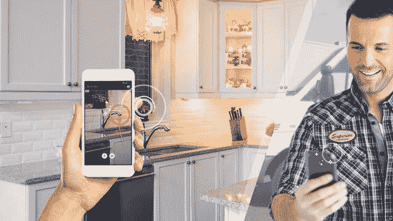

# 为什么移动 AR 的发展速度比你想象的要快

> 原文：<https://medium.com/hackernoon/why-mobile-ar-is-evolving-faster-than-you-think-6a8e461a7405>

随着 ARKit 和 ARCore 现已向公众发布，增强现实(AR)现已在超过 5 亿台设备上实现。iOS 应用商店中有超过 2000 个 AR 应用程序，另外 [Google](https://hackernoon.com/tagged/google) Play 上有 200 多个。由于很少有突破性的成功，许多人都在想 AR 的杀手级用例会是什么。我们可以研究移动应用生态系统的增长，以更好地了解移动 AR 将如何发展。

移动生态系统的增长部分是由三个用例驱动的:创意、情境和连接应用。这些相同的用例现在正在推动 AR 生态系统越过最初的新奇阶段，进入为用户创造真正价值的阶段。

苹果在 2008 年首次推出应用商店，拥有约 2 万个应用，到 2017 年底，应用数量超过 300 万个。第一批移动应用是新奇的、简单的、单一用途的，比如手电筒，但通过将现有的用户行为扩展到移动领域，生态系统迅速发展。很快，噱头应用被广泛的应用所取代，这些应用现在已经成为我们日常生活的一部分。

Number of available apps in the iTunes App Store from 2008 to 2017 (in 1,000s) — Source: [Statista](https://www.statista.com/statistics/268251/number-of-apps-in-the-itunes-app-store-since-2008/)

移动生态系统的增长部分是由三个用例驱动的:创意、情境和连接应用。这些相同的用例现在正在推动 AR 生态系统越过最初的新奇阶段，进入为用户创造真正价值的阶段。

**创意 AR**

创意应用让用户能够创造新的更好的内容。Instagram 让每个人都成为专业摄影师，Musical.ly 让每个人都成为摇滚明星。创意应用程序通过滤镜、贴纸、音乐等增强照片和视频。通过允许用户分享不仅仅是相机的原始镜头，更大的创作潜力被释放出来。类似地，AR 正在使新的创作工具能够分享相机之外的体验。我们通过 Snapchat 的镜头看到了这一点，但这只是 AR 冰山的一角。

[Filmr](http://filmrapp.com/) 是一个移动 AR 应用程序，可以快速轻松地编辑电影。它提供了各种可以放置在场景中的动画 3D 角色和对象。他们的编辑工具和 AR 效果的结合让任何人都可以成为一个特殊的 FX 向导。

Filmr AR

虽然这些效果现在是新的和神奇的，但随着时间的推移，它们会变得更好，我们看到 3D 艺术家为 AR 创造资产的激增，并通过诸如 [Sketchfab](https://sketchfab.com/feed) 和 [Google Poly](https://poly.google.com/) 等图书馆分享它们。像 [Adobe](https://vrscout.com/news/adobe-ar-vr/) 、 [Torch3D](https://torch3d.com/) 和 [Simile](http://www.depthkit.tv/) 这样的公司正在为内容创作者开发工具，让每个人都更容易获得 3D 技能。最后，遮挡和 PBR 等渲染技术的改进将很快使人们无法区分场景中的数字世界和物理世界。

# 上下文 AR

当背景加入到体验中时，移动应用变得更加有用。Yelp 将本地业务数据的现有数据集与位置感知相结合，以实现移动发现。地图在移动设备上变得越来越有用，因为它提供了路线指引。用户的输入也有助于 Foursquare 和 Waze 等公司增强其数据集，以与现有竞争对手竞争，并建立可防御的数据护城河。如果做得好，工具和数据的结合可以创建强大的应用程序。

同样，我们越了解这个世界，AR 就变得越有用。平面检测、云点、标记/图像跟踪和机器学习都是能够更深入理解现实世界的工具。通过这些知识，AR 开发人员可以覆盖内容和数据，以增强您对周围环境的了解。Google Lens 是情境 AR 以及结合不同工具和数据如何产生高价值体验的最佳例子之一。

[Entur](https://play.google.com/store/apps/details?id=no.entur&hl=en_US) 是挪威官方公交 app。它使用 AR 来覆盖相对于用户位置的公共交通站的位置。Entur 不需要将数字地图翻译到现实世界中，而是直观地显示车站的位置并提供方向。

Entur AR

AR 工具正在快速发展，以帮助开发人员更好地理解世界，并为其添加上下文。ARKit 1.5 和 [ARCore 1.2](https://github.com/google-ar/arcore-android-sdk/releases) 增加了对垂直平面和图像/标记追踪的支持。 [Mapbox](https://www.mapbox.com/augmented-reality/) 提供了一个[基于位置的增强现实平台](https://blog.mapbox.com/introducing-native-ar-b3c55a50539d)，使得地理定位与增强现实之间的桥梁变得更加容易。苹果、谷歌、亚马逊和其他公司提供机器学习工具来识别现实世界中的图像和物体。随着这些工具在准确性和覆盖范围方面的不断改进，我们将看到更多增强我们现实世界环境的上下文 AR 体验。

[Black Panther Movie Poster Marker Demo](https://github.com/viromedia/virocore/tree/master/ARBlackPanther)

# 连接的 AR

2011 年，我们看到了优步、Postmates、Lyft、Instacart 等按需应用的激增。这些互联体验让商品和服务只需轻点我们的手机就能到达。移动应用不再是单一玩家的体验，而是将各种各样的客户与服务提供商联系起来。更好的连接、无处不在的智能手机和位置数据使这些服务能够大规模解决客户问题。即使在今天，新的突破，如 HQ Trivia，是将人们聚集在一起共享体验的连接应用程序。

AR 正在从基于个人的用例转向互联体验。 [Streem](https://www.streem.pro/) 是一个连接客户和服务提供商的 AR 平台。用户只需点击一个按钮，就可以联系服务专家来解决他们的问题。服务提供商能够直观地识别问题，并通过将信息叠加到用户的世界中来提供支持和指导。

*Streem Pro*

Streem 是一个很好的例子，说明了联网 AR 如何惠及当今的用户。如今有更多的多人 AR 体验。而这种趋势只会随着 [AR 云](https://www.forbes.com/sites/charliefink/2018/03/01/who-is-seeding-the-ar-cloud/)的出现而加速。在 I/O 2018 上，谷歌发布了云锚，以便在同一位置实现多人 AR 体验。今年晚些时候，苹果将公开发布 arKit 2.0，实现多人体验和持久 AR。这些是实现互联 AR 体验的第一步。一旦现实世界被精确地映射到提供持久性和规模的云点级别，我们将看到另一个与按需革命相媲美的互联应用的爆炸。

# 2018:移动 ar 之年

黑仔应用程序不是孤立建立的，新的计算平台通常作为更大趋势的一部分而成功。

> 计算领域还出现了其他重要趋势，包括 VR & AR、自动驾驶汽车、无人机和物联网设备等下一代计算设备的出现。人工智能的最新发展非常令人兴奋，将使计算机能够更智能地与世界互动。**我们相信，正如上三个大趋势——移动、社交和云——相互交叉并相互加强，接下来的三个大趋势——下一代计算设备、人工智能和加密——也会如此。** —克里斯·狄克逊，[介绍 a16z 加密](https://a16zcrypto.com/)

因此，尽管有些人可能对迄今为止移动 AR 的采用感到失望，但许多下一代用例已经由具有前瞻性思维的开发人员构建。苹果和谷歌[正在 ARKit 和 ARCore 大量投资](https://hackernoon.com/tagged/investing)。该功能集将继续发展，到 2018 年底，将有超过 5 亿台设备支持 AR。创业公司不断发明新的工具和框架，让构建 AR 体验变得更容易。计算机视觉正在快速发展，使得通过我们的相机来理解真实世界变得更加容易。这些技术结合其他计算趋势，将在 2018 年将移动 AR 推向新的高度。

[*Viro Media*](https://viromedia.com/) *是开发者搭建 AR 和 VR 应用的平台。开发者可以使用*[*viro react*](https://viromedia.com/viroreact/)*构建跨平台(ARKit 和 ARCore)AR app，或者使用*[*viro core*](https://viromedia.com/virocore/)*构建原生 ARCore apps。Viro 平台是免费的，没有发行限制，* [*注册*](https://viromedia.com/signup/) *，今天就开始开发你的 AR 应用吧。*