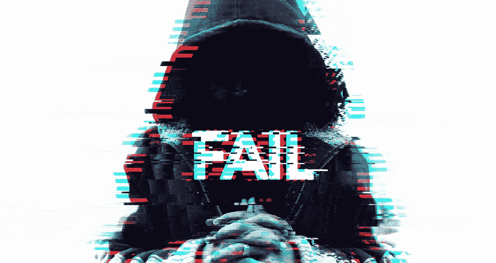
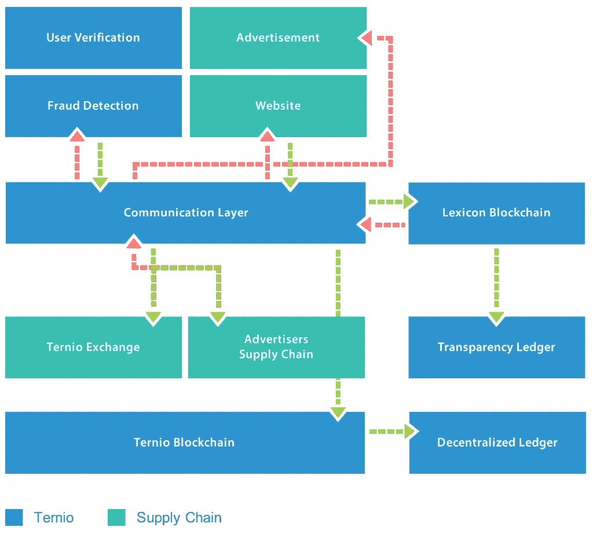

# 为什么大多数区块链 ICO 会失败

> 原文：<https://medium.com/hackernoon/why-most-blockchain-icos-will-fail-53c2f69f3f17>

随着区块链运动的诞生，新公司似乎每天都在数字世界的各个领域涌现。公司有了一个想法，起草一份白皮书，然后开始行动，发行他们的第一批硬币。但问题是很少有人问；这是必然的创造吗？还是有人卖给我蒸汽器皿？

目前市场上有 4 种类型的 ICO:

*   **转身烧掉:**一群人创建一个伪公司(或者根本没有公司)，拼凑一份白皮书(或者复制另一份)，然后带着一个基本想法直接进入一个象征性的销售发布会。问题是，他们要么不具备实现这一目标的知识，不需要区块链来构建他们的产品，要么根本不打算交付一款真正的产品。
*   **乘风破浪:**一家合法公司开始进行基于流行的区块链(即以太坊)的代币销售，完全打算在代币销售后转向另一个区块链。这使得他们能够在特定代币发行(更高的代币销售结果)的流行浪潮中乘势而上，同时充分了解该代币永远不会投入生产使用。
*   **年轻的&哑巴:**虽然这个团体确实有成功的机会，他们还是冲进了一场象征性的销售来追逐金钱。他们已经在他们的想法和白皮书中进行了思考，但这是基于希望和梦想，没有建立任何东西。他们有充分的意愿将产品推向市场，但将它概念化为现实超出了他们目前的动机。
*   现实主义者:这个小组最有可能成功。他们或者已经开始构建或者已经构建出他们基于区块链的应用程序，他们是有组织的，并且对于如何将他们的产品推向市场有完整的计划。

问题是没有人的额头上有一个巨大的贴纸。在这些 ico 的网站上，你找不到“我们正在乘风破浪！”不幸的是，没有什么是非黑即白的，你必须从字里行间去体会。

***台词:***

目前有很多关于区块链将在未来统治他们的讨论。有人说比特币，有人说以太坊。在不了解区块链的基本原理的情况下，我很容易理解为什么有人会纯粹基于受欢迎程度或知名度来支持某一方。然而，区块链是一种协议，其中计算机根据预定义的规则执行操作。类似地，你可以把它比作一种编程语言，在这种语言中，程序员编写一组指令(代码)，计算机根据预定义的指令执行操作。当我们开始将注意力从流行转移到功能上时，字里行间的含义就变得清晰了。今天，世界各地的开发人员使用大量不同的编程语言来构建高度可伸缩的应用程序。没有也永远不会有一个区块链来统治他们。区块链本身成为我们利用的工具，每个人都有自己独特的用途。

以太坊非常适合构建应用程序，但是对于批量交易来说，它的成本高得惊人，速度也很慢。Stellar 非常适合支付——交易超级快，超级便宜。但是，它缺少智能合同等应用程序设置中所需的功能。

许多 ICO 会失败，因为他们对使用区块链的原因没有基本的了解。如果您不知道应用程序使用区块链的原因，也不知道如何为任务选择合适的框架，那么您每次都会失败。从字里行间可以看出使用的是什么技术。为什么以及如何使用它？它的选择是否恰当，还是这家公司急于追求受欢迎程度而非功能性？

在 Ternio，我们非常了解广告行业，也知道该行业面临的问题。经过几个月的反复试验，特尼奥的区块链系统诞生了。

通过了解区块链 Ternio 的功能和效用，它是第一个支持程序化广告并能够管理所需的大量交易印象的解决方案。通过将区块链视为一种协议，我们可以通过一系列多个不同的区块链协同通信来实现这一点。

就像互联网和网络商业时代的开端一样，我们现在才开始了解区块链背后的力量、效用和可行性。我们现在正处于一个时刻，在我们之后的几代人将会把它视为历史上的一个时刻。这是全球互联网永远改变的一个关键点。

Ternio 通过将区块链引入主流广告，站在了这场数字革命的最前沿，引领着潮流。它将影响到供应链中的每一个人，从广告商一直到出版商。Ternio 将为广告商、出版商和广告技术公司提供多种服务，如 Net0 支付、供应链透明、透明审计、无发票支付处理、免费广告欺诈检测等。通过简单的整合，Ternio 解决了困扰主流数字广告的许多问题，而无需供应链中的任何人对其代码或基础设施进行重大更改。

在这里了解更多关于 Ternio 的信息: [https://ternio.io](https://ternio.io)

像往常一样，交易时要小心，做好尽职调查，知道自己的风险是什么，凡事要有所保留。有些人在发展业务，有些人在增加钱包。

下次再见，交易愉快！