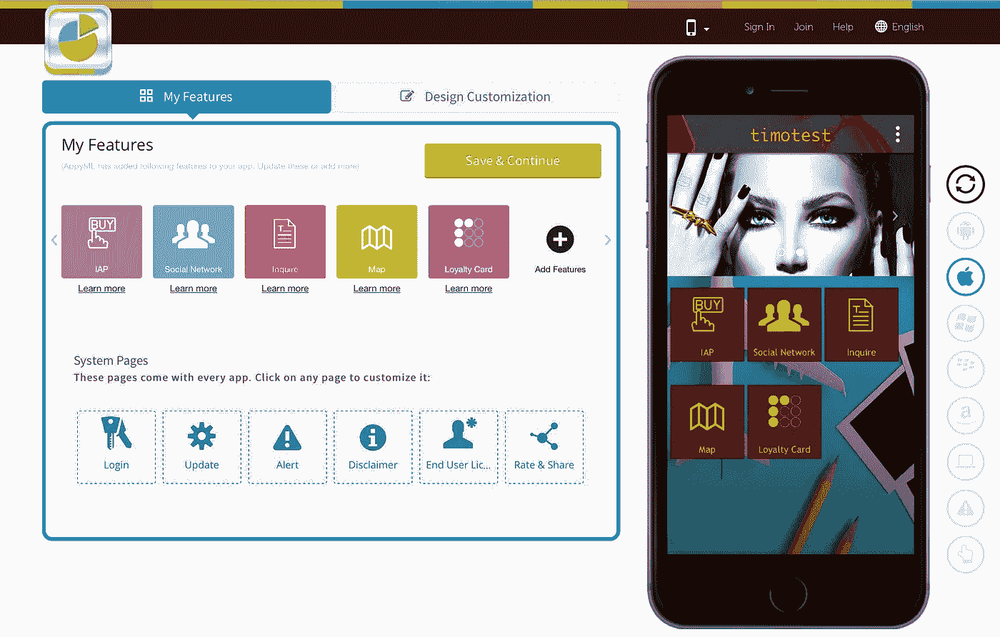
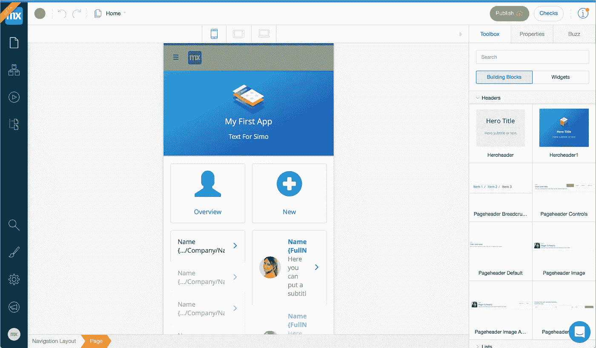
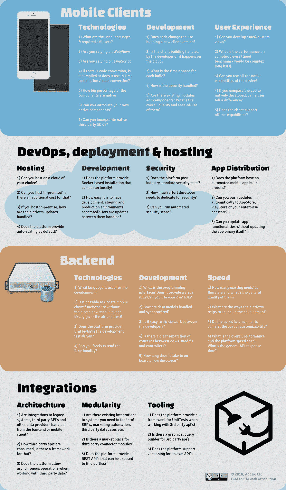
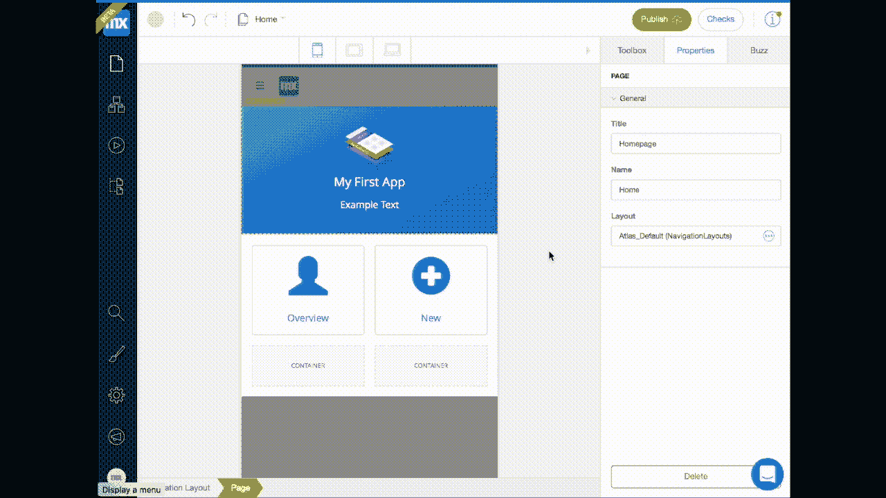
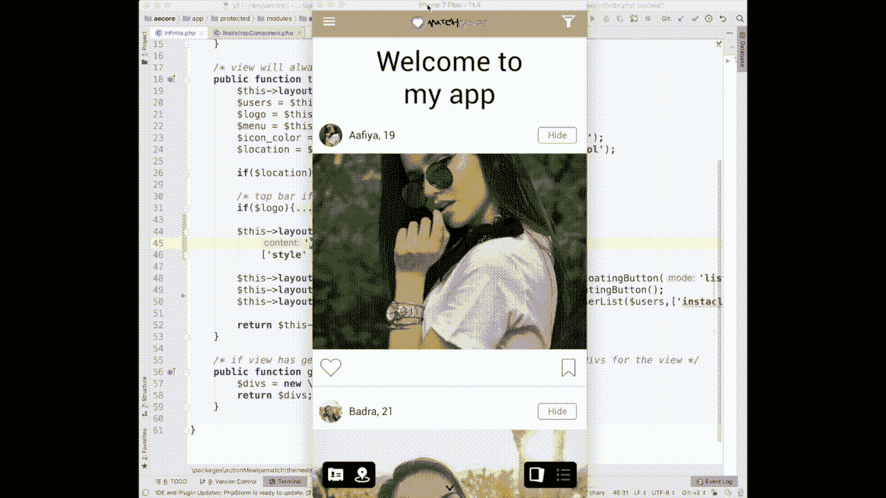

# 为什么大多数低代码平台不适合移动开发

> 原文：<https://medium.com/hackernoon/why-most-low-code-platforms-fall-short-on-mobile-development-fe1b6f0f7981>

作为一点背景:自从 HyperCard 时代(20 世纪 80 年代末)以来，我一直在使用不同的 RAD(快速应用开发)和低代码工具。我爱过他们，也和他们斗争过。在最好的情况下，RAD 工具可以在很短的时间内为您提供结果，在最坏的情况下，它们只能让您完成 80%,而不能完成最后的 20%。此外，我从 Symbian 开始就一直从事移动应用的工作，那是在苹果发起移动应用领域的革命之前。

*我也是* [*Appzio*](https://appzio.com/) *的 CTO，这是一个低代码的原生移动应用开发平台。通过 Appzio，我们经历了一个阶段，我们重新调整了我们的移动开发平台，以允许“任何人都可以构建应用程序”。这是一个严重的思维错误，我很高兴我们及时抛弃了它。*

*我了解这个行业，下面是我对为什么大多数低代码平台无法实现高质量移动开发的看法。*

根据我自己的经验，我将阐明低代码平台的潜在障碍，并指出一些需要注意的关键问题——讨论中经常忽略的问题。这篇文章的背景是为 iOS 和 Android 创建移动应用程序。

## **视觉配置与编码——达到收益递减点**

有很多工具可以让你用某种可视化配置器或编辑器来构建移动应用。面向中小型企业的更简单的工具，如 [Mobile Roadie](https://mobileroadie.com) 、 [Good Barber](https://www.goodbarber.com) 、 [AppyPie](https://www.appypie.com) 、&、 [AppMachine](http://www.appmachine.com) 提供预定义的功能和基于网络的配置器。你不会真的从这些供应商那里找到一个成熟的 IDE，超越他们提供的功能是不可能的。

Example of an app configuration interface from AppyPie.

企业工具如 [Mendix](https://www.mendix.com) 、 [Outsystem](https://www.outsystems.com) 、 [Appian](https://www.appian.com) 和 [Kony](https://www.kony.com) 提供了更全面的可视化编辑器。这些可以使工具在开始时更容易接近，至少在演示中是这样。尽管如此，当你使用基于浏览器的可视化编辑器一段时间后，你真的开始缺少一个合适的编程接口。

Example of a visual editor of Mendix

当我们开始重新调整 Appzio 平台的用途，以允许“任何人都可以构建一个应用程序”时，我们设置了相当高的标准:我们希望输出的是一个功能齐全、丰富的原生移动应用程序，具有 InApp 购买、实时定位等功能，以及其他原生功能，最重要的是丰富的原生用户体验(UX)。我们了解到，visual builder 并不适合完成这项任务。

生产丰富的移动应用程序体验需要深入了解 UX 设计、移动最佳实践以及对业务逻辑创建的深刻理解。这意味着我们试图为大众创造一个工具，结果太复杂了。简而言之；你需要成为一名程序员才能使用这个工具。当你是一名程序员时，你会发现编码是解决复杂问题的最好和最快的方法。

学习可视化工具迫使你学习一种全新的范式，这种范式在默认情况下充满了局限性。你很快就会达到收益递减点。换句话说，你花在浏览各种菜单和配置选项上的时间比你花在编写代码上的时间还要多。而到最后，你还是被限制了。

这就是为什么我们后退一步，放弃了提供可视化界面的想法。相反，我们努力使代码工作成为可能，并创建一个平台，在不牺牲灵活性的情况下提供速度优势。

## **Gartner 缺什么？**

[Gartner 的企业高生产力应用程序平台即服务魔力象限](https://www.gartner.com/doc/3872957/magic-quadrant-enterprise-highproductivity-application)是一份事实上的白皮书，涉及面向企业的低代码平台产品。他们长期以来一直将一个最令人惊叹的字母组合结合在一起——hpaas，代表高生产力应用平台即服务。他们将报告中包含的部门定义为:

> *企业高生产力 aPaaS 市场由供应商形成，旨在为客户提供无代码到低代码的云平台，用于开发和部署企业级应用程序和服务。但是它们避免了传统的亲代码应用程序开发方法的许多传统成本、风险和时间尺度。*

有趣的是，Gartner 很少强调最终用户体验。在大多数情况下，报告中列出的企业平台为移动**提供的不过是一个美化的网络包装，依靠 Cordova (PhoneGap)、JavaScript 甚至 web views** 来构建移动界面。我认为这也是我们很少看到这些平台上面向消费者的应用的主要原因。他们就是不剪。

公共或企业应用程序的移动应用程序用户正在将应用程序体验与她日常使用的所有其他本机应用程序进行比较。像加载时间、界面的快速性和创造性的原生用户界面都是标准的——也是大多数低代码平台无法企及的。

## 使用低代码平台实现定制用户体验的真实成本

科尔多瓦迅速失势是有原因的。如果你需要快速拼凑一些东西，它会做的很好。当涉及到更复杂的用户体验时，您实际上最好用本机代码来实现它。或者一个给你本地体验和完全可定制性的平台。

使用 Cordova，你不仅可以使用 JavaScript，还可以使用其他两种解释语言:HTML 和 CSS。

此外，用 Cordova 构建的应用程序本质上是通过所谓的 WebView 嵌入到应用程序中的网站。这样做的最大缺点是:

*   表演
*   缺乏原生功能
*   严重的依赖性，使得移动操作系统更新更成问题
*   JavaScript 引擎的差异
*   对不同屏幕尺寸的适应性差
*   缺乏多线程
*   实现异步操作的困难。

另一种流行的替代方法是使用 JavaScript 渲染引擎。面临的现实是，它不会在 iOS 和 Android 以及不同版本和屏幕尺寸之间给你相同的结果。实际上，在这种情况下，我们也达到了收益递减点。通常，简单地让视图在不同的设备上看起来相同，实际上可能比本地开发更耗时。尤其是如果你还需要原生性能的话。

当将本地代码的使用与 web / javascript 进行比较时，在移动设备上的优势是显而易见的。所以这是一个很好的问题，为什么所有的低代码平台不使用它。这种架构决策背后有几个原因:

1.  **遗产**。许多低代码平台已经存在很长时间了。如果你看看五年前的移动开发环境，跨平台框架似乎会在未来几年赶上本地代码。事实上，相反的事情发生了——科尔多瓦已经越来越落后了。与此同时，ReactNative 应运而生，而且更有前途，但据我所知，没有任何企业平台将其移动客户端堆栈基于 ReactNative。
2.  **工程人才**。大多数从事低代码平台工作的工程师来自 web /后端开发。对于 web 开发人员来说，Cordova 是一个非常自然的工具。用本地代码构建平台确实需要完全不同的技能。
3.  **支持网页**。许多低代码平台不仅作为移动客户端提供输出，还作为 web 应用或渐进式 web 应用提供输出。使用这种方法，很自然地看到移动应用程序最好用包装器来解决。因为真的是这样。如果你想为原生 iOS 和原生 Android 客户端构建相同的功能，我们希望开发工作翻两番。

然而今天是 2018 年，原生移动 app 比以往任何时候都强大。我相信，一些低代码平台供应商需要重新审视他们的架构，干脆放弃科尔多瓦。

## 什么是好的低代码平台

根据您的操作环境，在移动应用程序开发方面，您可能会重视不同的东西。为了使评估更容易一些，我制作了一个图表来显示低代码平台的关键因素。这绝不是 100%全面的，但它应该有助于你回答决策时最重要的问题。

## 如何加快移动开发？

为了理解低代码平台带来了什么，看看如何加速移动开发是有好处的。除了低代码平台，我还将从传统的本地开发开始。

1.  **加速传统原生移动应用开发**是通过使用框架来实现的，这些框架通过第三方 SDK 和现成的代码模块来扩展功能。
2.  **通过为 iOS 和 Android 使用一个客户端代码库、现有的包和模块以及使用第三方 SDK 扩展功能，可以加速跨平台移动开发**。
3.  **加快后端开发**通常是通过利用后端即服务(baas)提供商、框架、谨慎的编程语言选择以及建立自动方法来直接从模型生成 API 和使用不同的模块&包来实现的。
4.  加速规划是必不可少的，这得益于使用视觉原型工具，如[vision](https://invisionapp.com)来创建可点击的原型和[现成的 UI 工具包](https://ui8.net)。
5.  **使用低代码平台加速**促进模板的使用、现成模块的使用、自动化代码生成、编程配置、自动化云部署、自动化测试、更轻松的开发人员协作、将后端和前端开发耦合在一起。

随着速度的提高，可能会有所取舍。如果您使用现有模块，它是否允许足够的配置和定制来满足您的要求？如果您使用[无服务器](/@MarutiTech/what-is-serverless-architecture-what-are-its-criticisms-and-drawbacks-928659f9899a)架构作为您的后端，当您需要实现更复杂的业务逻辑时，您会遇到限制吗？

## 开发者体验

当前对开发人才的竞争是全球性的。如果你的开发者不喜欢你选择的平台，那你就有问题了。无论是哪个平台，都有一个难以估计的学习曲线。平台提供了一种简单的方法来测试它们，这提供了相当大的优势。开发人员是否乐于在这个平台上工作，将会极大地影响您从中获得的节省。

在最好的情况下，一个知识渊博的开发人员可以帮助你以一种比传统开发模式更敏捷的方式开发一个移动应用项目。毕竟，大多数传统的移动开发仍然遵循[瀑布](https://appinventiv.com/blog/agile-or-waterfall-which-is-the-right-mobile-app-development-approach)方法。低代码可能是敏捷开发的一个非常好的方式。

在评估规范时，有一个问题可能看起来很小，但对开发人员的体验有很大的影响，那就是如何在设备上预览应用程序的更新。这里基本上有三个层次:

1.  **重建**:使用 Xcode 或 Android studio，您需要重建整个移动客户端。这意味着每次您需要预览更改时会有几分钟的延迟。它还要求开发人员安装和配置 Xcode 和 Android studio。
2.  **热重新加载**:你加载整个应用，尽管你不需要在设备上安装任何东西，也没有实际的代码编译。
3.  **实时编辑**:您只需保存更改并刷新手机屏幕。

为了从开发人员的角度更好地说明这种差异，这里有两个简短的 gif，是关于做一个简单的文本更改并在设备上预览的。

Hot reloading: simple change with Mendix (2 minutes)

Real-time editing: simple change with Appzio (11 seconds)

## 当价格成为障碍时

如果你在一家财富 500 强公司工作，你通常可以放心地认为你的公司不会很快缺钱。当你看到分配给你的移动应用程序开发的预算时，这可能有点难以置信。不管公司的规模有多大，成本都应该与预期回报保持一致。

许可费用可能会变得令人望而却步，尤其是如果你打算让你的应用程序有很多用户的话。一些低代码供应商按席位收费，一些按开发人员收费，一些按开发实例收费。这可能是一个真正的挑战，以了解您需要支付的最终价格(除了自定义开发)。例如，Mendix 企业版的起价为每月 7.282 美元。您的业务优势和时间节省需要相当可观，以证明价格的合理性。

此外，平台越专业，吸纳新人的时间就越长。您将需要计划新开发人员的入职，因为找到对所选平台有经验的开发人员几乎是不可能的。

## 清单

在你离开之前，这里有一个总结列表，当你为你的移动应用项目寻找一个潜在的低代码平台时，你可以考虑一下。首先尝试为您的业务案例回答这些问题，然后尝试看看您考虑使用的平台是否能够真正满足这些问题。这就是你可以很容易地比较选择的方法。

1.  用户体验有多重要？这仅仅是为了一小部分用户，他们可以忍受更长的加载时间和更少的界面吗？你需要一个可以在 AppStore 和 PlayStore 上发布的应用吗？它可能是一个面向消费者的应用吗？
2.  参与该项目的开发人员有哪些？是自己的团队吗？他们合作过哪些技术？他们对你提出的平台感到兴奋/忧虑/消极吗？如果你完全依赖外部团队，平台的选择就变得不那么重要了，满足你的需求才是驱动因素。
3.  还需要网页版的 app 吗？
4.  开发和拥有的总成本是多少？
5.  您需要在内部托管吗？这一标准会将许多低代码平台从列表中删除，或者大幅提高成本。如果是云托管的，是否存在安全问题？
6.  你能找到用低代码平台产生的满足你一般质量和功能期望的应用程序例子吗？
7.  您是否遵循瀑布或敏捷开发方法？如果你采用敏捷，那么这个平台在这个场景中的表现如何？每次更新都需要用户下载新版本的应用程序吗？或者你可以在不更新客户端二进制文件的情况下推送更新吗？
8.  当有多个开发人员在一个项目上工作时，开发是如何安排的？
9.  您需要平台供应商提供多少支持？吸纳新开发人员有多容易？

## 最后的想法

如果平台满足您的期望，并提供足够的与您的需求相关的功能，那么低代码或无代码的移动应用程序开发方法可能是一个很好的捷径。与传统的移动开发相比，对于已经了解该平台的开发人员来说，可以节省高达 10 倍的时间。

如果你心中有一个特定的项目，我的建议是联系潜在的平台供应商，请他们提供关于需求规范的逐项反馈。更好的是，如果你已经有了屏幕设计，这将帮助你指出潜在的问题。

此外，如果您已经知道您的移动应用程序项目将使用低代码平台，那么最好从设计过程的一开始就考虑它的局限性。在某些情况下，克服平台限制来实现设计者想出的那种奇妙的 UI，最终可能比用传统开发来实现它的成本更高。

最后，但并非最不重要的一点是，尝试找到构建在你正在考虑的低代码平台上的应用程序示例。如果你能看到它的功能和用户体验，那么你就知道它是可能的。如果你找不到这样的例子，你需要非常小心地行事，并在承诺任何平台之前获得一些额外的保证。