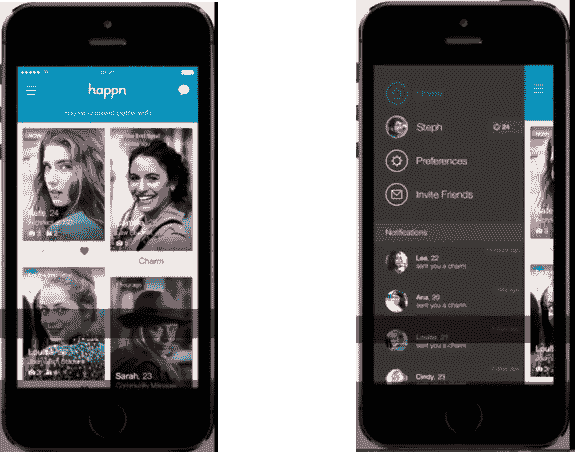

# 为什么 MVP 不起作用，为什么我们需要 MAP(最低可接受产品)

> 原文：<https://medium.com/hackernoon/why-mvp-will-not-work-and-why-we-need-map-minimum-acceptable-product-5e85dcad8116>

用户的期望已经有了很大的改善。我们需要重新思考最小可行产品或 MVP 这样的概念。

Photo by [Štefan Štefančík](https://unsplash.com/photos/UCZF1sXcejo?utm_source=unsplash&utm_medium=referral&utm_content=creditCopyText) on [Unsplash](https://unsplash.com/?utm_source=unsplash&utm_medium=referral&utm_content=creditCopyText)

[技术](https://hackernoon.com/tagged/technology)和消费产品之间的界限每天都在变得模糊。每天我们都看到更好的产品问世。顾客对你的产品的期望也很高。他们不在乎你是在测试这个想法还是正式发布。你的产品被比作庞然大物，你需要脱颖而出。先入为主！

*看这个——如何在 2014 年推出***。我们可以看到在设计和技术方面有相当多的想法。**

**

*Image Source: [https://techcrunch.com/2014/07/16/happn-is-a-dating-app-powered-by-real-life-interactions/](https://techcrunch.com/2014/07/16/happn-is-a-dating-app-powered-by-real-life-interactions/)*

*期望值的这些变化也让我们重新思考整个最小可行产品( [MVP](https://hackernoon.com/tagged/mvp) )的概念。传统的 MVP 有三个部分——产品执行的核心功能，非常基本的设计——接近零 UX 或视觉效果，从最终用户的角度来看，绝对没有令人惊叹的因素，以及反馈循环。它只会做它应该做的一部分。几年前测试一个概念的完美方法。随着新的和令人惊叹的设计应用程序每天出现，最低可接受产品的标准已经改变。我们仍然遵循 MVP 的原则，但是就像我说的，我们做了一些重新思考。*

## *重新思考 MVP(最小可行产品)*

*MVP 的特征是-
1。核心功能产品可以。
2。基本设计&技术。
3。反馈回路。这些是 MVP 的核心部分。有了新的期望，我们想出了**地图(最低可接受产品)**的基本特征。*

***1。一个核心功能产品执行**——这和 MVP 一样。*

***2。设计(UX)和技术**——这是已经改变的功能。初创公司需要在第一次互动时提供无缝和出色的体验，因此需要在这方面投资。你需要在用户体验和技术上花时间。这些是应该消耗你大部分时间的领域。当我说设计时，它不仅仅是外观和感觉，而是用户体验，产品有多快，完成一项任务有多容易等等。最后，你需要让你的潜在客户惊叹，让他们想要更多，这意味着也要在好的视觉效果上投资。*

***3。反馈循环**——想法不变，但是实现方式变了。你需要想出简单且互动的方法来收集反馈。在我们的一个地图中，我们使用声音和视觉来收集反馈。我们的想法是珍惜用户的时间，而不是让他们打字。*

*当你拿出一张地图(最低可接受产品)时，你已经为你的用户设定了一个期望。他们知道他们会得到很棒的东西。这就像一部电影的预告片。如果预告片不是打磨过的人，通常不会看这部电影。你需要专注于增加你获胜的机会，这意味着减少任何会让你失败的机会。
制作地图需要不同的思维方式。这是两者的结合，既保持简单又有意义。你需要不断提醒自己，这是一个测试，因此你不应该走极端。你需要保持一种平衡来最大限度地利用你的地图成果。*

## *关于构建地图(最小可接受产品)的一些想法*

* [## 最低合格产品(MAP)

### 编辑描述

infograph.venngage.com](https://infograph.venngage.com/ps/OqTjgpvU0Ws/minimum-acceptable-product-map) 

1.确保这是一项有时间限制的工作。理想情况下，在 3-4 周内完成。

2.把你的时间分成三个部分:

#产品特性——用一行文字说明你的产品能做什么。不断问自己“这个产品让用户做的一件事是什么”？你不应该在这上面花超过一周的时间。如果找到一个核心函数比你需要的时间要长，首先要弄清楚你想要构建什么。

#设计和技术-为此分配大约两周时间。计划一个为期四天的设计冲刺，让你的团队做这个练习。你会得到惊人的结果。有关如何进行设计冲刺的参考，请查看。这是谷歌的一个很好的参考。您可能想为您的公司定制它。如果你不是设计专家，寻求帮助。如果你无力尝试达成交易，那就拿出一些钱来聘请一位优秀的 UX 专家。让它发生。
对于技术，尝试使用开源，或者有时你可能需要购买一些第三方 API、云存储服务，甚至是你的地图。在这方面投资。你的产品应该无缝运行，付费版本的服务通常比开源软件要好。此外，它增加了更多的皮肤游戏。

#反馈循环-集思广益，寻找与用户沟通的简单方法。你和用户的双向沟通越多，产品就越好。确保你问的问题很清楚，有助于你提高。记住每个输入都不是有用的。

*如果你喜欢你正在阅读的东西，请分享。您还可以分享您对我们如何共同改进的想法。谢谢！**