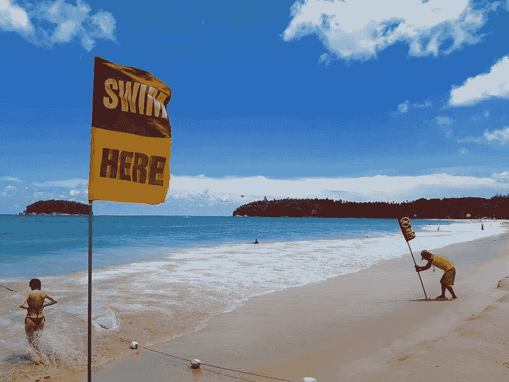

# 为什么我的应用如此神奇，应该出现在每个人的手机上

> 原文：<https://medium.com/hackernoon/why-my-app-is-amazing-and-should-be-on-everyones-phone-69164f8a9f5c>

Taken by a Looxie user. Our users are amazing

## 推销我的应用程序，中等风格

好了，伙计们，说真的——听着:我以前说过，现在再说一遍。

我的应用程序，Looxie，有改变世界的潜力。

这对你来说是不是听起来太自负，太不现实了？太糟糕了，因为我是对的。

## 好吧，我还没有停止阅读。这个 Booxie 是做什么的？

Looxie。它叫做 *Looxie* 。来吧，伙计。

Looxie 是一款照片请求 app。主要的使用场景是，你在地图上点击你想拍照的区域，假设其他 Looxie 用户在该区域附近，他们可以给你发照片。

Taken by an amazing Looxie user, again. Switzerland.

## ROFL 和 LOL 同时！看起来 Instagram 和 Snapchat 还没有在你可能居住的岩石下被发现。

去他妈的那些家伙。谁在乎呢。你真的想看第一万张你二表哥早午餐的照片吗？你高中朋友的孩子第一百万次蹒跚学步了？日落时的励志名言？你的兔子耳朵奶奶(恶)？过滤过的生活的过滤过的照片，有经过精心挑选使它看起来完美的时刻？

不用了，谢谢。

首先，这些应用程序都不允许你做 Looxie 做的事情。请求功能根本不存在。

其次，Looxie 不允许你从你的图库上传照片。这听起来像是一个完全武断的限制，但你不能这样做是有原因的:用户必须使用他们的相机拍摄照片，**，这意味着你通过应用程序收到的任何照片都是在更早的时刻拍摄的，这反过来意味着你所看到的是此时此刻在那个位置实际发生的事情。**

没错，Instagram 上可能有不计其数的埃菲尔铁塔照片，但有多少是你甚至不认识的一个用户应你的要求拍摄的(或定制的)？没错:一个都没有。

这是 Looxie 的另一个特别之处:你不需要与某人建立特殊的联系(如请求添加为好友或接受好友请求)来使用该应用程序:相反，地图上的任何用户都是有效的“你的个人”类型的记者，随时准备接受你的照片请求并回复它。

More Looxie user awesomeness! This time from the UK!

## 但是我的隐私呢？我看了一下 Play Store 列表，该应用程序是免费的，没有广告。这不就意味着我是产品吗？

嗯……是的。是的，你是。或者至少，你会，因为我们仍然没有应用程序的任何部分货币化。

但是听着。我们收集的唯一信息是用于注册目的的电子邮件地址和您的位置，以便您能够在您所在的位置接受其他人的请求。没别的了。

事实上，您可以在没有用户名的情况下使用 Looxie，因为设置用户名是完全可选的。你在地图上用一个点来表示，如果你对此感到不舒服，你甚至可以选择在地图上隐藏自己。您仍然会收到在您的位置发送的请求，但是没有人能够看到匿名用户的位置。

赚钱的计划也相当新颖:我们不会依赖你的年龄、性别、电影和音乐偏好、种族背景、宗教信仰(或无宗教信仰)、爱好、大气条件、喜爱的食物、工作、位置、汗液酸度和大便的颜色，而是会根据你发出请求的地点，向你展示时尚的相关广告。

如果你想一想，这很有意义:如果你已经向圣托里尼发出请求，要求拍摄壮丽的日落，这就有意义了，也许你想去那里。那么，为什么不接收圣托里尼岛的酒店或餐馆的广告呢？

如果你想在巴塔哥尼亚拍一张照片，为什么不去找一个广告，买一张去偏远地方的机票呢？这些广告仍然与你和你的生活方式相关，我们不会试图利用你刚刚有了一个孩子的事实来赚钱。或者中风。或者别的什么。

Taken by a (you guessed it) Looxie user in Canada

## 哦，好吧，所以你会尊重我的隐私。谢谢，但我还是不明白为什么我应该在手机上安装另一个社交网络应用程序。

Looxie 是*不是*社交网络应用，所以闭上你的臭嘴*。*在最基本的层面上，Looxie 是一个陌生人之间一对一的照片请求/拍照应用程序，这些陌生人通常都喜欢旅行、风景和摄影。

你只能“喜欢”你收到的一张照片，但这是以完全匿名的方式完成的(即你不知道谁收到并喜欢这张照片，他们也不知道是谁发的)。

你也可以对我们在世界各地的用户拍摄的最后三张照片发表评论，但这是你可以与该应用程序的其他用户进行互动的范围。

Looxie 是关于获得真实的，实时的异国和非异国他乡的照片。你可以做的编辑是有限的(只有三个基本的过滤器可用)，这样你收到(或发送)的任何照片都不会被修改，看起来像一个假屁股软色情帧。

Taken at Monaco by a freaking awesome Looxie user!

## 无意冒犯，但你的应用听起来像扫兴的诺曼·贝茨。我还需要解高级代数方程才能使用它吗？你认为这对什么有好处？

谢谢你的提问。这里有一些 Looxie 可以派上用场的例子

*   你被困在办公室了。你唯一感觉到的是一种令人不安的、联觉绿色的混合物，是智力麻木和戴夫腋窝的气味的混合物。但是，嘿，也许一张来自加勒比海的*照片会给你灵感！不幸的是，Looxie 对 Dave 的臭腋窝无能为力。*
*   你试图组织一次外出夜游，但是你担心你最喜欢的地方挤满了人。或者更糟，被遗弃。不幸的是，你必须亲自去那里寻找答案。*还是你会？*
*   那个海滩有大家一直说的那么壮美吗？发个请求，自己看看。最精彩的部分？由于 Looxie 中几乎不能进行剪辑，所见即所得，宝贝！尿坑看起来像尿坑，不像科莫湖。
*   还有更多！

当然，Looxie 并不完美。这里列出了一些你不能用 Looxie 做的事情:

*   窥探你的暗恋对象
*   撞上一个间谍
*   假设你的生活是一个完美的、不间断的时间线，充满了迷人的照片和沙滩派对
*   出售“健康茶”和/或用你参与的最新 MLM 计划打破你以前朋友的蛋蛋/卵巢。
*   还有更多！

You get the drill. Awesome Looxie user, somewhere in the world. Gorgeous!

## 好吧，好吧。我可以贴迪克的照片吗？

号码

但是，嘿——为了减轻我们的“无鸡巴照片”政策的打击，你可以发送看起来像鸡巴的人、地标和自然形态的照片！很棒，对吧？

## 所以你的意思是，Looxie 就像脸书或 Instagram，去掉了隐私问题、过度广告、关注和被关注、自恋和自我推销？所以，不像那两个？

是啊！*谢谢你。*

每当我向人们提起 Looxie，他们都会嗤之以鼻，说‘我们已经有了某某人，谁还需要另一个照片分享应用？’？但这是完全无效的比较。

*Looxie 是一个工具，它可以让你实时看到你周围的世界，利用了我们几乎每个人都在口袋里带着相机的事实。*

你可能想这么做的原因有很多:逃避现实的感觉，当你在厕所时对蒙古大草原上发生的事情感到好奇(有些人，对吗？)，这些信息将帮助你更有效地计划你的下一次旅行或夜间外出，甚至可能是研究。

Cyprus via Looxie.

## 好吧，我就直截了当地说吧:这对我有什么好处？

如果你是一个普通用户，你将有助于形成一个世界性的摄影师/记者社区。这对你和其他人都有好处，因为随着用户数量的增加，这个应用程序对每个人都变得真正有用，我对一个更加可视化连接的世界的愿景更接近成为现实。

如果你是一家小企业的老板，想象一下:你坐在你的咖啡馆/餐厅/酒吧/书店/或其他地方。突然，一个照片请求到达你的位置附近。拍一张你住的地方的照片，写上你的企业的名称、描述和位置，吸引潜在客户。

如果你是一个风险投资者，看到这篇文章，我真的需要从你手头的大笔现金中拿出几百万。我的全职工作是口腔外科医生，所以我不能随心所欲地在 Looxie 上工作。此外，一旦 Looxie 不可避免地变得巨大，有人将需要支付这些电费。

## 成交！在哪里可以下载你的应用程序？

目前， [Looxie 在 Play Store](https://play.google.com/store/apps/details?id=com.saladdressing.looksie) 的安卓设备上可用。试一试并留下来——我真的相信这是一个特别的开始。

iOS 用户，不要绝望。希望某种形式的资助会发生，我将能够雇人做一个 iOS 版本。