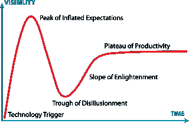

# 为什么没有人使用占卜，为什么这并不重要

> 原文：<https://medium.com/hackernoon/why-no-one-is-using-augur-and-why-it-doesnt-matter-a3e091aaf107>

**跟我来**[**@ flat outcrypto**](https://twitter.com/flatoutcrypto)**。你可以在**[**flatoutcrypto.com**](http://flatoutcrypto.com)上找到我所有的文章

昨天，Coindesk 发表了一篇文章，谴责 DApp 预测市场 Augur 缺乏用户。他们的结论是，这是由于流动性和设计问题。

没有。

问题是没有人使用 DApps。任何 [DApps](https://hackernoon.com/tagged/dapps) 。

奥格是最有趣的项目之一。虽然设计并不完美，而且和所有 dapp 一样，它迫切需要一个移动应用程序，但事实是，它可能拥有人类已知的最伟大的设计，但它的用户仍然不到 100 人。为什么？因为没有基础设施来支持它。因为没有基础设施，就没有社区。

期望 DApps 推出并拥有成千上万的用户是可笑的。奥格可能定价好像它应该，但它定价高，因为:

1.  这是最早的 DApps 之一
2.  它是以太坊的旗舰应用之一，而以太坊本身就是智能合约的先锋
3.  这是雄心勃勃的

发布时的预期用户和令牌使用情况*不会计入 REP 的价格，如果你以任何方式了解其他 DApps 是如何发布的，就不会。*

[Cryptoasset](https://hackernoon.com/tagged/cryptoasset) 价格可能在 2017 年飙升，但技术只能发展这么快。要为 DApps 创建一个庞大且可持续的用户群，需要做很多事情。

首先，我们需要一种更简单的方法让那些只想使用 DApp 的人登机。不得不去比特币基地购买您的 ETH，然后将该 ETH 转移到您的分类帐或 MetaMask 帐户，然后登录该帐户，然后使用 Augur，这不是一个很好的用户体验。这既费时又尴尬。此外，正如克鲁格自己指出的，你支付的费用很高。而且它需要使用电脑，这是许多人在家里不再使用的东西。哦，你还承担了 ETH 波动的风险，所以即使你赌赢了，你也可能会大幅下跌。

其次，网络速度仍然很慢，即使需求到来，也无法应对。众所周知，扩展解决方案至关重要。当我们知道网络会立即使其变得不可用时，为什么我们如此热衷于让人们开始使用网络呢？这不是一个到达时死亡的场景。现在这个领域的大多数开发者都是在过去的 24 个月里才进入的。他们需要时间来建立和实施将用户带到 DApps 的基础设施。

第三，我们只需要耐心。科技炒作周期众所周知。就价格而言，我们现在处于膨胀的期望的顶峰和幻灭的低谷之间，但就技术本身而言，我甚至不确定这是真的。技术本身的好处在 2017 年的价格谈判中消失了。许多人能解释为什么分权很重要吗？我表示怀疑。世界上大多数人甚至不知道这件事。坦率地说，如果超过 20%的自称参与加密的人能够解释为什么这项技术是有前途的，或者为什么去中心化是重要的，我会感到惊讶。

我的观点？我们还不能指望看到大量的用户。

这甚至比不上互联网，因为我们是在和互联网竞争。去中心化用户体验的每一个方面都必须与互联网相匹配，从接纳新用户开始。除此之外，我们还能指望如何将人们转化为 DApps？

我们目前离这个标准还很远。在这个阶段需要耐心。奥格是一个了不起的 DApp。真的是。没有用户对团队来说并不丢脸。他们刚刚在一个没有电、水、通讯和道路的地方建了一栋房子。