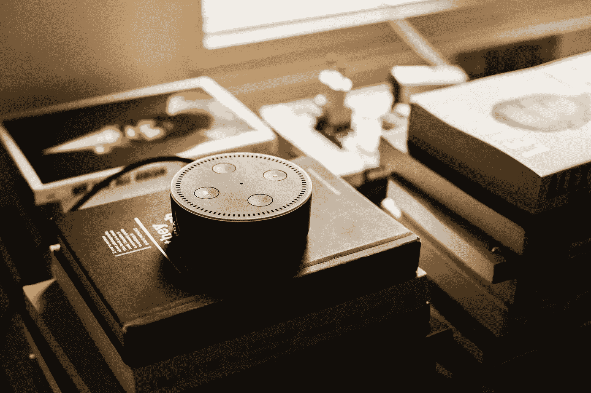

# 为什么非技术创始人在亚马逊的 Alexa 加速器中茁壮成长

> 原文：<https://medium.com/hackernoon/why-non-tech-founders-are-thriving-at-amazons-alexa-accelerator-c65416630f20>

## 在世界上做好事——在财务上做好事

对于大多数人类来说，当一个问题变得如此紧迫，需要一个解决方案时，创新就产生了。早在我们有加速器、产品忍者和技术大师之前，我们就有人做日常事情，遇到日常问题，并找到解决这些问题的巧妙方法。

中国人发明指南针不是为了发财；他们想要一种更可靠的导航方式。亚历山大·弗莱明完全有权利拥有盘尼西林的专利并变得异常富有，但他却在二战期间为了拯救生命而将专利交给了美国和英国政府。这样的例子不胜枚举，但在每个故事中反复出现的是，解决问题的动力排在第一位，商业应用排在第二位。

What will be your contribution to the world?

在一个创新、技术和财富似乎密不可分的世界里，我们不要开始认为这些是线性相关的，这一点很重要。我们可以基于一个想法开发技术，现有的技术可以激发进一步的创造力，而新的想法可以是即时的金融巨人或缓慢燃烧的火焰。

科技创新者和非科技创业者之间的关系确实是共生的。虽然非技术创业者可能有一个绝妙的想法，但如果他们不了解技术突破可能带来的新可能性，他们的想法可能永远不会实现。同样，非技术类创始人总是在推动开发者去想象新的可能性。

# **非技术创始人正在推动新技术的发展**

omorrow 的伟大创始人和首席执行官都是当今特定领域的专家。遭遇繁琐的版权管理实践的律师正转向区块链开发商寻求智能合同。电力公司正在寻找更有效的方法来监控变电站的健康状况，并推动智能电网技术的创新。例子不胜枚举。

不过，让我们来看一个具体的例子，来自最近的[亚马逊 Alexa 加速器演示夜](https://www.geekwire.com/2018/top-pitches-amazons-alexa-accelerator-startups-push-boundaries-voice-tech/)。许多推介都基于亚马逊的人工智能和语音识别技术 Alexa，但旨在解决以前未解决的问题。

Voiceitt 就是这种情况，该公司写道，创建 Voiceitt 是为了“让语音识别技术真正为每个人所用”，帮助那些有语言障碍和沟通障碍的人更好地与世界联系。

联合创始人兼战略副总裁 Sara Smolley 拥有经济学学士学位，并从以色列延世大学(Yonsei University)获得工商管理硕士学位——这是一位明确的非科技创始人。她卓越的创新首先来自于对世界行善的渴望。在那里，她利用自己的商业管理经验吸引资金，尽管 Voiceitt 等社会影响力企业存在障碍。

> “在资金方面，我们面临着特殊的挑战；传统风投可能不会马上看到更大的市场潜力，传统投资者社区可能会对双重底线目标(做好事，同时做好财务)保持警惕，这是像我们这样的公司的标志，”Smolley [在《以色列时报》的一篇文章](https://www.timesofisrael.com/wework-and-voiceitt-giving-voice-to-people-who-cant-be-heard/)中写道。

“但这些担忧并没有阻止我们筹集资金。我们已经能够通过政府拨款、企业现金奖竞赛(如创造者奖)和相信我们使命的投资者的创造性组合来筹集资金。”

斯莫利利用她的商业头脑，将一个想法转化为产品，并吸引资金。她的故事是人类问题的技术解决方案影响非技术创新的几十个故事之一，非技术创新然后推动技术社区开发适当的工具，激发进一步的创新。这是一个奇妙的循环，但前提是科技和非科技社区都尽自己的力量。

# 他们在世界上做好事(并创造收入)

在 Alexa 加速器演示中，他做好事和解决全球问题的动力非常普遍。Bryanne Leeming 拥有波士顿巴布森学院的工商管理硕士学位，并在大学期间学习了认知科学和艺术史，她创办了 [Unruly](https://www.unrulysplats.com/) 。

这个项目也是 Alexa/Techstars 加速器计划和 Voiceitt 的一部分，它使用动觉学习来教孩子们编码的基础知识。该系统包括电子可编程楼层按钮、课间运动、平板电脑程序以及灯光和声音的组合，使[学习变得有趣，并提高记忆力。](https://hackernoon.com/tagged/learning)

Leeming's Unruly 可能是为什么技术社区需要非技术创始人的最纯粹的例子:她的想法本身就可以带来新一代的开发人员，他们比以前的任何人都有更多的经验，他们将准备好找到现实世界问题的技术解决方案。

The way children learn is changing thanks to new tech developments.

# 他们知道没有比现在更好的时机了

M 奥尔德定律说明了一切。技术的进化是无限的，但如果没有应用，突破将是无关紧要的。将由非技术群体提出他们各自行业和职业中的问题和可能的解决方案，以充分利用这些技术进步。

幸运的是，将一个想法转化为产品从未如此容易。这些创始人证明了一个事实，即你不需要融入科技世界就能产生翻天覆地的科技创新。您有远见，有管理经验，不要让缺乏 IT 知识阻碍您追求梦想。

上面列出的两位非科技类创始人只代表了那些在对 IT 没有深入了解的情况下获得巨大成功的企业家的一小部分。他们最初可能没有技术实力，但他们有远见，知道如何经营企业。那么，是什么阻止你找到同样的成功呢？