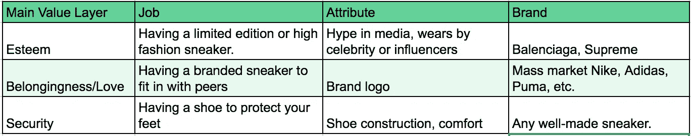

# 人们为什么购买

> 原文：<https://medium.com/hackernoon/why-people-buy-46ad5558ecdc>

## 解构价值函数。

无论你是企业主还是公司雇员，你都会花大量的时间来回答上述问题。我们需要了解这一点，因为我们希望顾客购买更多我们的产品，并在顾客开始减少购买时解决问题。真正的公司有许多策略来解决这些问题:折扣、广告、公共关系、参与活动等等——但因为它们是策略，所以存在有效和无效的情况。为了增加一个人的成功率而不是纯粹的机会，一个人必须有一个潜在的理论基础，从这个基础上可以得出适当的策略。这篇文章提供了一个这样的价值函数理论。

**价值函数是作为消费者的人们考虑购买**的价值的函数——也就是用辛苦赚来的钱来换取产品或服务。我们本能地知道这种功能的存在，因为我们一直在买东西，而且我们做决定时可能会用到某种逻辑，但很难精确地定义它。

# 价值函数

因此，对于这个值函数的简单版本，可以这样写:

> 净值=感知的提供价值—获得成本

**如果净值为正，那么人们会购买股票，如果净值为负，他们不会购买**。如果有多个产品，他们将购买净值最大的一个。简单。但事实并非如此。有一些问题阻碍了公司简单地操纵这个功能来实现更多的销售。

1.  **感知的产品价值不断变化**

这是从价值函数中可以得出的最直接的结论。在特定时间的市场中，获得特定商品/服务的成本往往是相似的。超市里一瓶可乐的价格对任何想在那里购买的人来说都是一样的，但并不是每个进入超市的人都会买。因此，可以得出结论，对于每个超市顾客来说，一瓶可乐的感知价值是不一样的。更重要的是，如果你渴了，你可能会买那瓶可乐，但在你喝完之后，你可能不会倾向于买第二瓶，即使产品和价格完全一样。

2.**获取成本大于价格**

公司可以设定他们提供产品的价格，然而货币价格只是决定获取成本的一个因素。我们可以把获得成本定义为一个人从需求点到消费点必须花费的任何东西。除了报价，这还包括运输到相关市场的价格、他们在交易中花费的时间价值、交易所需的体力或脑力劳动的价值等。为了简化，我们可以把所有这些不同的成本放入一个术语，交易成本。因此，获取成本就是交易成本+发行价格。在理论上的有效市场中，交易成本应该为零，但在现实世界中，交易成本永远不会为零。

**为了增加销售额，公司必须想出一种方法来部署他们的资源，以解决其中一个或两个问题，从而为尽可能多的客户实现净值最大化**。因此，聪明的公司需要了解他们感知的产品价值和获取成本，以便设计影响每个人的计划。在这篇文章中，我将着眼于第一个问题的感知价值。

# 增加感知价值

人们可能会将“感知价值”理解为“不真实”的价值，但它是非常真实的。只是它是多维的，主观的。这就是为什么单一的增值计划不会对每个客户都有效。营销的整个领域都集中在如何从产品中传递尽可能多的感知价值，因此关注细分和沟通策略。然而，营销努力往往发生在产品上市之后，因此通过它可以增加多少价值是有限制的。理想情况下，增值应该从一开始就通过产品管理来实现。

**我所知道的关于理解客户如何以不同方式评价产品的最好理论之一是哈佛教授 Clayton Christensen 提出的工作要做框架**。他认为，与传统的细分不同，在传统的细分中，产品的价值对于该细分中的所有成员都是相同的，产品的价值取决于它是否适合做客户雇佣它来做的“工作”。

A bottled water can have many jobs

让我们以一瓶饮用水为例。细分如何有助于增加饮用水的价值？每个人都需要饮用水——如果一家公司卖的是给男人的水，还是给孩子的水，会有人更有可能购买吗？他们可以尝试，但如果品牌努力不能转化为比普通饮用水更多的销售或更高的销售价格，那么为什么要麻烦呢？

事实上，更高价格的饮用水确实存在，他们是好生意。在一个存在低价替代品的市场中，昂贵的水资源有什么意义？只能是有些工作需要昂贵的水所具有的属性。例如，在一次重要会议上，你可能需要为贵宾提供饮料。在这种情况下，瓶装水的作用不仅是解渴，也是为活动营造一种精致的氛围。对于前者，一瓶普通的塑料瓶装水可能就足够了，但对于后者，只有高档品牌的花式玻璃瓶才可以。顾客并不是造成差异的原因——如果活动组织者或贵宾的工作是在跑步后解渴，他们也会很乐意选择低价水。

因此，为了实现价值最大化，公司必须考虑:

1.  产品被雇佣做什么工作？
2.  客户在选择每项工作的产品时会考虑哪些因素？

如果你想要更深入的资料来做上面的分析，我强烈推荐克莱顿·克里斯滕森的[创新者的解决方案](https://www.goodreads.com/book/show/2618.The_Innovator_s_Solution)和法伯、温克尔和沃特曼的[工作要做:以客户为中心的创新路线图](https://www.goodreads.com/book/show/30212651-jobs-to-be-done?from_search=true)。对于这篇文章，我想关注一个不同的问题:**给定一组我们可以改进的属性，我们如何选择最佳属性来改进，从而使客户愿意支付更高的价格？**

让我们仔细分析一下:如果有一个我们应该关注的特定属性子集，这意味着**每个属性满足工作的不同方面，客户对每个属性的改进有不同的价格敏感度**。简而言之，客户会愿意为属性 A 的改进支付更高的费用，而在假设相同水平的增加的情况下，不会为属性 B 支付那么多费用。例如，汽车具有快速和省油的属性。我们应该让汽车速度快 10%还是更省油 10%？这取决于汽车是用于比赛还是日常运输。

如何确定客户对某一属性的价格敏感度？对于现有产品，历史市场数据。简单地比较做同样工作的产品的销售数据，看看销量最高的产品有什么属性优势。对于新产品或市场尚未成熟的产品，差异化的属性可能不容易被发现。

为了预测客户愿意为哪些属性支付更多，我建议使用马斯洛的需求层次框架。

A job can be thought of as fulfilling several layers of needs in Maslow’s hierarchy.

**客户雇佣产品从事的任何工作都可以用满足这些需求的维度来表达**。一份工作包含的级别越多，对客户来说就越有价值，他们会很乐意支付更高的价格。为什么他们愿意支付更高的价格？因为职位越高，工作就越具体——越少的人拥有它们，越少的产品能够满足这份工作的要求。一项工作可能不涉及层级结构中的每一层，但仍然是较高层的改进会受到更高的重视。

例如，让我们看看一双运动鞋可能被雇用的各种工作。

Different jobs have different main attributes that satisfy a need layer

**层级越高，价格敏感度越低，顾客对产品满足需求程度的了解越来越少**。很容易判断你的脚是否得到了足够的保护，但是你能准确地判断一双运动鞋能提升你的自尊到什么程度吗？随着满足程度的差异变得越来越难以分辨，价格的差异也变得越来越难以准确判断。这就是品牌的由来。人们将品牌与那些难以判断的更高属性联系在一起。这就是我们为品牌付费的原因——它们代表了一种简单的启发式方法，可以帮助我们寻找能够满足我们更高层次需求的产品。

那么，公司应该以牺牲较低层次的需求为代价，直接解决较高层次的需求吗？他们可能会自担风险。一个有着奇特瓶子设计的优质水品牌，如果发现里面的水不能安全饮用，就不会出售。不，他们应该弄清楚任何低的水平都会成为该层交易的破坏者。在这个层次被超越后，他们才能考虑满足更高层次的需求。

总而言之，为了有效地最大化产品的盈利能力，公司可以采取以下措施:

1.  列出他们的产品被雇佣的所有工作。
2.  通过列出马斯洛层次结构中哪些属性满足了哪些需求层，来阐述他们的产品对于这项工作的价值。
3.  通过专注于改善满足更高需求层的属性来增加感知价值。

作为价值函数的结果，仍然有许多令人感兴趣的东西，例如它对市场竞争的影响以及技术在感知价值中的作用。我还没有解决等式的第二部分，即获取成本以及如何最小化成本。还有如何设计实验来测试感知价值的提高。然而这篇文章已经超过了 7 分钟，所以我会在以后的文章中讨论这些问题。

感谢您的阅读，我很想听听您对此的看法。在 [LinkedIn](https://www.linkedin.com/in/rajendra-rusmana-2a303150/) 上和我联系，或者发邮件给我。