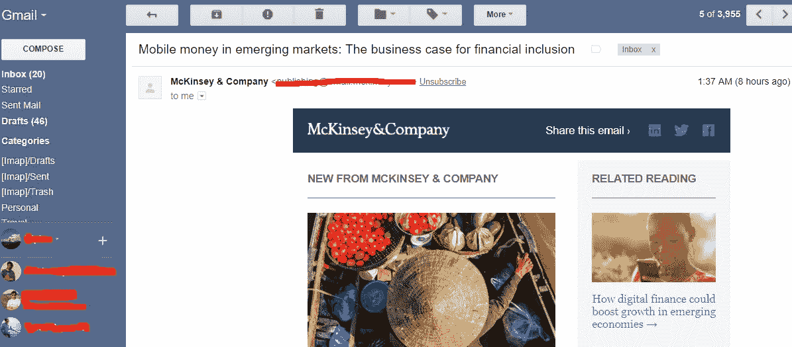
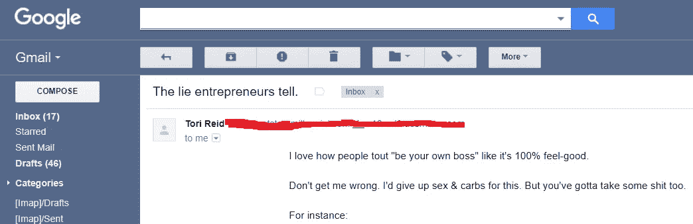
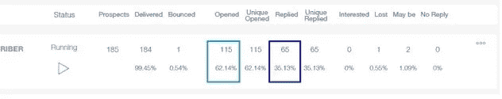

# 为什么纯文本邮件比 HTML 邮件能确保更好的增长

> 原文：<https://medium.com/hackernoon/why-plain-text-email-ensures-better-growth-than-html-email-3935a19ed9c0>

转化率高达 20%。这就是我在一些电子邮件活动中看到的结果，所以让我直说吧——电子邮件仍然是瞄准你的受众的最佳方式。

Image credit- Unsplash

然而，我经常看到销售和营销经理就电子邮件的类型展开辩论。图片加载 HTML 电子邮件或只是简单的纯文本，何时发送，多少是太多了，等等。

由于我们公司的最新产品 Alore CRM 提供了电子邮件自动化功能，我认为我们 Alore 可以相当权威地谈论它，因为在过去的几个月甚至一年中，我们每天都在使用它！

因此，如果你是一名定期发送电子邮件的销售或[营销](https://hackernoon.com/tagged/marketing)经理，下面是这场辩论的解码。

**什么是 HTML 邮件:**

HTML 电子邮件是有编码电子邮件模板的电子邮件。它们有很重的设计、色彩和图像，看起来就像网页。

Screenshot of an HTML email from a subscribed McKinsey Newsletter

**什么是纯文本电子邮件:**

纯文本电子邮件是发送的电子邮件，就像你在 word doc 上键入它，然后按原样发送文本一样。不如 HTML 那样吸引人，但效果却是它的两倍。

Screenshot from a plain text email subscribed to from ace content marketer Tori Reid

在 Alore，我们支持纯文本电子邮件。很简单，业务需要增长，增长来自销售，销售来自更好的拓展，而伟大的 B2B 拓展的最好方式之一就是电子邮件——一封已经回复的打开的电子邮件！！

我们不仅仅是在理论上，也看到了实际的结果。一位客户与我们分享了以下内容。62%的打开率和 35%的回复率！！—针对细分目标受众的简单纯文本电子邮件营销活动。

An Alore customer shared this screenshot from his campaign. Open rates of 62% and Reply rate of 35%

不过，让我明确一点——主题行和电子邮件副本的质量是不能妥协的。你不能因为它在干净的白色背景上就卖驴屎。总是在内容中提供价值。

# 那么为什么纯文本邮件比 HTML 邮件好呢？

纯文本邮件无疑是赢家。以下是关于“为什么”的集体智慧:

1)纯文本邮件最终会出现在它们应该出现的地方:收件箱。

当邮件中没有 HTML 元素时，它很有可能不会出现在垃圾邮件、推广标签等中。那不是你应该渴望到达的地方。即使人们已经安装了过滤器，纯文本邮件通常也能设法挤入主收件箱。

消费者的思维已经被训练成回避销售形象。

高度设计的 HTML 电子邮件已经变得令人生厌。每个人都发。为了吸引更多的注意力，你可以添加 gif、颜色、图片等。更多吸引眼球的噱头，更多的信任流失。例如，B2C 可能需要图片来吸引其目标受众，但 B2B 受众并不热衷于图片邮件。

当你发送一封纯文本邮件时，它就像一股清新的空气。你会立刻引起注意。

看起来很私人(即使是自动的)。

对大多数消费者来说，HTML 电子邮件=群发邮件活动。人们喜欢被给予个人关注，而纯文本邮件给了他们这种感觉。

**隐射。它们很容易浏览和浏览。**

你习惯在白色背景上阅读。书，报纸，所有的东西。用白色背景比彩色文本/背景更容易理解。

重点是内容，而不是别的。越短越好。

**5)更高的开放率:**

它已经被证明了！！有图片的 HTML 模板比没有图片的纯文本模板打开率低 25%。图像需要更多的带宽，对吗？

**6)设备兼容性:**

对于在手持设备上阅读的人来说，与需要滚动和设备优化的 HTML 电子邮件相比，纯文本电子邮件在任何设备上都更容易阅读。

**7)最后一点也是最重要的一点——电子邮件自动化不仅仅是点击！！**

当你写一封纯文本邮件时，你倾向于使用更短的句子，更精确，更少虚假。你不倾向于用一百次点击来吸引读者，而是用一次或两次有意义的点击来吸引读者。是关于人的。真正的东西。停下来想一想，你愿意收到来自 vikas@plash.in 的邮件吗？还是来自 no-reply@plash.in？

**那么，为什么要回到纯文本邮件呢？**

不，这不是什么让电子邮件复古的时髦方式。

随着营销内容的泛滥，我们暴露在每一天，我们已经训练我们的大脑跳过杂乱。想想吧。你每天看多少传单？还是每一份发到你邮箱里的报价？

我们人类，试着用最快的方法找到每条信息的症结。

这是因为在我们的核心，我们讨厌被出售或营销(想象我是一个充满激情的营销者写这篇文章！！).我们都渴望简单和真实。

为什么不使沟通和被理解变得更简单、更容易呢？

结束语:理解你邮件的本质不应该是一个阅读邮件的人在迷宫中寻找答案。应该是诗体的诗句。

 [## 你必须知道的销售趋势！-生产力革命

### 随着顾客购买行为的改变，销售正在迅速转变，以满足更多顾客的需求

blog.alore.io](https://blog.alore.io/top-sales-trends/) 

*与迪皮卡·辛格合著的文章，原载于 2018 年 3 月 9 日*[*blog . alore . io*](https://blog.alore.io/plain-text-email-vs-html-email/)*。*