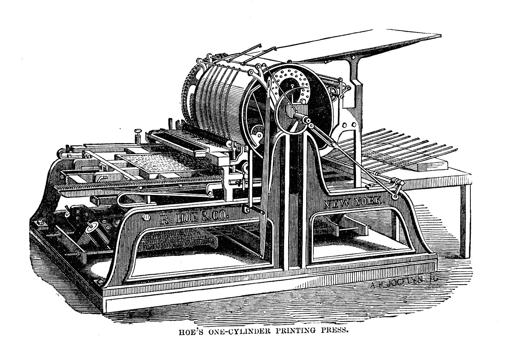
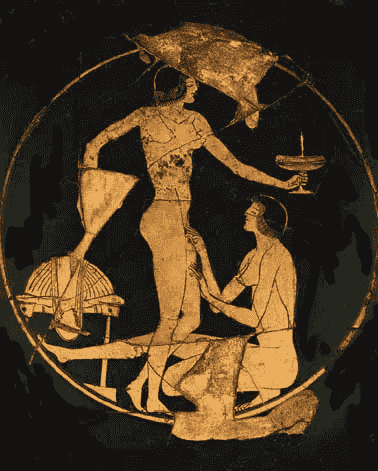

# 为什么色情可能只是 Crypto 的第一个黑仔应用

> 原文：<https://medium.com/hackernoon/why-porn-might-just-be-cryptos-first-killer-app-596cf822ef3f>

*(注:所有链接标注 SFW 和 NSFW。)*

crypto 的杀手级应用是什么？

我已经在 [**中为分散的微信提出了理由，将金钱的交付**](https://hackernoon.com/gamifying-the-delivery-of-money-c55c25cecaee) 游戏化，但这只是一种可能性。这有太多的可能了。这可能是一个老的最爱或一些全新的原创的小转折。然而，我越想越觉得我忽略了显而易见的事实。

有一种人类的原始力量推动着新技术的发展，这种力量是独一无二的:

做爱。

性和科技就像魔术棒和爱情手套一样相伴而生。每当新的通信技术出现时，都是性让它从货架上飞下来。

Gutenberg’s filth enabling printing contraption.

古腾堡给了我们印刷机 50 年后，意大利作家彼得罗·阿伦蒂诺给了我们肮脏的书。一旦我们有了相机，我们就有了色情。1874 年，一名伦敦色情供应商因 13 万张淫秽照片被扫黄队逮捕。

但是性和科技的历史可以追溯到更远。我们倾向于认为色情是某种现代发明。

不是真的。

一旦人们可以绘画或雕刻，他们就绘画和雕刻人们做爱。

我们已经从几乎所有有史以来的文明中发掘出色情艺术。

# 你妈妈不想让你看的希腊陶器

The Island of Lesbos depicted on some ancient Greek Pottery

无论是古希腊人的粗糙陶器(NSFW) 、印度的性饱和庙宇(NSFW) 、难以置信的柔软的埃及人(NSFW) 、都灵的色情纸莎草纸(SFW) 、德川时代的辛辣木刻版画(绝对是 NSFW) 还是金花瓶中的李子(SFW)

迄今为止发现的最古老的画作之一展示了一幅迷幻的壁画，位于庞大的洞穴建筑群的天花板上。28000 年前，土著人证明了我们的大脑中一直有爱(NSFW)。

将绘画或雕塑视为技术似乎有些奇怪，但它们确实是模拟技术。钢笔是工具。纸的发明改变了世界的本质，让我们可以记录思想，而不是和我们在一起。

但是技术也是关于转变和嬗变的。工匠们按照自己的意愿改变物质世界的各种方式给了我们明代花瓶上美丽的蓝色墨水和花瓶本身的瓷器。瓷器是最早的复合材料(SFW)之一，由粘土、长石、骨灰、石英等制成，所有这些都被超高温加热到数千度，使其变成新的宏伟的东西。这是最完美的模拟技术。

随着时间的推移，社会对性的接受或抑制会有增无减。它从关闭到打开，然后再打开。但是对肉体的强烈渴望从未改变。无论力量如何压制我们的本能，火焰永远不会熄灭。人性总有办法。

事实上，对性的彻底压制是一个相当新的现象。早期社会很少将情色意象与其他意象区别对待。

Queen Victoria was not a fan of the erotic arts.

你可以责怪趾高气扬的维多利亚人毁了所有人的派对。

直到维多利亚时代，我们才开始认为露骨的性材料是邪恶的。尽管许多国家禁止某些性行为，但仅仅看裸体照片并没有成为死罪，直到 1857 年，在扫兴的人[扫黄协会](https://en.wikipedia.org/wiki/Society_for_the_Suppression_of_Vice)的坚持下，英国通过了 1857 年[淫秽出版物法案(SFW)](https://en.wikipedia.org/wiki/Obscene_Publications_Acts) 。该法案禁止销售和传播色情内容，并赋予法院没收和销毁这些内容的权力。

随着 20 世纪的到来，越来越多的国家将反性运动提升到了全新的水平，从中国封锁数百万成人网站的“防火长城”到印度，越来越严厉的措施进行打击。在印度，通过 WhatsApp 发送淫秽照片在 T4 是非法的。

但是当我们把人们推得太远时，有趣的事情发生了。

每一个作用力都有一个大小相等方向相反的反作用力。

在过去，色情只是新技术的另一个使用案例，但随着现代世界压制的加速，人们很快转向技术来绕过禁令。

不是对西方民主的渴望，而是 JAV 巨星苍井空(SFW)的激发了中国年轻人用虚拟专用网(VPN)跨越了防火长城。

在二十世纪，色情不仅仅推动了市场，它还创造了市场。

它始于第二次世界大战后，8 毫米家用摄像机进入商业货架。最大的用途之一不是拍摄与家人在公园或后院烧烤的慵懒时光，而是拍摄人们做爱。没过多久，相机商店就开始秘密储备“雄鹿”电影，这推动了电影放映机、屏幕等产品的销售。

1953 年，一位名叫休·海夫纳的年轻企业家花了他一生的积蓄，5000 美元，为《花花公子》创刊号购买了神圣的裸体玛丽莲·梦露的照片。与联邦政府、州政府和地方政府的多年斗争随后以邮局为战场。源于 19 世纪的淫秽法规定通过邮件运送淫秽材料是非法的。但是在 1957 年，最高法院裁定国会只能禁止“完全没有挽回社会重要性”的事情。现在全美国的男人终于可以在他们自己的浴室里看《花花公子》了。

20 世纪 70 年代见证了家庭视频播放器的诞生以及 Betamax 和 VHS 之间的格式冲突。Betamax 的质量更好，但只能保存 60 分钟的视频，而 VHS 看起来更差，但给了人们 3 个小时。索尼控制了 Betamax 格式，他们犯了一个严重的错误，拒绝允许任何成人内容出现在平台上。

结果呢？

到 70 年代末，成人电影占了美国录像带销售的一半以上，尽管播放器的价格高达 800 美元。

哦，贝塔麦克斯死了。

当然，我们都知道真正统治互联网的不是猫，而是色情。[仅 Pornhub (SFW，yes really)](https://www.forbes.com/sites/curtissilver/2018/01/09/pornhub-2017-year-in-review-insights-report-reveals-statistical-proof-we-love-porn/#2aee7e0224f5) 在 2017 年，平均每天就有 8100 万访客(全年 285 亿访客)，有 247 亿次搜索。也就是每分钟 5 万次搜索，每秒 800 次。”

我们已经看到了同样的虚拟现实市场制造力量，Oculus 和 Vive 等昂贵的头戴设备在大预算游戏和改变世界的用例中短缺，但已经看到了与[网站的蓬勃发展，这些网站致力于近距离接触你最喜欢的成人偶像(NSFW)](https://www.vrpornsites.xxx/) 。Okoin 已经将虚拟现实视为通往秘密色情荣耀的道路，[筹集了 3300 万美元(NSFW)](https://okoin.io/#about) 来资助他们的虚拟现实罪恶的分散网络。

但是有一项技术让 sex 成为了主流，这是我们最大的线索，它可能会成为 crypto 的完美突破应用:

电子商务。

Pam and Tommy Lee

当亚马逊在 Jeff Bezo 眼中只是一束微光时，Richard J. Gordon 在 20 世纪 90 年代创建了第一个电子信用卡系统。

他最早的顾客？

x 级娱乐。

戈登从大大小小的零售商那里收取佣金，赚了一大笔钱，包括 1998 年出版了臭名昭著的帕姆和托米·李性爱录像带的大型网站 ClubLove，每个人都想得到它。

今天，这些支付处理商和大型成人网站已经控制了这个行业，收取的费用高得离谱，深深地咬进了艺人的口袋。成人视频网站从受欢迎的表演者那里窃取高达 50%的内容。这比社会化法国的最高税级[还要糟糕，这意味着成年艺人不得不加倍努力才能勉强度日。](https://www.french-property.com/guides/france/finance-taxation/taxation/calculation-tax-liability/rates/)

天啊，有些高利贷者要价更低。

Spankchain logo on some undies.

当然，今天的许多 cryptos 提供的费用是今天的集中式竞争对手无法击败的。 [SpankChain (SFW)](https://spankchain.com/) 希望将交易成本从 50%降至 5%，这意味着如今所有成年巨星的口袋里会有更多的钱被骗走。他们已经[吸引了一群成人世界最耀眼的明星作为代言人(SFW)](https://www.forbes.com/sites/zarastone/2017/10/25/how-spankchain-an-x-rated-blockchain-plans-to-provide-pornstars-with-better-payment-plans/#71090dc23659) ，到目前为止看起来是这个领域值得关注的一个。

但另一个无处不在的特性可能会让色情和加密成为完美的组合:

隐私。

穿上风衣，在雨中偷偷溜到当地的成人影院是一回事，但录像机使人们有可能在自己家里看色情娱乐节目。信用卡让人们很容易从远处看色情电影，但信用卡账单上的一系列交易已经让不止一个丈夫在月底与他的另一半陷入麻烦。

这就是为什么像 [Monero](https://getmonero.org/) 、 [Zcash](https://z.cash/) 和 [ZCoin](https://www.youtube.com/watch?v=aEbawhzhLqM) (都是 SFW)这样关注隐私的密码很有可能构成未来所有色情交易的支柱。在目前的大型网站或新的分散性网站上建立加密支付渠道，将会大大降低高利贷水平的费用。

成人企业尽快转向分散支付还有另一个原因:

公司道德条款。

正如成人巨星贾尼斯·格里菲斯在 SpankChain (NSFW — *标题图片* ) 的博客中写道:

> [“企业可以以任何他们认为合适的理由拒绝我们](https://motherboard.vice.com/en_us/article/nz7b4k/how-sex-workers-get-paid)，包括但不限于[银行](http://www.businessinsider.com/porn-star-chase-bank-accounts-2014-4)和[支付处理器](http://reason.com/archives/2015/07/02/visa-mastercard-refuse-backpage-payments)。”

另一方面，区块链是开放和不可知论者。没有道德权威来监督谁能使用 Monero，谁不能使用它。这使得它非常适合一个每次想开店都面临重重障碍的行业。

但是一次性付款只是冰山一角。

正是加密货币和微交易的可编程性质真正为成人和主流网站开辟了大量新的收入来源。

以广告为例。现在广告是一条单行道。广告商付费给一个集中的网站，用很低的投资回报把他的信息塞进每个人的喉咙。最好的广告往往只能获得几个百分点的点击率和转化率。人们讨厌广告，广告拦截浏览器插件的出现向我们展示了我们有多讨厌广告。

当甚至谷歌，一个建立在广告收入基础上的企业，[在其浏览器中包含一个广告拦截器](https://www.theverge.com/2018/2/14/17011266/google-chrome-ad-blocker-features)，你知道这个世界鄙视当面的广告。

但是如果你的关注得到了回报呢？如果你看广告得到报酬，而你对是否喜欢这个广告的投票真的很重要，那会怎么样？

今天，当你点击一个广告说“不要再给我看这个”时，它很可能会再次出现在你的手机或脸书 feed 上。微支付可以彻底改变这一切，这是注意力经济代币(如 BAT)背后的基本前提。分散声誉银行中的广告声誉将变得越来越重要，只有最优秀、最专注的广告才能获得成功。

Vice Token 似乎已经有了正确的想法，宣称自己是“付钱让你看色情片”的硬币。

像 Vice Token 提出的小额支付在法定货币中是不可能的。这些费用会扼杀任何业务，中央信用卡公司会迅速切断任何每秒发送数千笔小额付款的公司。如果你想建立一个网站，只对观看的视频收取很低的费用，你是做不到的，这就是为什么每月大额订阅主宰了电子商务世界。

这只是微支付的数千种可能性之一。

一个专注于加密的网站可以让人们只为他们想看的视频流付费，而不是支付昂贵的月费。我想到的另一个主意是为和一个明星在一起的确切时间付费，不管是 10 分钟还是 10 小时。

# 分散的性革命

The Summer of Love.

不可能知道我在这里强调的任何成人专用硬币是否会赢得胜利，或者像 Monero 这样的通用支付系统是否会成为未来成人内容狂热分子的默认货币。也许最终会是两者的混合，通用硬币透明地购买较小的硬币，并在后台进行原子互换。

但毫无疑问，分散平台将证明对未来的色情爱好者和表演者来说是不可抗拒的。无论是因为隐私、低费用还是只为人们想要的内容付费，成人娱乐可能会成为密码的完美试验场。

当然，今天成人产业的先锋将很快在不久后成为主流商业模式。

这意味着 60 年代的口号完全错了。

这场革命将由电视转播。

或者至少是流式的。

###########################################

## 如果你喜欢我的作品，请[访问我的 Patreon 页面](https://www.patreon.com/danjeffries)，因为那是我与所有粉丝分享特别见解的地方。顶级赞助人可以独家访问传奇的硬币表 Discord，在这里您可以找到:

*   **来自我和其他专业技术分析大师的市场呼声**。
*   进入**硬币**仅**私聊**。
*   **幕后**看看我和其他专业人士是如何解读市场的。
*   **你还可以独家参加每月一次的虚拟聚会**，在那里我会分享我正在做的一切，让你看看我的幕后工作过程。
*   每次谈话后，我都会有一个问答环节。问我任何问题，我都会回答。

############################################

你也可以在 [**DecStack 停下来，这是加密货币和分散式应用项目**](http://decstack.com/) 的虚拟合作点，在这里你可以接触到多个项目。永远完全免费。只是进来和社交，一起工作，分享代码和想法。通过反馈让你的想法更好。寻找新朋友。见见你的新家人。

############################################

*简单介绍一下我:我是一名作家、工程师和连续创业者。在过去的二十年中，我涉及了从 Linux 到虚拟化和容器的广泛技术。*

## 读者们称我的突破性纳米块小说[、蝎子游戏](http://amzn.to/2gNn04x)、“神经漫游者的第一次严肃竞争”和“黑色侦探遇上约翰尼助记术”

##################

## 最后，你可以[加入我的私人脸书小组，Nanopunk Posthuman 刺客](https://www.facebook.com/groups/1736763229929363/)，在这里我们讨论所有的科技、科幻、幻想等等。

############################################

## 你没有一件[金钱獾 t 恤是有原因的吗？你可能想要一个，因为它们比比特币便宜多了。](https://teespring.com/money-badger)

############################################

对于我的一些最独家的故事和这个星球上最好的实用硬币研究，请查看[**战略硬币**](http://strategiccoin.com/category/news/) **！**

############################################