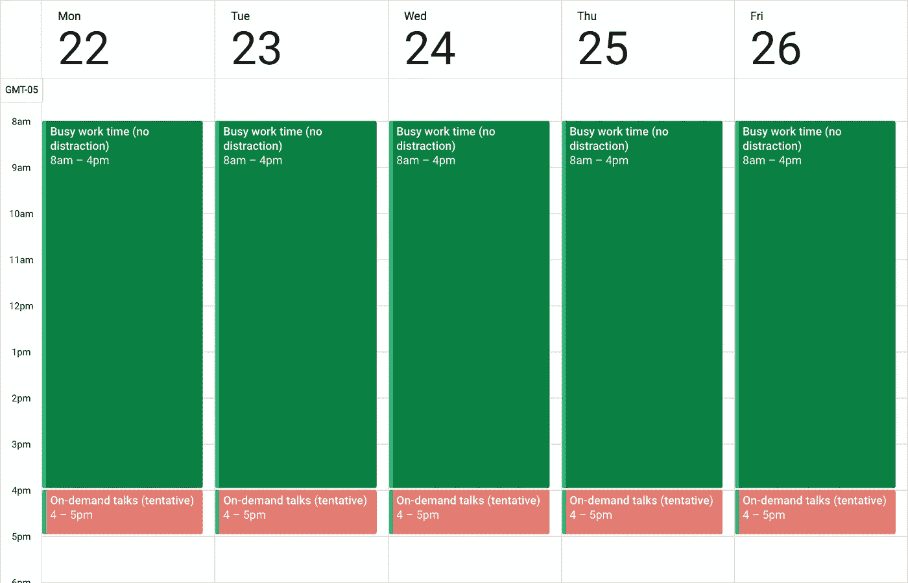

# 为什么程序员不喜欢开会(与你的经理分享这一点)

> 原文：<https://medium.com/hackernoon/why-programmers-dont-like-meetings-share-this-with-your-manager-3cd3c58154cf>

*Photo by Mariano Colombotto*

想象一下，你在空旷的高速公路上全速行驶，突然，你遇到了长达一小时的交通堵塞。你的 8 小时旅程变成了 9 小时。令人沮丧，不是吗？

现在想象一下，回到全速状态是一件缓慢的事情。这至少需要 30 分钟，而不是你希望的 10 秒钟。现在你的行程是 9 小时 30 分钟——比预期长 90 分钟。

额外 30 分钟的原因是任何智力密集型工作都需要[流动](https://en.wikipedia.org/wiki/Flow_%28psychology%29)。心流是大脑工作效率最高时的一种精神状态。一次失败后，回到流畅状态需要时间。

> *进入心流就像在空旷的高速公路上全速行驶。被打断就像碰上了交通堵塞。*

你终于再次全速向前行驶，但随后你又遇到了两次 15 分钟的交通堵塞，每次相隔几个小时。

觉得自己又损失了 90 (15+30+15+30)分钟？不幸的是，情况要糟糕得多。你已经浪费了一整天。

> *进入心流需要很多能量。每一次分心，都会变得更加困难。*

Photo by Jens Herrndorff

这就是为什么程序员和其他做出伟大作品的人不喜欢开会。

我不是建议你应该取消会议。他们对于团队的生产力是绝对必要的。

口头交流是迄今为止最有效的合作方式，但前提是会议时间短，规模小，并且在合适的时间举行。

**短时间的定义是 5-15 分钟。小型的定义是 2-4 人。**

# 帮助程序员做好他们的工作

有两个简单的规则:

1.  **在工作日开始或结束时召开所有会议**。商定一个每天最有效的时间，根据需要用它来进行简短的谈话。对于成员在不同时区的团队，您必须在交叉点上选择一些东西。
2.  **停止安排任何周期性的小组会议。**喜欢每日、每周、每月。周期性会议包含的人数比需要的多，持续的时间也比需要的长。他们也很难找到时间来讨论当下最重要的事情。

这是程序员理想的日历的样子:

Week schedule to maximize the flow state

为你团队中的所有程序员制定这个时间表。你可以忽略所有过时的关于如何举办“伟大会议”的建议。

Gene Podolyak 是 Meetter 的联合创始人，meeter 是一款让你的团队跟上潮流的会议应用。

## 关于此主题的最佳内容

[1] [保罗·格拉厄姆:制造者的时间表，管理者的时间表](http://www.paulgraham.com/makersschedule.html)

[2] [阿尔·皮坦帕利:“在我们下一次见面之前读一下这个”|在谷歌的演讲](https://www.youtube.com/watch?v=Mn-q529ExFw&t)