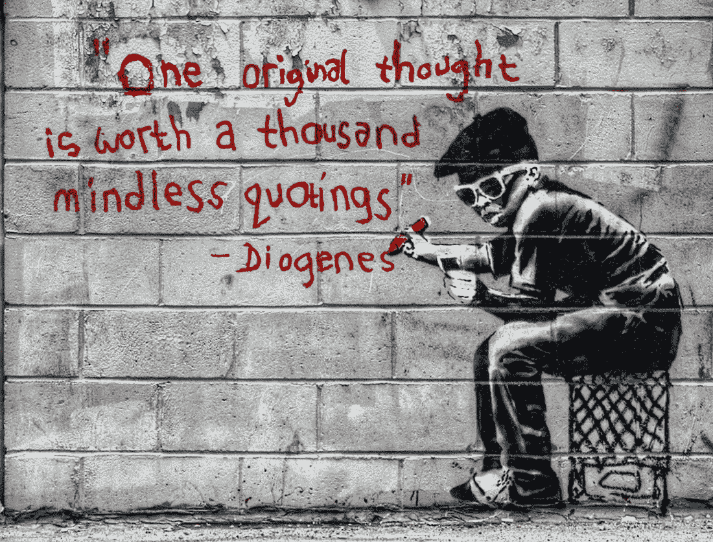
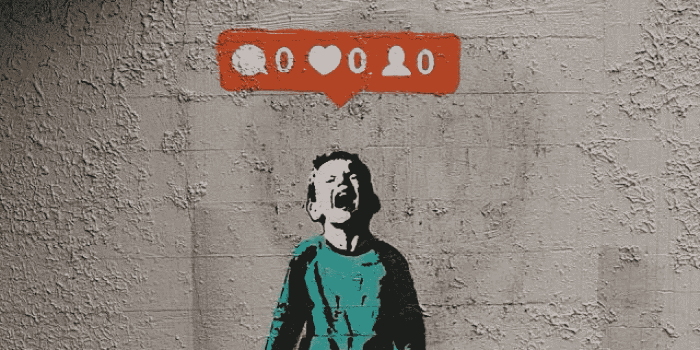
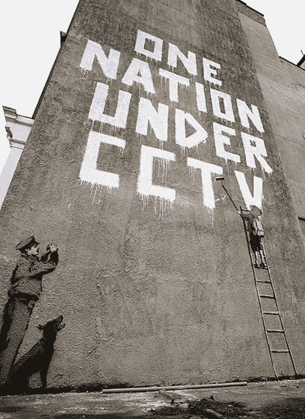

# 为什么假名不应该是一个肮脏的词

> 原文：<https://medium.com/hackernoon/why-pseudonymity-should-not-be-a-dirty-word-cfcc8214ac3b>

It’s harder than you think to find something which conveys pseudonymity without resorting to a hooded figure

如何评价和判断匿名或署名投稿人的意见是一个老生常谈的争论话题，或许 1993 年著名的《纽约客》漫画“在互联网上，没有人知道你是一条狗”可以很好地概括这个话题。25 年过去了，围绕我们在互联网上到底有多匿名的天真可能已经消失，但争论仍在继续。

这一论点在 [crypto](https://hackernoon.com/tagged/crypto) 圈子里尤其突出，可能是由于赛博朋克的起源、财务利益和通常在法律上可疑的野心，因为很大一部分贡献者更喜欢化名运营。

反对[化名](https://hackernoon.com/tagged/pseudonymity)的论点——在本文的其余部分，我将更多地关注化名而不是匿名——可以归结为:

*   如果不把你的论点和你的现实生活身份联系起来，你在游戏中就没那么有面子了，你可以随后抛弃你以前的话，重新开始
*   它阻碍了社区建设
*   正如阿里安娜·赫芬顿曾经哀叹的那样，那些在匿名的掩盖下运作的人是“隐藏的”，因此不具有同等程度的可信度，因为我们无法判断他们是否真的可信
*   这种责任的缺失也鼓励了不良行为，比如钓鱼

除此之外，还有一种不公平的感觉，这种感觉弥漫在许多不使用假名的人身上，因为他们觉得自己没有在一个平等的竞争环境中运作。这种权力动态是不可否认的；匿名是将 IRL 对手置于不利地位的有力工具；IRL 用户所能做的最多就是通过屏幕感到恼火，而匿名对手可以将争论延伸到现实生活中。

然而，所有这些都不是反对假名的好理由——如果有的话，这是一个让更多人接受它以及它意味着什么的理由。

我所看到的所有反对使用假名的论点都忽略了一个事实，即我们中的许多人对假名的依恋与对 IRL 身份的依恋是一样的。事实上，我要说的是，我在网上的用词比我在现实生活中要谨慎得多。在现实生活中，我知道我是一个不错的人；我有一群很好的朋友，一个大家庭，并继续获得有收入的工作。我也知道那些团体明白我的话从来没有恶意。然而，在《笔名》中，我意识到我并没有从这些联系中受益，而且潜在的读者包括许多我以前没有联系的人。

此外，我认为，一个假名演员在很长一段时间内运作，但保留他们所有的作品，比一个乐于将他们的作品与他们的 IRL 联系起来，但随后删除他们的大部分或全部思想的人，表现出更多的信念。这也是为什么我永远不会编辑或删除任何实质性的东西(除非法律规定如此)，而是更喜欢添加后续回复的部分原因。

我的激情一直是历史。人们经常指责这门课程没有为学生就业做好准备，但不可否认的是，它教会了一些核心能力，包括分析来源和内容。因此，我总是对任何作家的动机持怀疑态度。

Crypto 为这种分析提供了许多材料，其动机常常是赤裸裸的。

这种利己主义是许多 IRL 作者专注于一组狭窄主题的部分原因。他们不能承受被暴露为不可知，所以他们坚持他们知道的。这同样与不愿意批评网络中的其他成员有关，即使他们认为他们是一个坏演员。这种攻击可能会引起更广泛群体的负面反应、负面情绪以及——如果没有别的——社交尴尬。出于显而易见的原因，许多人根本不想自找麻烦。这是完全可以理解的，但它提醒人们，缺乏假名可能会导致对冒险的厌恶(尽管一旦成为社区的一部分，假名往往会陷入同样的陷阱——这是一个真正为那些不受社会压力影响的人、匿名或意志极其坚强的人保留的领域)。

不应低估社会压力的影响。这也是为什么许多人选择匿名运营，将他们各自的网络彼此分开的核心原因。有时这是因为在一个社区中会给另一个社区带来影响，通常是因为用户的背景可能会减少他们思想的影响，但其他时候这只是互联网最初运作方式的回归，用户在很大程度上受利益驱动的群体中使用假名。

事实上，直到最近十年左右，互联网才真正从这种模式转向 IRL 驱动的标准。社交媒体的出现，以及接受互联网只是生活的一部分而不是少数人的避难所(网上约会的待遇是最明显的例子)，使 IRL 成为默认。

也许我的成长岁月是作为一个使用假名的论坛的用户度过的，这让我比大多数人更容易接受假名。特别是，我怀疑我对用户名的记忆比对真实姓名的记忆更深。用户名通常是令人难忘和机智的，你可以构建他们背后的人的形象；真实姓名通常是公式化的，并且被我们都携带的行李所拖累。

然而，长期使用假名的人也同样被他们之前的行为所拖累。除了，在这种情况下，行李纯粹是限制他们的话。这就是为什么我永远无法同意马克·扎克伯格(Mark Zuckerberg)的观点，他声称“拥有双重身份是缺乏诚信的一个例子。”正直是通过行动赢得的。我不明白为什么一个人不与一个名字和一张脸联系在一起就不能获得正直；对我来说这不合逻辑。我们都有多重身份。很少有人在所有的社交场合都是同一个人。

匿名导致不良行为的论点，巧合的是，也是许多运营社交网络并能从访问个人数据中获益匪浅的人提出的，同样没有什么分量。当然，也许缺乏问责会导致针对某人的匿名账户被创建——但这不同于假名账户，后者是经过很长时间建立起来的，一旦参与此类行为，他们的卡就会被标记。此外，网络上的不良行为绝不仅限于匿名——快速浏览一下脸书上的任何政治帖子就会发现这一点。

在未来的几年里，我们可能会把这个时代视为 IRL 的高潮。许多人厌倦了他们的数据和身份被利用。各国政府继续出台旨在打击数据共享的法规。也许最重要的是，机器人的广泛使用和改进正在慢慢模糊真假 IRL 之间的界限。

也许随着机器人技术的进步，对一个只有 IRL 的世界的渴望将会结束，以至于照片和名字将会贬值，只有更难伪造的内容和思想的历史将再次占据中心舞台。