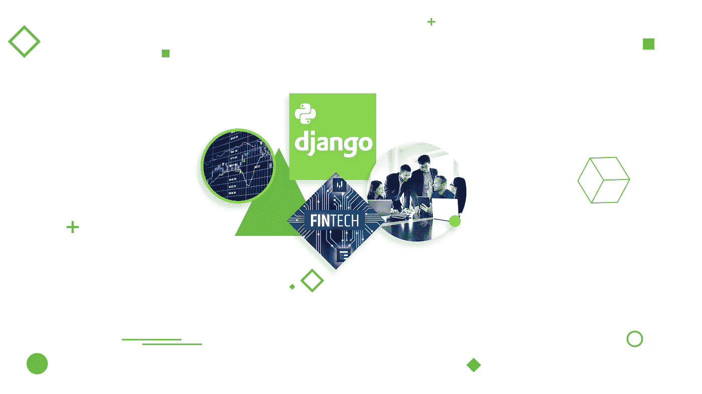
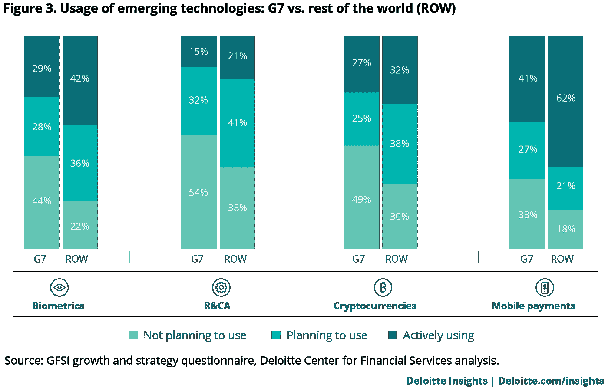
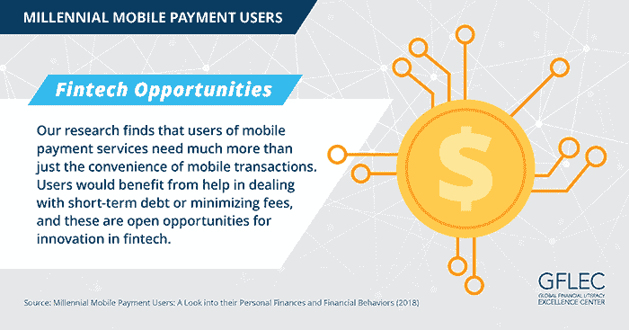
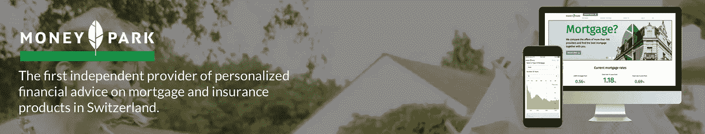
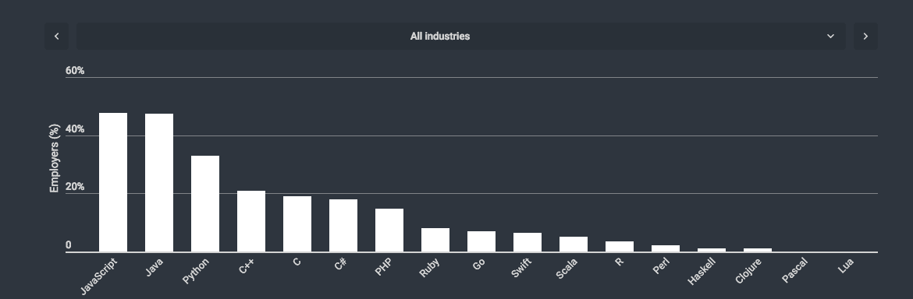

# 为什么 Python 是 Fintech 产品的最佳选择

> 原文：<https://medium.com/hackernoon/why-python-is-the-best-choice-for-fintech-products-64a2eae7b8be>

你是如何在金融科技领域找到出路并保持活力的？这项新技术席卷了整个世界，但是它的复杂性仍然很难与之竞争。首先有国家层面的规定，与不同服务和机构的集成，银行 API 连接等。去处理。第二步是征服最终用户的心和信任——经营金融、抵押贷款、投资等等不是儿戏。为了能够做到这一点，您需要最高级别的安全性、功能性以及与需求的一致性。

> 关于[金融产品](https://djangostars.com/blog/how-to-build-a-unique-technology-for-your-fintech-product-with-python/?utm_source=medium&utm_medium=hackernoon.com&utm_campaign=python%20for%20fintech&utm_content=financial%20products)的文章由亚瑟·巴钦斯基——首席运营官在 [Django Stars](https://djangostars.com/?utm_source=medium&utm_medium=hackernoon.com&utm_campaign=python%20for%20fintech&utm_content=djangostars) 发表。

> [在 **Django Stars 博客**](https://djangostars.com/blog/how-to-build-a-unique-technology-for-your-fintech-product-with-python/?utm_source=medium&utm_medium=hackernoon.com&utm_campaign=python%20for%20fintech&utm_content=read%20full%20article) 上阅读全文。

所有这些基本上意味着你需要一些真正独特的东西——一种提供值得信赖的解决方案的独一无二的技术。显然，你的软件越独特，它的价值就越高。如果没有正常工作和可靠的软件，任何金融风险都会逐渐消失并失去价值。不管背景如何，每个人都希望自己的钱安全。这就是为什么人们在寻找一种持久的金融技术，我想告诉你我们是如何在开发[金融科技产品](https://djangostars.com/industries/fintech/?utm_source=medium&utm_medium=hackernoon.com&utm_campaign=python%20for%20fintech&utm_content=fintech%20products)时通过使用 Python/Django 技术栈实现这一切的。我希望它对你特别有用，因为 Python 已经成为世界上最流行的编码语言。

## 在千禧年金融时代脱颖而出

现代金融世界包含两个仍然共存的世界。这是第一次，千禧一代在掌握非接触式支付、使用网上银行和各种数字金融服务的同时享受生活。他们的新世界是建立在新技术之上的，新技术蔑视老派的官僚主义。

另一个世界属于优秀的传统金融。可悲的是，这是一台极其陈旧和生锈的机器，不能因为一时兴起就停下来。即使它接受了新技术及其对金融的影响，它仍然不认为它是一个威胁，也不认为它是一个有价值的竞争对手。

这种泰然自若的政策只有在 G7 中最发达的国家才能找到——那里有所有的旧资金，也有最多的人准备好运营高科技创业公司。但可悲的是，改变他们的硬壳金融系统将是一个巨大的挑战。

例如，在 2017 年的[统计数据中，德勤展示了 G7 在金融科技方面的习惯，与世界其他地区形成对比。德勤的研究人员指出:](https://www2.deloitte.com/insights/us/en/industry/financial-services/talent-technology-future-of-financial-services-survey.html)

> 令人惊讶的是，关于移动支付，40%的美国高管预计对他们的行业影响很小甚至没有影响。需要注意的是，样本
> 规模相对较小，17 家美国银行中的 7 家(41 %)几乎没有受到移动钱包和其他支付技术的影响，相比之下，36 家非银行银行中的 14 家
> (37%)。

发展中国家呈现出完全不同的景象。由于缺乏强硬的传统金融部门，他们为金融科技的成长和发展提供了更多空间。这反过来又让人们有更多的机会和途径轻松地与发达国家合作，并获得更有保障的报酬。老实说，这是我最喜欢 fintech 的地方——它消除了金融边界！

**新兴技术的使用:G7 与世界其他地区(ROW)**

七国集团可能仍对金融科技持怀疑态度，但科技一直在改变金融。问题是——这个世界上的一切都在快速变化，技术也是如此。它是*灵活的*，它能够*适应*新用户的需求——这正是千禧一代想要的。他们的新习惯、高数字敏感度、数字存在——所有这些都是千禧一代生活方式的一部分，这种生活方式不允许他们浪费任何时间，并要求他们每周 7 天、每天 24 小时都保持高效。这就是为什么他们重视随时随地的财务自由。

为了证实我的想法，这里有一篇由《华尔街日报》撰写的关于移动支付和金融知识的博客。显然，支付的便利性吸引了那些对技术感到舒适并拥有忙碌生活方式的人。移动支付用户大多受过高等教育，有全职工作，主要是男性，在财务上非常活跃。与非用户相比，他们更有可能拥有银行账户、退休账户和/或自有住房，并利用汽车贷款和抵押贷款。

我们能得出什么结论？《华尔街日报》的统计数据显示，移动支付用户比非用户收入更高，他们在金融方面更活跃，也更懂金融，也就是说，他们使用更广泛的金融产品。与此同时，他们对自己的开销更加粗心，也更容易负债。有时，他们甚至可以从自己的退休账户里取钱。这需要一波全新的金融科技简单工具，帮助千禧一代理清他们的资金。尽管收入和教育水平高，但据报道，使用移动支付的千禧一代面临更大的财务困境和管理不善的风险[。](http://gflec.org/initiatives/millennial-mobile-payment-users/)

金融业必须对新的客户需求特别敏感。但在数字颠覆的时代，更是如此。当你的服务变得越来越普遍、越来越有必要时，总会有客户停止使用你的服务的危险。你如何防止这种情况发生？你能不能现在*创造一个产品*经得起时间的考验，然后*以后*服务于千禧一代，当他们长大并开始挣大钱的时候？我的意思是，就像当前金融体系所针对的一代人。像抵押贷款、投资和财富管理这样的分支应该特别谨慎。

这是我回到之前所说的时间。为了生存，为了获得强大的追随者和依赖它的客户，您的技术必须是独特的、坚固的、安全的，并且是根据您客户的需求定制的。在这一点上，它将不可能避免与传统的金融和国家机构的整合。这就是为什么你必须确保合作完美无缺，在后者眼中你是一个可靠的商业伙伴，他们使用你的技术，而不是别人的。或者更糟，创造自己的技术！

## 更多关于 fintech takeways:

 [## 2018 年顶级金融科技外卖

### 在 21 世纪，我们感觉我们终于生活在每个人都在等待的未来，而且…

djangostars.com](https://djangostars.com/blog/top-fintech-takeaways-2018/?utm_source=medium&utm_medium=hackernoon.com&utm_campaign=python%20for%20fintech&utm_content=readmoreaboutfintech) 

我们的客户 [MoneyPark](https://djangostars.com/case-studies/moneypark/?utm_source=medium&utm_medium=hackernoon.com&utm_campaign=python%20for%20fintech&utm_content=moneypark) 就是一个独一无二的技术获得完全回报的很好的例子——以前是一家初创公司，现在是瑞士最大的基于技术的抵押贷款中介。由于他们令人信服的技术解决方案和商业方法，该公司成为 [Helvetia 保险](https://www.helvetia.com/corporate/web/en/home.html)的一部分。

## 阅读 Full Money Park 案例研究:

## Python:金融和 Fintech 的秘密武器

那么，我们需要什么？一项足以承受全球金融动荡压力的技术，但也足以灵活适应新世界的挑战和客户不断增长的需求。至于我们，我们选择在 Python 中使用 Django 框架——事实证明这是一个很好的选择，我们仍在探索这种组合给我们带来的所有可能性。我们并不想向您推销 Python 作为您所有问题的解决方案，但是我们当然知道 Python 对于金融有什么样的优势。

**1。使用 Python/Django 堆栈更快地推向市场。**很简单:使用 Python/Django 栈，你可以很快地构建一个 MVP，这增加了你找到适合你的产品/市场的机会。

fintech 能够与传统银行和金融业竞争和/或合作的唯一方式是适应变化和客户需求，根据客户的意愿提供额外的服务和改进。您的技术必须灵活，并为众多附加服务提供坚实的基础。

Python/Django 框架组合考虑到了 MVP 的需求，并允许节省一些开发时间。它们基本上像乐高积木一样工作——你不需要从头开始开发像授权或用户管理工具这样的小东西。你只需从 Python 库(Nimpy、Scipy、Scikit-learn、Statsmodels、Pandas、Matplotlib、Seaborn 等)中获取你需要的任何东西。)并打造 MVP。

Django 在 MVP 阶段给你的另一大优势是一个简单的管理面板或 CRM——它是内置的；你只需要为你的产品设置它。当然，在 MVP 阶段，产品并不完整，但是你可以测试并轻松完成它，因为它非常灵活。

MVP 完成后，这个技术栈允许修改部分代码。这意味着在您验证了 MVP 之后，您可以很容易地更改一些代码行，或者甚至编写新的代码行，如果这是产品完美运行所必需的。

千禧一代习惯于生活在一个快节奏的世界，并且需要每周 7 天、每天 24 小时保持高效。他们对其他人和他们使用的服务的期望是最大的透明度和高质量的服务。这就是客户开发如此重要的原因——整整一代人都依赖于它。因此，你越早将你的产品推向市场，你就能越快地收集反馈并改进你的产品。金融中的 Python 编程，让你双手背在背后就能做到这一点。

**2。Python 的数学和经济用途。**显然，fintech 离不开数学家和经济学家用 Python 计算他们的算法和公式。像 R 和 Matlab 这样的语言在经济学家中不太常见，Python 成为了金融领域最有用的编程语言，还有数据科学的编程“通用语”[。经济学家用它来进行计算，所以显然将它们与基于 Python 的产品集成更容易。然而，有时即使是用同一种语言编写的代码也很难集成，这就是为什么与你的技术合作伙伴的交流是至关重要的。](/@metjush/4-reasons-why-economists-make-great-data-scientists-and-why-no-one-tells-them-524478845ec2)

**3。更简单的语法—更容易的协作。简单是天才。由于其简单性和易于理解的语法，Python 非常易读，每个人都可以学习它。这就是为什么，在我看来，成为“通用语”只是一个时间问题。Python 的创造者[吉多·范·罗苏姆](/the-renaissance-developer/python-101-the-basics-441136fb7cc3)证实了我的想法，将它描述为*“一种高级编程语言，它的核心设计理念是关于代码可读性和语法，它允许程序员用几行代码表达概念。”***

因此，Python 的好处是不仅对技术专家来说容易理解，对客户来说也是如此。双方参与开发过程的人员对技术的理解程度不同。使用 Python，工程师可以更容易地解释代码，客户也可以更好地理解开发的进展情况。看，这是双赢。

正如《经济学人》对 Python 的评论:

> 这种语言的两个主要优点是简单和灵活。它简单明了的语法和缩进空间的使用使它易于学习、阅读和分享。被称为 Pythonistas 的狂热实践者已经将 145，000 个定制软件包上传到一个在线知识库。这些涵盖了从游戏开发到天文学的所有内容，可以在几秒钟内安装并插入到 Python 程序中。

这就引出了下一点。

**4。Python 的开放库包括 API 集成工具。**由于 Python 的开放库，您不必从零开始构建工具，开发产品并在最短的时间内分析大量数据。如果你处于 MVP 阶段，这可以为你节省很多时间和金钱。
正如我之前提到的，金融科技产品需要与第三方进行大量整合。Python 库使得通过不同的 API 将您的产品与其他系统集成更加容易。在金融领域，API 可以帮助您收集和分析关于用户、房地产和组织的所需数据。例如，在英国，你可以通过 API 获取人们的信用记录，这是进行进一步金融操作所必需的。通过在在线抵押贷款行业使用 API，您可以检查房地产数据并验证某人的身份。最重要的是，您可以通过使用和组合不同的库/包来获得数据或过滤数据，而不必为此开发新的工具。

例如，Django Stars 使用 [Django Rest 框架](https://www.django-rest-framework.org/)来构建 API 或与外部集成，以及使用 Celery 来排队或分发任务。

**5。Python 越来越受欢迎。**根据 [HackerRank 2018 开发者技能报告](https://research.hackerrank.com/developer-skills/2018/)，Python 是程序员接下来要学习的第二种语言，也是金融服务和其他进步行业的前三种语言之一。这很好，因为 Python 将继续发展，让越来越多的专家参与进来，这反过来保证将来有足够的人来开发和维护我们的产品。

> 根据我们的爱恨指数，Python 赢得了所有年龄段开发人员的喜爱。Python 也是开发人员最想学习的语言，而且有相当一部分人已经知道了。— **黑客排名**

Python 的用途比你想象的要多:从 web 开发等传统用途到 AI 等前沿用途。它的灵活性和多功能性令人难以置信，它拥有超过 125，000 个第三方 Python 库，让你像搭建乐高积木一样搭建你的产品。它是数据分析的首选语言，这使得它对商业等非技术领域很有吸引力，也是财务分析的最佳编程语言。

同样，我并不是说 Python 是唯一的出路。我只是在描述我自己的经历，我可以补充一下，相当成功的经历。我看到 Python 在 Django 框架中应用时确实很奇怪。

这就是你在 it fintech 中需要做的——一个非凡的工具，它将使你的产品值得信赖，完全安全和实用。遵守州法规，处理与服务、机构和银行 API 连接的集成，所有这些都需要关注软件的细节和寿命，以支持接管未来的新一代千禧一代。登上顶峰，成为改变金融市场的人，更好的是，成为改变世界的人。独特、高效、面向用户、面向未来。这就是 Python 的全部。

> 如果你觉得这篇文章有用，请点击👏下面的按钮:)