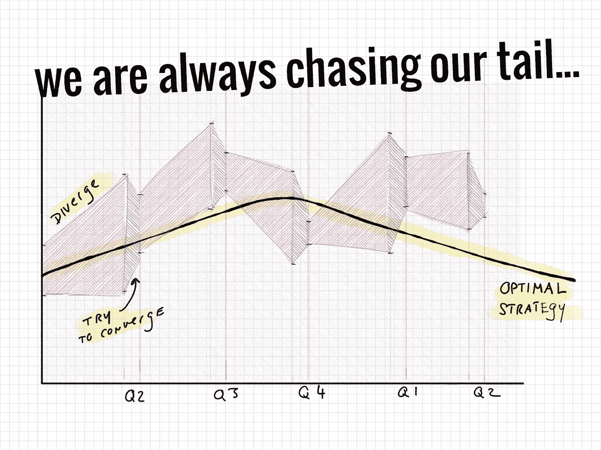
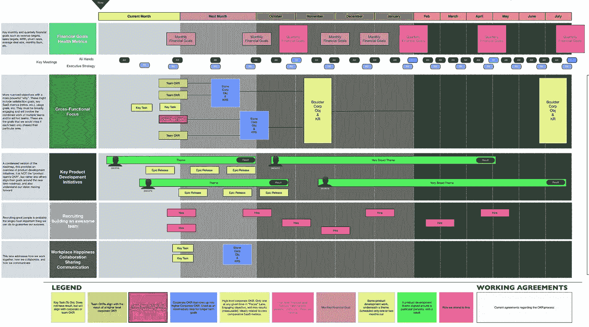

# 为什么是季度 OKRs？

> 原文：<https://medium.com/hackernoon/why-quarterly-okrs-88113e885f56>

你的公司使用季度 OKRs 吗？

他们为你工作吗？

你为什么选择 90.25 天的批量？你的所有目标都需要 90.25 天(或者更准确地说，65 个工作日)吗？你花几天时间为下一季度“重置”？

这里有一个想法…季度 okr 就像季度“冲刺”。一些团队擅长冲刺，但是其他团队更喜欢连续的流程、及时的计划，以及根据需要进行回顾/重新校准。或者[混动车型](https://hackernoon.com/flow-decoupling-cadences-and-fixed-length-sprints-3eac1428ad73)。

> 但是季度规划好痛苦啊！我不想做得更频繁！

也许这是个暗示。[频率降低难度](https://martinfowler.com/bliki/FrequencyReducesDifficulty.html)！或者说得通俗一点…如果疼，就多做几次。也许季度计划之所以有害，是因为它发生得太不频繁(而且是以人为的节奏)。

“漂移”可能太大了…

想象一个连续的计划模型，其中公司有滚动的 6 个月和 12 个月的目标。地平线上的引导点*永远可见。当现实的某个方面发生变化时，这些点也会随之改变。团队处理不同长度的目标/目的——一天、12 天、两个月、四个月——并在必要时重新校准。那样会更好吗？*

> 但是硬币是商业的心脏！

真的吗？商业的方方面面？

好吧，假设你是对的。我想回到将持续的心流与某些有节奏的事件/仪式混合的想法。想象一下，每个团队都有一个连续 12 个月的核心赌注、子赌注和子子赌注图。它总是正确的，并且总是延续到接下来的十二个月。这并不妨碍你每个季度检查一次。但是你把签入和你目标的节奏(或者混合节奏)分离了。

注意这里你可以同时运行各种循环/节奏/触发器。你有财务步调、产品步调、跨职能工作重点、招聘和工作场所快乐流。它们应该都以 90.25 天的节奏运行，还是完全以一种节奏运行？

总之…这些年来，我看到许多团队从推式批处理/固定时间盒模型转向基于连续流的模型。这并不是说固定的时间盒模型在某些情况下是无用的和绝对适用的，而是说替代方案是存在的。我们是否可以将这一点扩展到高级别的公司规划中？

我们似乎把《OKR 季刊》当成了福音，所有的福音都应该受到挑战。

杰森问了正确的问题:

我的回答是，几乎不可能一概而论。90.25 天对你的公司来说可能是完美的，接下来是 60 天，接下来是 30 天，或者接下来是可变长度的周期。在这种情况下，您的组织是独一无二的，您应该定制您的工具。

一般化/强制收敛总是暗示有益的定制和更好地反映现实的机会。