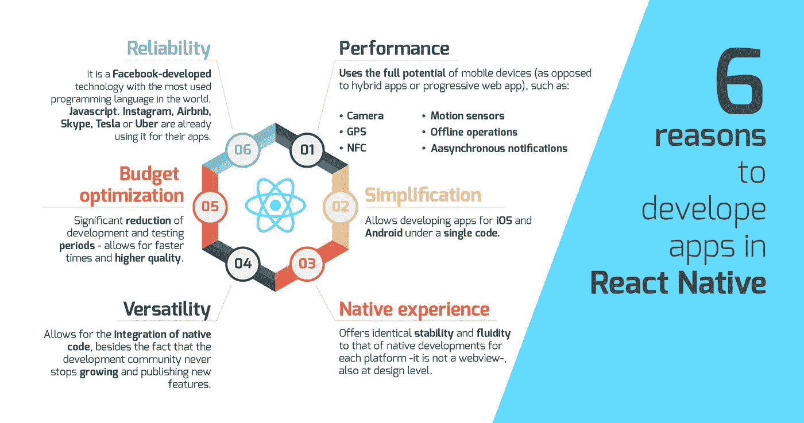

# 为什么反应原生:建立一流的移动应用？

> 原文：<https://medium.com/hackernoon/why-react-native-to-build-top-notch-mobile-apps-ff9053a735e>

Source: Bacancy Technology

> 如果你正在考虑一个新的移动项目，使用 React Native——你不会后悔的。正在为您的项目寻找 react 本地开发人员？
> ***下面是 3 大反应原生优势！***

# 1.大型科技巨头正在使用 REACT NATIVE

查看这篇关于沃尔玛、彭博、Airbnb 和其他大品牌如何利用 React Native 优势的详细文章“迁移到 React Native:知名公司的顶级案例研究”。

***下面是 React Native 的几个优点:***

# 生产力:

*   95%的代码库在 iOS 和 Android 之间共享；
*   不需要知识共享，因为每个功能都由一个团队实现。

# 代码共享:

*   前端/展现代码可以在 iOS 和 Android 之间共享；
*   业务逻辑也可以与 Web 应用程序共享；
*   平台间大量代码的可重用性。

# app store 批准:

*   无需经过 app store 审批流程。您可以在自己的服务器上托管这个包，并进行无线更新。

# 上市时间:

*   非常快；
*   您可以控制发布日期；
*   两个平台可以在同一天同一个时间发布。

# 性能:

*   React Native 提供了与 Native 几乎相同的性能。

# 动画:

*   React Native 提供了极其流畅的动画，因为代码在渲染之前被转换为本机视图。

# UX:

*   您可以拥有特定于平台的 UI 设计。

# 自动化:

*   相同的自动化套件可以在 iOS 和 Android 上运行。

# 2.世界上最流行的编程语言

React Native 是用 JavaScript 写的。根据[Stack Overflow Developer Survey 2017](https://insights.stackoverflow.com/survey/2017#technology)(主要来自美国的 36，625 份回复)，JavaScript 连续第五年成为世界上最常用的编程语言。

# 3.最流行的移动应用程序开发跨平台框架

开发者体验超赞。与传统方法相比，React 开发人员在开发过程中获得的反馈要快得多，因为他们不需要重启打包程序来查看每一个微小的变化。使用 React Native，可以为 Android 和 iOS 开发移动应用程序。

Sources: Google.com

当你想为你的创业公司开发一个移动应用程序时，你脑海中会浮现出许多为你的企业开发一个移动应用程序的选择和想法。这种情况会不断出现，直到您获得最令人信服的解决方案，满足您的业务目标、需求和偏好。

**一般来说，有 3 种方法可以构建手机 app:**

1.原生 App 开发
2。混合 App 开发
3。移动网络开发

并且，匿名选择一个就像从所有的帽子中挑选一样。让你不安的最常见和挥之不去的想法是:

*   去哪个站台？
*   开发方法
*   是将项目外包还是内部完成……清单还在继续

在这个被尖端技术和按需移动应用包围的世界里，是时候开始利用移动市场了。今天，用户已经在智能手机中使用了几十个应用程序。在这种情况下，您可以向他们展示哪些令人印象深刻的东西，提供最佳性能并与他们的移动操作系统无缝集成？
嗯，答案就在——*React 原生 App 开发服务*。

## 为什么 React Native 正在积极改变移动应用程序开发的规则？

让我们看看如何应对移动应用程序开发方式的本机变化。

*   **多平台支持:**因此，应用程序开发人员可以共享相同的代码库，而不是在 Swift 和 Java 中构建并行代码库。React Native 无疑减少了交叉兼容性挑战，并利用了出色的用户体验。
*   **尝试 web 应用:**
    如果你想观察一下 react native 实际上是如何工作的，你绝对应该尝试一下 Web 应用。它允许应用程序开发人员重用使用 React Native 编写的 web 应用程序的代码。因此，开发了网络应用的公司可以使用他们的网站前端，并将其转换为移动应用。拥有 web 应用程序的公司可以使用其网站的前端，并转换到移动应用程序。
*   **确定不同平台的需求:**
    在跨平台应用程序开发中，开发人员在硬件、操作系统、编码语言等方面面临诸多挑战。React Native 进行了严格的测试，确保您在多个设备上构建的功能在各自的操作系统中清晰呈现。
*   **避免平台之间的移植:**
    由于 Android 和 iOS 都有不同的界面，使用 react native，在 Android 中开发的应用程序可以在几周内轻松部署到 iOS 中。它大大减少了转换时间，使开发者更容易广泛使用硬件。

> [**更多选择 React 原生 App 开发的理由**](https://belitsoft.com/react-native-development/advantages) **:**

Source: Bacancy Technology

> **下一个 App 开发项目是否强烈推荐使用 React Native？**
> **是的，为什么不呢！**

# **结论:**

在开始使用 React Native 之前，这些优点和缺点都值得考虑。要全面了解该框架，请查看我们的代码并雇佣 React 本地开发人员。