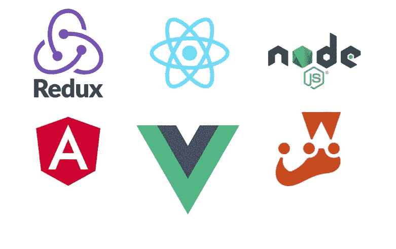
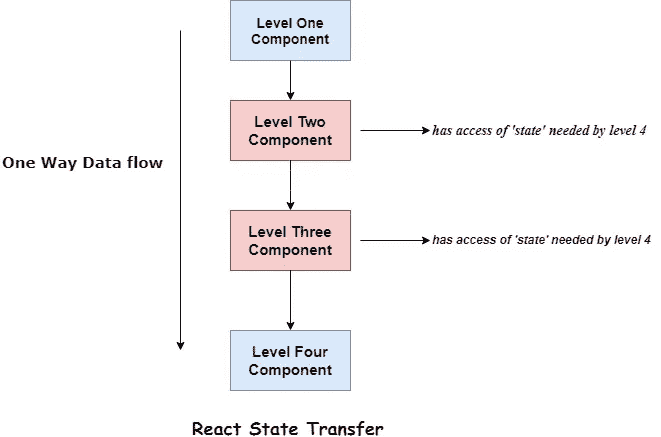
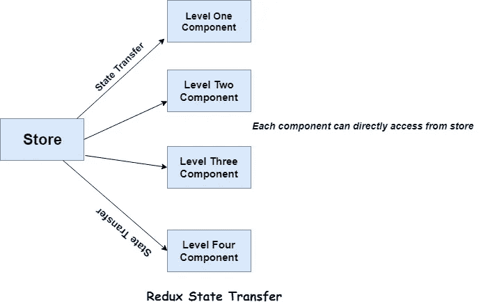

# 为什么是 Redux？

> 原文：<https://medium.com/hackernoon/why-redux-cbfc6fc5f788>

在这个 web 开发的世界里，每天都会突然冒出一个新奇的流行词，我们想要学习它，因为我们是一群好奇的人(或者我应该说“因为我们想听起来很酷”)。是的， [Javascript](https://hackernoon.com/tagged/javascript) 伙计们，你们感觉到我了吧。

所以，像所有其他 Javascript 开发人员一样，我从 VanillaJs 开始，在这个过程中，我开始了解 jQuery，作为一个“好奇”的人，我从它开始，直到我完成它，我听说了 AngularJs(听起来**很酷**，对吗？)于是我就学会了然后来了 Angular2，跟 Angular1 一点关系都没有(像这些家伙到底在想什么)。

然后有人跟我说了 React(听起来比 Angular 酷多了)所以我决定去学。然后在这个学习反应过来的过程中，我听到了 [**REDUX**](https://hackernoon.com/tagged/redux) (多么 dope 的一个词吧？我们也学学吧)。

我想说的是，我们应该意识到框架或库为我们提供了哪些功能，而前者没有，然后决定我们是否要使用它，而不是开始学习它，因为它是一个新的时髦词。所以让我们看看，为什么我们需要 Redux。

**我们为什么需要 redux？**

在回答这个问题之前，我们需要回答另一个问题:

【react 失败在哪里？

**react 有哪些缺点让开发者使用 Redux？**

在组件之间的**状态转换时 React 失败。react 中组件之间的数据传输相当混乱，因为很难跟踪数据来自哪里(哪个组件)。如果一个人在处理大型复杂的应用程序，事情会变得非常复杂。**

react 的另一个问题是，不必要的数据被传输到组件中。见上图(一级相当于单父子关系)，一个*状态*从**第一级组件**要向下传递到**第四级组件**。让我们先看看这是如何反应的，稍后我们将看到 Redux 将如何处理它。

我们知道，在 react 中，有**单向数据流**。React 会将数据从第一级组件传递到第二级组件，然后传递到第三级组件，最后传递到第四级组件。这不是一个好的方法，因为数据或状态被传递到第二和第三级组件(不需要那个特定的状态)。所以这就是 react 失败的地方。

好了，我们来回答前面的问题:- **为什么需要 Redux？**

redux 做的就是，解决这个‘状态转移问题’。在 Redux 中，我们将所有状态存储在一个叫做 **store 的地方。**因此，当我们看上述将状态从一级组件传递到四级组件的问题时，它变得很容易，因为所有的状态都存储在**存储器**中，四级组件可以直接从存储器中访问所需的状态(见上图)。不用担心数据是从哪里来的，因为**商店**是事实的唯一来源。清晰的代码、容易的状态访问、容易的状态转移是 Redux 的主要优点。

尽管如此，我还是不推荐使用 Redux，直到*状态*在你的应用中变得太难管理。

到目前为止，我们知道为什么我们需要 redux，在我接下来的文章中，我将介绍 redux 的核心概念，一些 Redux 代码，以及如何在自己的项目中使用它们，成为一个酷孩子。