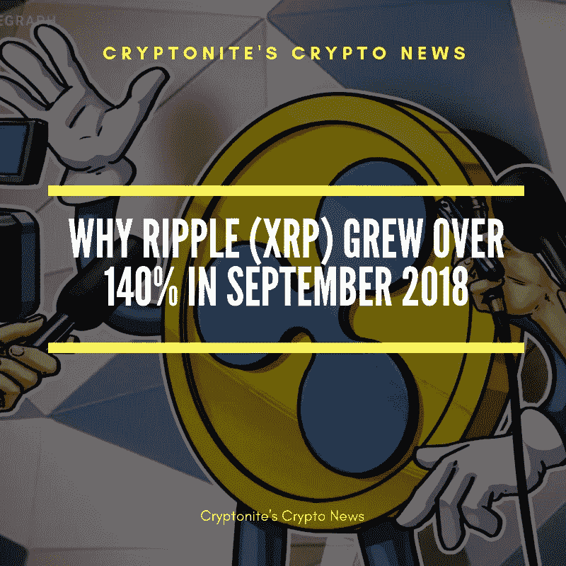

# 为什么瑞波(XRP)在 2018 年 9 月增长超过 140%

> 原文：<https://medium.com/hackernoon/why-ripple-xrp-grew-over-140-in-september-2018-9b1a37fb1cb6>

## 在 24 小时内，XRP 的价格飙升超过 50%，这背后有一个很好的原因

从 9 月 20 日到 9 月 21 日，XRP 的价格在短短 24 小时内上涨了 50%以上，然后继续增长到 140%以上。这是有原因的。

Ripple 亚太和中东地区监管关系负责人 Sagar Sarbhai 在美国消费者新闻与商业频道宣布，Ripple Labs 即将发布一款产品，该产品将帮助银行加快使用 XRP 的交易速度。

以下是萨加尔·萨巴伊对美国消费者新闻与商业频道的评价

> *“我非常有信心，在接下来的一个月左右的时间里，我们将在生产中发布产品，届时你会看到一些好消息，”*

一个工作产品的时间表可能是*一个月*，投资者争先恐后地进入。

然而，根据 Ripple Labs 的说法，尽管 Sagar Sarbhai 发表了声明，Ripple 的产品还没有正式的商业发布日期。

所以几个月似乎更现实，可能是 1-3 个月或者 2019 年初。

有问题的产品是 xRapid，它本质上是不同全球货币之间的桥梁。这将使银行和支付提供商以更快的速度处理跨境交易。

根据 Ripple Lab 首席执行官 Brad Garlinghouse 的说法，到 2019 年底，“数十家”银行将使用 xRapid。

**xRapid 的潜在能力**

因为 xRapid 将使用 XRP 来加速交易，所以这里有一些我们可以期待的特性。

**4 秒跨境交易:**

XRP 的交易时间很快，XRP 的交易大约需要 3-4 秒钟处理。

**零头交易费用:**

XRP 的交易费用非常低，XRP 区块链上的一笔交易费用不到 1 美分，每笔交易 0.004 美元(不到 1/2 美分)。

**x rapid 协议的广泛采用:**

由于 Ripple Labs 与 100 多家银行合作，我们可以预计 xRapid 产品将被大规模采用。

与 Ripple Labs 合作的银行包括美国银行、瑞银集团、渣打银行、巴克莱银行、摩根大通、桑坦德银行和美国运通。

**安全性提高:**

XRP 的区块链通过将每笔交易添加到不可更改或改变的公共分类账中，增加了交易的透明度和安全性。

此外，由于 XRP 交易是点对点的，因此不存在中心故障点。

**最终想法**

Ripple 看到了价格的大幅上涨，因为他们宣布了 xRapid 产品的发布，没有多少加密货币有自己的工作产品，所以这可能会让投资者兴奋。

最近，Ripple (XRP)被添加到一些基于现金的交易所，如[**【CEX】**](https://goo.gl/hTJMcX)，允许投资者直接购买加密货币，这降低了准入门槛。

一个实际上*需要*加密货币的工作产品，以及更容易进入 XRP 都是有助于 Ripple 持续增长的因素。

## 我希望你喜欢我的故事，请随意查看下面这些有用的资源:

您可以在世界任何地方使用 [**CEX**](https://cex.io/r/0/up106280379/0/) 购买比特币、以太坊、Ripple、比特币现金、Dash、比特币黄金、恒星流明等等

您可以使用 [**BitPanda**](https://www.bitpanda.com/?ref=3127933809251797450) 在欧洲任何地方购买比特币、以太坊、IOTA、OmiseGo、EOS、比特币现金、莱特币等。

可以跟上我上 [**推特**](https://twitter.com/CryptoniteTweet) 和[**中**](/@cryptonitecj900) **。**