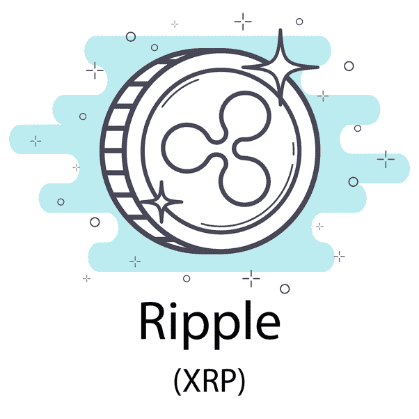

# 为什么 Ripple (XRP)仍然是一个很好的加密货币投资

> 原文：<https://medium.com/hackernoon/why-ripple-xrp-is-still-a-great-cryptocurrency-investment-for-2018-4c86ee83bc59>

## Ripple 在 2017 年爆发，这就是为什么我认为这个节目还没有结束

由于我们目前正处于熊市季节，许多加密货币的市值遭受了巨大打击，从而影响了它们的价格。

这并不一定意味着加密货币已死，尤其是像 Ripple 这样的项目。

市场总是有起有落，跌势是意料之中的，尤其是那些受到广泛投机的新兴技术。

## **涟漪/XRP**

Ripple 背后的技术实现了几乎即时和几乎免费的交易。除此之外，Ripple 还与全球 100 多家银行建立了合作关系，其中瑞银和桑坦德是目前使用 Ripple 的两家银行。

## **涟漪/XRP 担忧**

有传言称，由于 Ripple Labs 持有大量 XRP，Ripple 将被集中，但事实并非如此:

*   XRP 是在“托管”中持有的，这意味着 Ripple 实际上并不持有 XRP 本身，它存储在区块链分类账中，并将由于分类账机制而逐渐释放。
*   每月将发行一定数量的 XRP，上限为 10 亿 XRP，这将在 55 个月内完成。
*   这样做是为了确保 XRP 有一个可预见的流通供应量的增加。例如，许多加密货币，如比特币和以太坊，并没有全部流通，其余的需要“挖掘”。有了 Ripple，硬币被释放，因为不需要矿工来支持网络。
*   即使 Ripple Labs 作为一家公司失败了，XRP 仍将作为一种加密货币存在。这进一步表明，XRP 是分散的，因为没有一个政党或组织控制它。

## **涟漪/XRP 的展望**

在我看来，Ripple 只是刚刚起步，而且 Ripple 的价格自 2017 年 1 月以来已经增长了 80 多倍。

在调整期间，金价稳定下来是很自然的事情。

Ripple 也被添加到更多的法定(现金)交易所，例如，****CEX 就将 Ripple 作为他们提供的加密货币之一。如果基于现金的交易所对加密货币表现出兴趣，那就说明了很多问题，尤其是在熊市期间。****

## ******最终想法******

****Ripple/XRP 仍然有增长的空间，他们有一个令人印象深刻的合作伙伴名单，这个项目背后的团队有风险投资的支持，所以看起来许多人都有兴趣看到 Ripple 成功。****

****如果 Ripple 能够实现其成为全球银行首选转账系统的目标，那么我认为 Ripple 至少可以保持其作为第三大最有价值加密货币的地位。****