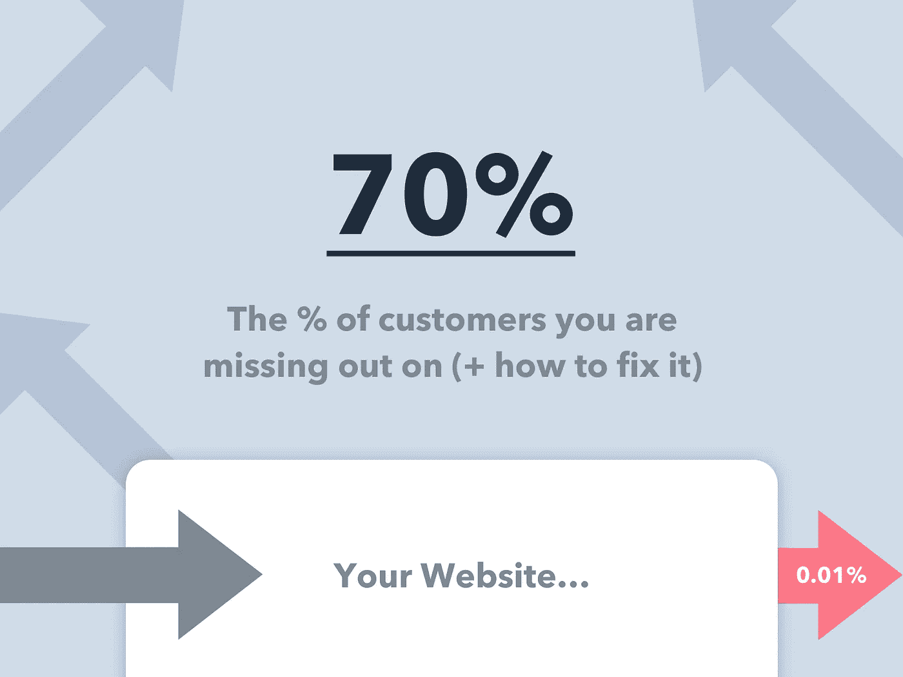
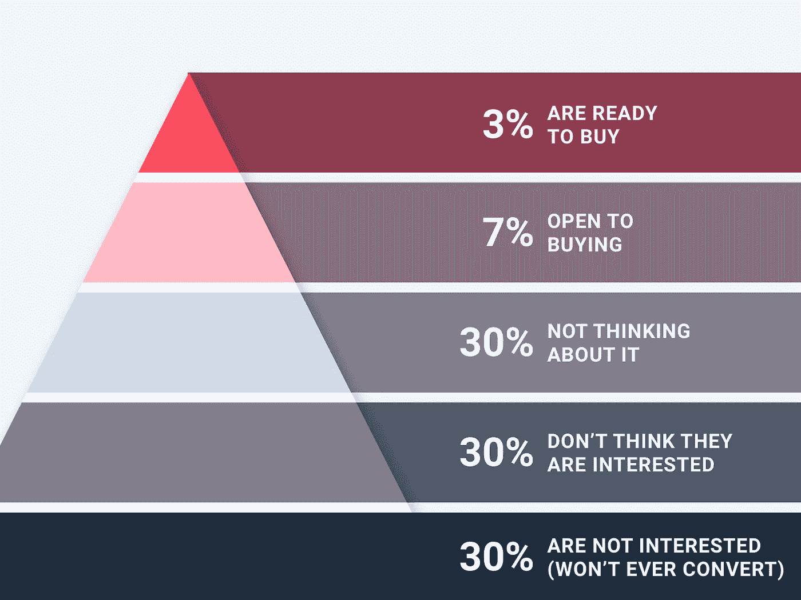
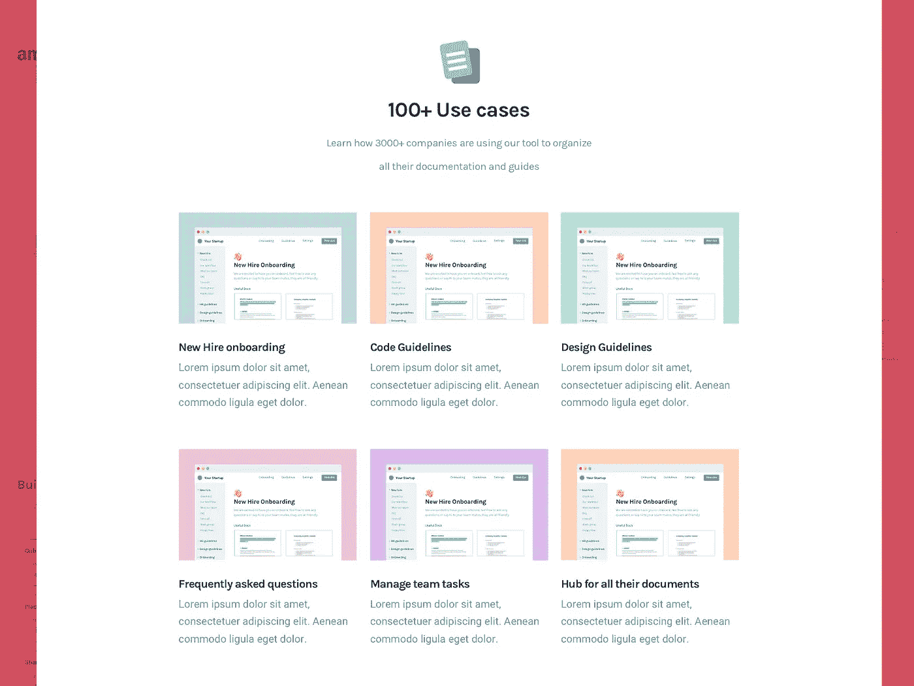
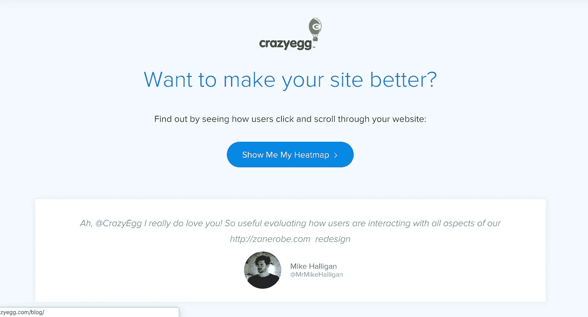
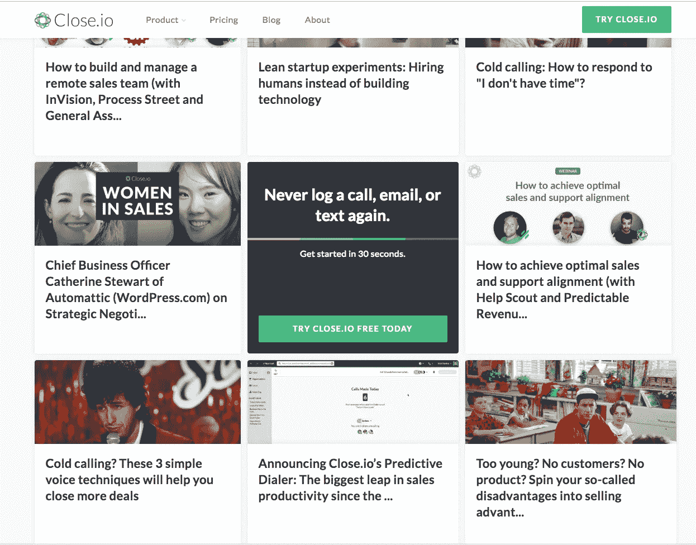
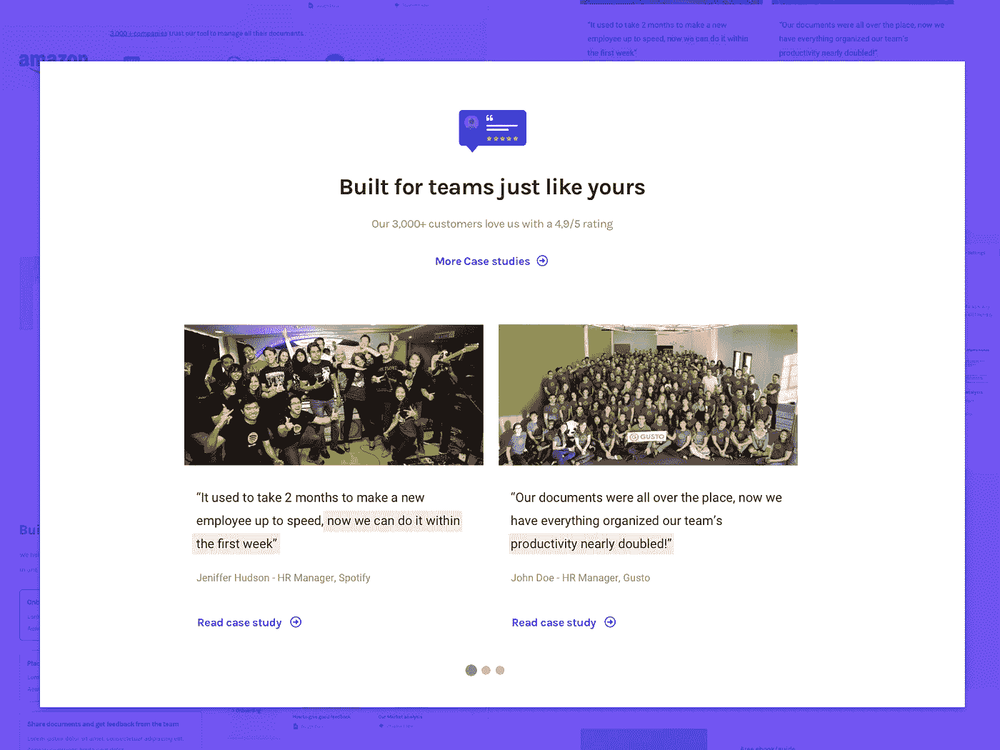
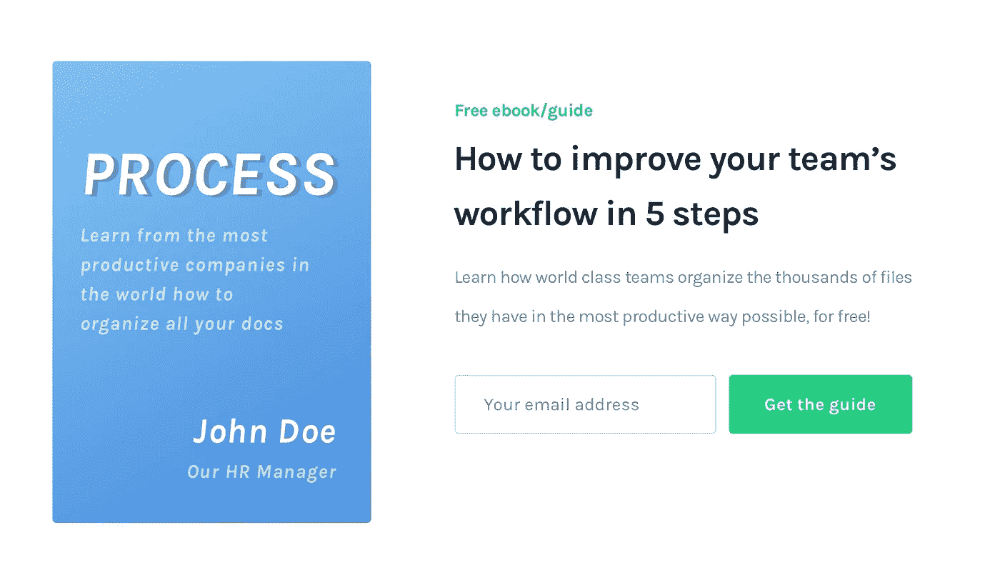
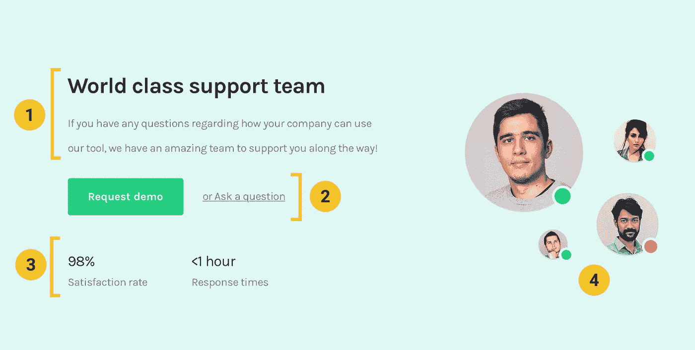
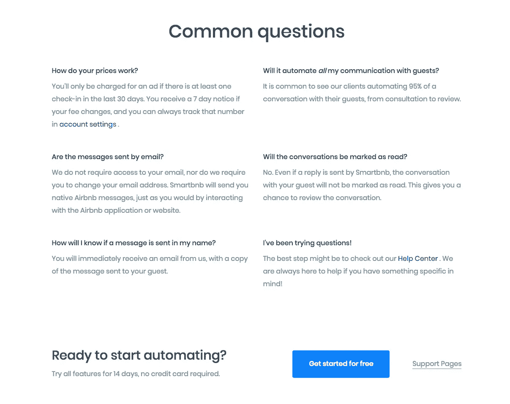
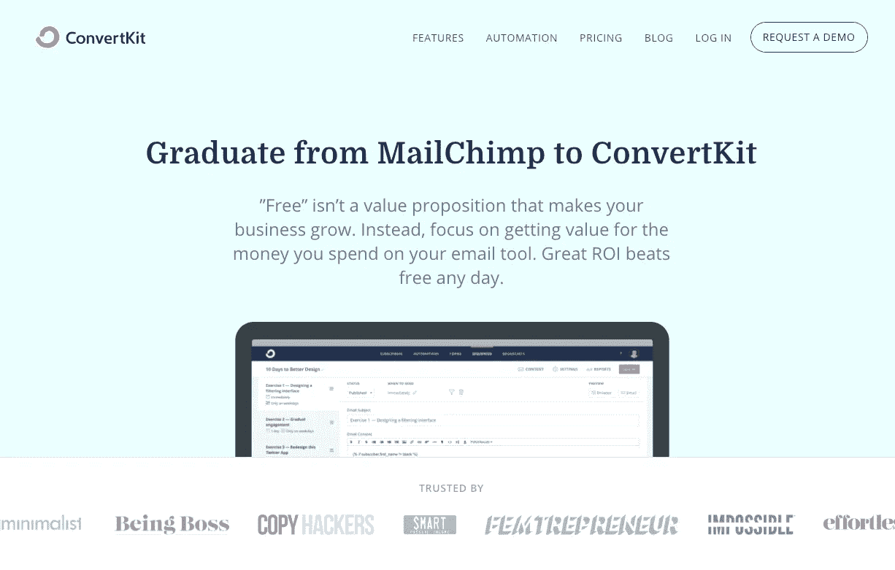

# 为什么 SaaS 的创业公司错过了 70%以上的转化率(+如何解决)

> 原文：<https://medium.com/hackernoon/why-saas-startups-are-missing-out-on-70-of-conversions-how-to-fix-it-11bd59770844>

大多数创业公司都希望有一个[登陆页面](https://hackernoon.com/tagged/landing-page),神奇地让大量访问者了解他们提供的价值，并在理想的时间立即转化…

从来都不是这样！

你看，我认为公司对他们的网站有错误的期望。**如果他们认为人们应该马上改变信仰，他们最终会寻找永远不会奏效的策略！** ‍

大多数人只是没有准备好立即转换，所以你的网站应该是一个可预测的系统，无论在短期还是长期，都可以转换访问者，不管他们处于什么阶段。

在这篇文章中，我将向你展示**为什么你错过了 70%的潜在客户**，而这些客户最终是可以转化为客户的！

# 为什么有些人容易改变信仰，但大多数人却不容易

很有可能你的网站上有一些人，他们非常容易就转化了你。

这些人和你的其他访客有什么不同吗？你应该期望大多数游客也这样做吗？

不要！你只是在购买周期的不同阶段得到了它们。

让我们把购买金字塔作为一个简单的例子来看…

Buyer’s pyramid applied in SaaS Websites :)

正如你所看到的，只有大约 3%的人准备购买，这在你的网站上没有什么不同！

最有可能的是，这是你目前唯一试图转化的人，显然这不足以维持健康的增长率。

这些人只需要明白，你可能会解决他们的问题，并得到一个行动的呼吁，以转换。

但是你猜怎么着？这是不可扩展的，而且肯定不会经常发生！

为了给你的网站带来适当的收入，你需要将冷流量转化为愿意购买的人(也就是让他们最终成为那 3%)。 **‍**

> ***相关文章:*** [*为 SaaS 交通温度优化登陆页面。*](https://www.cortes.design/post/optimizing-for-traffic-temperature-in-saas-landing-pages) *‍*

 [## 优化 SaaS 登陆页面的交通温度

### 这些人对你的产品、你的公司或者你如何解决他们的问题一无所知，而你可以…

www.cortes.design](https://www.cortes.design/post/optimizing-for-traffic-temperature-in-saas-landing-pages) 

# 买家周期的 4 个阶段

正如你在买方金字塔中看到的，这一点也不复杂，但也不容易实现。

你的潜在客户(也就是你的访客)只有 4 个阶段。

我们的目标是围绕这些阶段建立一个网站，这样你就可以在自动驾驶仪上对不同阶段的人进行划分、资格认证和转换。 ‍

在接近 3%的阶段，人们更容易转变，但这不会给你带来成千上万的新客户，而这正是成功公司掌握的东西。

你走得越高(离准备购买的距离越远)，就越难转化，但你能瞄准的人也就越多。

但是…要小心！如果没有适当的经验，你可能会得到一个模糊的信息，最终没有人会接受。 **‍**

**让我告诉你如何在每个阶段改变人们。** ‍

# 第一阶段——他们认为自己不感兴趣

这些人并不完全理解你的产品如何解决他们的问题，所以在你提供的和他们认为能真正解决他们问题的东西之间存在脱节。

# 如何转化这些人:

## 展示您产品的使用案例

这是一个简单的方法，让他们想象自己使用你的产品，并(自己)意识到他们可以用它来做什么。

如果他们自己明白这一点，这比你试图向他们推销一堆他们(还)无法联系到好处的功能要有力得多。

Use cases — [full breakdown of this page here](https://www.cortes.design/post/breaking-down)

> ***相关文章:*** [*分解一个转化驱动 SaaS*](https://www.cortes.design/post/breaking-down)*[*登陆页面*](https://www.cortes.design/post/breaking-down)*

* [## 打破旨在获取更多线索的 SaaS 登录页面

### 在这篇文章中，我将向你展示我是如何设计一个概念页面来捕捉线索的，在这种情况下，它是…

www.cortes.design](https://www.cortes.design/post/breaking-down) 

## 为他们提供价值

这通常是一些内容营销的形式，如文章、视频、指南等…

这里的想法是将它们发送到一篇文章中(例如),并围绕您的产品所解决的问题提供价值。**这做了 3 件事:**

1.  创造信任，因为你已经提供了价值而不要求任何回报。
2.  它开始在解决他们的问题和你的产品之间建立联系。如果他们浏览你的主页，他们可能会以不同的(更好的)方式看待你的产品。
3.  这些人中的一些人会回来寻求更多的价值，直到你把他们送到购买过程的下一个阶段。

这里有几个例子:‍

Notice the CTA at the end of the article

CrazyEgg 在每篇文章的结尾都有机会了解 Crazy egg 解决了什么问题，通过吸引人们关注与他们解决的问题相关的内容，他们有一个很好的方法来产生一些线索。

There’s a CTA to for a free trial on their blog along with several lead magnets all over their website.‍

‍**Close.io**——steli(创始人)在创业界被视为“销售/冰冷的电子邮件家伙”,因为他提供了惊人的内容，当应用时，你会需要一个 CRM，猜猜看……这正是 close . io 提供的。

他们能够解释如何解决销售问题，并让人们意识到他们可以使用他的产品来解决问题。

# 第二阶段——还没想好

在这个阶段，他们对你的产品(或类似的产品)有了更多的了解，但是在他们看来，它似乎没有解决足够大的问题，或者根本不是优先考虑的问题。

从本质上讲，这些人没有购买或试用你的产品的紧迫感，所以他们只是“逛逛”,没有采取行动，也没有成为顾客。

# 如何转化这些人:

## 结果/证明

展示结果和证明会让他们好奇，想知道你解决了什么问题，你能产生什么结果。

这让他们更加信任你的产品，甚至有希望引发一些 FOMO 让他们采取行动。

## 个案研究

这与使用推荐非常相似，但你可以将它们与一篇有价值的文章一起使用，让它们更有吸引力。

## 用例(再次)

根据一些人从一个阶段到另一个阶段的难易程度，用例部分可能是促使人们采取行动或者至少找到更多关于你的产品的方法。

## 铅磁体

example of a Lead magnet as a secondary CTA — [full breakdown here](http://www.cortes.design/post/breaking-down)

这可能是最好的一个，因为你会得到他们的联系信息，以换取一些有价值的东西，你可以提供给他们。如果你定位正确，对电子邮件营销略知一二，你应该能够跟踪这些人，直到他们最终转变。

## 利用广告重新定位

这些人以前看过你的提议，但现在还不是转变的时候。

你可以使用广告来“跟进”他们，并把他们发送到特定的页面，如销售线索磁铁、联系表格或任何可能引起他们兴趣的内容。如果您通过这种方式获得了他们的联系信息，您可以免费与他们联系！

# 第 3 阶段—开放购买

这些人非常接近从你这里购买，他们只是需要一些额外的信息，然后才准备转换。

这也是很常见的，这些人有一个异议，你没有在你的网站上回答，这阻碍了他们。你可以在下面找到一些改善的方法。

# 安排演示

Using a demo to capture more leads [— Full breakdown of a SaaS Landing page here](http://www.cortes.design/post/breaking-down)

如果人们需要一些帮助或有一些问题，安排一个演示是让他们大多数转化为客户的快速有效的方法。

这对高价的 T2 SaaS T3 来说是理想的，但对喜欢低接触方式的公司来说不是很好。

无论如何，在一个公司的早期阶段，有能力安排演示将提供大量的关于页面上缺少什么以及如何改进它以获得更好的转化率和获得更多客户的见解。

# 促销/特别优惠

制造一些紧迫感并让他们采取行动的好方法。这在 SaaS 世界并不常见(或实际),但取决于你的产品，这可能是一种选择。

# 常见问题解答

Faq in the Pricing page (from a client project)

由于这些人还没有转化，因为他们有一些异议没有得到答复，那么将他们发送到 FAQ 页面可能是一个让他们转化的好方法。

如果您首先知道这些异议是什么，并且像我之前提到的那样，您将从演示或与客户的销售电话中获得大部分这些见解，这将是最有效的方法。

> ***相关文章:*** [*如何找到一条最能转化你的 SaaS 登陆页的消息。*](https://www.cortes.design/post/use-this-process-to-identify-which-message-will-make-your-saas-landing-page-convert-the-most)

 [## 使用此过程来确定哪条消息将使您的 SaaS 登录页面转换最多！

### 在这篇文章中，我将向你展示我开发的过程，使我能够把 4-5 页的功能列表，针对 160+…

www.cortes.design](https://www.cortes.design/post/use-this-process-to-identify-which-message-will-make-your-saas-landing-page-convert-the-most) 

# 专题页面

他们可能会担心你是否有某种他们离不开的特征。如果他们知道这个功能，他们会准备试用你的产品。

# 设置/集成页面

Convertkit.com trying to convert people that are currently using Mailchimp

人们可能想知道你的工具安装或使用起来有多容易，因为最大的承诺可能不是购买你的产品，而是从一个产品跳到另一个产品，甚至是集成一个他们离不开的工具。

# 第 4 阶段—准备购买

你不必在这里做太多…只要这些人觉得这是他们正在寻找的解决方案，他们就会很容易改变。

但是要小心，因为这些人可能会给你错误的见解，告诉你如何转化更多的访客，甚至给你错误的期望，告诉你如何轻松地转化你的访客。

# 最后的想法

在购买过程的不同阶段转换人们通常相当于 70%的人可以成为你的客户。

转化这些人归结为两件事:

1.  正确传达产品的信息和价值
2.  提供备选方案，让观众在不同阶段转变观念。* 

## *📺【免费视频分解】*

# *我用来帮助 SaaS 初创公司将访客转化为客户的漏斗*

**

*[**这里是视频的链接**](http://bit.ly/2Na6Of6)*

# *SaaS 创业公司的‍Other 文章(以及如何将访客转化为客户)*

* [## 如何做一个转化驱动的 SaaS 登陆页[2018 版]

### 转换驱动的登录页面是最大化你的营销努力和创造一个可预测的…

www.cortes.design](https://www.cortes.design/post/how-to-make-a-conversion-driven-saas-landing-page-2018-edition)  [## 打破旨在获取更多线索的 SaaS 登录页面

### 在这篇文章中，我将向你展示我是如何设计一个概念页面来捕捉线索的，在这种情况下，它是…

www.cortes.design](https://www.cortes.design/post/breaking-down)  [## 没有转换？以下是您的登录页面无法转换的 4 个原因

### 根据我的经验，我可以告诉你，大多数页面转换不好的原因至少可以归结为以下四点之一…

www.cortes.design](https://www.cortes.design/post/some-traffic-but-no-conversions-here-are-4-reasons-your-page-is-not-converting-any-why) 

# 接触

想看看你的创业公司如何可以预见地将访问者转化为客户吗？

**联系我:** pedro@cortes.design

[我网站上的更多信息](http://www.cortes.design)

*最初发表于*[*www . cortes . design*](https://www.cortes.design/post/why-saas-startups-are-missing-out-on-70-of-conversions-how-to-fix-it)*。**