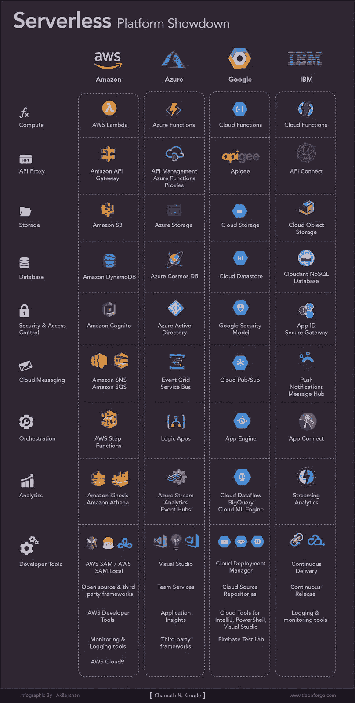

# 为什么没有服务器？为什么是现在？

> 原文：<https://medium.com/hackernoon/why-serverless-why-now-f09ce43c4767>

## 您的无服务器开发已经陷入困境了吗？

Source: [https://unsplash.com/photos/6SNbWyFwuhk](https://unsplash.com/photos/6SNbWyFwuhk)

无服务器是一个误称。一种感知。直到几年前，它才成为一个家喻户晓的名字。如果你问无服务器中是否有服务器，答案是肯定的，这并不奇怪。现在，百万美元的问题是——你必须担心他们吗？

号码

过去，这些都只是裸机服务器，由企业自己管理。然后是虚拟机，一种模仿基于硬件的服务器的软件。云是受分布式计算平台启发的下一件大事。容器化，也称为操作系统级虚拟化，随后出现并流行起来。然而，后来，IaaS(基础设施即服务)已经覆盖了一些领域，因为那时云开始流行。随着 PaaS 成为 IaaS 的下一步，配置服务器变得自动化。

不管喜欢与否，技术在不断发展，我们周围的一切也是如此。在过去的十年中，我们看到了连接、计算能力、存储等方面的巨大进步。在业务开发副总裁开始制作[影响力故事](http://readwrite.com/2012/10/15/why-the-future-of-software-and-apps-is-serverless/)后，无服务器开始越来越多地出现(甚至让我们 [Baader-Meinhoffed](https://science.howstuffworks.com/life/inside-the-mind/human-brain/baader-meinhof-phenomenon.htm) ),这延续了 PaaS(平台即服务)的趋势，并带来了一些重大的范式转变。随着亚马逊网络服务在 2014 年[创新大会](https://aws.amazon.com/blogs/security/2014-reinvent-roundup/)上推出 Lambda，无服务器成为必然。时至今日，它已经成为软件架构世界的[趋势话题之一](http://serverlessconf.io/)。

# 进入无服务器模式

无服务器计算是一种云计算模式，在这种模式下，无需管理任何服务器即可构建和运行应用程序和服务。因此，该名称的由来证实了这样一个事实，即服务器的供应、扩展和管理对运营商来说是完全隐藏的。无服务器整合了两个不同但重叠的领域——BaaS，后端即服务的缩写，和 FaaS，功能即服务的缩写。

无服务器并不是一个新的概念，尽管有些人误解它是一个相对较新的概念。Zimki 在 2006 年开始提供第一个“按使用付费”的代码执行平台——在他们[于 2007 年底撤回服务](https://blog.gerv.net/2007/09/zimki_shuts_down/)之前。自 2007 年以来，Salesforce 的 Heroku 一直在默默运营他们的 web 应用部署模型。谷歌应用引擎于 2008 年 4 月发布，功能有限。它最初是一个定制的 Python 执行框架，现在变成了 web 应用程序开发和托管的最受欢迎的云平台之一。

## 勇敢的新浪潮

随着事件驱动的浪潮席卷海岸，短暂的无状态计算容器开始发挥作用。与传统架构不同，这些计算引擎只被第三方调用一次，然后就被终止了。人们开始使用绰号——功能即服务(FaaS)出现了。开发人员很快利用这一点来关注和实现由特定事件触发的自己的业务逻辑。

FaaS 完全从开发者那里抽象出基础设施层，只对使用时间收费。引用 [AWS Lambda](https://aws.amazon.com/lambda/) ，

> 运行代码时不考虑服务器。只为您消耗的计算时间付费。

最近，FaaS 市场主要是由从 DevOps 到无服务器计算的转变推动的。全球预测显示，无服务器市场将以 32.7%的速度增长。行业专家对无服务器技术的发展也有一些诱人的观点。

## 无服务器，英雄

无服务器的引入消除了管理服务器集群的麻烦和传统的“永不停机”的服务器需求。底层服务器群可以自行灵活扩展，提供适当的基础设施，甚至可以应对流量的激增。它们由提供者定期监控和管理——安全补丁和其他免疫注射也得到了照顾。这削减了相当一部分预算，因为它导致运营成本显著降低，更不用说麻烦了。

在无服务器模式下，你只需按使用量付费；调用按秒的分数计费。从一个简单的想法实现一个生产就绪的输出是非常快的。与内部设置的不同软件堆栈相比，第一次体验的开发人员生产力是一个显著的收益。AWS 和几乎所有其他无服务器解决方案提供商都提供了[免费层](https://aws.amazon.com/free/)选项，并作为语言无关的端点出现(除了 Google Cloud，其他提供多种运行时/开发环境),这使得首次动手体验更加轻松。

## 无服务器，恶棍

这并不意味着无服务器都是神一样的；它可能包括一些产生的[隐性成本](/@amiram_26122/the-hidden-costs-of-serverless-6ced7844780b)。通常，这些成本不仅包括 CPU 和 RAM 的使用，还包括 API 请求、存储和网络的数量。有时，根据您的特定业务需求，实现多个功能可能比实现单个容器更困难。由于整体逻辑的分布式性质，代码维护可能会使您无能为力——或者对于更复杂的用例，使用 Kubernetes 可能更有优势，因为它更成熟。

缺乏本地主机上的集成测试设施是现有提供者的一个巨大缺点。没有简单的方法可以模仿，但是通过使用[无服务器框架](https://serverless.com/)或者 [aws-sam-local](https://aws.amazon.com/about-aws/whats-new/2017/08/introducing-aws-sam-local-a-cli-tool-to-test-aws-lambda-functions-locally/) 可以在一定程度上克服。手动调整机器以适合您的应用程序是不可能的，因为服务器层是无形的。

在向前发展时，提供商锁定可能具有挑战性，因为每个无服务器平台因其独特性和局限性而大相径庭。由于[冷启动](https://hackernoon.com/im-afraid-you-re-thinking-about-aws-lambda-cold-starts-all-wrong-7d907f278a4f)，应用在开始时可能会经历高延迟。

# 无服务器竞争

AWS 不是市场上唯一的 FaaS 提供商。有少数其他企业巨头争夺育肥市场。微软 Azure 通过 [Azure 函数](https://azure.microsoft.com/en-us/services/functions/)增强了事件驱动的无服务器计算体验。IBM 的无服务器域提供了基于 Apache OpenWhisk(一个开源项目)的 [IBM 云功能](https://www.ibm.com/cloud/functions)。[谷歌云功能](https://cloud.google.com/functions/)是谷歌云平台的 FaaS 版本，目前仍处于测试阶段。

不同的提供商在其无服务器平台中提供了一系列完全托管的产品。这些后端服务不需要供应、维护或管理。这里描述了每个无服务器平台中的各种组件。

Cloud Computing Platforms: Serverless Product Showdown

除此之外， [Firebase](https://firebase.google.com/) 是谷歌云平台支持的(2014 年[照常](http://www.wired.co.uk/article/google-acquisitions-data-visualisation-infoporn-waze-youtube-android)收购的)移动和网络应用开发平台，由多个集成服务组成。大多数无服务器提供商展示了物联网框架支持、移动后端支持和认知应用开发支持。

大多数 Amazon web 服务都有特定于可用性区域的端点，以补偿全球应用程序的延迟。开发人员可以自由使用这些区域端点或默认的北弗吉尼亚端点。你可以在[这里](https://aws.amazon.com/about-aws/global-infrastructure/regional-product-services/)阅读更多关于支持特定地区的 AWS 服务。就像这样，其他无服务器提供商也支持不同的可用性区域。

AWS Lambda 和其他服务拥有支持多种编程语言的无服务器开发的 SDK。亚马逊最近(2018 年 1 月)[宣布](https://aws.amazon.com/blogs/compute/announcing-go-support-for-aws-lambda/) Go 支持。阅读[这篇文章](https://headmelted.com/serverless-showdown-4a771ca561d2)可以了解大量关于不同无服务器提供商的详细比较。

# 无服务器的许多方面

无服务器应用程序允许您在不提供或管理服务器的情况下运行代码。无服务器域提供了无数的应用机会。其中一些在此披露如下。

## 1 —实时数据处理

实时处理被发现与无服务器广泛创造。《西雅图时报》[使用 AWS Lambda](https://aws.amazon.com/solutions/case-studies/the-seattle-times/) 来调整图像大小，以便在台式电脑、智能手机、平板电脑等不同设备上观看。SiteSpirit [使用 IBM cloud](https://www.ibm.com/case-studies/sitespirit) 数据服务来构建他们基于云的媒体库。

## 2 —实时流处理

Localytics [使用 Lambda](https://aws.amazon.com/solutions/case-studies/localytics/) 处理数十亿历史和实时社交媒体趋势数据，供商业用户查询。IBM Cloud 函数可以与 Apache Kafka 支持的 IBM Message Hub 集成，用于处理流数据。Plexure 是一家总部位于新西兰的从事创新零售业务的公司，[使用 Azure 无服务器技术](https://customers.microsoft.com/en-us/story/plexure-dev-azure)将客户体验提升到一个新的水平——在 Azure 功能和 Azure Logic 应用程序的帮助下，现在客户可以获得关于店内数字显示的警报。

## 3 —提取、转换、加载(ETL)

最大的房地产品牌之一 zillow[利用 AWS 无服务器堆栈](https://aws.amazon.com/solutions/case-studies/zillow-zestimate/)为客户提供近乎实时的房屋估价的流畅体验。

## 4 —物联网后端

在物联网领域，使用无服务器平台的应用越来越多。这个[激动人心的故事](/openwhisk/openwhisk-for-a-smart-city-data-application-dccd7894e0e1)解释了智能住宅垃圾收集公司 GreenQ 如何利用 IBM Bluemix 技术来提供更快速、更高效的服务。

## 5 —移动后端

Bustle.com 是一个迎合女性的网站，提供新闻、时尚和更多内容。他们将 Lambda 和 API Gateway 用于其 iOS 和网站后端。随着[迁移到新的无服务器架构](https://aws.amazon.com/solutions/case-studies/bustle/)，开发人员不再担心管理和配置基础设施，他们只关注创新。手机应用程序 [WeatherGods](https://itunes.apple.com/us/app/weather-gods/id1041512978?mt=8) 使用 IBM 云功能(前 IBM OpenWhisk)通知用户特定的天气事件(例如佛罗里达州的飓风)，根据他们的偏好排列上帝头像。

## 6 —无服务器 web 应用程序

用[埃里克·哈蒙德的话说](https://alestic.com/2015/07/timercheck-scheduled-events-monitoring/)，TimerCheck.io 是一个“看似简单却拥有超能力的网络服务”。该服务完全建立在 Amazon API Gateway 和 AWS Lambda 之上，它提供了无限数量的计时器，可以无限运行。

## 7 — SaaS 事件处理

圣华金河谷学院(SJVC)是加利福尼亚州的一所私立初级学院。为了简化 IT 管理并为学生提供更好的体验，他们[将其学习管理系统](https://customers.microsoft.com/en-us/story/san-joaquin-valley-college)迁移到了微软 Azure 和 Office 365。在微软快速通道的帮助下，SJVC 采用了无服务器技术，并继续他们的创新之旅。

除了这些最流行的，你还可以找到更多的 [AWS](https://aws.amazon.com/solutions/case-studies/enterprise/) 、 [Azure](https://azure.microsoft.com/en-us/case-studies) 、 [IBM](https://console.bluemix.net/openwhisk/) 的用例。

# 支持无服务器开发

软件架构世界正稳步被无服务器所吸收。它不会很快成为“无服务器一切”,因为仍然有许多空白需要填补。工具正在改进，但是仍然有[差距需要弥补](/statuscode/its-all-going-to-be-serverless-9e16fe721f36)。前面提到的无服务器框架提供了一个 CLI 工具，允许用户与多个云提供商集成。

[Cloud9](https://docs.c9.io/docs/faq-general) ，曾经一个独立的基于云的 IDE 被亚马逊收购[，以将开发方面插入其无服务器堆栈。然而，设置 Cloud9 开发环境需要一个新的 Amazon EC2 实例或您自己的 Linux 服务器。据许多用户](https://www.forbes.com/sites/janakirammsv/2016/07/18/the-master-plan-behind-amazons-acquisition-of-cloud9-ide/#aaad64672c1a)报告，入门过程比最初的 Cloud9 (c9.io) [更复杂。检查](https://community.c9.io/t/please-dont-shutdown-original-c9-io/20955/4)[这个巧妙的技巧](https://dzone.com/articles/writing-a-self-sufficient-aws-lambda-function)试图提出一个自给自足的 AWS lambda 函数，它消除了上传具有第三方依赖关系的包的需要——在本地构建。微软 Azure 由 Visual Studio 提供支持，这是另一个多功能但沉重的带有团队服务的云 IDE。

## 想想无服务器

SLAppForge，一个全新的玩家，[最近宣布](https://globenewswire.com/news-release/2018/02/06/1333797/0/en/SLAppForge-Announces-Sigma-a-Cloud-IDE-for-Serverless-Computing.html#.WnnY4MV60OI.twitter)它的测试版[适马](https://sigma.slappforge.com/)，一个用于开发和部署无服务器应用的定制编辑器。这是一个混合模型，利用了拖放风格的优点和原始代码的全部功能。适马使用自己的“非常”无服务器架构向开发人员隐藏了平台的底层复杂性，这意味着，现在你不必钻研成堆的文档和教程。

这个[强大的 IDE](https://slappforge.com/) 配备了直观的代码建议、上下文感知的代码完成、自动生成的代码片段——尽管仍然只支持 Node.js。它还负责无服务器应用程序的持续集成和持续交付流程。如果你有网络浏览器(我打赌你已经有了！)，一个 GitHub 账户和一个 AWS 账户，你都设置好了——因为没有什么*需要安装。部署您的无服务器应用程序只需几分钟，而不是几小时，也不是几天。*

# 结论

向无服务器模式的转变正变得不可避免，就像从内部部署到云的转变一样。所有应用程序都不用服务器的日子不远了。是时候跟上潮流，成为一名无服务器开发者了，因为一切都在推动你变得更有生产力和效率。抛开对基础设施的担忧；完全专注于业务逻辑。球在你的球场上；立即开始[您的无服务器开发](https://sigma.slappforge.com/#/signup)!

# 行动呼吁

*   **拍手。**欣赏并让别人发现这篇文章。
*   **发表意见。**分享你对这篇文章的看法。
*   跟我来。Chamath Kirinde 接收此类文章的更新。
*   **保持联系。** [LinkedIn](https://www.linkedin.com/in/jchamath/) ， [Chummy Charms](https://chummycharms.blogspot.com)

*原载于***。**