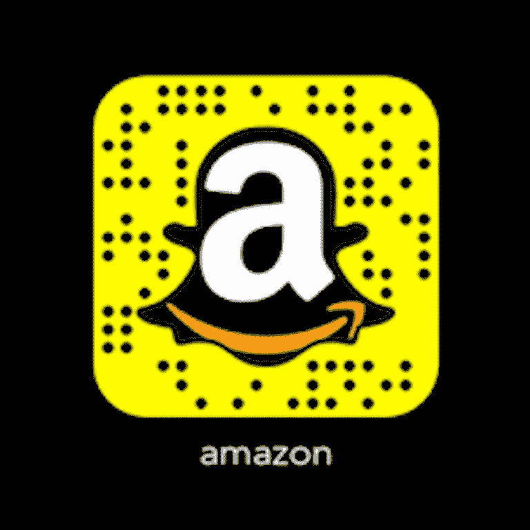

# 亚马逊 AQUIRE 为什么要 SNAP？

> 原文：<https://medium.com/hackernoon/why-should-amazon-aquire-snap-e0cd6691795e>

# 亚马逊+SNAP =爱情

# 千禧一代的最爱

美国东部时间 2018 年 7 月 16 日中午 12 点 16 分

> 对 Snap，Inc .的收购可能正在讨论中？！

# 通过我的破坏

**SNAP，Inc.** ，(纽约证券交易所代码:SNAP)在 2018 年初的价格为 20 多美元，在 2017 年强劲结束后。当投资者感到恐慌后，股票暴跌，当时凯莉·詹娜试图通过关闭她的账户来抵制该应用程序，只是在意识到她失去了许多粉丝后不久就回来了。上周亚马逊和 Snap 发布了合作伙伴关系，但这是为贝佐斯购买前的一次尝试吗？

Snap 公司太有价值了，不能保持独立。该公司已经占据了大多数千禧一代，这意味着最强大和更受欢迎的客户。

如果亚马逊将对 Snap，INC .进行收购，这应该不会太令人惊讶。虽然亚马逊收购 Salesforce.com 公司(纽约证券交易所: [**DIS**](https://investorplace.com/stock-quotes/dis-stock-quote/) )也有道理，但亚马逊可以充分利用千禧一代最喜爱的社交媒体——迪士尼& **公司**(纽约证券交易所: [**CRM**](https://investorplace.com/stock-quotes/crm-stock-quote/) )也可以利用 Snapchat 的追随者——如果双方最终都选择追求 Snap 的话。

# SNAP 需要保持独立的形象

千禧一代会期望像 Snap，INC .这样的公司留住其领导人和创始人，他们是最有价值的资产，任何想收购 Snap，Inc .的公司都应该考虑这一点，因为他们似乎知道我们想要什么**！**

# 到目前为止，巴索斯也是千禧一代不介意也不喜欢的领导人之一。作为挑战世界并取得胜利的商业反叛者，他似乎赢得了我们的心。

我喜欢在我的社交媒体上购物，不用离开我的应用程序，你不喜欢吗？

# AMZON + SNAP =来自千禧一代的爱