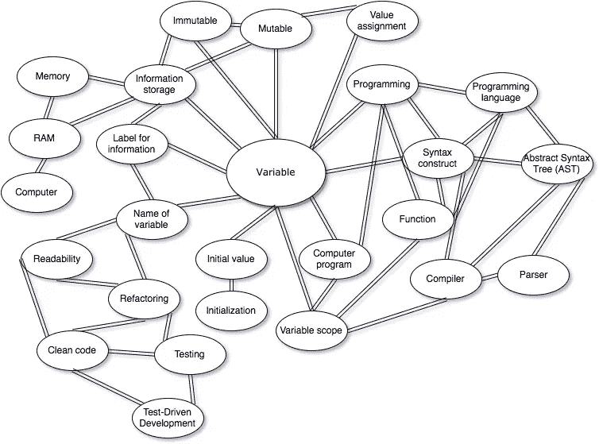

# 我为什么要学安卓？

> 原文：<https://medium.com/hackernoon/why-should-i-learn-android-14687b27e062>

你已经下定决心要学习使用 Kotlin 为 Android 创建应用程序。你非常有动力去创建你的第一个应用程序。

还是你？

要是这么简单就好了。心里有那种挥之不去的感觉:“或许学 iOS 更好？”你考虑过 Web 和桌面应用程序开发吗？

# 选择，选择—无处不在！

即使你已经决定使用 Android，也许，你仍然不确定什么是最好的起点:Kotlin 还是 Java。

有很多关于 iOS 和 Android 开发的比较，它们都谈到了(如果你还没看过，去网上搜索一下——有很多这样的比较):

*   市场的规模，
*   就业前景，
*   获得收入的机会，
*   开发工具，
*   知识可转移性(你在一个平台学到的知识如何在另一个平台上有帮助(或没有帮助)，
*   设备碎片，
*   诸如此类。

让我们想象一下，你已经从一个方面确定了一个好处，比如 Android 的市场规模要大得多。

接下来，你会发现一个不利因素，要么会抵消好处，要么会让你花费大量精力来抵消它本身(比如设备碎片化和收入水平)。

因此，这个选择相当棘手，也不明显。

我知道你现在的感受。当我试图选择首先要学习什么移动平台时，我一直在那里。这是令人沮丧和痛苦的。

但是，嘿，如果你已经做了一个坚定的决定——太好了！继续读下去，你不会失望的。因为接下来的事情会让你大吃一惊。

在编程中，当事情涉及到学习时，以上所有的事情都很重要。

但不如你获得的学习收益多。

# 一天学会一门编程语言？—不可能！

或者是？

你知道一个有经验的程序员可以在一两天内学会一门编程语言吗？并在一两天内熟悉这个平台、一堆库和一个框架？

听起来很震撼，不是吗？

不，我不是想在这里显得傲慢。这些是我认识的真实的人。他们会成功的。此外，他们可以加入一个拥有一套完全陌生的技术的团队，并在第一天就富有成效。

他们不是一些天才或超级天才。

不过，他们确实有一个共同的显著特点:他们都知道五种甚至更多的编程语言，并且精通这些语言的许多不同的库和框架。

这些开发人员可以在几个小时内开始利用他们从未见过的技术提高工作效率。

为此，他们需要接触已经精通这项技术的人。在开发某个功能时，有经验的学习者会向专家提出一些特定的问题，这样他们就可以用现有的知识来填补空白。

因此，两到三个问题，他们已经远远领先于大多数学习者。根据几个月和几年的经验。

这听起来既令人惊讶又令人畏惧。

也许，你在想“那不可能！”或者你感到沮丧是因为你不能像他们那样学习。

还没有。

关键是，当你能够掌握(轻松开发生产就绪的应用程序)大约五种甚至更多的编程语言(这些语言并不十分相似)，以及大约相同数量的不同框架时，那么这种快速学习的技能就是你的了。

事实上，它已经是你的了。你将会像这些“有天赋的”(更像是努力工作的)开发人员一样。

要做到这一点，你需要在内心接受“学习的生活”。你需要成为一个终身学习者。

就像他们一样，你会希望永远不要错过学习的机会。

有图书馆的怪异行为？—你不怕麻烦地阅读文档和源代码。并且调试和使用 print 语句。

你这样做，直到你确切地理解它为什么会这样。

也许，你瞥见了一个新的概念，但在没有完全理解它的情况下让它工作了？—去那里，阅读它，玩它，直到你完全理解它。

你有没有一个 bug 摆在你面前，不知何故你最后一次修改代码就把它修复了？但你还是不明白这个 bug？—你不能就此打住。

你找出为什么它不起作用，以及为什么你的修复工作。

有时候，你需要创建一个小小的应用程序，仅仅是为了尝试一个新的概念。以各种形式和不同的目的使用它，直到你确信你得到了它。

我听到你在说:“有一天？不管你学了多少，这都是不可能的！”

见鬼，学习一门编程语言需要几个月甚至几年的时间！

我知道，对吧？

这是真的。学习编程中的一个概念都要花很多时间。

但是学习你的第二个概念需要一点点时间。特别是，如果这个概念和你之前学过的有联系的话。

但都核实了。

# 一天学会编程语言背后的科学

在人类的认知和学习中，很少有关于人如何处理信息和学习的理论。这些理论都是重要的，相辅相成的。

有一个理论有助于在一天内学会编程语言的这种效果。

它是由受人尊敬的心理学家理查德·c·安德森(Anderson 1977，1978；Shallert 1982 年)。

您可以在自己的时间里深入研究这些白皮书，但是让我在这里为您快速概述一下最重要的部分。

图式理论中的主要概念是**图式**。它代表一般知识。模式包括所有组件和特性的插槽。

一个模式可以包含其他模式(多个模式)。从本质上讲，模式嵌入在不同抽象层次的其他模式中。但是它们之间的关系不一定是分层的(像编程中的树)，而是更像网络(编程中的双向图)。

让我给你举一个例子，什么可能是人对“变量”的图式:

我很确定我们可以向这个模式添加很多东西。您可以继续无限地扩展这个模式。

在某些时候，你甚至会逃离编程领域，开始谈论生活和自然中的正常事物。或者，你可以把它与数学或语言学领域联系起来。诸如此类。

你觉得我为什么这么执着于认知和学习？

我花了几周时间在论文中挖掘，以了解一个人如何才能学得更快更好。特别是，我对形式和抽象概念的学习感兴趣。

我这样做是因为我正在创建一些 Kotlin 和 Android 教程，我鼓励你[成为 iwillteachyoukotlin 的成员](https://iwillteachyoukotlin.com/android-wsila/)，这样你就可以收到我的“终极教程:Android 上的 kotlin 入门”的早期预览版本

不管怎样？像这样的模式不仅仅是学习的学生在纸上画出来的(不是说你不能——这可能是个好主意)。

当个人获得越来越多的经验和概念理解时，它们在一个人的大脑中自然形成。

图式一直在变化。即使是现在，当你在阅读同样的文本时，你的图式正在被扩展和重构(除非你已经知道这里的一切)。

最重要的一点是，这样的模式不仅仅是其各个部分的总和。每当你的大脑在两个图式之间建立有意义的联系时，你就获得了洞察力。

就像有了突破。

你有过“啊哈！”像这样的时刻:“啊哈！这里的这个东西就像我所知道的另一个东西一样，但差别如此之小？”

这种观点可能不是 100%正确的。但不一定要这样。这种洞察力使你能够快速应用一个全新的概念。

所以事情是这样的。你有越多的模式可以将概念联系起来，你学习这些概念的速度就越快。其中一些模式甚至不必来自编程领域。

例如，如果您正在学习双向链表是如何工作的，您可能会将这个概念与火车中车厢如何连接的模式联系起来。

然后你就可以把一个双链表的所有操作(比如 insert 和 remove)理解为一个正在火车车厢上执行的操作。

一切都会被证实的。

算是吧。

显然，图式之间的这种联系就是我们所说的隐喻。

它们为我们理解特定概念提供了有意义和有用的模型。但是当概念不同于这些模型时，它们有边缘情况。

因此，发现这些边缘情况，并了解概念在这些情况下的表现是有意义的。

亲爱的读者，这正是有经验的学习者在向已经精通编程语言或框架的人询问关于新编程语言或框架的精确问题时所做的。

他们探测模型中的漏洞。他们填补他们图式中的空白。

好吧，这一切都很棒，但这与你是否应该学习 Android 或 Kotlin 有什么关系呢？

或者我应该问真正的问题？

# 我为什么要学？

看到我做了什么吗？

我已经改变了问题，并使 Android 或 Kotlin 无关紧要。

所以该不该学？

根据图式理论，答案是肯定的“是”

为了实现你的人生目标，你需要所有的知识和所有的模式。因此，每一天、每一个机会的学习都不应该成为一个问题。这就是你要做的。

一直这样做的简单原因是，你做得越多，就越容易、越快。

我的名言“学习是一种可以而且必须训练的技能”在这里大放异彩。你学得越多——你的图式就越多，它们之间的联系也越紧密。

因此，学习新概念——扩展所述图式——变得更容易、更快。

这就是全部，除非你不想在你的生活中再学习任何东西。很抱歉打断你，但是一旦你想实现你还没有做过的事情，你就必须学习和成长。

从你在读这个的事实来看，我坚信你是想学习的。

那就让这个问题有了答案，你要，你要学。

# 安卓呢？

好吧，不管你如何权衡所有不同平台的利弊，你都不会得出决定性的解决方案。这在很大程度上取决于你想创建什么样的应用程序，你想建立什么样的业务，你的市场是什么。

如果你已经有了所有的信息，你应该能够做出选择。

如果作为一名软件开发人员，你只是在寻找什么样的新技术可以进入你的工具箱，那么只要它是被广泛使用的东西就没关系。安卓是。

# 科特林呢。

这两年半，Android 社区出现了 Kotlin 使用量的快速增长。我遇到的或一起工作的每一个软件开发人员都对 Kotlin 非常满意。

他们也尽快将公司的应用程序转换成 Kotlin。

他们中的一些人甚至在 Kotlin 稳定的 1.0 版本发布之前就进行了转换。这是一个大胆的举动，但它是值得的。

此外，谷歌和其他大公司和社区也在科特林身上下注。

如果你正在读这篇文章，你可能已经做出了选择。如果今天我是你，我也会这么做——学习科特林。

顺便说一下，这篇文章摘自我的“终极教程:Android 上的 Kotlin 入门”的第一章。

如果你决定学习 Android 和 Kotlin，考虑[成为 iwillteachyoukotlin](https://iwillteachyoukotlin.com/android-wsila/) 的成员。作为会员，您将收到 kotlin android 教程的早期预览版。

前几章将会在这篇博文发表后的十天内发布。

当你在等待的时候，你可以[拿一本 Kotlin 的“入门”教程](https://iwillteachyoukotlin.com/)，这样你就可以开始熟悉 Kotlin，同时用 Kotlin 构建你的第一个命令行应用程序。

# 我的相关文章

 [## 如何用 Kotlin 编写自己的第一个程序？

### 我听说你想学编程。这个多部分教程正是你所需要的，它不假设以前…

hackernoon.com](https://hackernoon.com/how-to-write-your-first-program-in-kotlin-8554cb526158)  [## Kotlin 灾难如何像闪电一样吞噬你的 Java 应用？

### 我听到你在说什么。有传言说 Android 积极采用 Kotlin 作为主要编程工具…

hackernoon.com](https://hackernoon.com/how-kotlin-calamity-devours-your-java-apps-like-cancer-f3ce9500a028)  [## 当你全职工作时，如何找到时间学习一项新技能？

### 让我猜猜…

hackernoon.com](https://hackernoon.com/how-to-find-the-time-to-learn-a-new-skill-when-you-are-working-full-time-d1957060ced0)  [## 对于 CTO:技术债什么时候还？

### 开发人员经常抱怨技术债务，并希望获得一些时间来修复它。无论是重大的重构，还是…

hackernoon.com](https://hackernoon.com/for-cto-when-is-the-time-to-pay-technical-debt-65343f18e5e4)