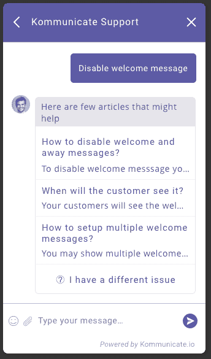

# 为什么要删除你的 FAQ 页面？

> 原文：<https://medium.com/hackernoon/why-should-you-delete-your-faq-page-eece59047a95>

如果你想知道为什么用户不阅读 FAQ，那么你并不孤单。还有其他几家公司投入时间、精力和资源来撰写 FAQ，但用户仍然会在支持聊天中询问相同的基本问题。

> 你上一次去阅读常见问题是什么时候？

你没在看。你不喜欢浏览一系列常见问题，为什么你的客户会喜欢呢？

请参见下图:

想象一下，你很着急，想尽快得到你的答案，你来到上面的屏幕。

你要怎么办？点击“转到[常见问题解答](https://hackernoon.com/tagged/faq)，然后浏览常见问题解答列表，看看你是否找到了你想要的，或者直接点击那个聊天图标？

你的客户也是这种情况，有这么多事情要做，这么多产品和服务要评估，在同一个[浏览器](https://hackernoon.com/tagged/browser)中打开了 10 个其他标签，有些甚至有未读通知！

事实是:

> 人们搜索，而不是浏览。

FAQ 要求用户阅读问题和答案。

如果你也为网站访问者提供了一个聊天选项，那么你从一开始就做错了 FAQ 的事情。

看看詹姆斯·胡普在[推特](https://twitter.com/jameshupp/status/345529805208436736)中提到了什么:

来自英国的政府数字服务没有常见问题，这里是为什么的原因。

亚马逊和谷歌等流量巨大的公司很难找到聊天选项，因此用户只有在做了功课后才会支持聊天。但他们是亚马逊和谷歌，拥有庞大的用户群，他们可以承受失去一个客户的风险，但如果你是一家初创公司，你不能冒这个风险！

## 我们如何解决这个问题？

> 这是一个 UX 问题。

Quora 和 StackOverflow 在简化它方面做得很好。

改善用户体验的三步流程:

1.  **搜索**:为用户提供搜索问题的选项
2.  **建议**:建议类似用户类型的问题
3.  **支架**:如果找不到匹配的问题，将其与支架连接。

另一种方法是使用机器人来回答聊天对话中的查询，它通过消息传递以更直观的方式提供所有 3 个选项搜索、建议和支持。

Sneak peek of Liz — FAQ bot from [Kommunicate](https://www.kommunicate.io/)

您的支持和自助服务平台现在可以在一个聊天窗口中。这对企业和客户都是双赢的。

我有没有告诉你，我们正在发布 Liz——一个常见问题机器人？如果你想得到通知，请在这里加入等候名单[。](https://kommunicate.typeform.com/to/aCl9lv)

你对使用 FAQ 有什么看法？如果你已经从 FAQ 中受益，请在评论中发帖，看看使用 FAQ 的最佳实践会很有意思。

*我们正在建设* [*通信*](https://www.kommunicate.io/) *，一个现代化的客户支持平台。文章原载* [*此处*](https://www.kommunicate.io/blog/why-should-you-delete-your-faq-page-e60933050643/) *。*