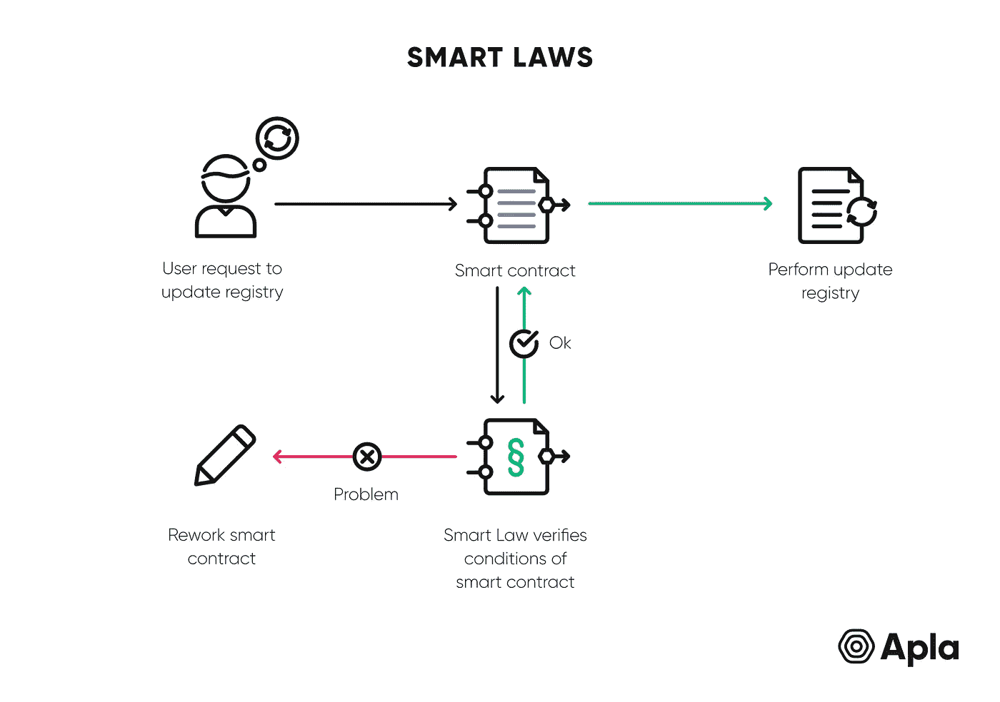

# 为什么智能合约仍然需要人的逻辑

> 原文：<https://medium.com/hackernoon/why-smart-contracts-still-need-human-logic-e4c07885e26a>

智能合约使简单协议的执行自动化，但是当代码出错，交易需要更改或撤销时会发生什么？智能法律将人的逻辑引入到各种情况中，将当前的立法与分布式账本技术相结合，这样就可以实现正义，并将数据归还给合法的所有者。

分布式账本技术的优势是显而易见的:不可改变的性质、增加的安全性和消除中介。实现这些优势的方法也很明显:通过特殊的加密算法和去中心化。因此，如果我们计算一下，并在区块链中加入智能合约，我们就拥有了保证双方信任的理想工具，而无需借助中介。

但是，不知何故，它并不是这样工作的，在 DAO 被黑之后，很明显，一个建立在“代码即法律”原则上的系统缺少了一个关键元素。也许是缺少了“法律”部分，不是代码的法律部分？

**智能合约真的智能吗？**

首先，我想花一点时间来提醒大家注意一个事实——这一点程序员已经知道了一段时间——像以太坊这样的“智能”合约根本就不是**智能的。**

它们并不比马桶水箱聪明:如果水位达到一定高度，进水阀就会关闭，当你冲水时，冲洗阀就会打开让水通过。智能合约也是如此:它只是一个简单的算法，用一组特定的数据完成一套标准的操作，与任何计算机脚本没有任何区别。

如果我们在一张纸上写出一个算法，然后把它写成代码，它不会变得智能。

**总账的不变性和自主性问题**

分布式分类帐的不变性和自治性的传统要求被认为是单方面的和事实上的。

没错，区块链技术保证了任何交易直到当前时刻的数据完整性；任何篡改经验证块中哪怕一个字节数据的企图都是不可能的。但是，任何人都可以通过完成进一步的交易来更改注册。尽管正确地做到这一点意味着最初应该根据特定的网络规则或法律来提供进行改变的过程。

因此，假设一个分布式分类帐网络有一个“法律”,当执行该法律时，能够将任何数字资产(令牌)从一个帐户转移到另一个帐户:即，有一个法律消除了窃取资产的机会，因为它们随后可以返回到受害者的帐户。

在系统内激活这种法律的条件可能取决于网络中一半以上的人(以某种方式被承认有投票权)的签名。为了不坐等每个人投票的结果，可以选出一名参与者，并授权他启动另一项冻结资金的特别法律。为此，我们不需要任何聪明的东西，甚至不需要聪明的契约，只需要一个常规算法来解决一个自文明开始以来就存在的问题:立法。

值得注意的是，在上面的例子中，法律的应用并不与寄存器的不可变性质相矛盾，也不与它的自治或分散属性相矛盾，因为以前的条目都没有被改变。这个问题已经由网络通过使用在协议系统之上工作的特别设计的法律解决了。在这样一个系统中，每一个代码都应该有一个控制它的法律和一个执行法律的决策系统，一个能够修正编码缺陷后果的系统。

**网络安全**

该准则只能在最简单的情况下确保安全，在这种情况下，已经考虑到了所有的行为情况。当一个人需要使用其功能将执行复杂动作的代码时，安全只能通过集体推理来提供，即创建一个不仅由法律组成，而且由制定和执行法律的人组成的立法系统。

自然，问题就出现了，当一个人有意识地决定签署一份恶意合同并冻结一个账户时，他是否会犯错误。当然可以，但与不作为的可能后果相比，导致合同中止的错误是两害相权取其轻。一套能够取消因部分人为错误而做出的决定的法律，或者启动纠正这种情况的合同的法律，就像描述移交权力的程序的法律(这一切都基于民主的投票制度)将使网络生态系统可持续发展。

**权力下放**

权力下放的概念可以从几个不同的角度和不同的层面来看。从技术角度来看，分散化保证了网络的完整性，这意味着即使大量节点出现故障，它也可以继续运行。从信息的角度来看，缺少一个集中的数据存储场所解决了完整性问题。然而，对集权和分权还有第三个层次的理解:管理层/治理层，在这里做出决策并为这些决策承担责任。

当以太坊和相应的道被创造出来时，这第三层被忽略了。这就是为什么当以太坊遇到他们的问题时，它只有两条路可走:保持现状或让时钟倒转。

所以，如你所见，去中心化并不那么简单。一方面保证了数据的完整性和准确性；另一方面，缺乏一个可以做出即时决定的集中元素意味着该系统根本无法避免在任何情况下都不可避免的恶意和灾难。

**不可变代码**

以太坊实现的契约代码的不变性，就像去中心化一样，有两个方面。当然，拥有合同条款是个好主意，任何一方都不能事后更改*，并且必须通过法律来执行。但另一方面，即使是最周密的政府法律也不能避免错误。此外，一个程序化的契约可能会有漏洞，使其容易被恶意使用。此外，虽然政府法律可以在法庭上被推翻，法律从此被修正，但以太坊网络上的那些不变合同的问题只能通过回滚时钟来解决。*

*我们应该始终从这样一个事实出发，即任何合同都不能脱离某种一般规则或法律而单独存在，这些规则或法律规定了合同的适用，并对合同必须修改或废除的情况作出了规定。此外，这样的条款是有意义的:每一个准则，每一个不那么聪明的合同都应该服从一个更高的法律，在(准则中)不可预见的情况发生时，该法律生效。如果我们真的需要一些聪明的东西来解决一个问题，法律上应该有这样的规定:一个人可以干预和修改代码的系统。我们可以称这种干预系统为“智能法律”。*

**

***中介***

*分布式分类账的主要优势之一是它的非中介性。在特定时刻验证特定文件的公证人可以很容易地被代码取代:用私钥签名并在块中盖章。但是当任务更加困难的时候呢？例如，需要通过政府法律进行严格监管的契约关系(相互关系)？*

*在大多数情况下，本应随着分布式分类账的引入而消失的中介不是合同各方之间的中介，而是他们与国家之间的中介。此外，只有将整个国家体系转移到区块链，我们才能真正谈论去中介化和降低交易成本。这里我指的不是仅仅为了政府运作而转移到一个私人的区块链，而是转移到一个单一的国家间区块链平台。*

***法律就是法律***

*任何契约，就像任何其他具有社会意义的行为一样，只能在一个特殊的立法系统中实现。就像一个国家的每个公民一样，使用所谓“智能合约”的分布式账本网络的每个用户都应该了解当前的立法并服从它。*

*合同的创建者应该确保他们的数据不会被篡改和丢失，并且算法应该成功执行。然而，他们也应该明白，在一些极端的情况下，保护系统及其用户整体利益的法律准则会迅速采取行动。要做到这一点，应该运用一个人真正的“智慧”，根据法律，这个人有权立即做出决定，纠正错误或纠正不公正。*

*如果有人利用合同中的错误为自己谋取私利，他们应该知道法律将生效，从而撤销未经授权的行为的负面后果。这里我们不是在讨论通过删除寄存器的一部分来撤销操作，而是执行一系列新的事务。这种解决方案意味着注册的完整性不会受到损害，因为改变将根据网络上已经存在的契约法而发生。*

*因此，代码不是法律:它不能解决问题。代码，就像你我一样，只会制造问题。此外，法律不是代码，而是一种结合人类推理来解决问题和用代码纠正问题的方式。通过将一个法律体系纳入法典，并在智能合同的基础上创建智能法律，我们就有了一个可以诉诸司法、纠正错误的监管体系。*