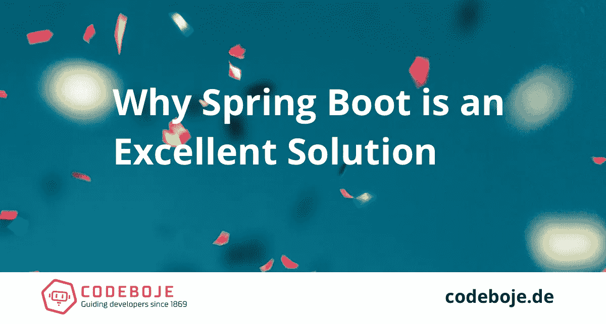

# 为什么 Spring Boot 是您下一步应用的绝佳选择

> 原文：<https://medium.com/hackernoon/why-spring-boot-is-an-excellent-choice-for-your-next-applications-cf5a0cdfa04f>

选择合适的技术来构建您的应用程序是很困难的。已经有无数的框架、工具和语言在外面，随着下一个宣传周期的到来，还会有更多。

势不可挡！

你将如何选择一个对你的公司长期有效的方法呢？？！？

虽然这篇文章不能给你一个完整的答案，但它挑选了一个最可靠的解决方案，并向你展示为什么它是一个极好的选择。

解决方案是 Spring Boot 和 Spring 框架。

# 成熟的

Spring Boot 是基于 Spring 框架的。Spring 框架本身是在 15 年前开发的，作为 Java 企业堆栈的轻量级替代。它使开发人员能够构建企业级应用程序，而没有传统 JEE 堆栈的膨胀。

# 稳定性

Spring 生态系统中的核心和中心模块在很长一段时间内都是稳定的，大多数变化都是向后兼容的。突破性的变化在发布之前很久就被宣布了，并且通常有一个平滑的迁移路径可以及时使用。

# 基于 Java 虚拟机

Spring 是基于 Java 的，因此依赖于 Java 虚拟机(JVM)。20 多年来，Java 和 JVM 一直是运行关键任务应用程序的可靠堆栈。理论上，Spring Boot 应用程序可以用 JVM 语言开发，并且是 Spring 生态系统中的 Java 和 Kotlin 一等公民。

# 开源但有公司支持

Spring Boot 和生态系统中的主要 Spring 模块都是开源软件。然而，它得到了 Pivotal 的大力维护和支持，Pivotal 是一家为构建更好的软件提供平台和工具的公司。Spring 是他们业务的基石。

它可以免费使用，而且很可能会再用十年。

# 云原生

Spring Boot 遵循云应用程序的部署原则，并为开箱即用的云做好了准备。有了 Spring Cloud，你可以立刻构建分布式系统。

在您自己的服务器、虚拟机、容器或 Heroku、AWS 等主机上运行。由你来决定。弹簧支持它。

# 连通性

使用 Spring，您可以轻松地将应用程序连接到关系数据库、NoSQL 数据库或队列服务。这一切都是春天特有的无忧无虑的方式。

支持 Oracle，PostgreSQL，MySQL，MongoDB，Redis，Solr，ElasticSearch，Rabbit MQ，ActiveMQ 等等。

# 灵活性

借助 Spring Boot，你可以开发典型的服务器端渲染的 web 应用、RESTful 和其他 Web-API，甚至可以创建批处理作业和常规命令行应用。

# 开发者喜欢它

开发人员喜欢用 Spring Boot 编程。他们工作效率更高，享受 Spring 生态系统的好处，并安心运行生产系统。我经常听到的一个常见主题是:

> 自从几个月前我们在 Spring Boot 开始使用我们的系统以来，没有出现过一个生产问题。

当开发人员喜欢他们的技术堆栈时，他们通常会更有效率。你可以把 Spring Boot 和科特林一起用。

# 丰富的资源

开源软件的一个常见问题是市场上像文档和开发人才这样的资源。遇到错误或生产问题，需要帮助吗？可能很难找到开发人员。但是 Spring 就不一样了，你会很快找到有 Spring 经验的开发者和公司，并且有大量的书籍、视频和培训。

> 当它让我得到它的时候，我会随时摘下它。嘘！搞定了。

仍然不确定它是否适合你？我可以帮你弄清楚。