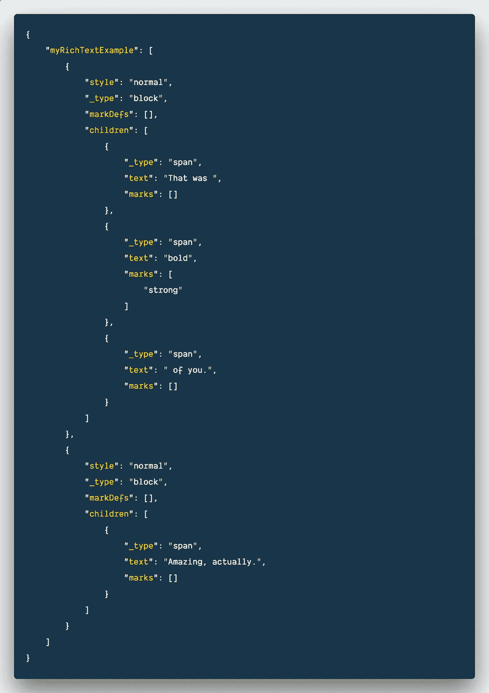
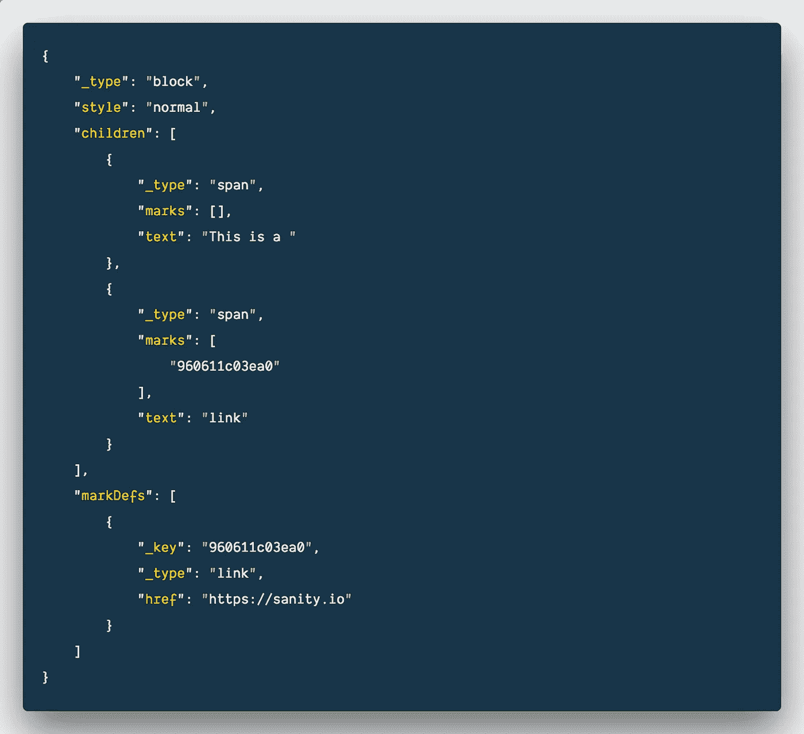
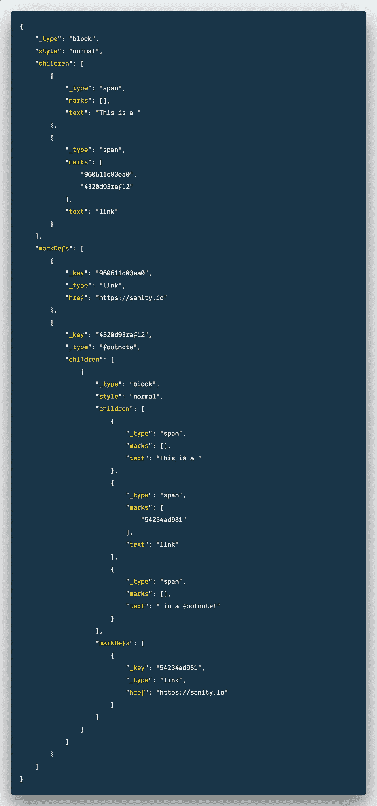

# 为什么结构化文本很棒，你完全希望它出现在你的 CMS 中

> 原文：<https://medium.com/hackernoon/why-structured-text-is-awesome-and-you-totally-want-it-in-your-cms-e6ecbdba2d36>


## 结构化文本是处理 CMS 内容的更好方式。原因如下。

让我们先弄清楚:在 [sanity.io](https://sanity.io/freecodecamp?utm_source=freecodecamp&utm_medium=blog&utm_campaign=jq) 我们热爱 HTML。我们喜欢减价。我们每天都用这两者在网上写作。甚至这篇文章也是在 Markdown 中诞生的。有了这个毫无争议的开头，你大概就能看到接下来会发生什么。我们将讨论为什么你不想让 markdown 或者 HTML 存储在你的 [CMS](https://hackernoon.com/tagged/cms) 中，除了代码示例。

但是几乎每个人都这么做，甚至是新来的人:我们去了 headlesscms.org 的所有供应商，浏览了文档，还注册了那些没有提到它的人:除了两个例外，他们都将富文本存储为 HTML 或 Markdown。如果你所做的只是使用 Jekyll 来渲染一个网站，或者你喜欢在 React 中使用`dangerouslySetInnerHTML`,那就没问题。

但是如果你想在网络之外的界面中重用你的内容。或者希望在富文本编辑器中获得更多的控制和功能。或者只是希望在流行的前端框架中更容易地呈现富文本，并让组件处理富文本内容的不同部分，那么要么必须找到一种聪明的方法来将 markdown 或 HTML 解析为您需要的内容，或者更方便的是，首先将它更合理地存储起来。

这就是为什么当我们在 2015 年开始开发时，Sanity 采用了结构化文本模型来存储富文本。现在其他 CMS 厂商也开始尝试了。我们很高兴这个流行起来。结构化文本对每个人都有好处。

让我们言归正传。“那是怎么**大胆**的你。在结构化的文本中寻找？嗯，像这样:



“先生，你疯了吗？，“你可能会说。这个复杂对象的数组比一个简单的`That was **bold** of you. Amazing actually`好在哪里？结构化文本不是给人阅读的，而是给你的软件处理的。如果你读得稍微慢一点，你就能感受到这个[结构](https://hackernoon.com/tagged/structure)允许你做什么。像`style`、`markDefs`和`marks`这样的键可以让我们以任何我们想要的方式，为任何我们想要的上下文描述文本块和内联文本。这个 JSON 块可以相当容易地序列化成干净的文本、 [HTML](https://github.com/sanity-io/block-content-to-html) 甚至 [Markdown](https://github.com/sanity-io/block-content-to-markdown/) 。或者如果你要为语音界面写东西，我们可以很容易地为[语音合成标记语言](https://developers.google.com/actions/reference/ssml) (SSML)做一个编辑器。

真正的力量来自于你能用`markDefs`和`marks`做什么。一个普通的例子是链接:



但是，如果你想打印这个，文本，并有链接也是一个脚注呢？拯救结构化文本:



如果您后退一些，把这个对象作为一个整体来看，您会看到富文本模式在脚注的标记中重复出现。它完全是结构化的文本！换句话说，这种方法为如何以及在哪里使用文本内容提供了很多可能性。

想对产品条款进行 A/B 测试吗？嗯，现在你可以为术语“变化”添加一个标记。想用用户生成的富文本数据更容易地为组件编写单元测试吗？与解析 HTML 相比，这种模式轻而易举，因为解析 HTML 会带来各种意外和无效语法。想要调整你自己的编辑评论系统，它只在你的组织中有意义吗？结构化文本使您无需在现有的标记语言中发明新的标记就能做到这一点。

Example of how structured text allows you to customize Sanity Studio’s editor to work for speech synthesis, used in services like [Google Assistant](https://assistant.google.com/). We spent but a morning making it.

结构化文本也是 Sanity 拥有实时内容 API 的一个重要部分，它为我们的富文本编辑器 Google Docs 提供了协作能力。这也给我们提供了一种更简单的方式来[定制你从其他来源](https://www.sanity.io/docs/new-block-editor-features)粘贴的文本，如网页或 Word 文档，应该如何组织。也许你想在一个定制的代码块中存储代码片段，或者让你的链接作为脚注输出[，因为你用理智来制作书籍](/buro-int/headless-cms-for-a-printed-pizza-book-54b39827e651)。

在内容管理系统中采用结构化文本并不是放弃 HTML，而是接受这样一个事实，即您应该能够以一种对您的编辑和组织现实有意义的方式来组织您的内容，而不是通过许多标记语言中的一种来制定规范。让我们担心并帮助您完成这一部分。

启动并运行，通过在您的终端中运行以下命令来测试其合理性:

```
npm i -g @sanity/cli && sanity init
```

查看我们的结构化文本包，了解 [React](https://github.com/sanity-io/block-content-to-react) 、 [HTML](https://github.com/sanity-io/block-content-to-html) 、 [HyperScript](https://github.com/sanity-io/block-content-to-hyperscript) 和 [Markdown](https://github.com/sanity-io/block-content-to-markdown) 。我们还有一个把 HTML 转换成结构化文本的包。

*最初发表于*[*sanity . io*](https://www.sanity.io/blog/why-structured-text-is-awesome-and-you-totally-want-it-in-your-cms)*。*