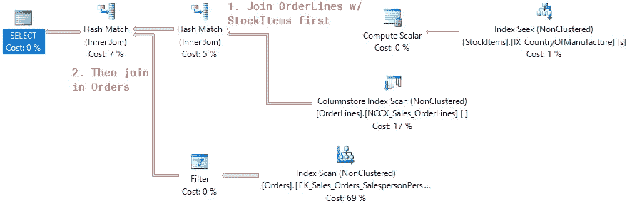
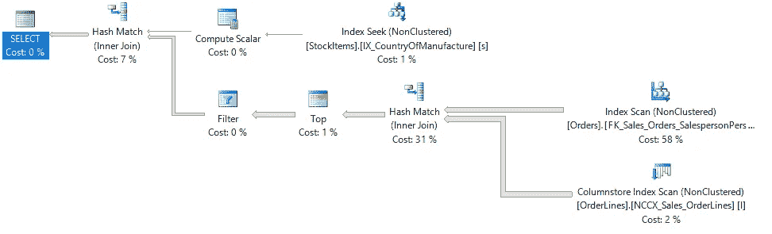
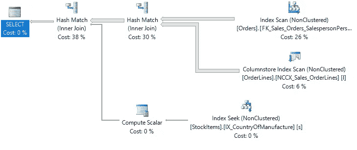
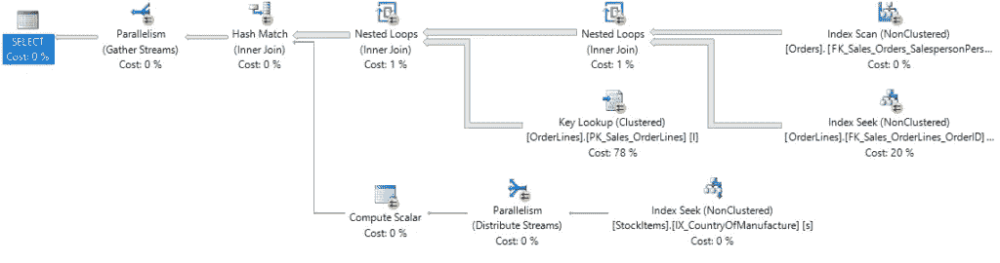

# 为什么关系数据库中的表连接顺序无关紧要

> 原文：<https://medium.com/hackernoon/why-table-join-orders-in-relational-databases-dont-matter-6de3a35f2959>


*Photo by* [*pan xiaozhen*](https://unsplash.com/photos/pj-BrFZ9eAA?utm_source=unsplash&utm_medium=referral&utm_content=creditCopyText) *on* [*Unsplash*](https://unsplash.com/?utm_source=unsplash&utm_medium=referral&utm_content=creditCopyText)

有人向我提交了一个很好的问题，我认为这将是一篇很好的 SQL Server 博客文章:

> 我一直在想，从性能的角度来看，在哪里开始查询是否真的很重要。例如，如果我从 A-B-C 加入，我会更好地从 [*表*](https://hackernoon.com/tagged/table) *B 开始，然后去 A & C 吗？*

简短的回答是:是的。没有。

与其说是读者，不如说是观察者？在 YouTube 上看本周的 [*集*](https://youtu.be/iIzdAJxedwE) *！*

# 表连接顺序对性能很重要！

*免责声明:在这篇文章中，我将只讨论内部连接。外部(左、右、全等)连接是另一种动物，我将留到以后再说。*

让我们使用来自 WideWorldImporters 的以下查询作为示例:

```
/* 
-- Run if if you want to follow along - add  a computed column and index for CountryOfManufacture
ALTER TABLE Warehouse.StockItems SET (SYSTEM_VERSIONING = OFF);   
ALTER TABLE Warehouse.StockItems
ADD CountryOfManufacture AS CAST(JSON_VALUE(CustomFields,'$.CountryOfManufacture') AS NVARCHAR(10)) 
ALTER TABLE Warehouse.StockItems SET (SYSTEM_VERSIONING = ON); 
CREATE INDEX IX_CountryOfManufacture ON Warehouse.StockItems (CountryOfManufacture)
*/

SELECT
  o.OrderID,
  s.CountryOfManufacture
FROM
  Sales.Orders o      -- 73595 rows
  INNER JOIN Sales.OrderLines l   -- 231412 rows
    ON o.OrderID = l.OrderID   -- 231412 rows after join
  INNER JOIN Warehouse.StockItems s  -- 227 rows
    ON l.StockItemID = s.StockItemID -- 1036 rows after join 
 AND s.CountryOfManufacture = 'USA' -- 8 rows for USA
```

*注意:对于内部连接，我通常更喜欢将‘USA’过滤器放在 WHERE 子句中，但是对于这些示例的其余部分，将它放在 ON 子句中会更容易。*

需要注意的关键点是，我们正在连接三个表——Orders、OrderLines 和 stock items——order lines 是我们用来连接另外两个表的。

对于表连接订单，我们基本上有两种选择——我们可以先将订单与订单行连接，然后再连接库存项，或者我们可以先将订单行和库存项连接，然后再连接订单。

就性能而言，几乎可以肯定，后一种情况(首先将 OrderLines 与 StockItems 连接起来)会更快，因为 StockItems 将帮助我们更有选择性。

选择性？您可能注意到我们的 StockItems 表很小，只有 227 行。通过对“USA”进行过滤，它变得更小，减少到只有 8 行。

因为 StockItems 表没有重复的行(这是一个简单的产品信息查找表)，所以它是一个很好的表，可以尽早连接，因为它将减少查询剩余部分传递的总行数。

如果我们尝试先执行 Orders to OrderLines 连接，我们实际上不会在第一步中过滤掉任何行，导致我们后续的 StockItems 连接更加缓慢(因为需要处理更多的行)。

基本上，连接顺序很重要，因为如果我们可以连接两个表，减少后续步骤需要处理的行数，那么我们的性能就会提高。

因此，如果我们的表的连接顺序对性能有很大影响，那么 SQL Server[会遵循我们定义的连接顺序，对吗？](https://hackernoon.com/tagged/sql-server)

# SQL Server 不允许您选择联接顺序

SQL 是一种声明性语言:您编写的代码指定要获取“什么”数据，而不是“如何”获取数据。

基本上，SQL Server 查询优化器接受您的 SQL 查询，并自行决定它认为应该如何获取数据。

它通过对表大小和数据内容使用预先计算的统计数据来做到这一点，以便能够快速选择一个“足够好”的计划。

因此，即使我们像这样重新排列 FROM 语句中表的顺序:

```
SELECT
  o.OrderID,
  s.CountryOfManufacture
FROM
  Sales.OrderLines l
  INNER JOIN Warehouse.StockItems s
 ON l.StockItemID = s.StockItemID
 AND s.CountryOfManufacture = 'USA'
  INNER JOIN Sales.Orders o
    ON o.OrderID = l.OrderID
```

或者如果我们加上括号:

```
SELECT
  o.OrderID,
  s.CountryOfManufacture
FROM
  (Sales.OrderLines l
  INNER JOIN Sales.Orders o
    ON l.OrderID = o.OrderID)
  INNER JOIN Warehouse.StockItems s
 ON l.StockItemID = s.StockItemID
 AND s.CountryOfManufacture = 'USA'
```

或者，即使我们将表重写为子查询:

```
SELECT
  l.OrderID,
  s.CountryOfManufacture
FROM
  (
  SELECT 
    o.OrderID,
    l.StockItemId
  FROM
    Sales.OrderLines l
 INNER JOIN Sales.Orders o
      ON l.OrderID = o.OrderID
  ) l
  INNER JOIN Warehouse.StockItems s
 ON l.StockItemID = s.StockItemID
 AND s.CountryOfManufacture = 'USA'
```

SQL Server 会将我们的三个单独的查询(加上页面顶部的原始查询)解释并优化为相同的执行计划:



基本上，无论我们如何尝试在 FROM 语句中重新定义表的顺序，SQL Server 仍然会做它认为最好的事情。

# 但是如果 SQL Server 不是最了解的呢？

大多数时候，我看到 SQL Server 在执行计划时效率很低，这通常是由于该表/索引的统计数据有问题。

统计也是另一天(或另一个月)博客文章的另一个主题，所以为了避免这篇文章离题太远，我会让你看看 Kimberly Tripp 关于这个主题的介绍性博客文章:[https://www . sqlskills . com/blogs/Kimberly/the-accident-DBA-day-15-of-30-statistics-maintenance/](https://www.sqlskills.com/blogs/kimberly/the-accidental-dba-day-15-of-30-statistics-maintenance/)

**需要注意的关键点**是，如果 SQL Server 生成的执行计划中表连接的顺序没有意义**首先检查您的统计数据**，因为它们是许多性能问题的根源！

# 强制连接顺序

所以你已经检查过你的统计数据是否是问题所在，并且在这方面用尽了所有的可能性。SQL Server 没有针对最佳的表连接顺序进行优化，那么您能做什么呢？

# 行目标

如果 SQL Server 不工作，我需要强制执行表连接顺序，我的首选方法是通过 TOP()命令来执行。

我从观看亚当·基尼克关于这个主题的精彩演讲中学到了这个技巧，我强烈推荐你观看。

因为在我们的示例查询中，SQL Server 已经以最有效的顺序连接了表，所以让我们通过首先连接订单和订单行来强制一个低效的连接。

**基本上，我们首先在想要连接的表周围编写一个子查询，并确保包含一个 TOP 子句。**

```
SELECT
  o.OrderID,
  s.CountryOfManufacture
FROM
  (
  SELECT TOP(2147483647) -- A number of rows we know is larger than our table.  Watch Adam's presentation above for more info.
 o.OrderID,
 l.StockItemID
  FROM
    Sales.Orders o
    INNER JOIN Sales.OrderLines l
      ON o.OrderID = l.OrderID
  ) o
  INNER JOIN Warehouse.StockItems s
    ON o.StockItemID = s.StockItemID
 AND s.CountryOfManufacture = 'USA'
```

包含 TOP 会强制 SQL 首先执行订单和订单行之间的连接——在本例中效率很低，但在能够控制 SQL Server 的操作方面取得了巨大成功。



这是我最喜欢的强制连接顺序的方法，因为在这种情况下，我们可以控制两个特定表的连接顺序(Orders 和 OrderLines ),但是 SQL Server 仍然会使用自己的判断来决定剩余的表应该如何连接。

虽然强制连接顺序通常不是一个好主意(如果基础数据在未来发生变化，并且您的强制连接不再是最佳选择，那么会发生什么)，但是在某些需要强制连接的场景中，TOP 技术将导致最少的性能问题(因为 SQL 仍然可以决定其余的表会发生什么)。

如果使用提示就不一样了…

# 查询和联接提示

查询和连接提示将成功地强制查询中的表连接顺序，但是它们有明显的缺点。

让我们来看一下 FORCE ORDER 查询提示。将它添加到您的查询中会成功地强制表连接按照它们列出的顺序发生:

```
SELECT
  o.OrderID,
  s.CountryOfManufacture
FROM
  Sales.Orders o
  INNER JOIN Sales.OrderLines l
    ON o.OrderID = l.OrderID
  INNER JOIN Warehouse.StockItems s
    ON l.StockItemID = s.StockItemID
 AND s.CountryOfManufacture = 'USA'
OPTION (FORCE ORDER)
```

查看执行计划，我们可以看到订单和订单行首先按照预期连接在一起:



FORCE ORDER 提示的最大缺点是查询中的所有*表的连接顺序都将被强制(在本例中并不明显……但是假设我们总共连接了 4 或 5 个表)。*

这使得您的查询非常脆弱；如果基础数据将来发生变化，您可能会强制执行多个低效的连接订单。使用 FORCE ORDER 优化的查询可能会从几秒钟运行到几分钟或几小时。

使用连接提示也存在同样的问题:

```
SELECT
  o.OrderID,
  s.CountryOfManufacture
FROM
  Sales.Orders o 
  INNER LOOP JOIN Sales.OrderLines l
    ON o.OrderID = l.OrderID
  INNER JOIN Warehouse.StockItems s
    ON l.StockItemID = s.StockItemID
 AND s.CountryOfManufacture = 'USA'
```

成功地使用 LOOP 提示再次强制我们的连接顺序，但是所有表的连接顺序再次变成固定的:



join 提示可能是强制表连接顺序的最脆弱的提示，因为它不仅强制连接顺序，而且还强制用于执行连接的算法。

**一般来说，我只使用查询提示来强制表连接顺序，作为一种临时的解决方案**。

也许生产出了问题，我需要让事情重新运转起来；查询或联接提示可能是解决当前问题的最快方法。然而，长期使用这个提示可能不是一个好主意，所以在眼前的麻烦被扑灭之后，我将回去尝试确定性能问题的根本原因。

# 摘要

*   表连接顺序对于减少查询的其余部分需要处理的行数很重要。
*   默认情况下，SQL Server 无法控制连接顺序，它使用统计信息和查询优化器来选择它认为合适的连接顺序。
*   大多数时候，查询优化器在挑选有效的连接顺序方面做得很好。如果没有，我做的第一件事就是检查我的统计数据的健康状况，并判断它是否因此选择了次优计划。
*   如果我在一个特殊的场景中，并且我确实需要强制一个连接顺序，我将使用 TOP 子句来强制一个连接顺序，因为它只强制单个连接的顺序。
*   在紧急“生产服务器着火”的情况下，我可能会使用查询或连接提示来立即修复性能问题，并在事情平息后返回来实现更好的解决方案。

*感谢阅读。你可能也喜欢在推特上关注我* [*。*](https://twitter.com/bertwagner)