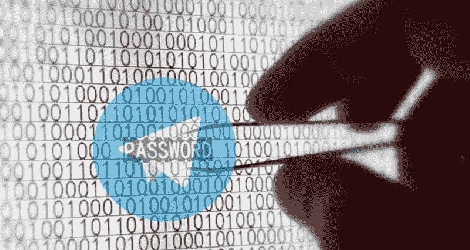

# 为什么电报护照不是端到端的

> 原文：<https://medium.com/hackernoon/why-telegram-passport-is-not-end-to-end-6d01945ac262>



*This is a translation of the* [*original article*](https://habr.com/post/418535/) *by* [*Scratch*](https://habr.com/users/Scratch/)*.*

关于新的 [Telegram](https://hackernoon.com/tagged/telegram) Passport 服务的安全性有很多讨论，所以让我们谈谈这项服务如何加密你的个人数据，并了解真正的端到端是如何工作的。

Telegram Passport 如何工作:

*   它使用密码在本地加密您的所有个人数据(姓名、电子邮件、护照扫描、其他文件)。
*   加密数据和[元数据](https://hackernoon.com/tagged/metadata)加载到电报云中。
*   当您需要登录服务时，客户端从云中下载数据，用密码解密，用请求信息的服务的公钥重新加密，然后将数据发送给服务。

让我们来分析第一部分，它处理你的个人数据的加密和存储。

按照开发者对端到端的理解——电报云无法解密你的个人数据。

让我们检查一下[加密算法](https://github.com/telegramdesktop/tdesktop/blob/a919737f6ef98b56cd7db41577ecfc269a60f444/Telegram/SourceFiles/passport/passport_encryption.cpp)。它从密码开始，当它变成中间加密密钥时:

```
bytes::vector CountPasswordHashForSecret(
      bytes::const_span salt,
      bytes::const_span password) {
  return openssl::Sha512(bytes::concatenate(
      salt,
      password,
      salt));
}
```

随机盐被取出并与密码连接两次，然后通过 SHA-512 散列发送。

我们在 2k18！一个好的图形处理器每秒可以处理超过 10 亿次 SHA-512。10 GPU 将在 80 天内处理 8 位密码的所有可能组合。一周就能管理一百个。

有许多方法可以让那些在 GPU 上暴力破解密码的人日子不好过，但 Telegram 的开发者决定不去费心实现它。

此外，密码散列加密另一个*几乎是*的随机密钥，它是这样生成的:

```
bytes::vector GenerateSecretBytes() {
   auto result = bytes::vector(kSecretSize);
   memset_rand(result.data(), result.size());
   const auto full = ranges::accumulate(
       result,
       0ULL,
       [](uint64 sum, gsl::byte value) { return sum + uchar(value); });  
   const auto mod = (full % 255ULL);
   const auto add = 255ULL + 239 - mod;  
   auto first = (static_cast<uchar>(result[0]) + add) % 255ULL; result[0] = static_cast<gsl::byte>(first);
   return result;
}
```

它“几乎”是随机的，因为电报开发者从未听说过 HMAC 和 AEAD，他们没有使用常规工具来检查解密的正确性，而是确保密钥的字节和的除法余数等于 239，这在解密时得到验证:

```
bool CheckBytesMod255(bytes::const_span bytes) {  
    const auto full = ranges::accumulate(   
        bytes,
        0ULL,
        [](uint64 sum, gsl::byte value) { return sum + uchar(value); });
    const auto mod = (full % 255ULL);  
    return (mod == 239); 
}
```

这个字节数组不是随机的。蛮力的话会有很多误报。然而，计算解码后的字节数比 HMAC 简单得多，所以基本上这种设计是在加速蛮力。

现在让我们观察数据加密方法:

```
EncryptedData EncryptData(   
        bytes::const_span bytes,  
        bytes::const_span dataSecret) {  
    constexpr auto kFromPadding = kMinPadding + kAlignTo - 1;   
    constexpr auto kPaddingDelta = kMaxPadding - kFromPadding;  
    const auto randomPadding = kFromPadding   
        + (rand_value<uint32>() % kPaddingDelta);  
    const auto padding = randomPadding   
        - ((bytes.size() + randomPadding) % kAlignTo);  
    Assert(padding >= kMinPadding && padding <= kMaxPadding);       auto unencrypted = bytes::vector(padding + bytes.size());  
    Assert(unencrypted.size() % kAlignTo == 0);       unencrypted[0] = static_cast<gsl::byte>(padding);  
    memset_rand(unencrypted.data() + 1, padding - 1);  
    bytes::copy(   
        gsl::make_span(unencrypted).subspan(padding),
        bytes);
```

数据附加 32 到 255 个随机字节。它发展到多样化
变量 dataHash。这是混合了随机字节的未加密数据的散列。

```
 const auto dataHash = openssl::Sha256(unencrypted);  
    const auto bytesForEncryptionKey = bytes::concatenate(   
        dataSecret,   
        dataHash);    auto params = PrepareAesParams(bytesForEncryptionKey);  
    return {
        { dataSecret.begin(), dataSecret.end() },   
        { dataHash.begin(), dataHash.end() },   
        Encrypt(unencrypted, std::move(params))  
    }; 
}
```

生成个人数据加密密钥。它是通过另一个来自几乎随机生成的密钥的 SHA-512 调用获得的，该密钥与 dataHash 连接在一起。

## 结论

云传输:

*   来自个人数据的散列与随机字节混合。
*   密码加密的*差点*随机密钥。
*   盐
*   加密数据

这绝对不是一个“随机噪音”，这里有一切，包括密码保护的加密密钥，它可以让你获得用户数据，比蛮力强制所有可能的 AES 密钥组合(2 ^ 256)快得多。

对 Telegram 团队而不是 HMAC 发明的关键验证机制有很多疑问。

强力算法的一个例子:

*   从密码和 salt (GPU)生成哈希。
*   试图破译密钥(AES-NI)。
*   根据字节数过滤掉无效密码。
*   使用另一个 SHA-512 调用(GPU)生成用于数据解密的候选密钥。
*   尝试解码第一个数据块(AES-NI)。
*   为了不浪费时间进行完全解码和另一次 SHA-256，您可以像他们一样通过检查第一个对齐字节来加速暴力破解:

```
if (padding < kMinPadding   
        || padding > kMaxPadding   
        || padding > decrypted.size()) {
```

由于 JSON 的使用，解密文本的第一个字节总是“{”或“[”。

我们发现个人数据的加密关键取决于密码的复杂性。蛮力的所有阶段都由硬件完美加速，无论是使用 GPU 还是 AES-NI 指令。

当然，你可以设置一个长的安全密码，并希望它能完成这项工作。但是你怎么想，两亿电报用户中有百分之几会把密码做的比八个字符还长？

此外，不使用标准验证机制的生成密钥和验证解密信息有效性的可疑技术直接违反了**“不要使用自己的密码”**原则，很明显这不是端到端的。

E2E 之所以这么叫，是因为它允许你向第三方展示加密数据，而不用担心他们的安全。正如你所看到的，电报护照不能满足这个条件。

感谢您的关注。

## ❤如果这篇文章有帮助，请点击小心脏！(在[推特](https://twitter.com/alik_chebotar)上关注我)