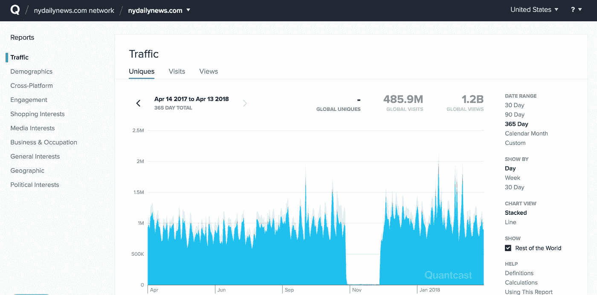
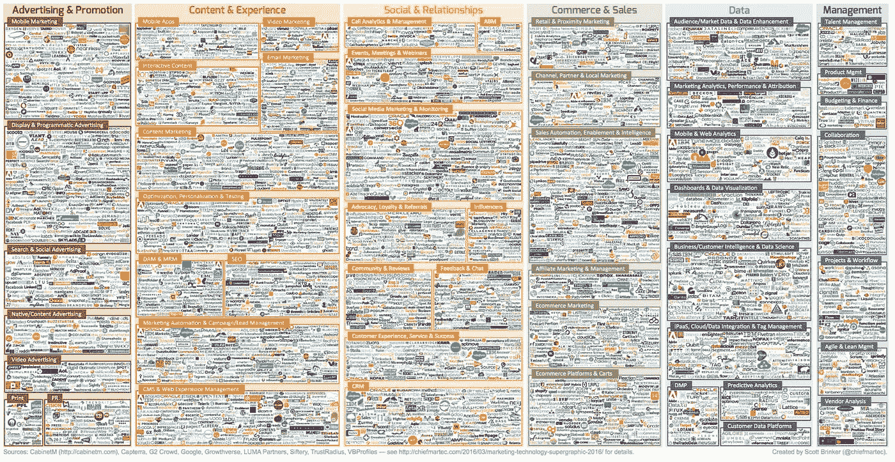

# 为什么 Ternio 建立了一个每秒能够进行超过 100 万次交易的区块链

> 原文：<https://medium.com/hackernoon/why-ternio-built-a-blockchain-capable-of-over-1-million-transactions-per-second-f74678fcfc3d>

正如你们许多人所知，Ternio 已经构建了 Lexicon，这是目前可用的最大规模的区块链解决方案。Lexicon 能够提供超过每秒 120 万次的事务处理(TPS)，完全分散且在链上。安全公司 Null Bash 对 Ternio 的词典架构进行了第三方验证，该报告[可在我们的网站上获得。](https://ternio.io/audit)本文解释了为什么有必要构建这种规模的解决方案，以及为什么这不是最终结果，而是革命性的开始。*滚动到本文末尾可获得摘要。*

Ternio 位于两个行业的顶端——区块链和程序化广告。我们对这两个行业如何运作有独特的观点，并有机会教育公众了解各自的细微差别。在区块链会议上，我们发现自己在解释程序化广告市场的低效——缺乏透明度、冗长的支付条款和广告欺诈。当参加广告会议时，我们发现自己一直在谈论区块链将如何通过解决这些问题来彻底改变这个行业。通过建立解决广告问题的解决方案，我们无意中开发了可以应用于任何行业的技术。

Ternio — The World’s Fastest Blockchain

# **什么是程序化广告？**

大多数人都熟悉数字广告，因为这是许多网站运营的资金来源。许多人不知道的是，所有数字广告的 70%都是通过编程进行买卖的。程序化广告类似于股票市场上的高频交易。当像宝马这样的广告客户想要在纽约每日新闻上购买横幅广告时，他们不会直接与纽约每日新闻联系，而是通过一系列中间人和中介进行工作。

当网络用户访问《纽约每日新闻》时，他们会产生广告印象。然后，这种印象通过 20-30 家中介机构进行“快速交易”,这些中介机构将它拍卖给出价最高的买家，并收取少量佣金来促进交易。印象最终到达宝马，宝马以最高出价购买广告位。这个过程发生在数百毫秒内，在幕后，以免扰乱纽约每日新闻访问者。

Analytics for NY Daily News

如果你看一下《纽约每日新闻》的访问者统计数据，你会发现一年之内产生了大约 12 亿次页面加载。如果每个页面有两个广告，那么仅仅一个网站就有近 50 亿次广告查询。假设有 10 个中介正在纽约每日新闻的买卖过程中。然后乘以投放广告的网站数量。

显而易见，生成的查询数量会迅速增长到令人厌恶的程度。事实上，程序化广告的交易额比 Visa 和 Mastercard 加起来还多。这就是为什么每秒高交易量对程序化广告如此重要。它需要支持每秒钟生成的大量查询。

# 区块链解决了什么问题？

嗯，相当多:

1.  **缺乏透明度**——宝马和纽约每日新闻都不知道供应链中有多少中间商。这是一个问题，因为大约 50%的美元都流向了中间商。
2.  **广告欺诈** —在 2017 年花费在广告上的 2240 亿美元中，广告欺诈占了 180 亿美元。欺诈者在默默无闻中茁壮成长！
3.  **冗长的支付条款** —出版商需要等待 30 到 120 天才能收到付款，平均为 60 天。这意味着出版商交付了一个广告印象，直到两个月后才得到报酬。

我们将在 [Ternio 的 youtube 频道](http://youtube.com/c/terniotoken)以及在我们的主页上找到的[文章中更详细地讨论上述问题。然而，下面的图片应该提供了一个在数字广告领域导致低效率的公司数量的概念。](https://www.ternio.io)

The current state of companies in online advertising/marketing

# **100 万 TPS 够用吗？**

是的，开始！最大的广告购买平台目前在其整个客户群中产生了 1100 万 QPS。程序化广告行业不会一夜之间 100%迁移到区块链。根据我们与世界上最大的广告公司的对话，100 万 TPS 已经足够开始测试了。然而，我们知道，一旦他们看到结果，转变将迅速发生。这就是我们准备突破 100 万 TPS 的原因！

> 我们的区块链解决方案在测试中已经达到 120 万 TPS，并且在需要时能够扩展到超过 1000 万(10x) TPS。

我们的区块链解决方案在测试中已经达到 120 万 TPS，并且在需要时能够扩展到超过 1000 万(10x) TPS。我们相信，我们高度可扩展的解决方案不仅将彻底改变价值数十亿美元的程序化广告行业，还将彻底改变其他行业——使区块链技术成为主流。Ternio 目前专注于程序化广告行业。然而，我们很乐意用我们的可扩展区块链解决方案支持其他领先公司。

# **总结:**

程序化广告会产生大量的 QPS(每秒查询数)，因为每次 URL 加载都会产生多个广告印象。带有四个广告的 URL 将产生四个独特的广告印象，从而产生四个查询。中间人通过促成更多需要被路由的呼叫来进一步夸大这些查询。Ternio 记录对区块链的每个查询，这需要以分散的方式记录巨大的规模。Ternio 的区块链解决方案在测试中已经达到 120 万 TPS，如果需要，可以扩展到超过 1000 万(10 倍)TPS。我们相信，我们高度可扩展的解决方案不仅会彻底改变价值数十亿美元的程序化广告行业，还会彻底改变其他行业——让区块链成为主流。