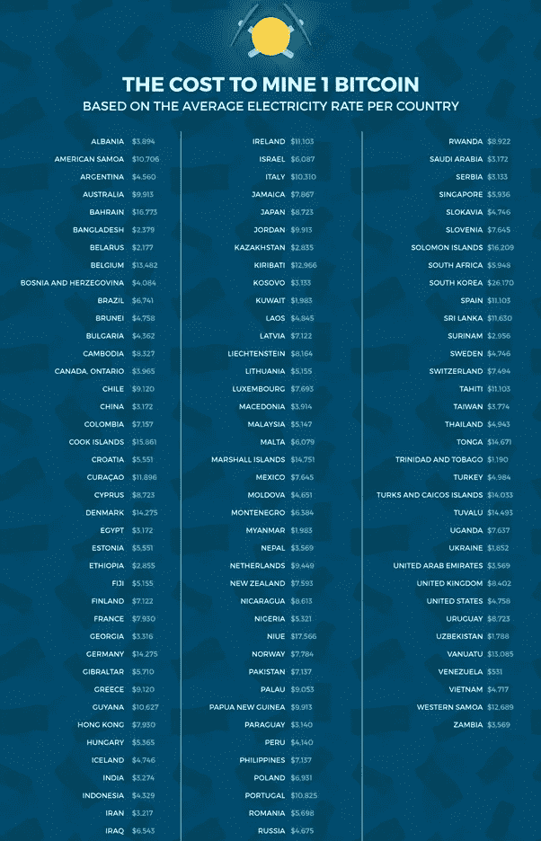

# 为什么秘密熊市会持续

> 原文：<https://medium.com/hackernoon/why-the-crypto-bear-market-will-continue-59b0da25f10a>

## …以及对此您能做些什么

Photo by [Jessica Weiller](https://unsplash.com/@jweiller?utm_source=medium&utm_medium=referral) on [Unsplash](https://unsplash.com?utm_source=medium&utm_medium=referral)

这是货币史上的一个独特点。最后，我们实现了一种方法，在这种方法中，少数人(在政府中)不再能够对人民的财富拥有压倒性的控制。如果你今天对 crypto 感兴趣，但你不知道我们最初是如何走到这一步的，你可能不喜欢 crypto，尤其是在这一点上。但是纵观全局，我很高兴能加入 crypto。

> 我最近读完了纳撒尼尔·波普的书《数字黄金》。从那以后，我对比特币和区块链有了新的认识。令人惊讶的是，密码产业发展到今天这个地步。

这种隐秘的熊市不是第一次，当然也不会是最后一次。我在看一个采访，记者说区块链技术(如果你仍然不明白那是什么，[看看这个](https://www.investinblockchain.com/what-is-blockchain-technology/))已经留下来了，社会已经接受了这一点，但加密货币仍然需要一些怀疑。她甚至继续表示，人们认为比特币存在泡沫，并认为比特币价格的正常区间在 1000 美元至 3000 美元之间。如果你在这里，你也是这样想的，让我先澄清你的疑惑。开采 1 个比特币需要多少钱？来吧，让我们看看:

Source: [https://www.quora.com/How-much-does-it-cost-to-mine-1-Bitcoin-as-of-June-2018](https://www.quora.com/How-much-does-it-cost-to-mine-1-Bitcoin-as-of-June-2018)

这张图是截至 2018 年 6 月份拟定的，此后难度有所增加。这些数字肯定是过时的，但让我们假设它仍然适用于今天。现在，常识问题；如果生产一种商品的成本是 6000 美元，它怎么可能以 3000 美元的价格交易？

> 为什么比特币的交易价格应该低于其开采成本？

为什么密码行业处于熊市？或者说准确一点，为什么比特币交易价格这么低，还在走低？这很简单。市场价格是由被称为需求和供给的市场力量决定的。只是这一次，供应已经在那里，没有改变它。所以市场价格纯粹受需求影响。需求意味着相对于多少人在卖，有多少人在买。**密码行业正处于熊市，因为有很多人在卖，没有那么多人在买。现在的问题是，谁会在这个时候卖掉他们的比特币？**

从比特币的[基本面来看，显然什么都没变。唯一改变的是人们的兴奋和情绪。让我们来一次历史之旅。](https://www.investinblockchain.com/what-is-bitcoin/)

当比特币在 2009 年推出时，它主要是网络朋克和自由主义者之间的事情(尽管不清楚 Satoshi 是否是其中之一)。下一个引起兴趣的群体是开发者。接下来的一组采纳者是进行秘密交易的人(主要是非法交易，这是人类的问题)和赌徒。此后，它延伸到那些只想保护自己的财富免受政府力量侵害的人。在此之后，它转向了那些只想使用酷的新东西的早期技术采纳者。当价格波动开始变得有趣时，比特币吸引了那些只想用自己的钱赚钱的人。

这就是问题开始的地方。如今，大多数比特币爱好者都想赚钱。有的是职业交易员，有的只是普通交易员，有的只是兴奋的认为买卖比特币就能赚钱的人。我们有熊市的原因是，这些希望赚钱的人的希望破灭了。**很明显，年初的时候有人决定卖掉他们的股份以获利，这引发了下跌**。其他中型和大型企业紧随其后，引领市场走向今天。

为什么抛售？感悟。人们看到自己持有的股票价值下跌，然后卖出，这样他们就不会看到进一步下跌。这有意义吗？在某种程度上的确如此！这是因为如果你以 5k 美元的价格出售，你可以以 4.2k 美元的价格重新进入市场。除此之外，这没有任何意义，除非你认为比特币不值得你购买它的价格。或者，你需要这笔钱，并要求兑现。我一直说，加密交易不是一项工作或工作，因为没有创造价值。**但是当人们在某件事情上疯狂赚钱时，他们相信自己是老板。**

那么这次抛售的目的是什么呢？这是最重要的问题！CZ 最近在 Twitter 上问，为什么 crypto 与股市走向一致。考虑到我们一直以来对加密的自我认知，加密市场应该是与股票市场反向运行的。为什么不是呢？这是因为现在大多数加入 crypto 的人都是交易员(或许还有赌徒)。他们交易股票市场、外汇市场和加密市场。对他们来说，加密只是另一个交易市场。有些人甚至是前外汇交易员，而有些人在他们能找到的每一个市场上交易。这些人有能力左右密码市场的剧烈波动。事后看来，你会发现快速的波动，尤其是从 1 万美元到 2 万美元的波动，时间太短了，只能是交易者的行为。

这次熊市的目的大概就是为了把操盘手抖出来。最终，每个人都会发送和接收密码，但是仅仅为了利润而这样做是不明智的。每个人都需要某种交易，但应该有界限。我可以理解加密货币内的交易，但当一切都是为了在菲亚特获利时，就有一个问题了。问题需要被提出来；你真的对加密感兴趣吗？

> 今年早些时候，我以大约 1.2 万美元的价格大举买入比特币(就我当时的水平而言)。(虽然那不是我的第一次)。我仍然看不到卖出的理由。是的，我曾经想过卖掉，然后以更低的价格重新买入。但是你知道，这也不是必然的。谁告诉你它会进一步下降？无风险的做法是(如果你相信长期前景的话)继续持有。我用我的作品赚了很多钱，所以我买了更多便宜的比特币。我不卖我高价买的东西，因为价格下降了。这是我对市场的理性的个人态度。

除非密码行业的用户和所有者多于交易者，否则这种抛售方式将会持续下去。**这就是为什么熊市的持久解决方案是建立和创造一些东西来增强加密产业**。所有这些加密交易所交易基金和其他基金可能只会导致更大的剧烈波动。健康的增长必须来自于提高使用率。这一点也不难。

在此之前，社区一直在努力让更多的人打开加密钱包。我认为大多数人已经拥有了当前发明状态的加密钱包。现在是时候拿给商家了。**这次熊市是为了唤醒活跃的社区，让有价值的人接受比特币作为一种支付方式**。此外，这场革命将归功于用比特币定义自身价值的商人(以及提供价值的人)。

> 采用的下一个阶段是关注商家；给人们不换回菲亚特的理由

接受比特币作为支付手段，意味着价值以菲亚特定义，但以比特币等价物支付。例如，该商品价值 90 美元，然后你支付价值 90 美元(实时)的比特币。一些商家和公司已经在这样做了，但是我们需要更多。第二个级别也是更高的级别是商家用比特币定义他们的价值。这意味着商家将接受产品或服务的 0.1 btc，而不管 0.1 btc 以美元表示。随着加密行业的波动性越来越大，这种做法的风险要大得多，但仍有一种方法可以实现。

> 首先，这可能目前只适用于服务业。即便如此，它也不应该适用于商家或价值提供者提供的所有东西。应该只是为了一两件特别的事情。第二，商家或价值提供者可以从年度范围着手平衡波动性。例如，他们可以决定他们为 2019 年 Q1 奥运会选择的 1 btc 的价值是 6k 美元。因此，0.1 btc 将以 600 美元为基准。因此，他们将在 2019 年 Q1 全国范围内以 0.1 btc 的价格出售价值 600 美元的产品或服务，而不管 btc 价格如何变化。对于 Q2，他们可以进行分析并查看 0.1 btc 报价。也许市场已经出现了明显的上涨，他们同意将 1 btc 的价格定为 1 万美元，那么在 Q1 为 0.1 btc 的产品或服务在整个 Q2 将为 0.1 btc，而不管 btc 价格会发生什么变化。

这只是一个说明性的形式，以帮助推动比特币和整个加密行业的下一个层面的牵引力。我不相信 ETF 的东西“帮助”加密，事实上，我认为这是一种将加密与传统系统捆绑在一起的链条。**比特币被设计成去中心化的，不需要华尔街的任何肯定就能让它走上正轨**。我认为这个行业即将迎来一个非凡的时刻。

上帝保佑聪，无论他在哪里。你可以自行判断我的想法。这不是一个财务建议。我只是在让比特币和加密货币更上一层楼的过程中扮演了一小部分角色。

干杯！