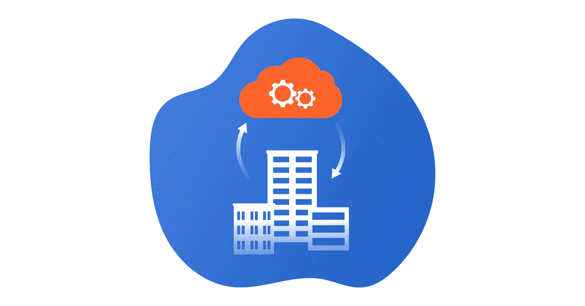

# 为什么混合云不再是最佳选择

> 原文：<https://medium.com/hackernoon/why-the-hybrid-cloud-is-no-longer-the-best-option-61eaf922d10d>

由于频繁报告的多种安全漏洞，许多企业不敢将其任务关键型系统和工作负载迁移到云中。然而，这是千真万确的。

现在只有两种类型的企业，一种已经在云中，另一种迟早会在云中。内部基础架构的时代正在迅速结束，因为云的优势(高可用性、可扩展性、虚拟化和成本效益)太大，不容忽视。

然而，许多企业都担心不断披露的云安全漏洞案例(如定期更新的名人裸照泄露或 2017 年 11 月发生的臭名昭著的[五角大楼安全云安全漏洞](https://www.upguard.com/breaches/cloud-leak-centcom))。诸如此类的案例似乎加剧了人们对将关键业务数据转移到云中的合理性的怀疑。

然而，事实证明，上述云安全漏洞完全是用户的错，与既定的云安全实践无关。那些裸照被泄露的名人只是用他们的出生日期作为密码，或者他们喜欢的狗的名字，或者喜欢的团体的名称作为密码恢复的秘密问题。五角大楼的云专家没有使用 AWS 提供给他们的安全功能，并将秘密数据暴露在服务器上，可以通过猜测链接直接访问。

也就是说，云安全是害怕迁移到云的企业的主要顾虑，如果使用得当，它与本地数据中心的安全性是同等的。恰恰相反，是内部数据中心人员和您的内部 it 部门不得不发明轮子来使他们的安全程序符合公共云安全级别。

# 混合云的优势

确实有某些[混合云优势](https://www.petri.com/five-big-benefits-hybrid-cloud)证明了其使用的合理性:

*   内部基础设施允许在内部处理巨大的数据集，避免为流量支付过高的费用
*   数据传输速度可以非常快，因为客户端和服务器位于同一个网络中，不受互联网提供商的信道带宽限制
*   一些流程和操作要求低延迟，当信号在本地服务器和云系统之间传输时，这是无法保证的

这些和其他一些原因导致混合云市场稳步增长，预计到 2021 年[将达到 920 亿美元。因此，走这条路是未来 5 年相当可行的战略，但迟早必须放弃混合基础架构。为什么？](https://www.marketsandmarkets.com/Market-Reports/hybrid-cloud-market-1150.html)

# 不是混合云，而是多云

根据 RightScale 的 [2017 年云状况](https://657cc6f528d49117fa9c-3be72f4a75ff54b1bd710461f0ee7ecd.ssl.cf1.rackcdn.com/RightScale-2017-State-of-the-Cloud-Report.pdf)报告， **85%的企业**使用[多云策略](https://itsvit.com/blog/digital-transformation-multi-cloud-strategy/)。为什么这样因为它有助于避免供应商锁定，保持系统的灵活性和通用性，允许通过利用来自 [AWS 或 Azure](https://itsvit.com/blog/aws-vs-ms-azure-cloud-provider-choose/) 、GCP 或 DigitalOcean 的各种促销和限时优惠来节省更多成本。这些解决方案可能包括混合云基础架构，但它们大多结合了各种公共云。

实际上， [AWS 或 GCP](https://itsvit.com/blog/news/aws-vs-gcp-cloud-service-provider-choose/) 已经解决了企业业务的所有问题，并在他们的 SLA 中涵盖了它们。当您选择一家领先的云服务提供商时，您会为您的数据安全和心理安全向他们支付费用，而不关心后台发生了什么，它只是在您没有任何运营或管理开销的情况下工作。

事实上，Azure 为 90%的财富 500 强公司提供服务。像这样的公司非常重视他们的业务安全，使用公共云是对其安全措施信任的标志。

# 关于为什么混合云可能会过时的最终想法

如您所见，构建混合云基础架构对许多企业来说是一个可行的选择，至少目前是这样。然而，正如之前的私有云一样，混合云解决方案最终将不得不让位于公共云。

既然如此，为什么不马上采用多云方法呢？你对这个话题有什么想法？您的企业是否已经完成了云转型？你选择了什么方式，结果如何？请在下面的评论中分享你的经验！