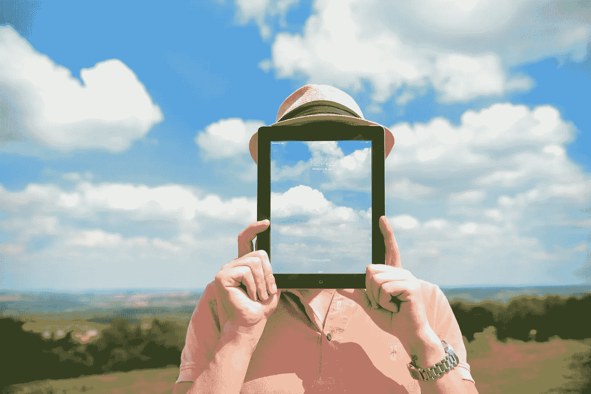
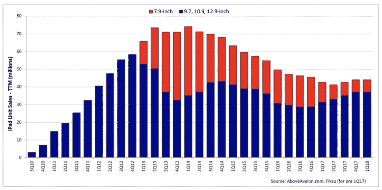
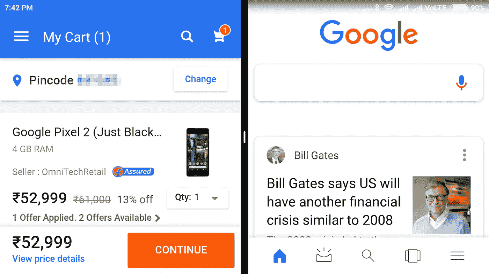

# 为什么 iPad 的统治会持续更长时间

> 原文：<https://medium.com/hackernoon/why-the-ipad-s-rule-will-last-a-bit-longer-6e33a7a3497d>

To iPad or not, that is the question

iPad 是苹果家族中的异类，它似乎不太清楚自己到底是什么。iPhone 是一部智能手机，iPod 是音乐播放器，Mac Pro 是一部老爷车...但是 iPad 是什么呢？

史蒂夫·乔布斯相信 iPad 会取代个人电脑，正如他著名的“后个人电脑时代”这句俏皮话所暗示的那样。但这从未发生过。事实上，iPad 在全球平板电脑市场的份额从 2014 年开始下降，尽管 iPad Pro 扭转了这一趋势。(对苹果来说，iPad 仍然是一台赚钱机器，因为迄今为止它已经卖出了 3.5 亿台 iPad。)

那么，到底是谁在购买这些 iPads，又是为了什么？

## 外行:查看内容和媒体

让我们从我开始，因为这里没有猜测。苹果在 2010 年推出了 iPad，我在 2012 年得到了第三代 iPad 3。我是一个典型的门外汉，因为我不知道如何使用哪怕是稍微复杂的应用程序，如 Photoshop 或 iMovie。即使我知道，我也没有艺术家的眼光来区分好和优秀。没有这种技能，摆弄设计和外观就没有多大意义。

所以我用 iPad 主要是为了阅读和浏览内容，因为它的便携式格式使它非常便于在家里或外面携带。比如，我可以把它放在我拥挤的早餐桌上，以了解新闻，或者在厨房里烹饪时获得一些提示，或者在旅行时观看视频(带耳机)。我也在较小程度上用它来玩游戏、社交媒体互动和听音乐。

我偶尔会用 iPad 处理与工作相关的事情，比如在晚餐时关掉 Mac 电脑，快速回复邮件。但一般来说，如果我在工作，我几乎总是在我的 Mac 上工作，因为它在很多方面都更方便。整个系统专为多任务处理而设计，具有快速键盘快捷键、可通过快速手势访问的多个打开的窗口，以及可以更快完成工作的强大操作系统。我所有的文件只需通过 Finder 点击几下，更大的屏幕和符合人体工程学的设置使长时间工作不再那么累。

对我来说，iPad 绝对不是 Mac 或 PC 的替代品。

## 半专业:一种工作工具

那么什么样的人会买 iPad Pro 呢？奇怪的是，我哥哥做到了。他对雕塑感兴趣，还有点技术恐惧症。就是那种时不时给我打电话解决 iPhone 问题的人。和我一样，他对 Photoshop 之类的图像应用毫无头绪。但他观察到，在他的雕刻工作室里，大多数同行都在使用技术来提高他们的雕刻技能。所以他在一年前给自己买了 iPad Pro。我不太确定它有多大用处，但上次我检查他的 iPencil 时，它已经失效了，他也懒得去更换它。行动胜于言语。

## 专业:次要的工作配件

接下来我和一个设计师朋友核实了一下。他是一个多才多艺的人，一个为百事等大品牌做广告的专业设计师，一个世界级的摄影师，一个多才多艺的书法家，一个业余摄像师，以及一个有点天赋的室内设计师。他的主力是 Mac Pro(垃圾桶)。他确实有一台 2016 款的 iPad，但他表示，任何 iPad 都无法快速处理他的图像和视频工作所需的高强度处理。他偶尔也会在工作中使用 iPad，比如在外出拍照时存储和浏览图片。但除此之外，他的 iPad 用法和我的差不多。

## 对不同的人做不同的事情

总之，iPad 还不足以成为专业人士的主要工具，但它可以作为一个有用的配件发挥作用。然而，它可以成为半专业人士或学生的主要工具。而对于门外汉来说，它只是另一个方便的大屏幕设备来查看媒体和内容。我的猜测是，市场上 3.5 亿台 iPads 中的大部分都是被像我这样的外行人买走的。

## iPad 需求正趋于平稳

我在一个网站上发现了一个有趣的图表，显示了 iPads 自 2010 年发布以来每个季度的销售情况。红色表示 iPad minis，在更大的 iPhone S 系列到来后，它似乎要过时了。蓝色表示其余的 iPads。自 2014 年初以来，销量似乎一直在下降(我猜是因为来自其他平板电脑的竞争)，但自 2016 年底以来，销量或多或少保持稳定。

iPad sales from launch 2010 till now (courtesy [https://www.aboveavalon.com](https://www.aboveavalon.com))

## 延长药片的使用寿命

iPad 销量没有上升的另一个原因是，大多数想要 iPad 的人可能已经买了。而且人们更换平板电脑的频率也没有手机高。我认为，与手机的 2-3 年周期相比，典型的平板电脑更换周期可能是 4-5 年左右。

## 决定(向勒布朗道歉)

尽管可能会有新的 iPad 用户进入市场，但我认为 iPad 最大的买家群体将来自替代品市场。这些人已经在平板电脑上销售，他们需要更换现有的即将报废的机型。过去八年售出的所有 iPads 肯定都到了第一次甚至第二次更换周期。

就苹果而言，这个十亿美元的问题是，“现有的 iPad 用户会用新的 iPad 取代它，还是会使用 Android？”

嗯，我是一个典型的想要更换 iPad 的 iPad 用户，这篇文章的其余部分是关于我的决定。好吧，这个决定可能没有勒布朗·詹姆斯的决定那么惊天动地。但我认为这将会给其他 iPad 用户一个合理的指示，告诉他们如何决定用什么来替换他们垂死的 iPad。

## 漫长的告别

我的 iPad 3 给了我多年绝对无故障的服务，但它的年龄开始显现。这是 2012 年 5 月的模型，这使得它在技术年代相当古老。苹果停止了对这种模式的支持，所以它停留在 iOS 9.3，并有一个令人不安的习惯，即在启动时显示冻结的锁屏。我需要耐心等待几分钟，让它的隐形轮子停止转动，然后才能刷卡输入密码。

硬件方面，iPad 3 的旧蓝牙版本不兼容 Airdrop 或 handoff，而 pre-lightning 连接器意味着要携带一根额外的电缆。主页按钮也变得古怪，很少工作，所以我使用辅助屏幕(软件)按钮的变通办法来保持它的功能。我用我的 iPad 主要是为了阅读和浏览内容，偶尔也用来打字，所有这些都还能用。虽然有时会非常慢，页面刷新要花很长时间。没有夜班，这使得夜间阅读很紧张。它还会随机断开我的 wifi，必须手动重新连接。总的来说，我对我的 iPad 仍能正常工作印象深刻，但很难忽视它的许多怪癖。

## 狩猎开始了

一年多前，我开始寻找低端 iPad 的替代品。我排除了 iPad Pro，因为它超出了我的需求，也超出了我的预算。2017 款基本版 iPad 是一款功能强大的平板电脑，但当时的售价接近₹29000(450 美元)。这超出了我想为一台主要用于阅读和观看内容的设备所花的钱。

所以我决定对 Android 世界进行另一次周期性的探索。大约在去年的同一时间，我给自己买了 Redmi Note 4，这是一款安卓手机，现在是印度最畅销的手机。(我的主要手机是 iPhone 6S Plus，所以这只是我放纵自己书呆子的一面。)

以下是我对 Android 手机现状的发现，尽管它不一定适用于 Android 平板电脑。我们会继续讨论。

## 操作系统

我的 Redmi 目前运行的是 Android 的修改版(fork)叫 MiUI 9，基于 Android 牛轧糖。它能做一些我的 iPhone 做不到的奇妙的事情。例如，iPad 的分屏，在我的安卓 5.5 英寸的小屏幕上也是可能的。

这个功能很有用，我假设所有平板电脑都有，所以它不会真正影响我选择哪一款平板电脑的决定。新的 Android 操作系统上的大多数其他功能并不会真正影响我的决定。

## 硬件和软件

苹果的软件和硬件集成似乎使它比安卓手机更高效。我的 Android (Redmi Note 4)有 4GB 内存，而我的 iPhone 6S Plus 只有一半的内存，但日常性能没有明显差异。我还注意到，同一个应用程序在 iOS 上比在 Android 上运行得更好。比如有一次，当我试图用 WhatsApp 发送我的安卓系统上的一个屏幕录像时，它出现了音频视频同步问题。同样的录音，在我的 iPhone 上用 WhatsApp 压缩发送时，效果很好。我猜开发者可能会为 iOS 应用版本投入更多的精力和资源，因为他们可能会产生更多的收入。

还有其他有趣的功能，如双 SIM 卡插槽，内存扩展槽，能够运行多个版本的应用程序，如 WhatsApp。MiUI 还提供了通过第二空间功能在我的 Redmi 手机上拥有两个配置文件/登录的能力。

我不在 iPad 上使用模拟人生，因为我可以随时连接到手机的热点。多个版本的应用程序(比如 WhatsApp)可能在手机上有用，但在平板电脑上就没用了。虽然双重登录是一个有趣的功能，但更重要的是拥有一个无缝运行的无故障操作系统。所以在这方面，我认为 iPad 确实比 Android 平板电脑有优势。

## 照相机

我的 iPhone 相机比我的 Android 相机拍摄的像素更好，尤其是在弱光下。但这并不是一个公平的比较，因为红米在₹12000 的售价为 185 美元，而我的₹53000 iphone 售价为 800 美元。如果我真的想比较 Android 和 iPhone 上的相机，我应该把它与谷歌 Pixel 进行比较，谷歌 Pixel 与我的 iPhone 价格相同。此外，两款手机的相似之处在于，它们的硬件和软件都是由一家公司开发的，不像我的 Redmi，它的硬件是由中国公司小米开发的。Pixel 太贵了，买它只是为了看看 Android。然而，街上的[词](https://www.dpreview.com/reviews/google-pixel-2)是谷歌在 Pixel 2 中混合了硬件和在线图像处理软件，使其成为最好的智能手机相机。可悲的是，除了相机，像素似乎并不真正证明其高昂的价格。

相机不会影响我对平板电脑的选择，因为我几乎从不在 iPad 上使用相机。

## 语音协助

语音助手在去年开始流行。手机上的麦克风技术没有亚马逊的 Echo 或苹果的 HomePod 这样的专用语音扬声器先进。但它仍然是一个非常有用的功能。

谷歌助手是这里的大赢家，因为 Siri 仍在开发中。事实上，她总是犯错误，给人带来无穷无尽的乐趣。对于任何严肃的语音工作，我从来不用 Siri，除非我在开车时需要打电话，或者让它在我汽车的音响上播放音乐。即使这样，Siri 通常也需要尝试几次才能做对。虽然我可以在我的 iPhone 上设置谷歌助手，但它必须受 iOS 限制，而且不能做 Siri 应该做的一半事情，如设置闹钟、启动应用程序或通过 WhatsApp 发送信息。我说“Siri 应该做的”是因为它在和我的印度口音斗争时犯了太多错误，以至于我很久以前就放弃了 Siri。令人惊讶的是，谷歌助手(和 Alexa)如何能够毫不费力地拾取相同的口音和单词。

如果语音成为选择平板电脑的一个重要因素，那么 Android 肯定会有优势。截至目前，它不是给我的。我已经用了 Alexa Echo 几个月了。不像电话，它非常善于接收我说的任何话，但我仍然没有把它融入我的生活。这可能是我的错，因为我还没有真正进入 Alexa 的技能和东西。

## 连接器

我的 Redmi 有 mini-USB，没有升级的 USB C。但它仍然比 iPhone 的 lightning 连接器好，因为我可以通过一个便宜的加密狗连接一个笔驱动器来轻松扩展我的 Android 的容量。基本型号的 iPad 现在配有 32Gb，对于我的需求来说已经足够了，所以这在 iPad 上不是问题。蓝牙也是如此，因为最近的 iPads 都有最新版本。

对我来说，连接器不是决定平板电脑的一个因素，但对于那些重视空间的人来说，这可能是一个障碍。

## 电池

与我的 iPhone 2750 电池相比，Redmi 的电池容量为 4100 毫安时，但 iOS 似乎更有效，可以用更少的电池容量获得更长的正常运行时间。快速充电目前还不可用，但看起来该功能将很快成为大多数中端安卓手机的标准。

这在平板电脑中并不是什么大问题，因为大尺寸意味着大多数平板电脑电池可以轻松使用一整天。

## 扬声器和屏幕

从用户的角度来看，这些或多或少是相同的。您需要连接外部扬声器或屏幕，以获得更好的声音和大屏幕观看效果。我用的是 Chromecast，而不是苹果电视。这样做的一个缺点是 Chromecast 不像 Androids 那样允许 iPhone 中的屏幕镜像。但我对此没有意见，因为我用 Chromecast 播放 YouTube 和视频，这在我的 iPhone 上也很好。Apple TV 本来可以允许镜像，但它比 Chromecast 贵得多。

我拥有一台 Chromecast 确实喜欢 Android，但屏幕镜像对我来说并不那么重要。所以这在平板电脑中也不是问题。

## 平板电脑在安卓中并不大

当我开始研究平板电脑时，我发现平板电脑显然不是安卓世界的优先选择。在中端机器人中，平板电脑没有手机先进。我想它们没有太大的市场，因为人们只是喜欢大屏幕的安卓手机。事实上，作为印度最畅销安卓手机的制造商，小米甚至没有在印度市场推出平板电脑。

三星的新平板电脑好评如潮，但价格与更贵的 iPads 一样。旧的三星型号价格较低，但它们与我的 iPad 3 有相同的问题，因为它们运行的是旧版本的 Android，可能没有像分屏这样的新功能来运行不同的应用程序。还有其他更便宜的安卓平板电脑品牌，但问题是它们都让人觉得“便宜”。

## 江山易改，本性难移

尽管中端安卓手机物有所值，但中端安卓平板电脑似乎已经落伍了。如果我要为一个过时的安卓系统支付和 iPad 一样的价格，我宁愿选择苹果。

最后，这是一个你习惯的系统的习惯和舒适度的问题。我已经在这个平台上呆了很长时间，因为 Android 的工作方式略有不同，所以我更喜欢将 iOS 作为一个日常使用的设备。例如，我经常使用 Notes 应用程序，并且知道我保存在其中的任何内容都可以在我的任何其他设备上的同一应用程序中轻松使用。我敢肯定，同样的微小差异可能会对长期使用 Android 的用户产生相反的影响(我想到了 Google Keep)。所以这是个人选择。

## iPad 赢了这一轮

苹果公司决定降低基本型号 iPad 的价格，从而扭转了 iPad 的命运。考虑到我的 iPhone 屏幕尺寸已经增大，而且我的使用主要是为了观看内容，我无法证明购买更高价格的 iPad 是合理的。

因为我的 iPad 还能用，所以我决定坚持下去，等着看我是否能在新 iPad 上买到一个好价钱。不久前，我在亚马逊的大减价中发现了一个，价格大约在₹19000(300 美元)。在这个价格范围内，我认为它在硬件和软件方面都远远好于市场上的任何 Android 平板电脑。只要苹果能够保持价格-价值平衡，我认为 iPad 将完全统治中端平板电脑市场，甚至可能扩大市场。

## 等待戈多

除非其中一个机器人推出了匹配或低于 iPad 的更新平板电脑(比如一款相当于 Redmi Note 5 的平板电脑)，否则我不太可能从 iPad 品牌转向这款平板电脑替代品。

我不支持亚马逊交易的唯一原因是，在 2018 年购买 2017 年初的型号没有意义。此外，市场上有消息称，苹果预计将在本月推出 iPad 的经济型产品。与此同时，印度政府确实提高了进口电子产品的税收。但我仍然希望这款 2018 年款的价格合理，并在推出时拥有一些 iPhone X 的功能。

手指交叉。